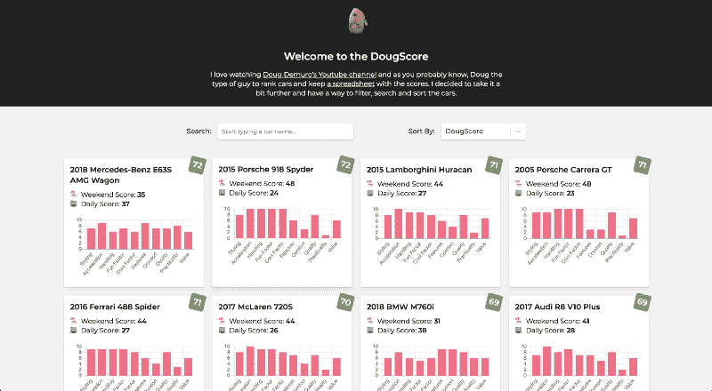
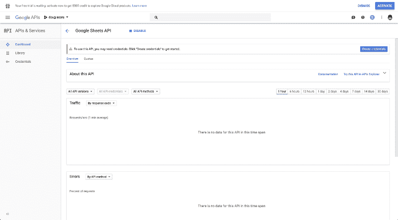
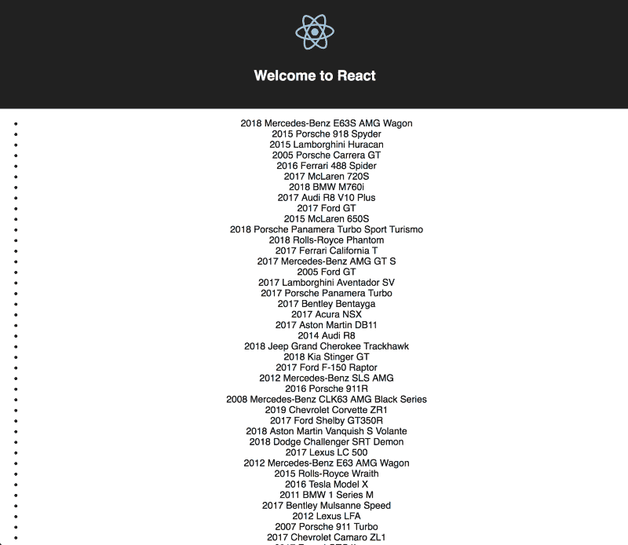

# 如何将 React 应用程序部署到 Netlify，以读取 Google 工作表

> 原文：<https://www.freecodecamp.org/news/how-to-deploy-a-react-application-to-netlify-that-reads-from-a-google-sheet-97a015806c47/>

在本教程中，我们将介绍如何连接到 Google 上的电子表格，在 React 应用程序中显示该信息，并将其部署到 Netlify。

如果你不关心数据将从哪里来，或者我为什么选择建立这个，跳到“设置”。我不会生气的，我保证。

现在最终的结果看起来是这样的，但是我很快会添加更多的特性。



You can find it at [https://dougscore.netlify.com](https://dougscore.netlify.com)

### 为什么

我喜欢汽车？？️.如果你对汽车有点兴趣，你可能会在某个时候偶然发现 Do [ug Demuro 的 Youtube 频道。他评论了各种各样的汽车，从价值 300 万美元](https://www.youtube.com/channel/UCsqjHFMB_JYTaEnf_vmTNqg)[的法拉利 Enzo t](https://www.youtube.com/watch?v=KhaLiiSUvAw)o 3[轮式宝马 Isetta。](https://www.youtube.com/watch?v=k0dEzY-xld8) Doug 的格式与大多数用户评论略有不同。他大约 20 分钟的视频有三个要点:

*   有趣的怪癖和特点:大约 70%的视频是他关于汽车的外观和内部怪癖。这些可以是用户手册中的一段话，也可以是刹车灯的有趣形状。


Not actually Doug, but a happy doggo ?

*   开车:大约 20%的视频是道格把车开上马路，当他加速时做鬼脸。他还谈到了车内噪音、操控性、速度等等。
*   DougScore: Doug 创建了一个电子表格，其中包含了他曾经评估过的所有汽车(自从创建了评分系统以来),并使用他自己的系统对所有汽车进行了排名。它分为两类:
    *周末得分:本质上是这辆车有多好玩。
    *每日评分:本质上是车的实用性如何。


I wonder if Doug reads all of these


Then he’ll find a typo on page 73

这就是为什么，在我看来，他可以在一个 25 分钟的小货车视频上获得超过 150 万的浏览量？？‍.由于这些视频如此古怪，道格本人也相当古怪，他的追随者提出了一些有创意的评论。我最喜欢的是"道格是那种……"的评论，就像上面那些。

现在，对于那些在那个介绍之后还逗留在周围，与构建一个应用程序、Google Sheets API 或 React 无关的所有人，这就是我要说的。

### 设置

道格把他的电子表格保存在谷歌表单上，任何有链接的人都可以访问。对我来说，这很难驾驭。所以我决定看看是否有办法扩展它并添加一些额外的功能。

#### React 创建应用

脸书的 React 样板文件会让我们很快上手，不需要配置任何后端。在你选择的终端中(对我来说是 [Hyper](https://hyper.is/) ，输入:

```
npx create-react-app doug-score
cd doug-score
yarn start
```

(或者`npm start`，随便什么能让你的船漂浮，但我会用纱线。)

在你选择的编辑器中打开文件夹(对我来说是 VS 代码)，然后前往`App.js`。我们将创建一个名为`CarList`的独立组件，将其放在一个`components`文件夹中，并将其添加到`App`中。

```
import React, { Component } from "react";
import logo from "./logo.svg";
import "./App.css";
import CarList from "./components/CarList";
class App extends Component {
  render() {
    return (
      <div className="App">
        <header className="App-header">
          
          <h1 className="App-title">Welcome to React</h1>
        </header>
        <CarList />
      </div>
    );
  }
}
export default App;
```

目前，这是 CarList 组件的外观:

```
import React, { Component } from 'react';
class CarList extends Component {
  render() {
    return (
      <div>
        This will be the car list
      </div>
    );
  }
}
```

#### 谷歌工作表 API

让我们继续[在谷歌](https://console.developers.google.com/projectcreate)上创建一个新项目。我把它叫做`doug-score`。创建完成后，在“API”框中，单击“转到 API 概述”一旦你点击“启用 API 和服务”,你将看到 API 库。我们将继续搜索“Google Sheets API”一旦你点击它，点击“启用”，在它的处理后，你应该看到这个页面。



Google APIs Dashboard

在侧边栏中，转到“凭证”，点击“创建凭证”按钮，并选择“API 密钥”单击“Restrict Key”并为其设置一个名称(我将其设置为“DougScore”)。在“应用程序限制”下，我们现在将它设置为“HTTP referrers”并添加`http://localhost:3000`。在“API 限制”下，选择“Google Sheets API”并保存。我们这边应该没问题。

#### 这种联系

现在我们有了一个 API 键，回到应用程序代码，创建一个名为`config.js`的新文件。输入您的 API 密钥和电子表格 ID。

```
export default {
  apiKey: "YOUR_API_KEY",
  discoveryDocs: 
    ["https://sheets.googleapis.com/$discovery/rest?version=v4"],
  spreadsheetId: "1KTArYwDWrn52fnc7B12KvjRb6nmcEaU6gXYehWfsZSo"
};
```

现在，我们将需要 Google API 库，所以我们将在`<div id="root">` < /div >之后使用`public`库中的`index.html`文件

```
<!DOCTYPE html>
<html lang="en">
  <head>
    <!-- Stuff -->
  </head>
  <body>
    <noscript>
      You need to enable JavaScript to run this app.
    </noscript>
    <div id="root"></div>
    <script src="https://apis.google.com/js/api.js"></script>
    <!-- Stuff -->
  </body>
</html>
```

这将为我们提供对`window.gapi`的访问，我们将使用它来连接到 Sheets API。想了解更多信息，请访问[谷歌文档](https://developers.google.com/sheets/api/quickstart/js)。

### 数据

现在我们已经可以访问 API 了，让我们建立到它的连接。最好的地方是在我们之前创建的`CarList`组件的`componentDidMount`生命周期中。我们去那边吧。

```
componentDidMount() {
  // 1\. Load the JavaScript client library.
  window.gapi.load("client", this.initClient);
}
```

`window.gapi.load`接受回调，因此我们的`initClient`函数如下所示:

```
initClient = () => {
  // 2\. Initialize the JavaScript client library.
  window.gapi.client
    .init({
      apiKey: config.apiKey,
      // Your API key will be automatically added to the Discovery Document URLs.
      discoveryDocs: config.discoveryDocs
    })
    .then(() => {
    // 3\. Initialize and make the API request.
    load(this.onLoad);
  });
};
```

这里介绍几个东西。`config`来自我们之前创建的`config.js`文件，所以不要忘记在`CarList.js`文件的顶部做`import config from “../config”;`。

`load`是我们现在要创建的一个函数。它将负责连接到正确的电子表格，正确格式化数据，并将其返回给`this.onLoad`回调中的组件(或者如果我们搞砸了，返回一个错误)。

我想将逻辑从组件中分离出来，以保持文件小且可读性强。让我们在`src`中创建一个名为`helpers`的新文件夹，并将一个`spreadsheet.js`文件放入其中。

```
import config from "../config";
/**
 * Load the cars from the spreadsheet
 * Get the right values from it and assign.
 */
export function load(callback) {
  window.gapi.client.load("sheets", "v4", () => {
    window.gapi.client.sheets.spreadsheets.values
      .get({
        spreadsheetId: config.spreadsheetId,
        range: "Sheet1!A4:T"
      })
      .then(
        response => {
          const data = response.result.values;
const cars = data.map(car => ({
            year: car[0],
            make: car[1],
            model: car[2]
          })) || [];
callback({
            cars
          });
        },
        response => {
          callback(false, response.result.error);
        }
      );
  });
}
```

所以这里我们调用 sheets API 并通过传递`spreadsheetId`和`range`从电子表格中获取值。promise 返回两个响应:一个是有数据，一个是有错误。响应值是一组数组，其中每一个都是电子表格中的一行。

### 该显示器

现在我们已经将数据放回了`CarList`组件中，我们可以开始为它设置显示了。在`initClient`函数中，我们有`load(this.onLoad)`函数，所以让我们从那里开始。

```
onLoad = (data, error) => {
  if (data) {
    const cars = data.cars;
    this.setState({ cars });
  } else {
    this.setState({ error });
  }
};
```

如果`spreadsheet.js`中的`load`函数返回数据，我们将为该数据设置`cars`状态。否则，我们设置一个`error`状态，向我们的用户显示出错了。

#### 默认状态

由于数据不会立即可用，我们需要为组件设置一个默认状态。

```
state = {
  cars: [],
  error: null
}
```

#### 提供；给予

现在在`render`函数中，我们可以显示状态:

```
render() {
  const { cars, error } = this.state;
  if (error) {
    return <div>{this.state.error}</div>;
  }
  return (
    <ul>
      {cars.map((car, i) => (
        <li key={i}>
          {car.year} {car.make} {car.model}
        </li>
      ))}
    </ul>
  );
}
```

在这里，我们正在破坏状态(ES6 FTW？？)并首先检查是否有错误。如果没有，我们将映射汽车并在一个无序列表中显示它们。



### 部署

现在我们有了 Doug 审核过的超级漂亮的汽车列表，我们可以开始与世界分享了。由于这将是一个静态网站，我将使用他们的 CLI 将其部署到 [Netlify](https://blog.416serg.me/r/?url=https%3A%2F%2Fwww.netlify.com%2F) 。为此，我们将停止本地主机并运行以下命令:

```
yarn build
```

这将在准备生产的应用程序中创建一个`build`文件夹。现在你要做的就是:

```
npm install netlify-cli -g
netlify deploy
```

当它询问时，确保输入`build`作为`Path to deploy? (current dir)`。

Netlify 将做它的事情，并向您显示最终的网址(我的是[https://laughing-yonath-118f58.netlify.com](https://laughing-yonath-118f58.netlify.com/)？)

如果您尝试访问您创建的 URL，您会在控制台中看到一个错误，因为您的 URL 没有添加到 Google API 控制台中。继续添加您需要的 URL，之后一切都应该如预期的那样工作。

### 结束了

我希望这一切都有意义。现在，您可以在列表中添加一些特性，比如排序、过滤、分页、搜索、比较等等。当道格向列表中添加另一辆车时，应用程序会自动更新新信息。

如果这个教程有意义，给它一个？？并与朋友分享。如果你想告诉我它很烂或者你还有任何问题，请在下面评论或者在 Twitter 上对我大喊[，](https://twitter.com/416serg)我真的不介意。如果道格在读这封信，嘿，道格？？！