# 如何构建一个？带有布尔玛 CSS 的响应式特斯拉启动页面

> 原文：<https://www.freecodecamp.org/news/how-to-build-a-responsive-tesla-launch-page-with-bulma-css-2bf484057349/>

作者 ZAYDEK

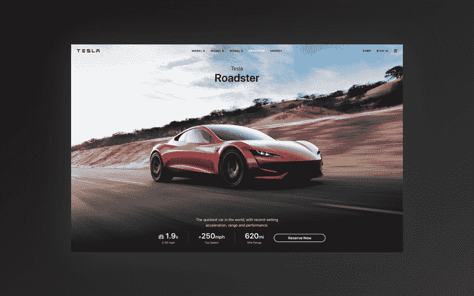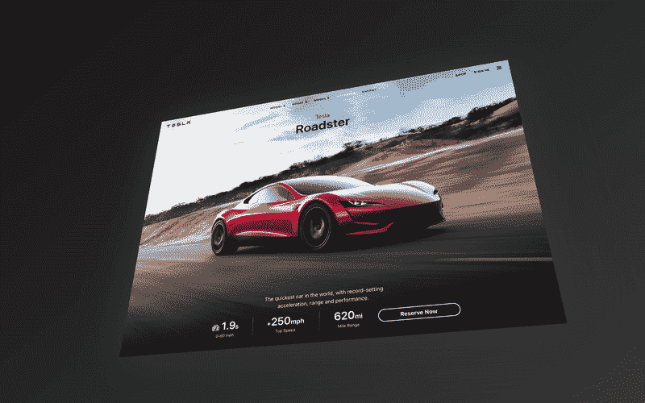

#### 1.9s 内 0-60？

# 如何构建一个？带有布尔玛 CSS 的响应式特斯拉启动页面

#### 加速可持续网页设计的到来

在我开始写这篇文章之前，我只想分享我正在开发一个产品，我很乐意收集一些关于如何更好地为 web 开发人员服务的数据。我创建了一个[简短问卷](https://twitter.com/username_ZAYDEK/status/1103914471267790854)在阅读这篇文章之前或之后进行检查。请检查一下，谢谢！现在，回到我们的常规节目。

### 你好互联网！(嗨埃隆！)

我来这里是为了让你不要认为建立网站一定很难。此外，在短短的几分钟内，我们凡人将学会如何建立一个美丽的和(！)使用布尔玛的响应式特斯拉启动页面。

#### 布尔玛？！[布尔玛](https://bulma.io/)是一个 CSS 框架，是 [@jgthms](https://jgthms.com/) 的创意。？

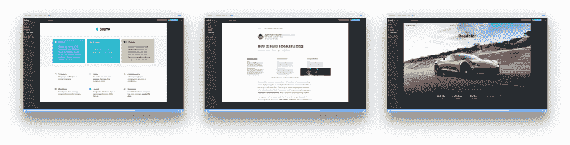

#### 我还在 Scrimba.com 教了一门免费的全长 Bulma CSS 课程，我们在那里建造这些️？设计。点击这里免费注册！？

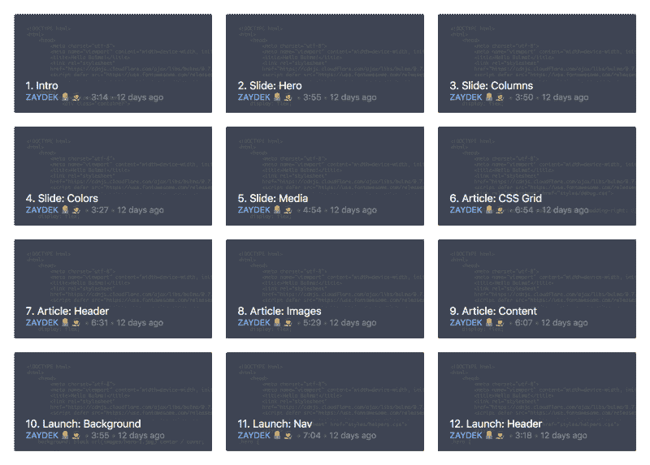

#### [Scrimba.com](https://scrimba.com/g/gbulma)是一个下一代平台，前端开发人员可以通过互动截屏录制和分享他们的网站！？

### 布尔玛？\_(ツ)_/

布尔玛解决了很多问题——很多。无论你是需要一个可视化组件，还是想了解如何用最佳实践和[最佳文档来编写组件](https://bulma.io/documentation/)，布尔玛都可以帮你！？‍?

布尔玛甚至不是 1.0 版本，但在 GitHub 上每月有 [15 万+的下载量](https://github.com/jgthms/bulma/)和[26 万+的星级](https://github.com/jgthms/bulma)被广泛采用。把布尔玛想象成 Bootstrap 的竞争对手，尽管事实上它只是 CSS。？看马，没有 Y [的 avaScript！](https://www.destroyallsoftware.com/talks/the-birth-and-death-of-javascript)

### 布尔玛是如何工作的？

布尔玛使用几种技术为开发人员创建一个内聚的界面。我们只需要关注使用语义类来描述我们的网站设计——而不是元素——或者换句话说，[惯用模板](https://bulma.io/documentation/overview/start)。

这些语义模板可以被认为是我们用来快速构建网站的互连构件。⚡️:这些组件也是开箱即用的，这意味着我们可以更专注于内容而不是代码。

#### 迷茫？开始？我们先来学习布尔玛的基本知识。

### 那又怎么样？设计？

Want to learn how to build this 3D graphic in HTML and CSS? ? L[et me know!](http://bit.do/subscribe-d82dcb4b980a) ?

这个设计可以更好的理解为**三个部分**:

☝️ **响应式背景**✌️**布尔玛组件+修改器**t5？C **不锈钢网格**

靠近一点看…看到什么了吗？背景不连续！？这不是一个错误；Tesla 团队针对台式机、平板电脑和移动设备进行了优化。以此为基础，我们将添加 B **ulma 组件和修改器，**然后使用 C **SS 网格**来实现规格的复杂响应设计。

### ☝️响应背景

这些是**真实的**背景图片 I？？？？？？？来自特斯拉. c [嗡！？‍☠️](https://www.tesla.com/roadster) 哦……我们如何建立一个反应灵敏的背景？使用媒体查询，obv！在某些情况下，媒体查询允许我们覆盖 CSS。

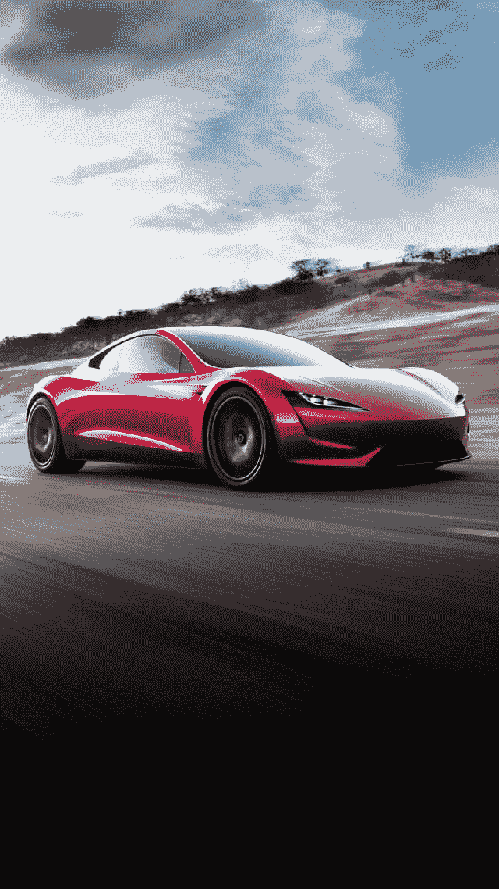

和媒体的询问是强有力的；我们可以根据网站呈现的长宽比、设备的长宽比或者简单明了的:网站呈现的宽度来覆盖 CSS。是的——我们就这么办吧。

首先，我们从布尔玛的一个组件`.hero`开始，使用它的一个修改器`is-fullheight`来创建一个全屏部分。然后，我们使用媒体查询为[的普通宽度](https://bulma.io/documentation/overview/responsiveness/)分配各种背景:

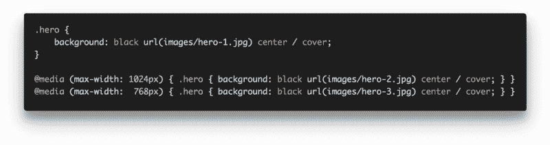

1337 hax ?‍?

太好了——现在我们的网站在`1024px`和`768px`交换背景。有时当这种情况发生时，会有一道白光闪过，所以`black`隐藏了它。而`center`和`cover`只是帮助对准和聚焦图像。

信不信由你，`background`是[8 个 CSS 属性](https://developer.mozilla.org/en/docs/Web/CSS/background)的简写:？

1.️ `background-clip`
2。`background-color`
3。`background-image`
4。`background-origin`
5。`background-position`
⑥。`background-repeat`
7。`background-size`
8。`background-attachment`

我们用了`-color`、`-image`、`-position`和`-size`！

### **✌️布尔玛组件+修改器**

这就是布尔玛变得有趣的地方。**哪个是真正的启动页面？！**

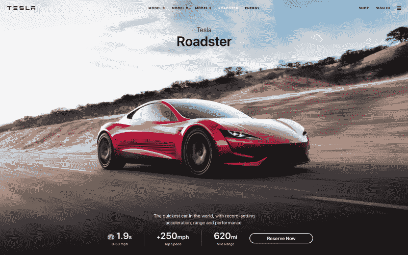

Choose one; the red pill or the blue pill? ?

…

…

…

**左边的是[正宗的](https://www.tesla.com/roadster)！**٩(；ʘ ʘ;)۶等等……布尔玛怎么会这么多才多艺？嗯——还记得修饰语吗？是的，所以，有了足够的修饰词，我们可以创造出不同的美感，甚至不需要编辑布尔玛的资料。

现在，事不宜迟，我将启动页面呈现为 ASCII 艺术！？？

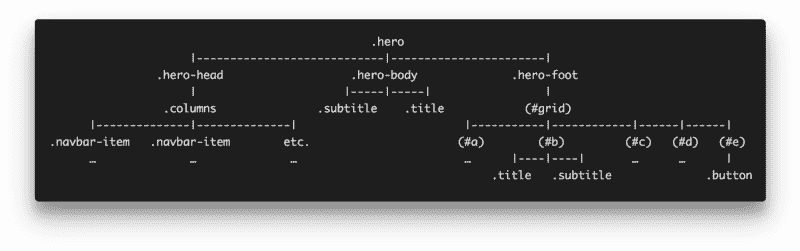

What if we could write code like this…?

现在可以忽略用括号括起来的 id。除此之外，这些是一些可用的[布尔玛组件](https://bulma.io/documentation/)。想象一下这个？布尔玛的组件也很灵敏！哇哦。

请记住，这远没有实际的实现简洁。我混淆了修饰词和无关的 HTML 来展示布尔玛是如何工作的；我们把组件链接在一起，就像乐高一样，但是要设计一个网页！

修改器是我们如何实现类似特斯拉的美学，尽管布尔玛和特斯拉没有任何关系。在整个[代码](https://scrimba.com/p/pV5eHk/c3E6PCb)中，注意`has-*`和`is-*`的广泛使用；这给了我们不同的审美。

#### 可以点击？来这里了解更多关于布尔玛的组件。

### **？CSS 网格**

我们需要 CSS 网格吗？我不确定，(>﹏

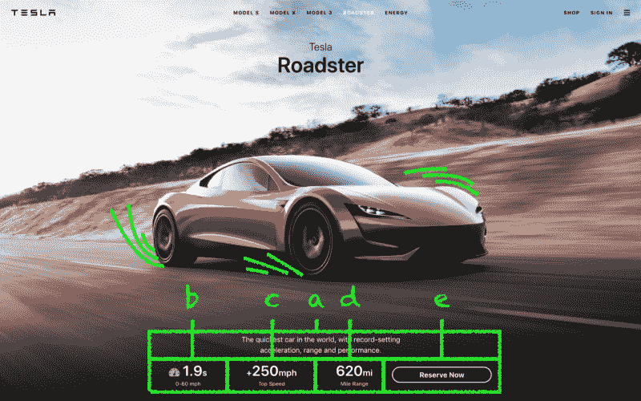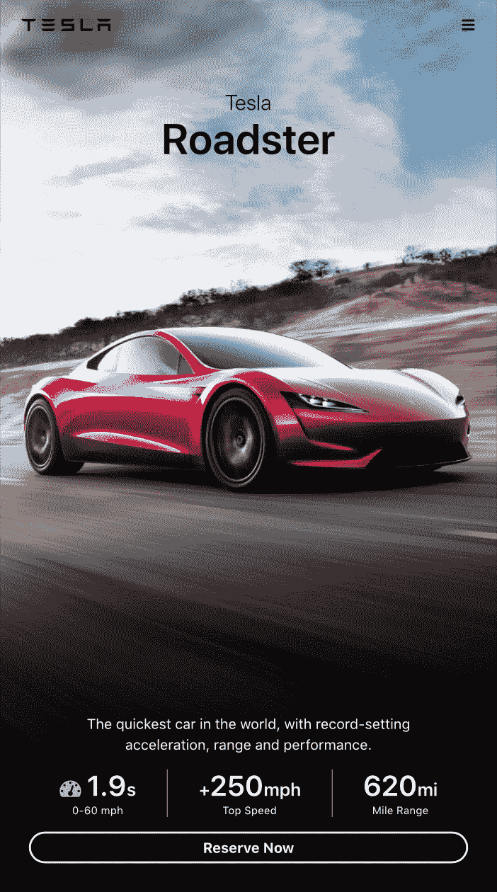

呵呵呵…所以我们有 id`#a`到`#e`，其中`#a`是一些营销，`#e`是“立即预订”按钮。想要的效果是，在手机上，我们偷偷在`#b`、`#c`和`#d`下点击“立即预订”按钮。

3…

2…

1… ?

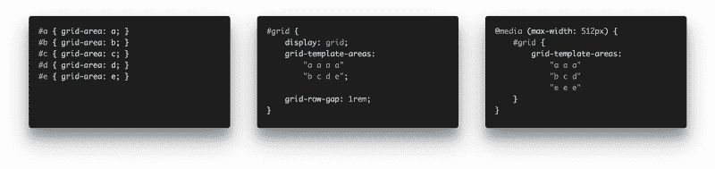

Huh? ? I was expecting something *harder*

在第一张幻灯片中，我们使用`grid-area`为每个 id 分配标识符。然后，我们使用 ASCII art 与`#grid`交流网格的形状！？这是默认网格；适用于台式机和平板电脑。

最后—还记得媒体查询吗？YAS！我们所需要做的就是传达我们的移动网格的形状。想象一下…我们编写一个媒体查询来覆盖移动网格的形状。？⚡️

#### 完整的互动代码可在布尔玛课程？这里。

### 或者……保时捷怎么样？！！？？

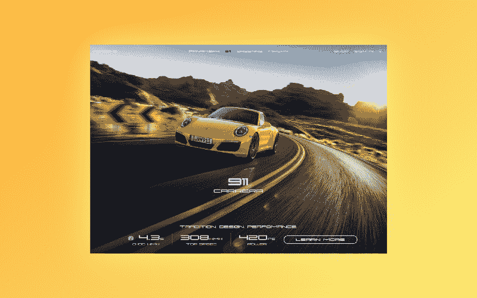

Want to learn how to build this 3D graphic in HTML and CSS? ? L[et me know!](http://bit.do/subscribe-d82dcb4b980a) ?

Nikita Rudenko [@rdnkta](http://twitter.com/rdnkta) ，他是#100DaysOfCode(！)，完成课程后创作了这个，分享给我！干杯！？

### 恭喜你。感谢阅读！6(^ω^)9

现在是进入前端开发的绝佳时机。随着像 [Flexbox](https://en.wikipedia.org/wiki/CSS_flex-box_layout) 和 [CSS Grid](https://en.wikipedia.org/wiki/CSS_grid_layout) 这样的 CSS 规范和像[布尔玛](https://bulma.io/)这样的框架的引入，web 构建变得前所未有的容易！

#### 喜欢这篇文章？！还有一篇文章跟它一模一样！点击？这里！

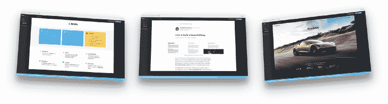