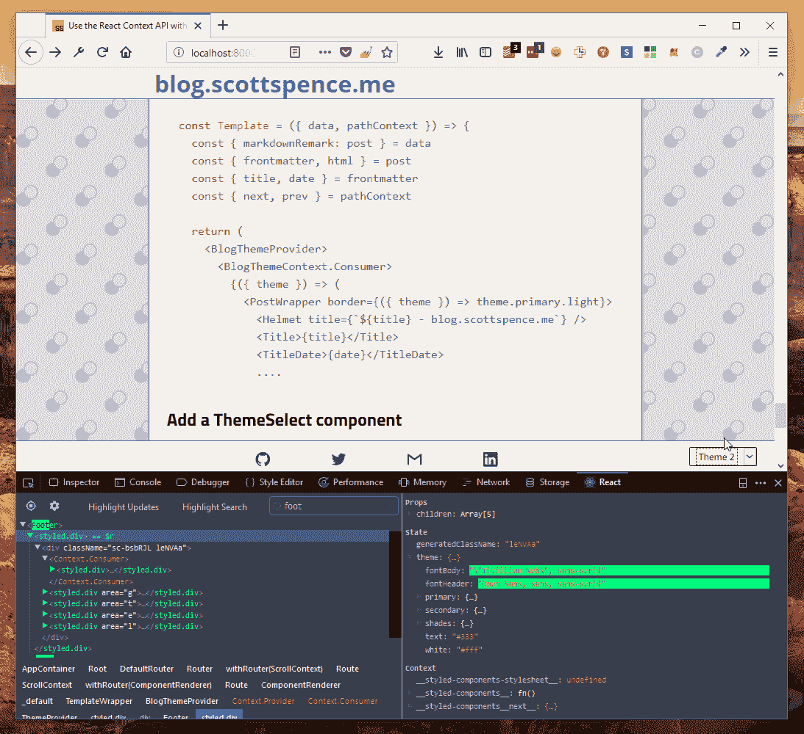

# 对 Gatsby 使用 React 上下文 API

> 原文：<https://www.freecodecamp.org/news/react-context-api-with-gatsby-2018/>

我对使用新的 [React 上下文 API](https://reactjs.org/docs/context.html) 有点晚了，我前几天在工作中使用了它，我还[做了一个片段](https://github.com/spences10/settings/blob/35ba1ca3e9871c3ea6344ca2274ebbd327a18bed/globalVs.code-snippets#L74-L112)为它搭建了一个组件。

我跟随了几个指南解释如何使用它，但没有一个比这个来自 [@leighchalliday](https://twitter.com/leighchalliday) 的[如何使用它的](https://www.youtube.com/watch?v=yzQ_XulhQFw)更好，谢谢你，Leigh？这是一个很好的用例，它帮助我理解了如何使用它。

所以，在 CRA 的一个项目中做了这个之后，我决定把它用在我的一个盖茨比项目中。Gatsby 的布局略有不同，你可以在应用程序的不同部分使用多种布局，因此这非常适合传递上下文。

需要记住的一点是，这是针对我的特定用例的，所以我现在要提前道歉。如果有任何令人困惑的地方，我也想把它记录下来，以帮助我理解它？

如果你想用 Gatsby React next，那么你需要安装 Gatsby React next 插件:

```
npm install gatsby-plugin-react-next 
```

Gatsby 使用 React 16.2，我相信你需要使用这个插件。

你可能需要做的另一件事是:

```
npm i react react-dom
npm un react react-dom 
```

这可能是因为我试图在一个旧项目中使用它，我现在已经在三个项目中这样做了，因为我得到的`createContext`不是一个函数错误，直到我这样做。

你可能要考虑的另一件事是，如果看起来没有任何效果，尝试使用`npm ci`命令。这是 npm 6+版删除你的`node_modules`文件夹重新安装。？

现在让我们来看看我最喜欢的一个用例，向 Gatsby 站点添加主题支持，并使用 React context API 来管理主题。

你可以看到在我的[样式化组件中，没有 React 上下文 API 的 React 应用程序是如何主题化的？入门](https://scottspence.me/styled-components-getting-started)贴。

为了便于说明，我将在这里介绍一下，您将`ThemeProvider`添加到应用程序结构的最高层，这样该应用程序的所有后代/子代都可以访问它。

我已经为我的[个人网站](https://scottspence.me)做了这件事，现在我将在这里，让我们一起来看一下。

## 我们来做个组件吧！

好了，React 中的所有东西都是组件，这就是我如此喜欢它的原因——让我们制作一个`SomethingContext.js`组件，因为我想用样式化的组件做？

让我们先给它起一个富有想象力的名字:

```
touch src/layouts/components/BlogThemeContext.js 
```

我们走吧。

好的，我想用上下文 API 做的“事情”是:

1.  改变样式组件`ThemeProvider`
2.  旋转站点英雄模式

现在为了搭建上下文组件，我已经提到了供我个人使用的 [VS 代码片段](https://github.com/spences10/settings/blob/71dc76fb8e11c176f4517431be57c021fb72411a/globalVs.code-snippets#L74-L111)，它是`Context`的基本结构，分为两部分，一个`Provider`和一个`Consumer`

让我们在这个组件中创建`Context`和`Consumer`。

使用这个代码片段，它应该看起来像这样:

###### `src/layouts/components/BlogThemeContext.js`

```
import React from 'react';
// Context is made up of two things
// Provider - Single as close to top level as possible
// Consumer - Multiple have multiple consumers
export const BlogThemeContext = React.createContext();

export class BlogThemeProvider extends React.Component {
  state = {
    item1: 1,
    item2: 2,
  };

  // add function here
  functionHere = () => {
    this.setState({
      item1: 2,
      item2: 3,
    });
  };
  render() {
    return (
      <BlogThemeContext.Provider
        value={{
          ...this.state,
          functionHere: this.functionHere,
        }}>
        {this.props.children}
      </BlogThemeContext.Provider>
    );
  }
} 
```

因此传递到`<BlogThemeContext.Provider>`中的`props`是包含在`BlogThemeProvider`中的状态和方法，然后可以通过使用`<BlogThemeContext.Consumer>`在整个应用程序中访问它们。

现在让我们在应用程序的顶层添加`BlogThemeProvider`，这样`layout/index.js`的子节点就可以访问提供者的状态和功能。

这是添加上下文提供者之前的样子，您会注意到 styled-components `ThemeProvider`是这里的顶级组件。

###### `src/layouts/index.js`

```
const TemplateWrapper = ({ children }) => (
  <ThemeProvider theme={theme}>
    <PageContainer>
      <Helmet title={nameContent} meta={siteMeta} />
      <Header />
      <Main>{children()}</Main>
      <Footer />
    </PageContainer>
  </ThemeProvider>
); 
```

现在我们已经有了 styled-components `ThemeProvider`，它接收一个`theme`对象，我们希望在我们的上下文提供者中管理主题。所以让我们将现有的主题从`globalStyle`模块导入到`BlogThemeContext`中，并将`theme`添加到`BlogThemeProvider`的状态中:

```
import React from 'react';
import PropTypes from 'prop-types';

import { theme } from '../../theme/globalStyle';

// Context is made up of two things
// Provider - Single as close to top level as possible
// Consumer - Multiple have multiple consumers
export const BlogThemeContext = React.createContext();

export class BlogThemeProvider extends React.Component {
  state = {
    theme,
  };

  // add function here
  functionHere = () => {
    this.setState({
      item1: 2,
      item2: 3,
    });
  };
  render() {
    return (
      <BlogThemeContext.Provider
        value={{
          ...this.state,
          functionHere: this.functionHere,
        }}>
        {this.props.children}
      </BlogThemeContext.Provider>
    );
  }
}

BlogThemeProvider.propTypes = {
  children: PropTypes.any,
}; 
```

当我们在这里的时候，让我们通过替换代码片段中的虚拟`functionHere`函数来添加处理主题改变的函数，并且引入我们想要切换的主题。

```
import React from 'react';
import PropTypes from 'prop-types';

import { theme1, theme2 } from '../../theme/globalStyle';

export const BlogThemeContext = React.createContext();

export class BlogThemeProvider extends React.Component {
  state = {
    theme,
  };

  handleThemeChange = e => {
    let theme = e.target.value;
    theme === 'theme1' ? (theme = theme1) : (theme = theme2);
    this.setState({ theme });
  };
  render() {
    return (
      <BlogThemeContext.Provider
        value={{
          ...this.state,
          handleThemeChange: this.handleThemeChange,
        }}>
        {this.props.children}
      </BlogThemeContext.Provider>
    );
  }
}

BlogThemeProvider.propTypes = {
  children: PropTypes.any,
}; 
```

## 使用`Context.Consumer`

所以，现在，让我们用它，对不对？使用方法很像样式化组件`ThemeProvider`，导入你的`<ThemeSelectProvider>`，然后你可以使用`<ThemeSelectContext.Consumer>`通过`<ThemeSelectProvider>`访问`BlogThemeContext`的功能和状态

消费者的孩子是一个函数，所以你的应用程序不会像普通的 React 组件那样被返回:

```
<Wrapper>
  <Child />
</Wrapper> 
```

所以你需要嵌入这样一个函数:

```
<Wrapper>{() => <Child />}</Wrapper> 
```

因此，您将(在本例中，`<Child />`)应用程序作为`<Context.Consumer>`函数的结果返回，这里我们还可以从上下文中获取任何属性或状态，在我的用例中，我想从上下文提供者`value` ( `<BlogThemeProvider>`)中获取`theme`道具，因此我们将使用 ES6 析构来提取`theme`对象。

样式化组件`ThemeProvider`现在可以使用由`<BlogThemeContext.Consumer>`提供的`theme`对象，所以从`globalStyle`移除导入是安全的。

```
const TemplateWrapper = ({ children }) => (
  <BlogThemeProvider>
    <BlogThemeContext.Consumer>
      {({ theme }) => (
        <ThemeProvider theme={theme}>
          <PageContainer>
            <Helmet title={nameContent} meta={siteMeta} />
            <Header />
            <Main>{children()}</Main>
            <Footer />
          </PageContainer>
        </ThemeProvider>
      )}
    </BlogThemeContext.Consumer>
  </BlogThemeProvider>
); 
```

还有一个模板`src/template/blog-posts.js`，Gatsby 用它来生成这篇博客中的帖子，让我们使它相同，让我们将应用程序包装在上下文消费者的返回函数中，之前它看起来像这样:

```
const Template = ({ data, pathContext }) => {
  const { markdownRemark: post } = data
  const { frontmatter, html } = post
  const { title, date } = frontmatter
  const { next, prev } = pathContext

  return (
    <PostWrapper border={({ theme }) => theme.primary.light}>
      <Helmet title={`${title} - blog.scottspence.me`} />
      <Title>{title}</Title>
      <TitleDate>{date}</TitleDate>
      .... 
```

现在看起来是这样的:

```
const Template = ({ data, pathContext }) => {
  const { markdownRemark: post } = data
  const { frontmatter, html } = post
  const { title, date } = frontmatter
  const { next, prev } = pathContext

  return (
    <BlogThemeProvider>
      <BlogThemeContext.Consumer>
        {({ theme }) => (
          <PostWrapper border={({ theme }) => theme.primary.light}>
            <Helmet title={`${title} - blog.scottspence.me`} />
            <Title>{title}</Title>
            <TitleDate>{date}</TitleDate>
            .... 
```

## 添加 ThemeSelect 组件

`ThemeSelect`组件是一个我已经使用过几次的精选组件，[这是来自我个人网站的源代码](https://github.com/spences10/scottspence.me/blob/master/src/components/ThemeSelect.js)，我们将使用它来处理主题更改，它将使用`BlogThemeContext`中的`handleThemeChange`方法，因此我们最好使用上下文消费者来访问该方法:

###### `src/layouts/components/Footer.js`

```
<BlogThemeContext.Consumer>
  {({ handleThemeChange }) => (
    <ThemeSelectWrapper>
      <ThemeSelect handleThemeChange={handleThemeChange} />
    </ThemeSelectWrapper>
  )}
</BlogThemeContext.Consumer> 
```

现在，如果我们看看 React dev 工具中的`state`,我们可以看到字体随着主题的改变而改变，就像在[样式组件中一样？入门](https://scottspence.me/styled-components-getting-started)贴。



好吧，成功？？现在到背景切换/转换的事情。

## 切换英雄(背景图案)

所以，现在为了在[史蒂夫·肖格](https://twitter.com/steveschoger)的令人敬畏的[英雄模式](http://www.heropatterns.com/)之间切换，我在`globalStyle`模块中有一个函数，它返回一个随机的英雄模式:

```
export const randoHero = () => {
  const keys = Object.keys(HERO);
  return HERO[keys[(keys.length * Math.random()) << 0]];
}; 
```

这个函数用来自`HERO`对象的随机键设置`body`的背景，现在我要把它移到`BlogThemeContext.Provider`的`componentDidMount()`，所以(现在)它每十秒钟从对象中选择一个随机键:

```
export class BlogThemeProvider extends React.Component {
  state = {
    theme: theme1,
    background: HERO[0]
  }

  handleThemeChange = e => {
    let theme = e.target.value
    theme === 'theme1' ? (theme = theme1) : (theme = theme2)
    this.setState({ theme })
  }

  componentDidMount() {
    this.interval = setInterval(() => {
      const keys = Object.keys(HERO)
      const background =
        HERO[keys[(keys.length * Math.random()) << 0]]

      this.setState({ background })
    }, 10 * 1000)
  }

  render() {
  .... 
```

现在在应用程序中找到可以改变背景的地方！正如我之前提到的，页面的背景是通过样式组件`injectGlobal`设置在`body`上的，现在我想从上下文中访问`background`道具，所以我把它移到了`src/layouts/index.js`。我已经为`theme`添加了上下文消费者，所以我们也来析构一下`background`道具:

```
const TemplateWrapper = ({ children }) => (
  <BlogThemeProvider>
    <BlogThemeContext.Consumer>
      {({ theme, background }) => (
        <ThemeProvider theme={theme}>
          <PageContainer background={background}>
            <Helmet title={nameContent} meta={siteMeta} />
            <Header />
            <Main>{children()}</Main>
            <Footer />
          </PageContainer>
          .... 
```

现在使用主包装器`PageContainer`中的`background`道具

现在，我们将背景图像和颜色作为样式组件道具进行传递。

```
const PageContainer = styled.div`
  background-color: ${props => props.theme.background};
  background-image: url("${props => props.background}");
  background-attachment: fixed; 
```

就是这样！我们已经使用 React 上下文 API 来访问状态，并在应用程序中的(两个)不同点使用它。

## 感谢阅读

感谢您查看所有代码墙！

如果您有任何反馈[请联系](https://scottspence.me/contact)

你可以在我的博客回购上找到所有的源代码:[https://blog . Scotts pence . me](https://blog.scottspence.me)

> 你可以在我的博客上阅读其他类似的文章。