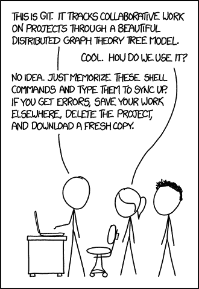
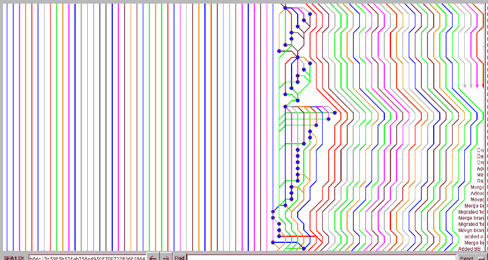
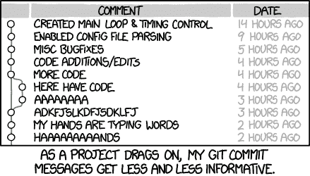

# 你不能忽视的 7 个技巧

> 原文：<https://www.freecodecamp.org/news/7-git-hacks-you-just-can-t-ignore-41aea137727a/>

作者:Ritesh Shrivastav

# 你不能忽视的 7 个技巧


Git 可能比其他任何技术挽救了更多开发人员的工作。只要你经常用 Git 保存你的工作，你总是能够回滚到你的代码过去的样子，从而扭转那些深夜的错误。

也就是说，Git 的命令行界面是出了名的难以掌握。让我们来探索一下从 Git 中获得最大收益的 7 个技巧。



photo credit: [*xkcd*](http://xkcd.com/)

通常使用 Git 的 70%只有*添加*、*提交*、*分支*和*推/拉*。大多数人都熟悉总是朝一个方向流动的流动。想知道如果您向 *repo* 添加了错误的文件，或者向错误的*分支*提交了带有错误消息的 *commit* 时，如何返回或撤销步骤吗？

如果你是上面漫画中的追随者之一，那么这份 Git hacks 列表就是为你准备的。

#### **1。编辑不正确的提交消息**

提交消息将在您的代码库中存在很长时间，因此您肯定希望它是正确定义更改的东西。

此命令将允许您编辑最近的提交消息。您需要确保没有工作副本更改，否则它们也可能被提交。

```
$ git commit --amend -m ”YOUR-NEW-COMMIT-MESSAGE”
```

如果您已经*将*您的*提交*到远程分支，那么您需要使用以下命令强制推送提交:

```
$ git push <remote> <branch> --force
```

你可以按照这个[栈溢出回答](http://stackoverflow.com/questions/179123/edit-an-incorrect-commit-message-in-git/179147#179147)获取更多信息。

#### **2。在提交**之前撤消“git add”

如果您向临时区域添加了一些错误的文件，但是没有提交，该怎么办？您可以通过一个简单的命令来撤消此操作。如果只有一个文件需要删除，则:

```
$ git reset <filename>
```

或者，如果您想取消转移所有未提交的更改:

```
$ git reset
```

你可以按照这个[栈溢出回答](http://stackoverflow.com/questions/348170/undo-git-add-before-commit/348234#348234)获取更多信息。

#### **3。撤销您最近的提交**

有时候你会不小心提交了错误的文件，或者一开始就错过了什么。在这种情况下，以下三个步骤可以帮你解决问题。

```
$ git reset --soft HEAD~1# make changes to your working files as necessary$ git add -A .$ git commit -c ORIG_HEAD
```

当您执行第一个命令时，Git 会将您的头指针移回您在执行这个命令之前所做的提交，这样您就可以根据需要移动文件或进行更改。

然后添加所有的更改，当您最终执行最后一个命令时，Git 将弹出您的默认文本编辑器，并显示相同的提交消息。如果您愿意，您可以编辑此消息，或者您可以通过在最后一个命令中使用'-c '而不是'-C '来完全覆盖此步骤。



Git + spaghetti = spagitty

#### **4。将你的 g *it 回购*回复到之前的提交**

在很多情况下,“恢复”可以有很多意义——尤其是如果你已经完全弄乱了一段代码。最常见的情况是当你想回到过去，探索你的代码库以前的状态，然后回到你现在的状态。这可以通过以下方式实现:

```
$ git checkout <SHA>
```

*< S* HA >'是您要执行的提交的哈希代码的前 8-10 个字符。

它会分离头部，让你在没有检查出分支的情况下瞎搞。别担心——拆头并不像听起来那么可怕。如果您想在这里提交，可以在这里创建一个新的分支:

```
$ git checkout -b <SHA>
```

要回到当前状态，只需检查到先前所在的分支。

你可以按照这个[栈溢出回答](http://stackoverflow.com/questions/4114095/revert-git-repo-to-a-previous-commit/4114122#4114122)获取更多信息。

#### **5\. Undo a Git Merge**

为了撤销合并，您可能必须对之前的提交执行*硬重置*。“合并”主要做的是重置索引并更新工作树中不同于 *< comm* it > *的文件；一个* d 头，但是保留那些在索引和工作树之间不同的(也就是说，有没有被添加的变化)。

```
$ git checkout -b <SHA>
```

但是在 Git 中总是有其他的方法，您可以在这里探索它们。

#### **6。从当前 Git 分支中移除本地(未跟踪)文件**

假设您碰巧有许多未被跟踪的文件(因为它们不是必需的)，并且您不希望它们在您每次使用 *git status* 时出现。以下是解决这个问题的几种方法:

```
$ git clean -f -n         # 1
```

```
$ git clean -f            # 2
```

```
$ git clean -fd           # 3
```

```
$ git clean -fX           # 4
```

```
$ git clean -fx           # 5
```

(1): *-n* 选项会让你知道如果运行(2)会删除哪些文件。

(2):这将删除命令-(1)报告的所有文件。

(3): *-d* 如果你也想删除目录。

(4): *-X* 如果只是想移除被忽略的文件。

(5): *-x* 如果您想删除被忽略和未被忽略的文件

注意最后两个命令中 *X* 的大小写差异。

要了解更多信息，你可以浏览官方的 git-clean 文档。



Photo credit: [*xkcd*](http://xkcd.com/)

#### **7。本地和远程删除 Git 分支**

要删除本地分支:

```
$ git branch --delete --force <branchName>
```

```
# OR use -D as a short-hand:
```

```
$ git branch -D
```

要删除远程分支:

```
$ git push origin --delete <branchName>
```

#### 用 Git 变好

查看官方 GitHub 培训文档以获得快速参考，查看[官方 Git 文档](https://git-scm.com/docs)以了解更多关于 Git 的信息。

如果你有一个最喜欢的 Git hack，把它贴在评论里，告诉我们你是如何使用它的。

*最初发布于[blog.projectshrv.com](http://blog.projectshrv.com/7-git-hacks-you-cant-ignore/)2015 年 11 月 11 日。*