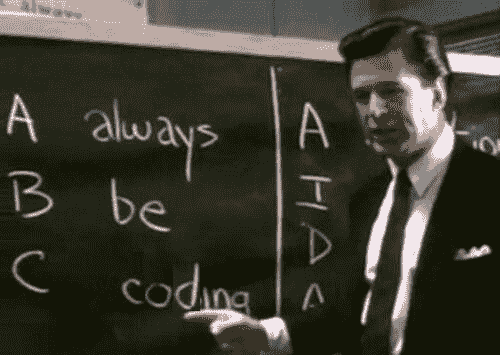
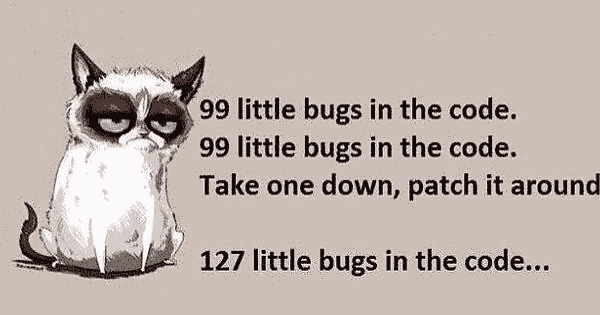

# 我 17 岁时学到的关于编程的 7 个重要教训

> 原文：<https://www.freecodecamp.org/news/7-important-lessons-about-programming-that-ive-learned-at-17-516ae619686/>

亚历克·琼斯

# 我 17 岁时学到的关于编程的 7 个重要教训

source: [twitter](https://twitter.com/msdev/status/399521824704589824) — always be coding— this is the most important lesson of all!

你好，我是 Alec，今年 17 岁，我从 12 岁开始学习 web 开发。我远不是一个优秀的开发人员，但我确实学到了一些关于做一个普通人的东西。？

以下是我学到的一些经验，我认为每个开发人员，尤其是新开发人员，都需要知道。

### 没有人什么都知道

没有一个开发者什么都知道，你也不需要什么都知道。

作为一名开发人员，除了记住之外，还有很多事情要做，例如，在 PHP 5.6 版中操作数组的方法。如果你知道一些小事情，那没关系，如果你忘记了，它们就在谷歌上搜索了。

作为一名开发人员，有比学习这些微不足道的细节更重要的事情可以做，

1.  提高你解决问题的技巧
2.  提高你的团队合作和沟通技巧
3.  增加您的编程概念和语言知识
4.  创建出色的项目来展示您的作品
5.  专注于编写干净高效的代码

作为一名开发人员，最大的好处是你不需要知道所有的事情。你只需要知道如何解决问题。

### 有 bug 是学习的必要条件

Source: [imgur](https://imgur.com/gallery/HTisMpC)

如果你在编程时没有遇到任何错误，这意味着你什么也没学到。

没有遇到错误并不意味着你是一个伟大的开发人员，因为你太聪明了，不会犯错误。这意味着你已经开发过很多次类似的东西，你已经知道如何避免遇到错误。

当你解决了 bug，你就成为了一个强有力的开发者。开发过程中会有无穷无尽的错误，所以你越快学会处理它们，你就会变得越好。

### 正规教育不是必须的

17 岁的我正在努力解决这个问题。为了获得计算机科学学位，我应该上大学吗？

那对我来说是一个很难回答的问题。但是，大多数读到这篇文章的人可能不是 17 岁，事实上，你们大多数人可能已经有工作了。

如果你已经上过大学，你肯定不需要计算机科学学位。你也不需要做所有这些编码训练营。

一个包含一些有趣项目的 GitHub 简介足以说明问题。如果你能证明你会编程，那你有什么背景都没关系。

这只是一个你如何学得最好的问题。

我别无选择，我不得不在周末学习编程，因为我不能从高中请假 6 周去参加新兵训练营。？‍♂️

如果你想回到大学获得计算机科学学位或者参加为期 8 周的训练营，那就去吧。但这完全没有必要。

### 谷歌搜索是一项合法的技能

如果你想成为一名优秀的开发者，你需要提高你的谷歌搜索能力。能够找到您正在寻找的解决方案和代码是非常重要的。

经常会有谷歌搜索，尤其是当你在学习一项新技术的时候。

有许多不同的方法可以通过谷歌提供的小“技巧”来改善你的搜索结果。

编码项目可以消除你需要添加到代码中的奇怪的兔子洞。有时候，你需要找到一个你自己都不懂的问题的解决方案。但谢天谢地，谷歌在某处找到了答案。

### 尝试思考而不是编码

当你编码的时候，你会问自己，“写这个代码的最好方法是什么？”

我知道我通常不会，直到我写了一个不合格的解决方案。太多时候，我发现自己写下了第一次出现在脑海中的解决方案。大多数时候，问题的第一个解决方案并不是最好的。

打出代码的动作很短。任何人都可以快速编写出草率的代码。你需要花时间想出一个好的稳定的解决方案。

虽然这可能很乏味，但是测试驱动的开发极大地促进了这一点，因为你必须考虑你期望什么功能以及它将如何工作。当你必须提前计划时，你不能徒手画代码。

当然，每条规则都有例外。我不是说你应该安静地坐着，思考每一行代码。

但是，无论如何，通过思考你的代码来节省你自己重构和修复错误的时间。

### 小心教程

跟随一个编码教程对于开始来说是很棒的，但是我认为这些教程不是你应该用来学习的唯一资源。

当你遵循一个编码教程时，你实际上并没有在学习。你可能会学到一点，但你并没有真正明白你在做什么，为什么要做。

此外，这些教程还可以快速跳过代码的重要部分，如昆西的推文所示。只复制粘贴，不问教程里的问题，太容易了。

学习编码的一个更好的方法是着手一个你想构建的项目。然后，就开始吧。找到小段代码，编写自己的代码，解决错误，阅读解释和帖子。

最有效的学习方法是把拼图拼在一起，直到你有一个可以工作的程序。

### 制表符比空格好

[image source](https://www.youtube.com/watch?v=V7PLxL8jIl8)

我知道。当你读这篇文章的时候，你在想，“很明显，他必须是一个空间的家伙。”恐怕不是，大家编码的时候应该都在用制表符。

我明白了。选项卡可能看起来与其他人的计算机不同。但是，只是点击 tab 键，而不是一次又一次地敲击空格键，这样很好。对待自己的标签人！

感谢你阅读我学到的这些简短但重要的经验。如果你不同意我提出的任何观点，我很想听听为什么！