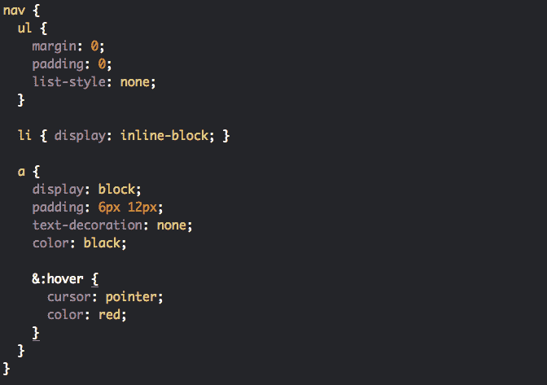

# 写出更好的 CSS 的 7 个重要技巧

> 原文：<https://www.freecodecamp.org/news/7-important-tips-for-writing-better-css/>

编程中最大的问题之一是处理维护。在现实世界中，我们并不总是从零开始开发项目。大多数情况下，我们被分配(或接受)一个可能几年前甚至更久之前就已经写好的项目。

为了在这个项目中高效地工作，首先我们需要理解源代码。这是我们立即意识到**干净代码的重要性的时候。作为开发人员，我们必须尽可能干净地编写代码。**

CSS 也是如此。写 CSS 的时候有几点需要注意。在这篇文章中，我想和你分享一些最重要的。我相信这 7 个技巧会帮助你提高 CSS 代码的质量。

让我们开始吧...‌ ‌

## 1.干燥的

**干代表“不要重复自己”**。这是一个通用的软件开发原则，可以应用于任何编程语言，也可以应用于 CSS。从它的名字我们就可以理解，DRY 的目的是尽可能的避免或者减少重复。

例如，我们可以为 3 个按钮创建 3 个 CSS 类，如下所示:

```
.primary-button {
  background: blue;
  color: white;
  border-radius: 5px;
  padding: 10px 20px;
  text-align: center;
  font-size: 16px;
}

.form-button {
  background: green;
  color: white;
  border-radius: 5px;
  padding: 10px 20px;
  text-align: center;
  font-size: 16px;
}

.cancel-button {
  background: red;
  color: white;
  border-radius: 5px;
  padding: 10px 20px;
  text-align: center;
  font-size: 16px;
}
```

或者，我们可以使用 DRY 原则，在一个附加类中编写一次通用规则**，在其他类中编写不同的规则:**

```
`.button {
  color: white;
  border-radius: 5px;
  padding: 10px 20px;
  text-align: center;
  font-size: 16px;
}

.primary-button {
  background: blue;
}

.form-button {
  background: green;
}

.cancel-button {
  background: red;
}`
```

**正如我们所看到的，应用 DRY 原则避免了重复，减少了行数，提高了可读性，甚至提高了性能。**

## **2.命名**

**命名 CSS 选择器是编写更好的 CSS 的另一个要点。选择器的名称应该是**自描述的和可读的**...**

```
`// BAD NAMING

.p {
  // Rules
}

.myFirstForm {
  // Rules
}`
```

**通常， **< p >** 是一个 HTML 标签，代表段落。以上，我们无法真正理解什么是**级 p** 。另外，你应该避免使用像 **myFirstForm** 这样的名字，我也不建议使用 **camel case** 。**

**相反，使用声明性名称(用破折号分隔多个名称):**

```
`// GOOD NAMING

.article-paragraph {
  // Rules
}

.contact-form {
  // Rules
}`
```

**我觉得现在名字更有意义了:)**

**在编程中命名事物并不容易，但是在项目中可以使用各种命名约定。 **BEM(块元素修改器)**就是其中之一。之前和 BEM 合作过，可以推荐。**

## **3.不要使用内嵌样式**

**关于这一点，网上有一些争论:一些人告诉你永远不要使用内联样式，而另一些人认为它在某些情况下是有用的。**

**在我看来，最佳实践实际上是不使用内联样式。在这里，我将重点讨论为什么我们不应该这样做。**

### **关注点分离**

**根据关注点分离原则，设计(CSS)、内容(HTML)和逻辑(JavaScript)应该被分离，原因是更好的可读性和维护性。**

**在 HTML 标记中包含 CSS 规则会破坏这个规则:**

```
`<div style="font-size: 16px; color: red;">Some Text</div>`
```

> **我们应该将样式规则保存在外部 CSS 文件中。**

### **搜寻的困难**

**使用内联样式的另一个问题是我们不能搜索它们。所以当我们需要改变样式时，我们通常会寻找 HTML 元素的 CSS 选择器。**

**例如，让我们改变网页上文本的字体大小。为此，我们首先通过查看 HTML 结构找到浏览器上需要更改的特定部分:**

```
`<div class="text-bold">Some Text</div>`
```

**然后我们需要找到选择器，这里是 **text-bold** 类。最后，我们去那堂课并做一些改变:**

```
`.text-bold {
  font-size: 16px;    // change the font-size to 14px
  font-weight: bold;
}`
```

**但是如果规则是用内联方式编写的，而不是使用类:**

```
`<div style="font-size: 16px; font-weight: bold">Some Text</div>`
```

**即使我们找到了 HTML 标签，我们也无法知道 HTML 内部是否有其他的**字体大小**规则。由于没有使用选择器，我们不得不一个接一个地浏览所有的 HTML 页面，试图找到其他的**字体大小**规则并改变它们。**

**用 CSS 选择器不是更简单吗？但是还有更糟糕的事情…**

### **特异性/覆盖问题**

**内联样式在 CSS 选择器中具有最高的特异性(当我们不计算**！重要标签**。**

**考虑到我们对一个元素同时使用了类和内联样式:**

```
`.text-bold {
  font-size: 16px;
  font-weight: bold;
}`
```

```
`<div class="text-bold" style="font-size: 14px">Some Text</div>`
```

**这里，文本的**字体大小**将是 **14px** ，因为内联样式比 CSS 类具有更高的特异性。当您在课堂上做出改变时:**

```
`.text-bold {
  font-size: 20px;
  font-weight: bold;
}`
```

**字体大小仍然是 14px。所以你在 CSS 类中的改变不会起作用，这将导致你最后说:**

> **“嘿，为什么我的 CSS 代码不行？我讨厌 CSS！”**

**并引导你使用一个**！重要标签**有什么神奇之处:**

```
`.text-bold {
  font-size: 20px !important;
  font-weight: bold;
}`
```

**这是一个大禁忌，并引导我们到下一点…**

## **4.避开！重要标签**

**好了，你的 CSS 没有像预期的那样工作，你通过应用**重要标签:**使它工作**

```
`!important`
```

**接下来会发生什么？**该！重要标签在所有 CSS 选择器中具有最高的特异性。****

**你基本上是在告诉浏览器用**应用那个特定的规则！重要标签**无论在任何情况下。这是不好的，因为 CSS 规则在不同的选择器、父选择器和子选择器之间会有所不同。**

**覆盖一个重要标签的唯一方法是使用另一个重要标签。这导致使用越来越多的重要标签。相信我，在不久的将来你的项目代码将会充满！**重要标签**，这使得你的 CSS 代码更难维护。所以尽量不要用。**

## **5.使用预处理器**

**使用像 Sass 或更少的 CSS 预处理器在更大的项目中非常有用。预处理器给我们的 CSS 代码带来了一些我们通常做不到的额外特性。**

**例如，我们可以定义变量、函数和混合，我们可以在其他 CSS 文件中导入和导出我们的 CSS 文件，我们可以编写嵌套的 CSS 代码:**

**

Sass Code Example** 

**预处理器有自己的语法，后来它被翻译成标准 CSS(在一个单独的 CSS 文件中)，因为浏览器不理解语法。**

**我喜欢使用 Sass，并在各种项目中使用过它。我已经在这里介绍了使用 CSS 预处理器的一些优点。**

## **6.使用人手不足的人**

**一些 CSS 属性，如填充、边距、字体和边框，可以用更简单的方式由速记员编写。使用短工有助于减少规则的行数。**

**因此，如果没有人手短缺，CSS 类将如下所示:**

```
`.article-container {
  padding-top: 10px;
  padding-bottom: 20px;
  padding-left: 15px;
  padding-right: 15px;
  margin-top: 10px;
  margin-bottom: 10px;
  margin-left: 15px;
  margin-right: 15px;
  border-width: 1px;
  border-style: solid:
  border-color: black;
}`
```

**对于人手不足的情况，它看起来像这样:**

```
`.article-container {
  padding: 10px 15px 20px 15px;
  margin: 10px 15px;
  border: 1px solid black;
}`
```

**[你可以在这里找到](https://developer.mozilla.org/en-US/docs/Web/CSS/Shorthand_properties)更多关于如何使用快捷键属性以及它们可以应用于哪些 CSS 属性的信息。**

## **7.必要时添加注释**

**正常情况下，质量代码不需要注释，因为它应该已经是清晰和自描述的了。但是，在某些情况下，我们可能需要写额外的解释。**

```
`// Your Comments
.example-class {
  // your rules
}`
```

**所以当你觉得代码的某些部分不清楚的时候，那么不要害怕添加注释(但另一方面，确保不要做过头:)。**

**作为一个有几年经验的前端开发人员，这些是我能为提高你的 CSS 技能提供的最重要的建议。如果你有任何问题，或者你认为还有其他写更好的 CSS 的技巧，不要犹豫在下面评论。**

****如果你想了解更多关于 web 开发的知识，欢迎在 Youtube 上关注我**[](https://www.youtube.com/channel/UC1EgYPCvKCXFn8HlpoJwY3Q)****！******

****感谢您的阅读！****