# 这些 JavaScript 方法将在几分钟内提升你的技能

> 原文：<https://www.freecodecamp.org/news/7-javascript-methods-that-will-boost-your-skills-in-less-than-8-minutes-4cc4c3dca03f/>

我们今天构建的大多数应用程序都需要某种数据收集修改。处理集合中的项目是您最有可能遇到的常见操作。忘记像`(let i=0; i < value.length; i+`+`for-loop`那样的常规做法。

> 快速提醒，在`for-loop`中使用`const`会给你一个错误。原因是因为它在每次执行时重新声明值，因此`i`被`i++`修改。所以每当你想到使用`const`或者`let`的时候，问问自己——这个值会被重新声明吗？如果答案是**是**，则进行`let`，如果答案是**否**，则进行`const`。[更多信息](https://stackoverflow.com/questions/41067790/why-does-const-work-in-some-for-loops-in-javascript)。

假设您想要显示产品列表，并对集合进行分类、过滤、搜索、修改或更新。或者您可能希望执行快速计算，如求和、乘法等。实现这一目标的最佳方式是什么？

也许你不喜欢**箭头功能**，你不想花太多时间学习新的东西，或者它们只是与你无关。别担心，你不是一个人。我将向您展示在 ES5(功能减速)和 ES6(箭头功能)中是如何实现的。

**注意:**箭头函数和函数声明/表达式是不等价的，不能[盲目替换](https://stackoverflow.com/questions/34361379/arrow-function-vs-function-declaration-expressions-are-they-equivalent-exch?utm_medium=organic&utm_source=google_rich_qa&utm_campaign=google_rich_qa)。请记住，`this`关键字在两者之间的作用是不同的。

#### 我们要学习的方法是:

1.  传播算子
2.  迭代器的 for……
3.  包括()
4.  一些()
5.  每隔()
6.  过滤器()
7.  地图()
8.  减少()

> 如果你想成为一名更好的 web 开发人员，开创自己的事业，教导他人，或者提高你的开发技能，我将每周发布关于最新 web 开发语言的提示和技巧。

### 1.传播算子

扩展操作符**将数组**扩展成它的元素。它也可以用于对象文字。

**我为什么要用它？**

*   这是一种简单快捷的显示数组元素的方法
*   它适用于数组和对象文字
*   这是传递论点的一种快速而直观的方式
*   它只需要三个点…

**示例:**
假设您想要显示喜爱的食物列表，而不创建循环函数。像这样使用扩展运算符:

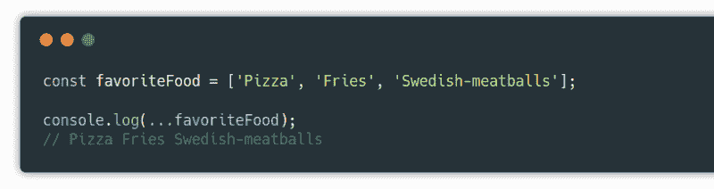

### 2.迭代器的 for……

`for...of`语句循环/迭代集合，并为您提供修改特定项目的能力。它取代了传统的`for-loop`方式。

**我为什么要用它？**

*   这是添加或更新项目的简单方法
*   进行计算(求和、乘法等)
*   使用条件语句(if、while、switch 等)时
*   产生清晰易读的代码

**举例:**
假设你有一个工具箱，你想展示里面所有的工具。迭代器让这变得很容易。

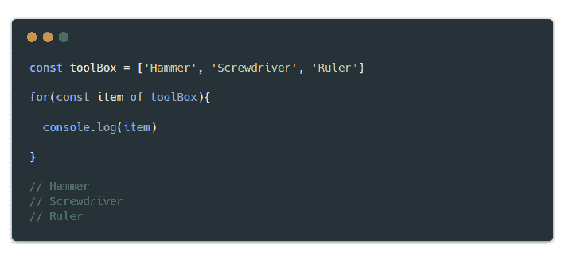

for…of operator

### 3.Includes()方法

`includes()`方法用于检查集合中是否存在特定的字符串，并返回`true`或`false`。请记住它是区分大小写的:如果集合中的项目是`SCHOOL`，并且您搜索`school`，它将返回`false`。

**我为什么要用它？**

*   构建简单的搜索功能
*   这是确定字符串是否存在的直观方法
*   它使用条件语句来修改、过滤等等
*   导致可读的代码

**举例:**
姑且不论什么原因，假设你不知道你的车库里有什么车，你需要一个系统来检查你想要的车是否存在。`includes()`来救援了！

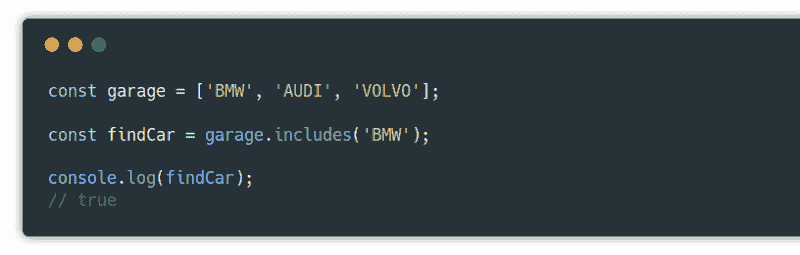

includes() method w/ arrow function

### 4.Some()方法

`some()`方法检查数组中是否存在某些元素，并返回`true`或`false`。这有点类似于`includes()`方法的概念，除了参数是函数而不是字符串。

**我为什么要用它？**

*   它确保某个项目通过测试
*   它使用函数执行条件语句
*   使您的代码具有声明性
*   有些已经足够好了

**举例:**
假设你是一个俱乐部老板，不在乎谁进了俱乐部。但是有些人不被允许进入，因为他们喝得太多了(我的创造力处于最佳状态)。看看下面 ES5 和 ES6 的区别:

#### 是 5:

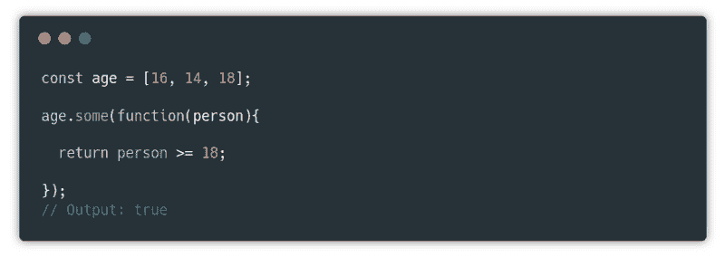

some() method

#### 是 6:

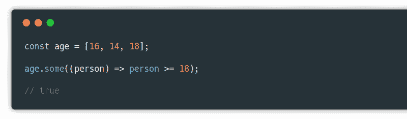

some() method w/ arrow function

### 5.Every()方法

`every()`方法遍历数组，检查每个项，并返回`true`或`false`。与`some()`概念相同。除了每一项必须满足条件语句，否则将返回`false`。

**我为什么要用它？**

*   它确保每个项目都通过测试
*   您可以使用函数执行条件语句
*   使您的代码具有声明性

**举例:**
上次你允许`some()`未成年学生进入俱乐部，有人举报了这件事，警察抓住了你。这一次你不会让这种情况发生，你将确保**每个人**都通过了`every()`操作员的年龄限制。

#### 是五个

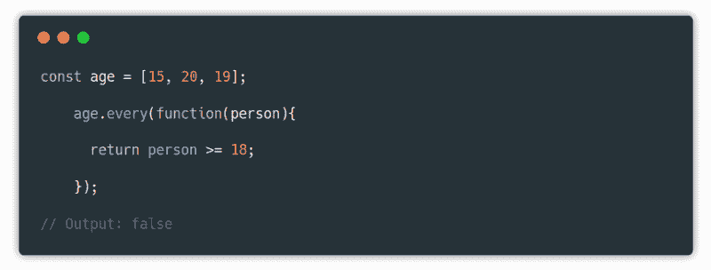

every() method

#### 是六个

every() method w/ arrow function

### 6.Filter()方法

`filter()`方法创建一个包含所有通过测试的元素的新数组。

**我为什么要用它？**

*   所以你可以避免改变主数组
*   它让你过滤掉你不需要的项目
*   给你更多可读的代码

**示例:**
假设您只想返回大于或等于 30 的价格。过滤掉所有其他价格…

#### 是五个

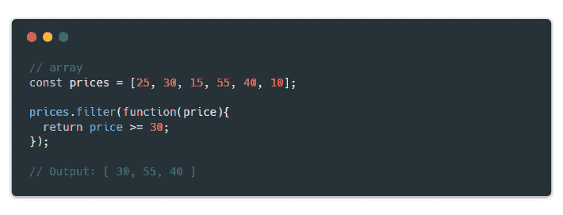

filter() method

#### 是六个

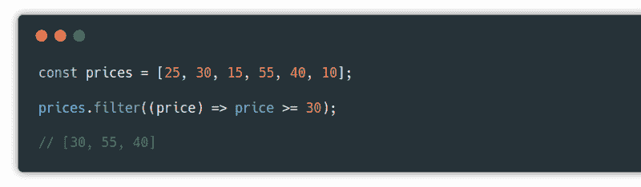

filter() method w/ arrow function

### 7.Map()方法

在返回新数组方面，`map()`方法类似于`filter()`方法。但是，唯一的区别是它用于修改项目。

**我为什么要用它？**

*   它可以让您避免对主数组进行更改
*   您可以修改想要的项目
*   给你更多可读的代码

**例如:**
假设您有一个带有价格的产品列表。你的经理需要一份清单来显示 25%征税后的新价格。`map()`法可以帮你解决。

#### 是五个

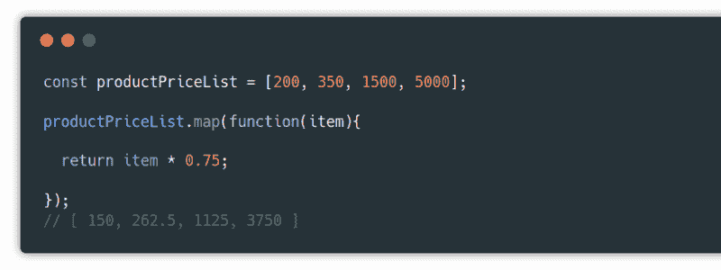

map() method

#### 是六个

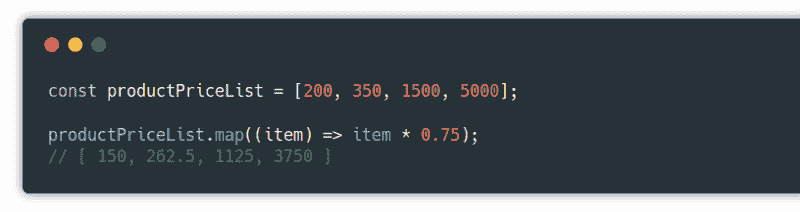

map() method w/ arrow function

### 8.Reduce()方法

方法可以用来将数组转换成其他东西，可以是整数、对象、承诺链(承诺的顺序执行)等等。出于实际原因，一个简单的用例是对一组整数求和。简而言之，它将整个数组“简化”为一个值。

**我为什么要用它？**

*   执行计算
*   计算价值
*   重复计数
*   按属性对对象进行分组
*   按顺序履行承诺
*   这是一种快速的计算方法

**例如:**
假设你想知道自己一周的总开销。使用`reduce()`获得该值。

#### 是五个

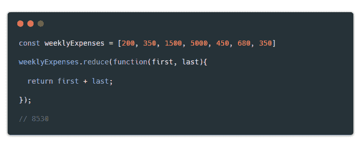

reduce() method

#### 是六个

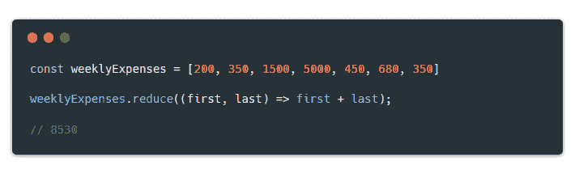

reduce() method w/ arrow function

你可以在我每周发布的开发者新闻上找到我。或者你可以在 Twitter 上关注我，我会在那里发布相关的 web 开发技巧和诀窍。