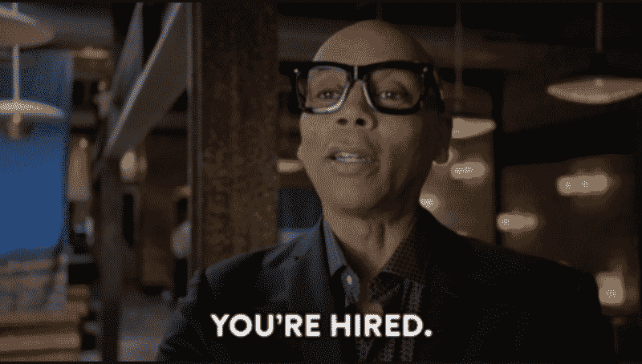
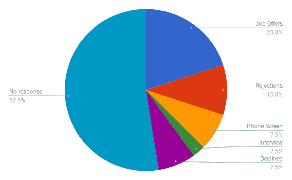
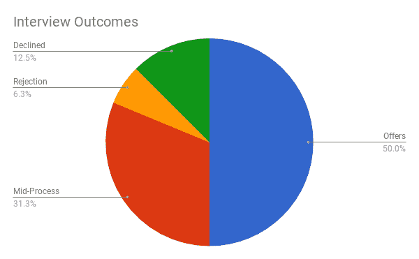

# 获得第一份软件工程工作的 7 个关键步骤

> 原文：<https://www.freecodecamp.org/news/7-key-steps-to-getting-your-first-software-engineering-job-6ef80543cad9/>

斯特拉·钟

# 获得第一份软件工程工作的 7 个关键步骤

我是 2017 年从一个 web 开发训练营毕业的。我没有软件工程师或科技行业的工作经验。10 月份开始求职，12 月份开始全职做前端工程师。

找工作的过程对我来说是短暂但充满压力的 5 周。有些事情我希望我已经知道了，有些事情的回报远远超过了我的预期。为了节省你大量的时间和压力，我把我学到的东西浓缩成了我为了保住第一份工作而做的七件关键事情。

#### 1.制作几个杰出项目的作品集

我看过其他训练营毕业生的简历，他们只列出了一两个部分完成的项目。它们不一定要完美(我的 Phaser.js 游戏并不完美)，但它们应该展示你作为软件工程师所取得的进步。

这意味着，如果你说你知道 React，你的投资组合中应该至少有一个 React 应用程序。如果你没有开发人员的工作经验，**至少三个项目的组合是至关重要的**。这些也不应该是教程——发挥创造力！项目对你来说越有趣，你投入的工作就越多。当你向面试官描述时，你听起来就越有激情。(如果您创建了自己的[投资组合网站](http://www.stella-chung.com/)，还会获得额外的积分！).

你还应该**准备好与面试官**讨论你的项目的优势和劣势。我的几位面试官打开了我的 Github，让我和他们一起浏览我的代码。第一次出现这种情况时，我肯定是笨手笨脚的，因为我已经好几个星期没看代码了！准备是*的关键*。

后来，我确保我可以在 Github 上浏览我的项目，并可以谈论我在每个项目中解决的一个棘手的挑战。

关于 Git 的话题，我所有的面试官都印象深刻，我有使用 Git 进行版本控制和[协作](https://www.atlassian.com/git/tutorials/syncing)的经验。我推荐**熟悉 Git + Github** 。如果你从未使用过 Git 进行团队协作，我肯定会推荐[为一个开源项目制作你的第一个 PR](http://www.firsttimersonly.com/) 。好的 Git 习惯也大有帮助。我的一位面试官刚刚浏览了我的提交历史，看看我是如何“思考”的，我很高兴这是一个有着良好提交信息的项目。

#### 2.准备技术面试

[Unsplash](https://unsplash.com/)

科技面试的方式存在很多问题，但事实是，对于许多公司来说，白板仍将存在。有很多很好的资源可以实践这一点( [Pramp](https://www.pramp.com/#/) 、 [InterviewCake](https://www.interviewcake.com/) ，当然还有[破解编码面试](https://www.amazon.com/Cracking-Coding-Interview-Programming-Questions/dp/0984782850)等等)。

我不得不承认，我为此纠结了很久——在压力下，我的大脑往往会一片空白。但最重要的是你**练习大声思考** *。面试中完全尴尬的沉默是你最不希望看到的，你想得越多，面试官就越知道你已经走了多远(如果他们愿意的话，他们也更能帮助你！).*

我还刚买了一块白板和干擦记号笔，这样我就习惯了在没有代码编辑器的情况下工作(相信我，从借助于 linter 编写代码到一面空白的墙是不和谐的！).

不是所有的公司都会请你在白板上写东西，但几乎所有的公司都会问你一些基本的技术问题，我称之为“琐事”，因为没有更好的术语。对于我申请的职位，这些问题通常集中在 HTML、CSS、JavaScript 和 web 性能上。也有很多网上资源列出了常见问题——我只是做了一堆抽认卡并练习了一下！

前端或全栈 web 开发人员很少会对一些主题感到舒服。其中包括 JS 中的[事件循环、](https://www.youtube.com/watch?v=8aGhZQkoFbQ)[承诺](https://developer.mozilla.org/en-US/docs/Web/JavaScript/Reference/Global_Objects/Promise)和[异步/等待](https://developer.mozilla.org/en-US/docs/Web/JavaScript/Reference/Statements/async_function)、 [CSS 盒子模型](https://developer.mozilla.org/en-US/docs/Web/CSS/CSS_Box_Model/Introduction_to_the_CSS_box_model)、CSS [特异性权重](https://developer.mozilla.org/en-US/docs/Web/CSS/Specificity)，以及加速网页加载时间的方法。我不止一次被问到关于这些的问题。

#### 3.明确你想要什么样的公司或角色

[Unsplash](https://unsplash.com/)

在我开始找工作的时候，我犯了一个错误，带着一种“乞丐不能挑肥拣瘦”的心态，撒了一张大网。但无论你在哪里着陆，你都将把大部分时间投入到工作中。如果你对去办公室几乎提不起任何兴趣，或者更糟，害怕去办公室，那还有什么意义呢？

为你的新工作列一个优先事项的清单，这将大大有助于你掌控求职，而不是让求职左右你。我的首要任务是:

*   解决我感兴趣的挑战性问题的机会
*   良好的工作/生活平衡
*   与现代技术合作的机会

这些优先事项让我关注那些有健康工作文化的公司的工作。我也想使用现代框架*(抱歉 jQuery)。*他们还必须有有趣的任务，我可以支持*(不，谢谢你，没有灵魂的公司)。*

另外，记住面试不仅仅是公司评估你的时候。如果一家公司是有毒的或者不是一个合适的公司，你通常会发现警告信号。我遇到过一个公司，它甚至在与候选人交谈之前就发布了一份冗长的编码挑战。另一家公司正在开发一款令人着迷的产品，但当我提到工作/生活平衡时，我的面试官很恼火。我可以不停地讲述我所经历的所有警告信号。

面试时总是问 [**问题**](https://gist.github.com/jvns/8178076) **。**说明你是认真的，有兴趣的，但也能帮你察觉这些预警信号。

#### 4.保持有序，追踪一切

你已经有了一些杀手级项目，为技术面试做好了准备，心中也有了目标公司。现在是时候开始求职了。但是天哪，跟踪几十个应用程序简直是一场噩梦！我过去常常把应用程序放在我电脑的文件夹里，但是它变得笨拙而麻烦。

我最终使用了 [Airtable](https://airtable.com/shrN6LSwDGNqxiXf5) 来跟踪我所有的申请。我用它来跟踪的工作列表、求职信、任何电子邮件或书面通信、工资范围、联系人、会议日志等等。

这里有一个 [**链接到我用的模板**](https://airtable.com/shrN6LSwDGNqxiXf5) 。(对于所有不喜欢电子表格的人来说，Airtable 就像是 Excel 电子表格和关系数据库的宠儿。)我喜欢 Airtable 的一点是它能够链接不同表中的记录。这让我可以在“People”页面上保存公司联系人和个人的完整列表，在另一个页面上保存公司列表。

但是为什么要这么有条理呢？？除了满足我对电子表格的热爱之外，它还能让你更容易找到求职策略中的优势和劣势。

例如，下面是我获得工作后，我的工作申请状态的明细:

I sent 40 job applications in total. ‘Declined’ means that I declined to continue interviewing. ‘Rejections’ means that the company rejected me as a candidate.

在我寄出的 40 份申请中，大约 50%没有回应，20%有工作邀请。考虑到我发送申请的方式，这还不错。但是，仍然没有我希望的那么高。

但是如果我们看看我有机会面试的工作:

I interviewed for 16 positions. I got 8 offers, declined to continue interviewing for 2 positions, got rejected from 1 company. I was between interviews for 5 companies when I accepted another job.

事情看起来好多了。**我有 50%的出价。在我面试的四分之一的工作中，当我接受工作邀请时，我还在几轮面试之间。所以，如果我继续面试他们，他们也可能会变成录用通知。面试后，我只被*一家*公司拒绝了(这可能是因为当我发现他们平均每周工作 60 多个小时时，我笑了——这是一次相当尴尬的面试！).**

多亏了我细致的电子表格，我意识到只要我和公司里的一个真实的人交谈，我得到工作机会的几率就会大大增加。我的面试游戏大部分都很精彩，但是我获得面试机会的能力却不怎么样。如果我的求职再持续几个月，我肯定会改变策略。我会花更少的时间写一大堆求职信和申请，花更多的时间建立关系网和培养推荐人。

这就引出了我的下几点…

#### 5.写一份有意义的简历和求职信

与其编写大量低质量的应用程序，不如花更多时间编写高度定制的应用程序。毕竟，有错别字或语法错误的简历或求职信会被立即拒绝。超过一页的简历通常会被立即拒绝。

普通的求职信可能不会立即被拒绝。然而，在求职申请的海洋中，他们真的不会为你做任何事情。花几分钟时间浏览公司网站，**想出一个真正的理由，为什么你想为*那家*特定的公司**工作。如果你不能，那么，也许这是一个信号，它不适合你的公司。

不管怎样，你都应该尽可能地调整你的回答。避免复制和粘贴你在网上找到的任何模板(招聘经理会谷歌一下，我保证)。

光是简历我就能写一整篇文章。但总的来说，你应该突出你以前工作中最相关的技术方面。例如，我曾经在非营利发展和筹款部门工作——这个职位没有一点是“网络开发人员”然而，我一定要强调我在迁移数据和管理筹款软件方面的工作。此外，我把我最相关的三个投资组合项目放在了我简历的顶部。因此，我的技术能力在我的工作经历之前就已经展现出来了。

#### 6.网络！

How I feel at networking events.

所以，我不擅长交际。我是一个害羞内向的人，很难融入大群体环境。但即使对我来说，这也是可能的。我拖着自己去当地聚会，有时我甚至和其他技术人员聊得很开心。

老实说，绝大多数的聚会都没有带来任何工作机会，但是有几个确实得到了回报。事实上，我现在的工作是我从一个聚会上认识的人那里了解到的！

所以，我真的真的鼓励你走出去，参加聚会、讲座和技术专业人士的休闲小组。甚至通过社交媒体在网上与人/公司联系也是有帮助的。最好的工作往往不会被公布，所以即使你是这个行业的新人，努力建立你的职业关系网也是很重要的。

记住——这是一次互利的交换！许多公司为员工提供推荐奖金，所以伸出援助之手通常也符合他们的利益。

#### 7.避免退而求其次，谈判，谈判，谈判

[Unsplash](https://unsplash.com/)

几乎在我面试的每个职位中，都会有人问我的目标工资是多少。这令人沮丧，因为一般来说，第一个说出数字的人在谈判中处于弱势。同时，你也不想浪费时间去一家远低于你期望薪资的公司面试。

在这个问题上摸索了几次之后，我终于振作起来，进行了一些薪资研究。我在 Payscale 等网站上查询了与我所在城市的经验水平相当的开发人员的薪资估算，以及我在当地技术聚会上的薪资调查。在大公司，你也可以在 Glassdoor 上查找薪水，这样你就可以确定你的薪水范围或多或少与他们的一致。

所以每当有人问我对薪水的要求是什么时，我就说:“我的目标薪水范围是 X 美元到 X 美元。然而，钱不是最重要的。我真的在寻找一家能让我继续成长并为团队做出贡献的公司。”这基本上是我用我所知道的最礼貌的方式陈述我的目标工资的方式。我陈述了一个范围，以表达我的灵活性，但确保范围的底部是我 100%满意的。

一旦你得到了一份工作，不要害怕谈判。问问也无妨！除了工资，你还可以就其他事情进行协商。这些可以包括假期，推迟你的开始日期，签约奖金，这可以比基本工资更灵活。

#### 结论

感谢所有走到这一步的人！我希望这对你的求职有所帮助。我的最后一条建议是:不要担心找不到工作。对软件工程师的需求非常大，甚至在主要技术中心之外也是如此。如果你已经学习并准备好了，你就能找到工作。

专注于获得正确的工作——在一家善待员工的公司从事你喜欢的技术工作。在你的第一份技术工作中，两者不一定都能得到，但是一旦你迈出了第一步，追求下一个机会就会变得容易得多。从这里开始只会变得更好。

善待自己，保重。祝你好运！

附言:如果你想听更多关于我个人面试经历的信息，以及我最终的结局，请查看我的文章[面试利基](https://building.niche.com/interviewing-as-a-software-engineer-at-niche-aa285898a22c)的软件工程师。