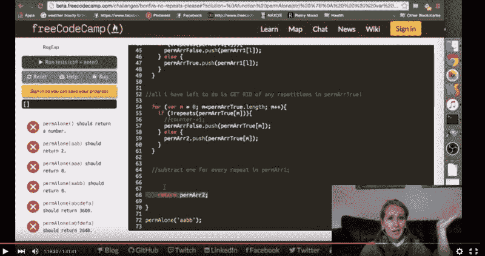

# 7 种方式让你成为更好的编码者

> 原文：<https://www.freecodecamp.org/news/7-ways-streaming-makes-you-a-better-coder-b1be71ce7c7e/>

由免费代码营

A live stream of mine from [October 2015](https://www.youtube.com/watch?v=XHT9lsQ-_C0).

# 7 种方式让你成为更好的编码者

在 twitch.tv 上现场编码几十个小时后，我确信流媒体让你成为一个更好的编码者。原因如下。

#### 1)获得结对编程的好处，但要用自己的时间

结对编程，敏捷开发的主要部分，关注于和你身边的伙伴一起解决问题。

目标是让一个人带头，而另一个人检查主要人员可能会忽略的细节和失误。就当是大图/小图作品平衡吧。

流媒体自然地设置了这一点。你会关注大局，聊天会关注细节。

为什么流式传输比配对更方便？您不需要与您的搭档一起玩调度游戏，也不需要担心不匹配的开发环境。你可以开始流式播放，让观众来找你。

#### 2)在 Twitch 聊天中获得免费的即时帮助

学习编码最令人沮丧的部分之一是学习去哪里寻求帮助。

当你从免费的 Code Camp 频道下载时，所有技能水平的用户都会收听。一旦你让他们知道你愿意接受他们的帮助，这就像上了一堂免费的个人编程课。

你还会得到帮助，保持在正确的轨道上——听众会间接地让你保持在正确的轨道上，因为你觉得你对信息流的主题内聚性负有责任。

诚实地说出你的优点和缺点，这样你的观众才能放心地给你坦诚的反馈。

#### 3)增强你的自信

在聊天中坦诚地谈论对我来说困难的事情，总能激发出令人鼓舞的话语。

大多数程序员和你一样在为同样的事情奋斗，并且乐于分享对他们有用的东西。听到观众的声音会提醒你，所有编码员都会遇到困难。

就像去健身房一样，串流需要最初的动力。但你总是很开心地离开，因为你做到了。

#### 4)感觉与其他编码员有更多的联系

许多新的程序员已经利用了本地编码事件，这是你自学时社交的一个很好的方式。

有时候，你想要一些互动，但你所在的城市没有任何活动，或者你不想离开家。流式传输将允许您与来自世界各地的编码人员联系、合作和学习。

你不是地球上唯一一个学习编码的人，流媒体可以极大地提醒你这一点。

#### 5)练习你的沟通技巧

在你能写出好的代码之前，你需要阐明你的问题以及你打算如何解决它。

流式传输给你一个机会来练习用快速、低风险的反馈来谈论你的代码。

#### 6)也帮助其他程序员学习

关注你的编码流的人从初学者到专家都有。

他们会接触到新的方法，看你如何解决问题。

观察你还会强化这样一个事实，即查找东西和向其他编码人员寻求帮助是很正常的。

#### 7)建立团队精神

大多数程序员作为团队的一部分工作。

以防你没听说过，[软件正在吞噬世界](http://www.wsj.com/articles/SB10001424053111903480904576512250915629460)。软件开发工作短期内不会短缺。

与其担心竞争，不如专注于帮助自己和他人尽快准备好填补这些职位。

在你编码的时候，与聊天流和互动是练习团队精神的一个完美方式。

#### 尝试在自由代码营的 Twitch 频道上播放流媒体

来自我们开源社区的几十名露营者通过在我们的 Twitch.tv 频道上流式传输改进了他们的编码。

你应该上我们的频道。不要担心你的英语水平或者你是一个多么高级的程序员——我们的近 3000 名订户观众真的很冷静和支持。

在 [Twitter](https://twitter.com/brianamarie132) 或 [Gitter](https://gitter.im/brianamarie) 上联系我(Briana)，我会帮你[准备好流媒体](https://github.com/FreeCodeCamp/FreeCodeCamp/wiki/Stream-Your-Coding-Sessions-on-Twitch.tv)。