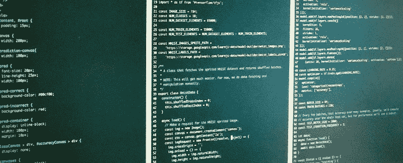
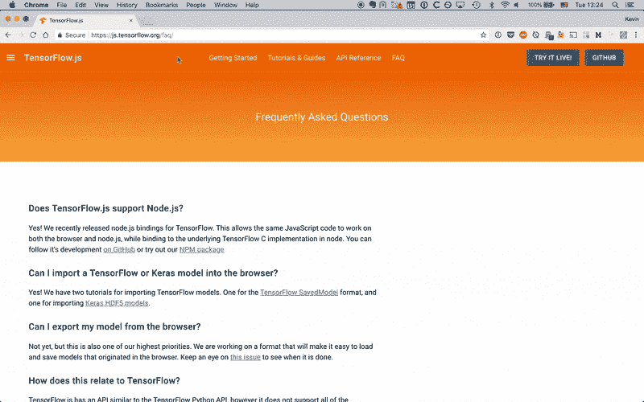
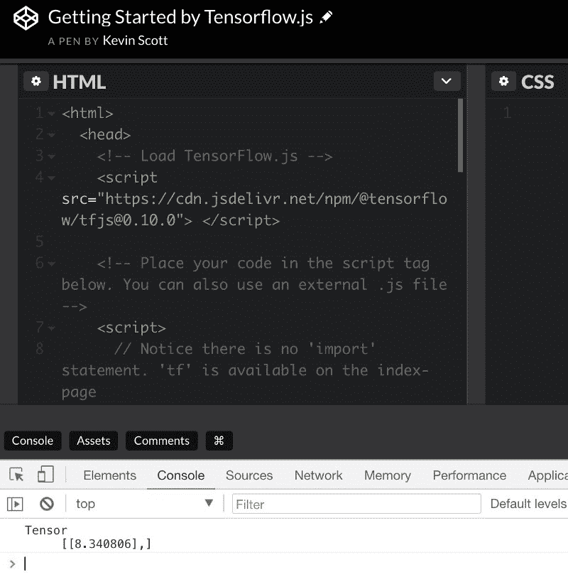

# 如何在浏览器中设置 Tensorflow.js 进行机器学习

> 原文：<https://www.freecodecamp.org/news/how-to-set-up-tensorflow-js-for-machine-learning-in-your-browser-2540b5c43411/>

作者:凯文·斯科特

# 如何在浏览器中设置 Tensorflow.js 进行机器学习



直到最近，仅仅开始编写你的第一行机器学习代码就需要大量的时间和金钱的前期投资。

去年，[我专门为机器学习打造了自己的 PC](http://thekevinscott.com/deep-learning-cryptocurrency-pc-1-hardware/) 。我研究了零件，然后自己组装。仅仅这样做就花了我大约 1600 美元和 30 个小时的安装时间。我仍在努力调整计算机的配置和库，让它能与各种框架一起工作。

好消息是，今天开始使用机器学习从未如此简单。事实上，如果你正在读这篇文章，这意味着你已经拥有了你需要的工具。现在，你可以在浏览器中使用 JavaScript 学习机器学习框架 Tensorflow。

### Tensorflow.js


Google I/O 2018 by [Bruno Sanchez-Andrade Nuño](https://www.flickr.com/photos/nasonurb/4649268142/in/photolist-85QHry-4RMuLP-6rHwUw-4RRzRS-8434Pj-83YVXe-4FLYVv-83SpSP-6TYsho-cww2Ej-oUgsLJ-6rwVWy-84KqdW-cvqdhq-TDNAMg-6TUr7z-oDPfkP-iJXS7Q-bDUXd-6TUqA4-83VSYq-6TYprJ-6U1qaL-6TWpTt-9Jo26U-6U1pQ5-gB66bX-dzG2FW-6TYmW9-83SEEc-dpkJrd-6TYnwA-qMXaBP-6TUotz-6TUmbi-jRSgF-iK1Pig-6TYwDs-GqG1if-83sPNj-oWgxXQ-6TUq68-6TYmgb-6rDpex-qMMZQZ-4RMiFv-9Gwi29-4RMJf2-cocCNf-4RRvyL)

Google [在 Google I/O 2018 上发布了 Tensorflow.js](https://www.youtube.com/watch?v=OmofOvMApTU) 。在浏览器中运行机器学习算法有一些巨大的用例[。](https://thekevinscott.com/reasons-for-machine-learning-in-the-browser/)

此外，这是一个在不安装任何东西的情况下使用 JavaScript 探索机器学习概念的绝佳机会。

如果您是 JavaScript 新手，或者已经有一段时间没有编写前端代码了，那么 JavaScript 生态系统中最近的一些变化可能会让您大吃一惊。我将列出运行 Tensorflow.js 示例所需的现代 Javascript 基础知识，并开始探索机器学习。

### 安装教程

我再重复一遍:**运行 Tensorflow.js 所需要的只是你的网页浏览器**。

在所有关于 transpilers、bundlers 和 packagers 的讨论中很容易被忽略，但您所需要的只是一个运行 Tensorflow.js 的 web 浏览器。您在本地开发的代码就是您将能够提供给用户在他们的浏览器上运行的代码。

让我们看看三种无需安装任何东西就能让 Hello World 示例正常工作的快速方法。我将使用 Tensorflow.js 文档中的[入门代码](https://js.tensorflow.org/#getting-started)。

#### `Getting started`使用您的浏览器控制台

每个现代的网络浏览器都内置了某种交互式 JavaScript 控制台。我用的是 Chrome，里面有一个 JavaScript 控制台，你可以用“查看>开发者> JavaScript 控制台”打开。



这个 JavaScript 控制台允许您编写 JavaScript 并立即执行。我们将使用它来运行来自 [Tensorflow.js 文档](https://js.tensorflow.org/#getting-started)的入门示例。

首先，您需要包含 Tensorflow.js JavaScript 文件。该文件的托管版本可通过下面的[内容交付网络(CDN)](https://www.webopedia.com/TERM/C/CDN.html) 获得。通过控制台包含外部`.js`文件的快速方法是:

```
var script = document.createElement('script');script.src = "https://cdn.jsdelivr.net/npm/@tensorflow/tfjs@0.10.0";document.getElementsByTagName('head')[0].appendChild(script);
```

将它复制并粘贴到您的 JavaScript 控制台中，您将有一个 Tensorflow 的副本保存为变量`tf`。(如果你在你的控制台中输入`tf`，你会看到它的引用)。

然后，您可以复制并粘贴入门示例的其余部分(第二个`<scri` pt >标记之间的 JavaScript ),方法是将其直接粘贴到您的控制台中。

#### JavaScript 托管平台入门

另一种方法是使用在线 JavaScript 托管平台。三个比较热门的是 [CodePen](https://codepen.io/) 、 [JSFiddle](https://jsfiddle.net/) 、 [JSBin](https://jsbin.com/) 。这些平台可以自动为您包含脚本，并负责在浏览器中传输您的代码，这使得入门变得轻而易举。

您可以在 Codepen 上查看[下面的示例，以了解实现的工作情况。确保打开浏览器控制台，如上所述，查看输出。](https://codepen.io/thekevinscott/pen/aGapZL)



#### 本地入门

让 Tensorflow.js 工作的第三个选择是将代码保存为一个`.html`文件，并在本地计算机上打开它。而且你不需要一个网络服务器来做这件事！

将 HTML 代码复制到一个文件中，并在 web 浏览器中打开它。例如，如果您将文件保存到桌面上，并且您在 Mac 上，您可以使用以下 URL 在浏览器中打开它:

`file:///Users/YOURNAME/Desktop/sample.html`

值得注意的是，以这种方式查看 HTML 文件会引入一些限制，包括引用相对链接、处理 ajax 调用和安全性等问题。但这是一种在浏览器中运行的快速简单的方法。

### 现代 JavaScript 开发工作流程

希望到这一步，您可以看到在浏览器中显示一些基本内容是多么容易。如果您开始查看 Tensorflow.js 示例，您可能会想:

*   我如何组织我的文件？
*   如何在我的代码中管理第三方库？
*   这些语法错误是怎么回事？

一旦您超越了上面的基本“Hello World”示例，进入到其他一些示例中，您将开始遇到语法问题和组织问题。在这种情况下，强大的 JavaScript 管道将是您最好的朋友。

#### 一点 JavaScript 历史

随着我们对 web 应用程序的期望在过去十年中不断增长，前端生态系统的复杂性也在爆炸式增长。

特别是 JavaScript，作为一种编程语言已经成熟了很多，在继续支持任何编程语言的最大用户群之一的同时，采用了许多前瞻性的变化。

语言规范的新变化引用了缩写词，如 ES5、ES6、ES2015 和 E2016。

‘ES’代表 ECMAScript， [JavaScript 就是基于这个标准](https://benmccormick.org/2015/09/14/es5-es6-es2016-es-next-whats-going-on-with-Javascript-versioning/)。传统上，数字 5 和 6 用来指代标准的版本，但是现在为了更加清晰，使用了年份。

现代浏览器对 ES6 的支持是不完整的。一些前沿的或提议的特性还不被支持，旧的浏览器(尤其是 Internet Explorer)将永远不会支持最新的规范。

由于这种不稳定性，如果你想获得尽可能广泛的受众，你可以使用一种叫做[捆扎机或 transpiler](https://dev.to/kayis/4-Javascript-bundlers-2g4b) 的东西。这是一个软件，它可以将你用现代便利编写的 JavaScript 代码转换成一个被广泛采用的版本。ES5 得到了广泛的支持，通常是一个很好的目标。

许多 Tensorflow.js 示例使用了浏览器尚未广泛支持的新语法，并且需要 transpiling。我将首先解释语法，然后解释如何让它们工作。

#### `import`和`export`

`import`和`export`是 JavaScript 中最近引入的用于导入模块的两种语法。JavaScript 模块的传奇[漫长而曲折](https://ponyfoo.com/articles/brief-history-of-modularity)，但是[社区已经很大程度上决定选择`import`而不是`require`](https://insights.untapt.com/webpack-import-require-and-you-3fd7f5ea93c0) 。

不幸的是，截至 2018 年 5 月，`import`不被任何浏览器支持，所以要使用它，你需要使用 transpiler。

在入门文档中，您将看到一个`import`的示例:

```
import * as tf from '@tensorflow/tfjs';
```

这基本上与以下内容相同:

```
var tf = require('@tensorflow/tfjs');
```

您还可能会看到类似这样的内容:

```
import { util, tensor2d } from '@tensorflow/tfjs';
```

使用`require`相当于:

```
var tf = require("@tensorflow/tfjs");var util = tf.util;var tensor2d = tf.tensor2d
```

#### `async`和`await`

Javascript 传统上大量用于 ui，ui 执行许多异步操作。多年来，处理异步代码有三种主要模式:[回调、承诺和异步/等待](https://medium.com/@stevekonves/three-Javascript-async-patterns-1d2e7094860a)。

`async` / `await`提供了一种以同步方式定义异步函数的方法。[许多 Tensorflow.js 示例](https://js.tensorflow.org/tutorials/webcam-transfer-learning.html)使用了这种`async` / `await`语法。

下面是同一代码的两个版本，第一个用`async` / `await`编写，第二个用 promises 编写:

```
// With async/awaitasync function loadMobilenet() {  const mobilenet = await tf.loadModel(      'https://storage.googleapis.com/tfjs-models/tfjs/mobilenet_v1_0.25_224/model.json');  // Return a model that outputs an internal activation.  const layer = mobilenet.getLayer('conv_pw_13_relu');  return tf.model({inputs: model.inputs, outputs: layer.output});});// With promisesfunction loadMobilenet() {  return tf.loadModel('https://storage.googleapis.com/tfjs-models/tfjs/mobilenet_v1_0.25_224/model.json').then(function (mobilenet) {    // Return a model that outputs an internal activation.    const layer = mobilenet.getLayer('conv_pw_13_relu');    return tf.model({inputs: model.inputs, outputs: layer.output});  });});
```

这两种语言特性——`import`/`export`和`async`/`await`——让编写 JavaScript 变得更加愉快。让我们看看在我们自己的代码中使用它们所需的工具。

### JavaScript 工具

在入门文档中，您会看到以下注释:

> 注意:因为我们使用 ES2017 语法(比如`import`)，这个工作流假设你正在使用 bundler/transpiler 将你的代码转换成浏览器能够理解的东西。查看我们的示例，了解我们如何使用 Parcel 来构建代码。然而，您可以自由使用任何您喜欢的构建工具。

我们来谈谈构建工具。

#### Bundlers


Conductor by [Rob Swystun](https://www.flickr.com/photos/rob_swystun/8098008837/in/photolist-dkApU2-KcT4m-4FRtTt-bs1ie-4FaQwJ-n4ZLz-5H5h5h-9QyqcV-HMKLpZ-bRcaTr-8AJzKR-o1hz5g-mUja5-4hde2s-ojw5ER-o1hzfM-7QTcn-baxtwT-o1gyBW-PZwwc-9Lqwso-o1gwTq-q6JLU3-4tpd7s-6utd7E-afAcD1-eQ5nNq-7k6Kmu-TZwnt4-hzhqsc-QW7UrX-6Sgmk9-di55YZ-c5g9mh-4sJY58-66uZkH-nuSDiR-tiR5Un-62C3pm-6GkQ63-5mXNoS-9rBtDY-8eJvZq-26reTMP-6o1GgZ-7nJCtp-kqpcEr-7r1AZJ-RAtTeU-8nX15C)

Bundlers 承担了不断增长的前端代码库乐队的指挥角色。捆绑器是一个程序，它把你的 JavaScript 代码“捆绑”成一个浏览器兼容的文件。

Bundlers 还将转换代码(将 ES2018 代码转换为 ES5，以及 React 或 Typescript 等其他方言，使用类似 [babel](https://babeljs.io/) 的东西)，设置“热重装”以在不重装页面的情况下用代码更改刷新浏览器，以及许多其他事情，以使前端开发更好。

[咕噜声](https://gruntjs.com/)和[大口声](http://gulpjs.com/)曾经很受欢迎，但最近已经失宠于`[webpack](https://webpack.js.org/)`。其他捆扎机包括`[parcel](https://parceljs.org/)`和`[rollup](https://rollupjs.org/guide/en)`。Tensorflow.js 示例使用了`parcel`。

#### 包管理器

通常，当遇到 JavaScript 库时，您会看到类似于`yarn add @tensorflow/tfjs`或`npm install @tensorflow/tfjs`的安装说明。

`[yarn](https://yarnpkg.com/en/)`和`[npm](https://www.npmjs.com/)`都是包管理者。它们是命令行工具，用于安装和跟踪第三方 JavaScript 依赖项。

`yarn`和`npm`非常相似，决定使用哪一个很大程度上取决于个人偏好(尽管如果你对这类事情感兴趣，你会在网上找到很多激烈的争论)。

这两种方法都会将您的依赖项保存到一个`package.json`文件中，该文件应该被签入到您的 git 存储库中。该文件将使其他开发人员能够快速安装您的项目所需的所有依赖项，并使项目快速运行。

要得到所有这些好东西，第一步是安装`npm`或`yarn`，以及`Node.js`。一旦这些都准备好了，你就可以按照 Tensorflow.js 示例中的说明进行操作，它们应该可以开箱即用。通常，使用这些工具设置一个新的前端项目是一步到位的过程。

### 包扎

同样，您不需要这些工具来处理这些示例，但是使用它们会使事情变得容易得多。如果你打算进行任何严肃的 JavaScript 开发，我会鼓励你使用这些工具，以及其他流行的 JavaScript 工具，如 [React](https://reactjs.org/) 和 [Typescript](https://www.typescriptlang.org://www.typescriptlang.org/) ，它们可以更好地处理更大的代码库。

最初发表于[thekevinscott.com](https://thekevinscott.com/tensorflowjs-hello-world)

特别感谢阿里·齐尔尼克。