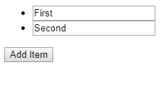
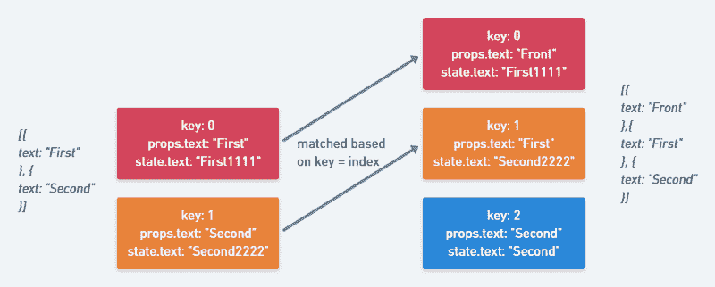

# 如何反应键的工作和有趣的事情，你可以用它们做

> 原文：<https://www.freecodecamp.org/news/react-fun-with-keys-68f4c8c36f3e/>

克里斯托弗·米歇尔

# 如何反应键的工作和有趣的事情，你可以用它们做


React 在[的协调阶段](https://reactjs.org/docs/reconciliation.html)使用`key`属性来决定哪些[元素](https://reactjs.org/blog/2015/12/18/react-components-elements-and-instances.html)可以在下一次渲染中重用。它们对动态列表很重要。React 会将新元素的键与以前的键进行比较，并 1)安装具有新键的组件 2)卸载不再使用其键的组件。

许多 React 开发人员都听过这样的建议:你[不应该使用`index`作为键](https://medium.com/@robinpokorny/index-as-a-key-is-an-anti-pattern-e0349aece318)。但是当以不好的方式使用`key` s 时，到底会出什么问题呢？玩钥匙的时候还能做什么？

为了更好的理解，让我们考虑一下[呈现一个`input`列表的例子](https://codesandbox.io/s/7ko97vnv80)，当点击一个按钮时，我们将在列表的前面插入一个带有文本`Front` **的新项目。**

```
import React from "react";import { render } from "react-dom";class Item extends React.PureComponent {  state = {    text: this.props.text  };  onChange = event => {    this.setState({      text: event.target.value    });  };  componentDidMount() {    console.log("Mounted ", this.props.text);  }  componentWillUnmount() {    console.log("Unmounting ", this.props.text);  }  render() {    console.log("rerendering ", this.props.text);    const { text } = this.state;    return (      <li>        <input value={text} onChange={this.onChange} />      </li>    );  }}class App extends React.Component {  state = {    items: [      {        text: "First",        id: 1      },      {        text: "Second",        id: 2      }    ]  };  addItem = () => {    const items = [{ text: "Front", id: Date.now() }, ...this.state.items];    this.setState({ items });  };  render() {    return (      <div>        <ul>          {this.state.items.map((item, index) => (            <Item {...item} key={index} />          ))}        </ul>        <button onClick={this.addItem}>Add Item</button>      </div>    );  }}render(<App />, document.getElementById("root"));
```

如果使用`index`作为键，会发生以下情况:

[**code sandbox**](https://codesandbox.io/embed/7ko97vnv80)
[*code sandbox 是一款为 web 应用量身定制的在线编辑器。* codesandbox.io](https://codesandbox.io/embed/7ko97vnv80)



如果在列表的后面插入另一个文本为`Second`而不是`Front`的`Item`会怎样？事情是这样的:

1.  `Item is an uncontrolled component`:用户写入其`input`字段的文本被存储为`state`
2.  新数据项`{ text: "Front" }`被插入到列表数据的开头。
3.  用作为`key`的**索引**值重新呈现列表。因此，先前的组件被重新用于前两个**数据项**，并被赋予正确的属性`Front`和`First`，但是状态在`Item`中没有更新。这就是为什么前两个组件实例保持相同的文本。
4.  为`key: 2`创建一个新的组件实例，因为没有找到以前的匹配关键字。用最后一个**列表数据项**的`props`填充，也就是`Second`。



另一个有趣的地方是发生的`render`呼叫。Item 是一个`PureComponent`，所以它只在`text`道具(或状态)改变时更新:

```
rerendering  Frontrerendering  Firstrerendering  SecondMounted  Second
```

**所有的**组件都被重新渲染。发生这种情况是因为带有`key: 0`的元素被重新用于第一个数据项并接收其`props`，但是第一个数据项现在是新的`Front`对象，触发了一个`render`。其他组件也会发生同样的情况，因为旧的数据项现在都移动了一个位置。

那么解决办法是什么？修复很简单:我们在创建时给每个列表数据项一个唯一的`id`(不是在每次渲染时！).所有组件实例都将与其对应的数据项匹配。他们收到和以前一样的`props`，这避免了另一个`render`。

现在让我们忽略在动态列表中使用`id`带来的性能优势。这个例子表明，由密钥引入的**错误只发生在*未受控的*组件**，保持**内部状态的组件**上。

如果我们将`Item`重写为一个受控组件，通过将状态移出它，bug 就消失了。

为什么？同样，因为 bug 是**为不同的数据项重用组件。**因此，内部状态仍然是**反映了前一个数据项**的状态，只是不同的**道具**。通过完全移除组件的状态，使组件受到控制，我们不再有这种差异。(但是仍然存在不必要的重新渲染的问题。)

#### 滥用密钥来修复损坏的第三方组件

React 在匹配几个元素时只需要`key` s，所以不需要在单个子元素上设置一个键。但是在单个子组件上设置一个键仍然很有用。

如果您更改了密钥，React 将丢弃整个组件(卸载它)，并在其位置挂载一个新的组件实例。为什么这会有用？

我们再次回到**未受控组件**。有时，您正在使用第三方组件，并且您无法修改其代码以使其受控制。如果一个组件有一些内部状态，并且它的实现方式不好(例如，状态在构造函数中只派生了一次，但是没有实现`getDerivedStateFromProps` / `componentWillReceiveProps`来**反映其内部状态中重复出现的`props`变化)**，标准的 React 工具箱在这里帮不了你。没有`forceRemount`。

然而，我们可以在这个组件上设置一个新的`key`来实现完全初始化一个新组件的期望行为。旧的组件将被卸载，一个新的组件将被安装，新的`props`初始化`state`。

#### TL；博士:

使用`index`作为密钥可以:

1.  导致不必要的重新渲染
2.  当列表项为**非受控组件**但仍使用`props`时引入 bug

属性可以用来强制一个组件的完全重装，这有时会很有用。

最初发布于 [cmichel.io](https://cmichel.io/react-fun-with-keys/)

