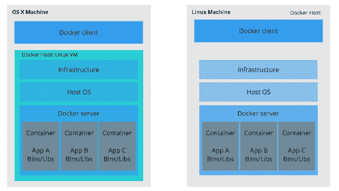
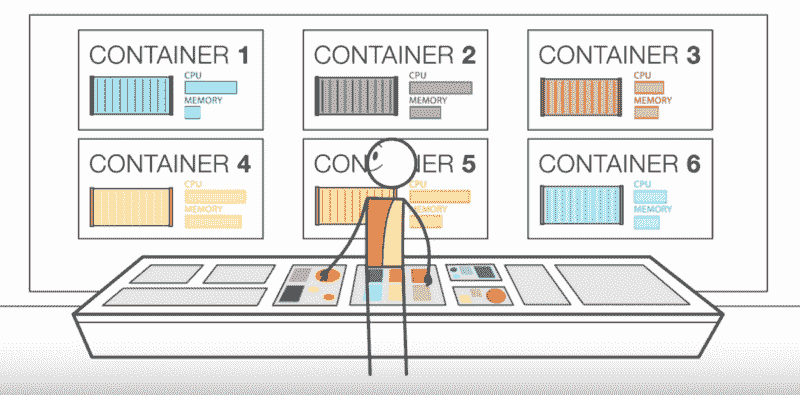
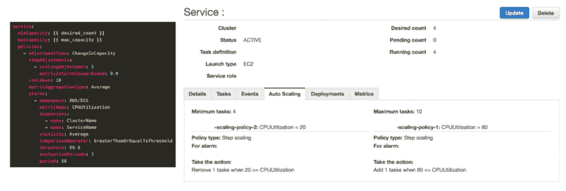
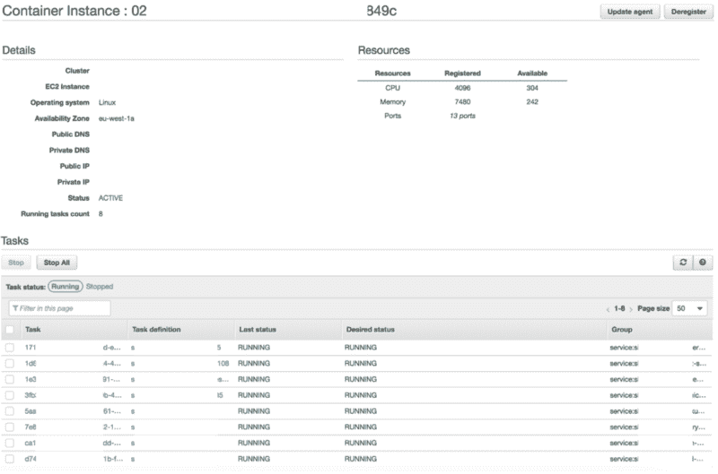
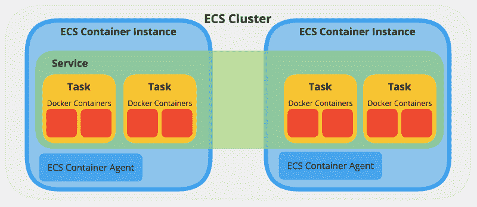
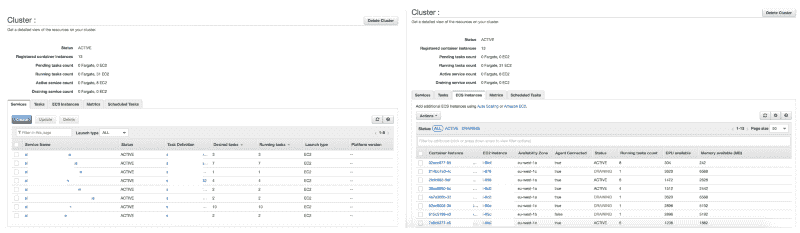
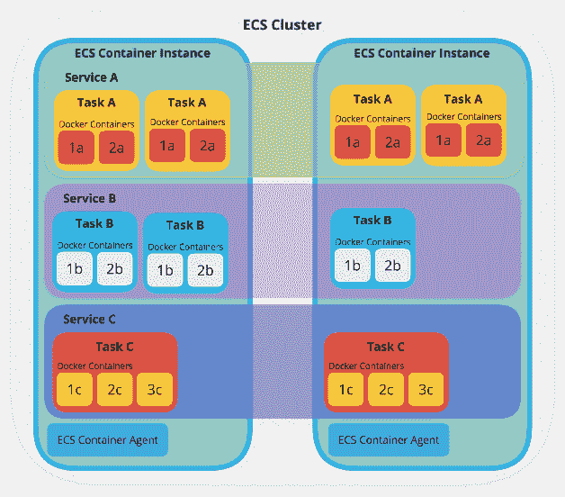

# 亚马逊弹性容器服务初学者指南

> 原文：<https://www.freecodecamp.org/news/amazon-ecs-terms-and-architecture-807d8c4960fd/>

这篇文章是对 Amazon ECS 的初级介绍。我们将涵盖核心概念、术语、简单的架构图和抽象的例子。所以让我们开始吧！

### 码头工人

要欣赏亚马逊 ECS，首先要了解 Docker。

Docker 是一个客户端-服务器应用程序，可以安装在 Linux、Windows 和 MacOS 上，并允许您运行 Docker [容器](https://en.wikipedia.org/wiki/Operating-system-level_virtualization)。容器是轻量级环境，包含运行特定应用程序或部分应用程序所需的一切。只要安装了 Docker 软件，就可以在一台机器上运行多个不同的容器。

如果你对 如何工作以及 Docker 与虚拟机有何不同感兴趣，那么这个[介绍 Docker](https://medium.com/pintail-labs/docker-series-what-is-docker-9eddca88f434) 是一个很好的起点。

Adapted from Docker’s ‘[get started](https://docs.docker.com/get-started/#container-diagram)’, see here for ‘[bins/libs](https://en.wikipedia.org/wiki/Filesystem_Hierarchy_Standard)’

通过将软件、操作系统和硬件配置抽象成可以在任何机器上运行的标准构建块，使用 Docker 容器允许团队拥有一致的开发环境。

每个容器都有它所需要的东西——例如，某种语言或库的某些版本——并且不会超过它所需要的。如果您愿意，可以将多个容器用于应用程序的不同部分，并且可以设置它们在需要时相互通信。

通过使用指定的 Docker 容器来运行您的生产代码，您可以确保您的开发环境与您的生产环境完全相同。

随着应用程序的增长，管理这些容器的部署、结构、调度和伸缩变得非常复杂。这就是“容器管理服务”的由来。它旨在允许简单的配置选项，并在您回去编写应用程序时处理繁重的工作。

### 亚马逊 ECS 简介

亚马逊[弹性容器服务](https://docs.aws.amazon.com/AmazonECS/latest/developerguide/Welcome.html) (ECS)据亚马逊称，

> *…一个高度可扩展的、快速的容器管理服务，使得在集群上运行、停止和管理 Docker 容器变得容易。*

堪比 [Kubernetes](https://kubernetes.io/) 、 [Docker Swarm](https://docs.docker.com/swarm/overview/) 、 [Azure 集装箱服务](https://azuremarketplace.microsoft.com/en-us/marketplace/apps/microsoft.acs)。

ECS 在预装 Docker 的 [Amazon EC2](https://aws.amazon.com/ec2/) (弹性计算云)[虚拟机实例](https://www.youtube.com/watch?v=TsRBftzZsQo)集群上运行您的容器。它通过 API 和 AWS 管理控制台处理容器的安装、伸缩、监控和管理。它允许您将 EC2 实例简化为一个资源池，比如 CPU 和内存。容器运行的特定实例以及所有实例的维护由平台处理。你不用想了。

值得注意的是，它被绑定到 Amazon 基础架构中，不像其他一些提供商那样允许更多的灵活性。然而，这意味着它可以与其他 AWS 服务很好地集成。

### 术语和架构

让我们为我们将要看到的定义提供一些想象的背景。假设您正在构建一个运行在两个 Docker 容器上的应用程序，可能一个用于主应用程序，另一个用于管理指标。这两者都是应用程序正常运行所必需的。如果流量很大，可能需要运行几对容器。

这里我们来看两组新术语:

*   一个**任务定义**、**任务**和**服务**，以及
*   一个**集群*****ECS 容器实例***和**ECS 容器代理**。**

#### **任务内容**

**这是描述运行哪些 Docker 容器的蓝图，代表了您的应用程序。在我们的例子中，它是两个容器。将详细说明要使用的图像、要分配的 CPU 和内存、环境变量、要公开的端口以及容器如何交互。**

#### **工作**

**任务定义的实例，运行其中详述的容器。根据需要，一个任务定义可以创建多个任务。**

**

One Task Definition creates several identical Tasks** 

#### **服务**

**定义在任何给定时间运行的一个任务定义的最小和最大任务，自动缩放和负载平衡。在我们的例子中，如果 CPU 在我们运行的单个任务中已经达到极限，我们可能希望它添加一个额外的任务。**

**然而，我们可能希望限制它可以运行的任务的最大数量，因为我们知道运行额外的任务会使用额外的资源，这是要花钱的。**

**

Service definition defining alarms of when to scale capacity** 

**现在我们有了自己的服务，它的任务需要在某个地方运行才能被访问。它需要放在一个**集群**上，容器管理服务将处理它在一个或多个 **ECS 容器实例**上的运行。**

#### **ECS 容器实例和 ECS 容器[代理](https://github.com/aws/amazon-ecs-agent)**

**

One ECS Container Instance running 8 Tasks from multiple different Services** 

**这是一个 [EC2 实例](http://AWS EC2 for Beginners)，其上运行着 Docker 和 ECS 容器代理。一个容器实例可以从相同或不同的服务运行许多任务。**

**代理负责 ECS 和实例之间的通信，提供正在运行的容器的状态并管理正在运行的新容器。**

#### **串**

**

An example ECS cluster, with one Service running four Tasks across two ECS Container Instances** 

**如上所示，集群是一组 ECS 容器实例。Amazon ECS 处理调度、维护和处理这些实例的伸缩请求的逻辑。它还消除了根据您的 CPU 和内存需求寻找每个任务的最佳位置的工作。**

**一个集群可以运行许多服务。如果您的产品包含多个应用程序，您可能希望将其中的几个放在一个集群中。这可以更有效地利用可用资源，并最大限度地减少设置时间。**

**

Multiple Services allocated across multiple ECS Container Instances running on one Cluster** 

### **结论**

**我们已经看到了如何用与**服务**有一对一关系的**任务** **定义**来表示一个文档化的应用程序，服务反过来使用它来创建许多不同的**任务**实例。**

**这个**服务** 被部署到一个**集群******ECS 容器实例** 中，这些实例提供了运行和扩展应用程序所需的资源池。其他服务可以部署到同一个集群。****

**亚马逊 ECS 或任何容器管理服务旨在尽可能简化这一过程，抽象出大规模运行基础设施的许多复杂性。**

**

A Cluster running 3 Services, each running a different amount of Tasks, across two ECS Container Instances** 

**随着您的需求变得越来越复杂，容器管理服务可确保您的需求易于管理。使用它的 API 或管理控制台，您可以在需要时添加新的容器实例。这确保了总是有健康数量的任务在运行，并且跨服务智能地分配资源。**

**感谢阅读！**

#### **资源**

*   **[用示例教程温和地介绍 AWS ECS 如何工作](https://medium.com/boltops/gentle-introduction-to-how-aws-ecs-works-with-example-tutorial-cea3d27ce63d)**
*   **[在亚马逊 ECS 上部署集群 Akka 应用](https://medium.com/@ukayani/deploying-clustered-akka-applications-on-amazon-ecs-fbcca762a44c)**
*   **[亚马逊 ECS 的构建模块](https://medium.com/containers-on-aws/building-blocks-of-amazon-ecs-db7fdfeeaa6f)**
*   **[亚马逊 EC2 容器服务(ECS)简介 AWS 上的 Docker 管理](https://www.youtube.com/watch?v=zBqjh61QcB4)**
*   **[亚马逊 ECS:核心概念](https://www.youtube.com/watch?v=eq4wL2MiNqo)**
*   **[面向初学者的 AWS EC2](https://hackernoon.com/aws-ec2-for-beginners-56df2e820d7f)**
*   **[更好的开发/测试体验:Docker 和 AWS](https://medium.com/aws-activate-startup-blog/a-better-dev-test-experience-docker-and-aws-291da5ab1238)**
*   **[使用 Docker 和 Amazon EC2 容器服务的基于集群的架构](https://medium.com/aws-activate-startup-blog/cluster-based-architectures-using-docker-and-amazon-ec2-container-service-f74fa86254bf)**