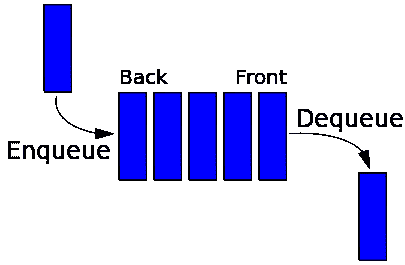
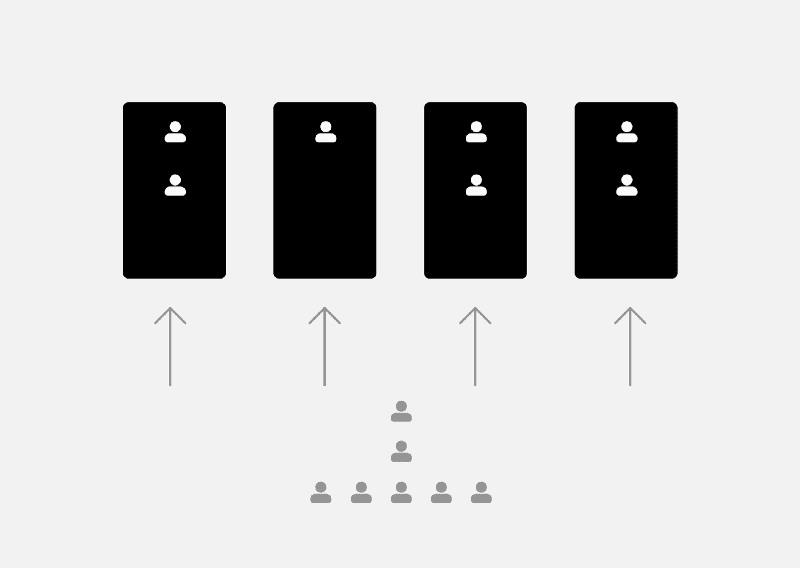
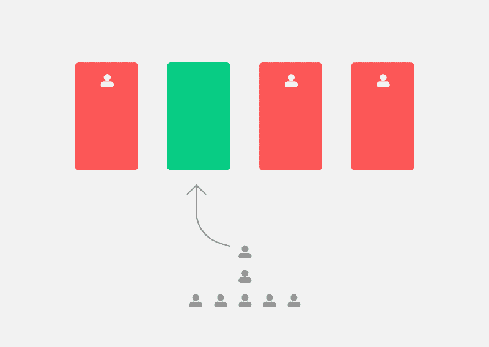

# 如何在你的 Redux-Sagas 中使用并发任务队列

> 原文：<https://www.freecodecamp.org/news/how-to-use-a-concurrent-task-queue-in-your-redux-sagas-39e598c4fcae/>

通过害羞的改变

# 如何在你的 Redux-Sagas 中使用并发任务队列

在本指南中，您将了解什么是并发任务队列，一些最佳用例，以及如何编写一个并发任务队列。

队列是最常用的数据结构之一。你可能每天都在用它购物(甚至是在网上),或者给朋友发短信。

并发任务队列是一个非常强大的模式，可以真正帮助您处理任务或提高性能。

**TL；底部的博士**

### 让我们从基础开始

#### 什么是队列？？？？‍

队列是一种线性结构，在一端添加值，在另一端删除值。这一原则产生了先进先出行为(FIFO ),这是队列的定义特征。两个基本的队列操作是入队(添加到后面)和出列(从前面移除)([源](https://stanford.edu/~stepp/cppdoc/Queue-class.html))。

Representation of a [FIFO](https://en.wikipedia.org/wiki/FIFO_(computing_and_electronics) "FIFO (computing and electronics)") (first in, first out) queue ([wikipedia](https://en.wikipedia.org/wiki/Queue_(abstract_data_type)))

#### 好的，我们应该什么时候使用它？

当您需要保持事件的顺序并按该顺序处理值时，请使用队列。

#### 太好了，你说服我了！但是我为什么需要并发性呢？

正如我上面提到的，一个队列一次能够处理一个值。但有时还不够快。

**考虑以下情况**？：

你在你最喜欢的杂货店，刚刚到达收银台，但不幸的是有许多人在等待。为了加快这个过程，商店又开了几个收银台，每个额外的收银员都有自己的队列。所以你只需要选择一个。如果其中一个收银员遇到了技术问题或者他们太慢，那么即使其他位置是空的，队列也会被延迟。

([@andreagiuliaderba](http://twitter.com/andreagiuliaderba "Twitter profile for @andreagiuliaderba"))

并发任务队列来救援！？

出于我们的目的，我们将只使用一个队列。这样，每当一个槽空闲时，我们将从队列中取出一个人，并把他送到空闲槽。

single concurrent queue ([@andreagiuliaderba](http://twitter.com/andreagiuliaderba "Twitter profile for @andreagiuliaderba"))

万岁！？

### 现在让我们检查一个用例

上周，我正在开发一个谷歌 Chrome 扩展，它可以嗅探和下载 HLS [流](https://en.m.wikipedia.org/wiki/HTTP_Live_Streaming) (HTTP 直播流)。

HLS 流由多个块组合而成，这些块被一个接一个地获取，并作为单个视频流传输到您的浏览器。每个流中可能有数千个文件，您需要将它们全部下载。

我们将使用我们心爱的**队列**来加速这个过程，并确保一个缓慢的获取不会阻碍其他的获取。

### **TL；博士:这是代码**

现在让我们一点一点来看。

#### 1.负责人

这个简单的处理程序从有效载荷中获取 URI，然后:

*   获取块
*   将其转换为一个斑点
*   发出一个**块就绪** redux 事件
*   获取就绪区块的当前计数
*   检查是否是**“全部完成”**

#### 2.创建队列

使用这个处理程序，我们创建了一个包含 5 个工作线程的新队列。我们拿回了**守望者**任务和一个**队列通道。**然后我们将运行(fork)watcher 任务，这样它将开始监听任务。

#### 3.推动任务

我们将所有段映射到一个 put 任务(到我们获得的**队列通道**),然后我们一起启动所有任务。

#### 4.等待所有块都准备好，或者等待操作被取消

现在我们正在等待第一个行动被称为**全部完成**或者被**取消。**之后，我们可以取消观察器，并根据收到的操作进行操作。

### 就是这样！

如果你想看现场直播，请访问[https://github.com/puemos/hls-downloader-chrome-extension](https://github.com/puemos/hls-downloader-chrome-extension)，并下载 Chrome 扩展。

我希望你学到了新的东西！如果你有任何问题，请在下面评论，这样每个人都可以受益。