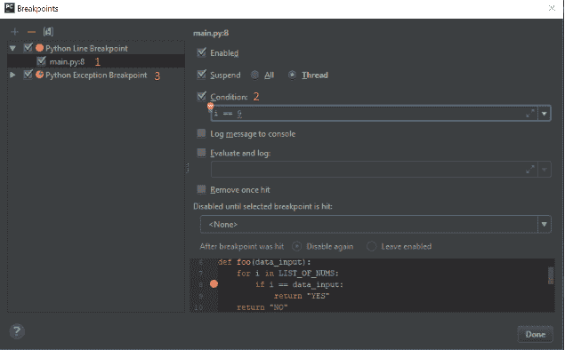
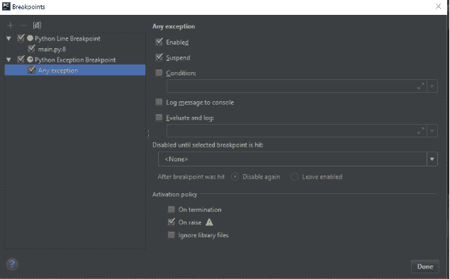
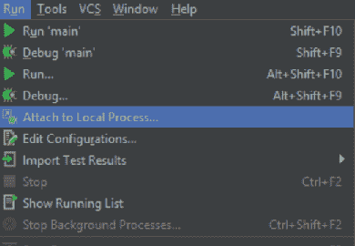
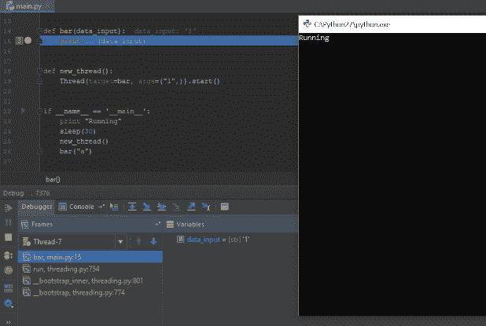
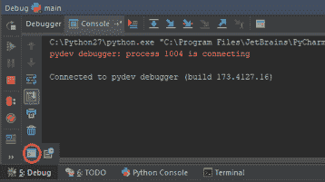
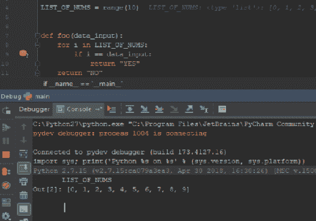

# 如何使用 PyCharm 调试您的 Python 代码

> 原文：<https://www.freecodecamp.org/news/debugging-with-pycharm-be282bcd6172/>

作者奥莉萝莎

# 如何使用 PyCharm 调试您的 Python 代码

在任何语言中调试代码都可能会令人沮丧，但在 Python 中尤其如此，因为我们无法立即识别 bug。

此外，Python 为我们提供了 PDB 库作为调试工具，这也可能很难处理。

幸运的是，我们有 PyCharm IDE。它使用 PyDev，给了我们调试的新体验！

在本文中，我将介绍 PyCharm 提供的主要且最有用的调试特性，并教您如何有效地使用它们。

### **断点**

当我们面对在特定条件下发生的 bug 时，断点可能是不必要的。

还有，当我们有很多的时候，就乱了。

幸运的是，PyCharm 让我们能够以高效的方式管理断点:

1.  按 Ctrl+Shift+F8(或运行->查看断点)
2.  我们在项目上设置的所有断点将如下所示列出(见 1)

3.正如我们所看到的，对于每个断点，我们可以设置一个触发断点的条件(参见 2)

4.此外，我们可以设置一个非常特殊的条件，控制在两种不同状态下发生异常时(见 3)是否触发断点:

a.终止时(脚本结束后)

b.引发时(脚本结束前)

### **附加到本地进程**

你有没有想过是否有可能调试一个远程进程？

是的，你可以！(而且这么容易！)

无论您是在后台执行其他流程还是作为流程的一部分创建它们，PyCharm 都为您提供了一种非常有效的调试远程流程的方法:

1.  如下所示，打开运行->附加到本地进程

2.现在选择您想要调试的 Python 进程:

3.然后，您选择的进程将在 PyCharm 中调试:

### **Python 解释器与加载的环境**

计算和操作当前被调试代码的变量节省了时间，并允许我们在实际的沙箱中进行更改！

PyCharm 为我们提供了一个带有加载环境的 Python 解释器。

1.  在控制台选项卡上，按标记的按钮:

2.正如你在下面看到的，解释器识别了我们的变量！

### **结论**

PyCharm 为我们提供了许多很棒的工具，这个调试器就是其中之一。

调试有时会很难，但是如果你使用正确的工具，它会变得更容易甚至有趣！

我希望这篇文章教会你一些新的东西，我期待着你的反馈。请告诉我——这对你有用吗？