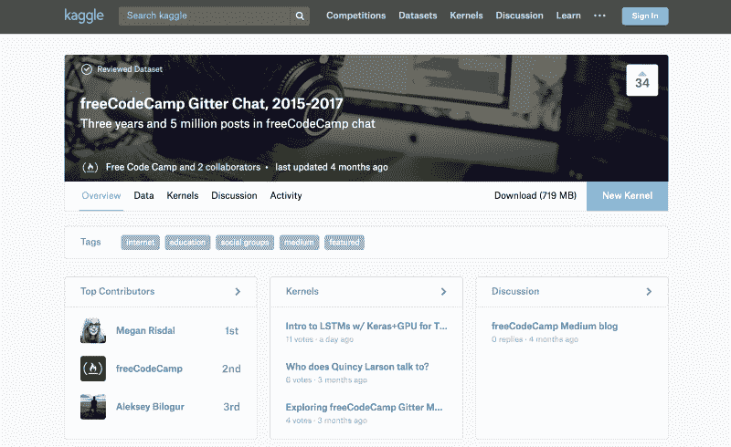
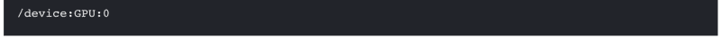
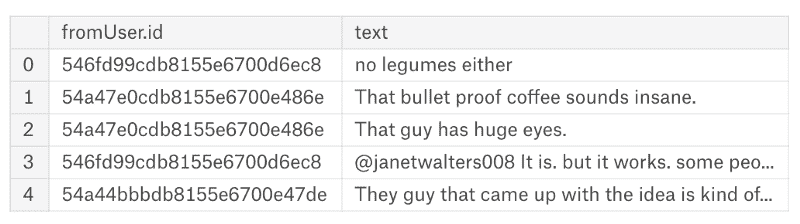
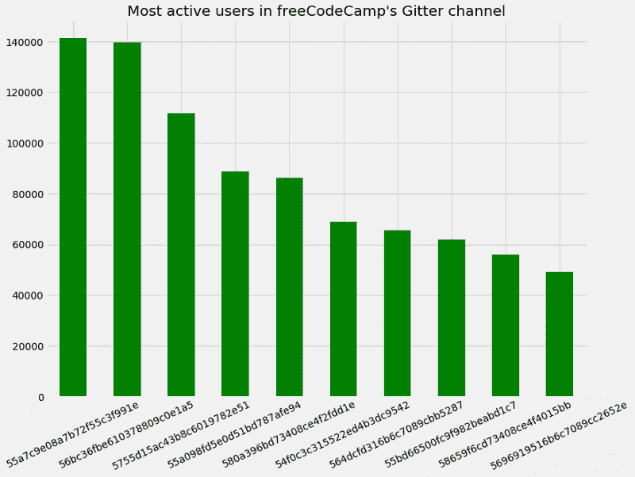
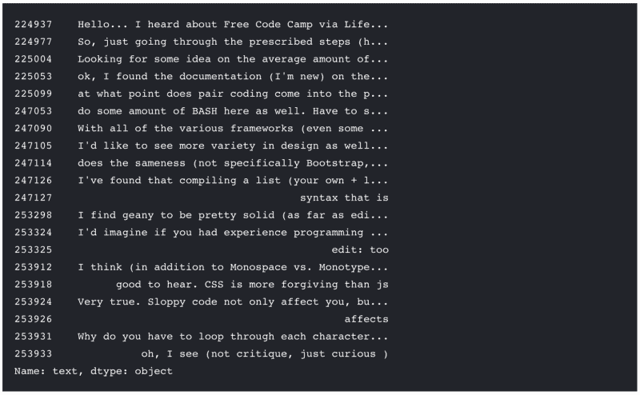
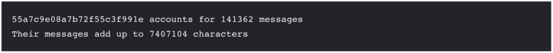
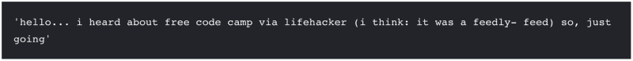
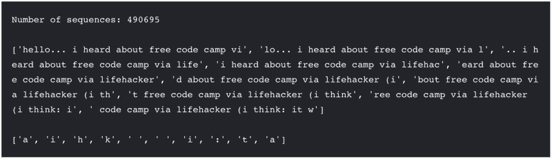
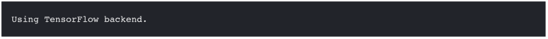
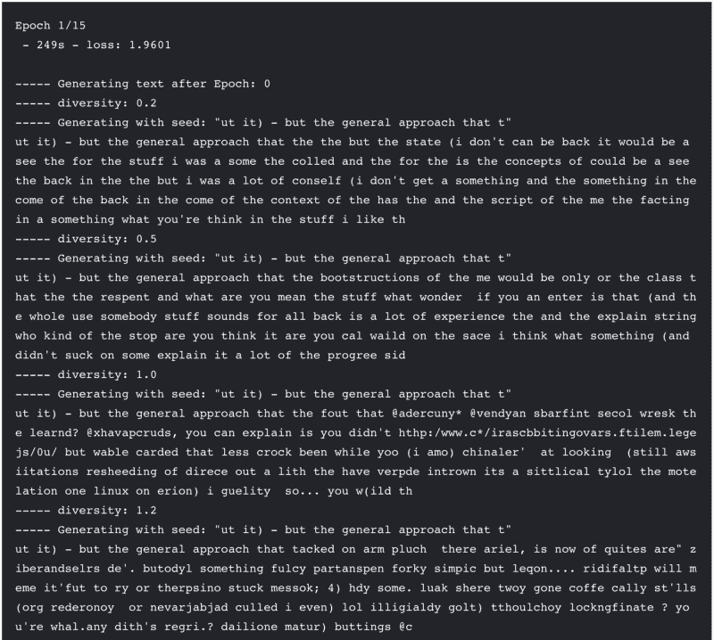

# 用于文本生成的 LSTMs 应用简介——使用 Keras 和支持 GPU 的 Kaggle 内核

> 原文：<https://www.freecodecamp.org/news/applied-introduction-to-lstms-for-text-generation-380158b29fb3/>

梅根·里斯达尔

# 用于文本生成的 LSTMs 应用简介——使用 Keras 和支持 GPU 的 Kaggle 内核

[Kaggle](https://www.kaggle.com/) 最近让数据科学家能够为[内核](https://www.kaggle.com/kernels) (Kaggle 基于云的托管笔记本平台)添加 GPU。我知道这将是我学习如何构建和训练更多计算密集型模型的绝佳机会。

有了 [Kaggle Learn](https://www.kaggle.com/learn/deep-learning) 、 [Keras documentation](https://keras.io/) 和来自 [freeCodeCamp](https://www.freecodecamp.org/) 的酷酷的自然语言数据，我拥有了从[随机森林](https://www.kaggle.com/mrisdal/exploring-survival-on-the-titanic)前进到递归神经网络所需要的一切。



freeCodeCamp’s dataset on Kaggle Datasets.

在这篇博文中，我将向你展示我是如何使用发表在 Kaggle 数据集上的 [freeCodeCamp 的 Gitter 聊天日志数据集](https://www.kaggle.com/freecodecamp/all-posts-public-main-chatroom)中的文本来训练一个 LSTM 网络，该网络生成新颖的文本输出。

你可以在这个 [Python 笔记本内核](https://www.kaggle.com/mrisdal/intro-to-lstms-w-keras-gpu-for-text-generation/notebook)中找到我所有可复制的代码。

现在你可以在内核中使用**GPU**——Kaggle 的基于云的托管笔记本平台——运行时间 **6 小时**，你可以在 ka ggle 上训练比以往任何时候都更加计算密集型的模型。

我会用一个 GPU 来训练这个笔记本里的模型。(你可以通过点击内核编辑器中的“设置”标签为你的会话请求一个 GPU。)

```
import tensorflow as tfprint(tf.test.gpu_device_name())# See https://www.tensorflow.org/tutorials/using_gpu#allowing_gpu_memory_growthconfig = tf.ConfigProto()config.gpu_options.allow_growth = True
```



我将使用来自该频道最多产的用户 id 之一的文本作为训练数据。这个笔记本有两个部分:

1.  读入、探索和准备数据
2.  在单个用户 id 的聊天日志上训练 LSTM，并生成新颖的文本作为输出

[你可以通过简单地阅读笔记本来跟随，或者你可以叉开它](https://www.kaggle.com/mrisdal/intro-to-lstms-w-keras-gpu-for-text-generation)(点击“叉开笔记本”)并且自己运行单元来学习每个部分交互地做什么。最后，您将学习**如何将文本数据格式化为在 Keras** 中实现的字符级 LSTM 模型的输入，并进而使用该模型的字符级预测来**生成新颖的文本序列**。

在我进入代码之前，什么是 LSTM(“长短期记忆”)网络？

在本教程中，我们将采取实践的方法来实现这种风格的递归神经网络，特别是在深度学习框架 Keras 中处理更长距离的依赖性(包括语言依赖性)。

如果你想回顾更多的理论基础，我推荐你去看看这篇精彩的博客文章，由 Christopher Olah 撰写的[理解 LSTM 网络](http://colah.github.io/posts/2015-08-Understanding-LSTMs/)。

### 第一部分:数据准备

在第一部分中，我将首先读取数据，并尝试对其进行充分的探索，以便让您对我们正在处理的内容有所了解。我在跟随非交互式教程(比如 GitHub 上共享的静态代码)时遇到的一个挫折是，通常很难知道您想要处理的数据与代码示例有什么不同。你必须下载它，并在本地进行比较，这是一个痛苦。

关于使用内核遵循本教程的两个好处是:a)我将尝试让您一瞥每一个重要步骤的数据；还有 2)你随时可以[叉这个笔记本](https://www.kaggle.com/mrisdal/intro-to-lstms-w-keras-gpu-for-text-generation)还有？嘣？您已经获得了我的环境、数据、Docker 映像的副本，并且不需要下载或安装任何东西。特别是如果你有安装 CUDA 来使用 GPU 进行深度学习的经验，你会体会到已经为你设置了一个环境是多么美好。

#### 读入数据

```
import pandas as pdimport numpy as np# Read in only the two columns we need chat = pd.read_csv('../input/freecodecamp_casual_chatroom.csv', usecols = ['fromUser.id', 'text'])
```

```
# Removing user id for CamperBotchat = chat[chat['fromUser.id'] != '55b977f00fc9f982beab7883'] chat.head()
```



看起来不错！

#### 探索数据

在我下面的图中，你可以看到 freeCodeCamp 的 Gitter 中按用户 id 排列的前十名最活跃聊天参与者的帖子数量:

```
import matplotlib.pyplot as pltplt.style.use('fivethirtyeight')f, g = plt.subplots(figsize=(12, 9))chat['fromUser.id'].value_counts().head(10).plot.bar(color="green")g.set_xticklabels(g.get_xticklabels(), rotation=25)plt.title("Most active users in freeCodeCamp's Gitter channel")plt.show(g)
```



因此，userid `55a7c9e08a7b72f55c3f991e`是频道中最活跃的用户，拥有超过 140，000 条消息。我们将使用它们的信息来训练 LSTM 生成新颖的类似于`55a7c9e08a7b72f55c3f991e`的句子。但首先，让我们看看来自`55a7c9e08a7b72f55c3f991e`的最初几条消息，了解一下他们在聊些什么:

```
chat[chat['fromUser.id'] == "55a7c9e08a7b72f55c3f991e"].text.head(20)
```



我看到像“文档”、“成对编码”、“BASH”、“Bootstrap”、“CSS”等这样的词和短语。我只能假设以“所有各种框架……”开头的句子指的是 JavaScript。是的，听起来他们说到点子上了。所以如果我们成功的话，我们会期望我们的小说句子大致是这样的。

#### 准备输入 LSTM 的序列数据

现在，我们有一个数据帧，其中的列对应于用户 id 和消息文本，每行对应于发送的一条消息。这与我们的 LSTM 网络的输入层所需的 3D 形状相差甚远:`model.add(LSTM(batch_size, input_shape=(time_steps, features)))`其中`batch_size`是每个样本中序列的数量(可以是一个或多个)，`time_steps`是每个样本中观察值的大小，`features`是可能的可观察特征的数量(即，在我们的情况下是字符)。

那么我们如何从一个数据帧中得到正确形状的序列数据呢？我将把它分成三个步骤:

1.  将数据分成子集以形成语料库
2.  将来自#1 的语料库格式化为长度一致的半重叠序列和下一个字符的数组
3.  将来自#2 的序列数据表示为稀疏布尔张量

#### 将数据分成子集以形成语料库

在接下来的两个单元格中，我们将只获取来自`55a7c9e08a7b72f55c3f991e` ( `'fromUser.id' == '55a7c9e08a7b72f55c3f991e'`)的消息来对数据进行子集化，并将字符串向量压缩成一个字符串。因为我们不关心我们的模型生成的文本大小写是否正确，所以我们使用`tolower()`。这使得模型少了一个需要学习的维度。

我还将使用前 20%的数据作为样本，因为我们不需要更多的数据来生成半真半假的文本。如果您愿意，您可以尝试派生这个内核并试验更多(或更少)的数据。

```
user = chat[chat['fromUser.id'] == '55a7c9e08a7b72f55c3f991e'].textn_messages = len(user)n_chars = len(' '.join(map(str, user)))print("55a7c9e08a7b72f55c3f991e accounts for %d messages" % n_messages)print("Their messages add up to %d characters" % n_chars)
```



```
sample_size = int(len(user) * 0.2)user = user[:sample_size]user = ' '.join(map(str, user)).lower()user[:100] # Show first 100 characters
```



#### 将语料库格式化为长度一致的半重叠序列和下一个字符的数组

这里使用的其余代码改编自[这个示例脚本](https://github.com/keras-team/keras/blob/master/examples/lstm_text_generation.py)，最初由 Fran ois Chollet(《Keras 和 Kaggler》的作者)编写，用于以正确的格式为训练 LSTM 准备数据。由于我们正在训练一个字符级别的模型，我们将唯一的字符(如“a”、“b”、“c”、…)与下面单元格中的数字索引相关联。如果你自己点击[“分叉笔记本”](https://www.kaggle.com/mrisdal/intro-to-lstms-w-keras-gpu-for-text-generation/)重新运行这段代码，你可以打印出所有使用的字符。

```
chars = sorted(list(set(user)))print('Count of unique characters (i.e., features):', len(chars))
```

```
char_indices = dict((c, i) for i, c in enumerate(chars))indices_char = dict((i, c) for i, c in enumerate(chars))
```


下一个单元步骤给了我们一个数组`sentences`，它由来自我们语料库`user`的`maxlen` (40)个字符序列和`next_chars`组成，后者是来自`user`的单个字符在`i + maxlen`对应每个`i`的数组。我已经打印出了数组中的前 10 个字符串，所以你可以看到我们正在将语料库分成部分重叠、长度相等的“句子”

```
maxlen = 40step = 3sentences = []next_chars = []for i in range(0, len(user) - maxlen, step):    sentences.append(user[i: i + maxlen])    next_chars.append(user[i + maxlen])print('Number of sequences:', len(sentences), "\n")print(sentences[:10], "\n")print(next_chars[:10])
```



你可以看到第一个序列`'hi folks. just doing the new signee stuf'`后面的下一个字符是如何完成单词“stuff”的字符`f`。序列`'folks. just doing the new signee stuff. '`之后的下一个字符是开始单词“hello”的字符`h`。通过这种方式，现在应该清楚`next_chars`如何成为我们在`sentences`中的序列的“数据标签”或基础事实，并且我们在该标签数据上训练的模型将能够生成*新的下一个字符*，作为给定序列输入的预测。

#### 将序列数据表示为稀疏布尔张量

如果您在内核中交互地跟随[，下一个单元将需要几秒钟来运行。我们正在创建一个稀疏布尔张量`x`和`y`，对来自`sentences`和`next_chars`的字符级特征进行编码，以用作我们训练的模型的输入。我们最终得到的形状将是:`input_shape=(maxlen, len(chars))`，其中`maxlen`是 40，`len(chars)`是特征的数量(即，来自我们语料库的字符的唯一计数)。](https://www.kaggle.com/mrisdal/intro-to-lstms-w-keras-gpu-for-text-generation/)

```
x = np.zeros((len(sentences), maxlen, len(chars)), dtype=np.bool)y = np.zeros((len(sentences), len(chars)), dtype=np.bool)for i, sentence in enumerate(sentences):    for t, char in enumerate(sentence):        x[i, t, char_indices[char]] = 1    y[i, char_indices[next_chars[i]]] = 1
```

### 第二部分:建模

在第二部分中，我们进行实际的模型训练和文本生成。我们已经研究了这些数据，并对其进行了正确的整形，这样我们就可以将它作为我们的 LSTM 模型的输入。这一部分有两个部分:

1.  定义 LSTM 网络模型
2.  训练模型并生成预测

#### 定义 LSTM 网络模型

让我们从在图书馆阅读开始。我使用的是 Keras，它是 TensorFlow 后端的一个流行且易于使用的接口。在这里阅读更多关于[为什么使用 Keras 作为深度学习框架的信息](https://keras.io/why-use-keras/)。下面你可以看到我们将要使用的模型、层、优化器和回调函数。

```
from keras.models import Sequentialfrom keras.layers import Dense, Activationfrom keras.layers import LSTMfrom keras.optimizers import RMSpropfrom keras.callbacks import LambdaCallback, ModelCheckpointimport randomimport sysimport io
```



在下面的单元格中，我们定义了模型。我们从序列模型开始，并添加一个 LSTM 作为输入层。到目前为止，我们为输入定义的形状与我们的数据是一致的，这正是我们所需要的。我选择了一个 128 的`batch_size`,这是我们的模型在更新之前的训练中所观察的样本或序列的数量。如果您愿意，可以在这里尝试不同的数字。我还添加了一个密集的输出层。最后，我们将使用添加一个带有`softmax`的激活层作为我们的激活函数，因为我们本质上是在做多类分类来预测序列中的下一个字符。

```
model = Sequential()model.add(LSTM(128, input_shape=(maxlen, len(chars))))model.add(Dense(len(chars)))model.add(Activation('softmax'))
```

现在我们可以编译我们的模型了。我们将使用学习速率为`0.1`的`RMSprop`来优化我们的模型中的权重(您可以在这里试验不同的学习速率)和作为我们的损失函数的`categorical_crossentropy`。交叉熵与在 Kaggle 上的二元分类竞争中通常用作评估度量的对数损失相同(除了在我们的情况下有两个以上的可能结果)。

```
optimizer = RMSprop(lr=0.01)model.compile(loss='categorical_crossentropy', optimizer=optimizer)
```

现在我们的模型准备好了。在我们向它提供任何数据之前，下面的单元格定义了几个助手函数[，代码是从这个脚本](https://github.com/keras-team/keras/blob/master/examples/lstm_text_generation.py)修改而来的。第一个是`sample()`，用一些`temperature`从概率数组中抽取一个指数。快速停下来问，温度到底是多少？

> ***温度*** *是在应用`softmax`激活功能之前应用于我们的密集层输出的比例因子。简而言之，它定义了模型对序列中下一个字符的猜测有多保守或有多“创造性”。较低的`temperature`(例如`0.2`)值将产生“安全的”猜测，而高于`1.0`的`temperature`值将开始产生“更危险的”猜测。想象一下，当你看到一个英文单词以“st”和“sg”开头时，你会有多惊讶。当气温较低时，我们可能会听到许多“这个”和“那个”;当温度高时，事情变得更加不可预测。*

总之，第二个是定义一个回调函数来打印由我们训练过的 LSTM 在第一个和随后的每第五个时段生成的预测文本，每次使用五个不同的设置`temperature`(关于`temperature`的值，请参见第`for diversity in [0.2, 0.5, 1.0, 1.2]:`行；也可以随意调整这些！).通过这种方式，我们可以摆弄`temperature`旋钮，看看是什么让我们产生了从保守到创新的最佳文本。请注意，我们使用我们的模型基于随机序列或“种子”从我们的原始子集数据`user` : `start_index = random.randint(0, len(user) - maxlen - 1)`进行预测。

最后，我们将我们的回调函数命名为`generate_text`,当我们将模型放入后面的单元格中时，我们会将它添加到回调列表中。

```
def sample(preds, temperature=1.0):    # helper function to sample an index from a probability array    preds = np.asarray(preds).astype('float64')    preds = np.log(preds) / temperature    exp_preds = np.exp(preds)    preds = exp_preds / np.sum(exp_preds)    probas = np.random.multinomial(1, preds, 1)    return np.argmax(probas)def on_epoch_end(epoch, logs):    # Function invoked for specified epochs. Prints generated text.    # Using epoch+1 to be consistent with the training epochs printed by Keras    if epoch+1 == 1 or epoch+1 == 15:        print()        print('----- Generating text after Epoch: %d' % epoch)        start_index = random.randint(0, len(user) - maxlen - 1)        for diversity in [0.2, 0.5, 1.0, 1.2]:            print('----- diversity:', diversity)            generated = ''            sentence = user[start_index: start_index + maxlen]            generated += sentence            print('----- Generating with seed: "' + sentence + '"')            sys.stdout.write(generated)            for i in range(400):                x_pred = np.zeros((1, maxlen, len(chars)))                for t, char in enumerate(sentence):                    x_pred[0, t, char_indices[char]] = 1\.                preds = model.predict(x_pred, verbose=0)[0]                next_index = sample(preds, diversity)                next_char = indices_char[next_index]                generated += next_char                sentence = sentence[1:] + next_char                sys.stdout.write(next_char)                sys.stdout.flush()            print()    else:        print()        print('----- Not generating text after Epoch: %d' % epoch)generate_text = LambdaCallback(on_epoch_end=on_epoch_end)
```

#### 训练模型并生成预测

我们终于成功了！我们的数据已经准备好了(`x`用于序列，`y`用于下一个字符)，我们已经选择了`128`的`batch_size`，并且我们已经定义了一个回调函数，它将在第一个时段的末尾使用`model.predict()`打印生成的文本，接下来是每第五个时段，每次有五个不同的`temperature`设置。我们有另一个回调函数`ModelCheckpoint`，它将保存每个时期的最佳模型，如果它是基于我们的损失值改进的(在内核的“输出”标签中找到保存的权重文件`weights.hdf5`)。

让我们用这些规范和`epochs = 15`来拟合我们的模型，以确定要训练的时期数。当然，我们不要忘记使用我们的 GPU！这将使训练/预测比我们使用 CPU 快得多。在任何情况下，如果您以交互方式运行此代码，在等待模型训练并生成预测时，您仍然会想要吃点午餐或散散步。

P.S .如果你在 Kaggle 上自己的笔记本中交互式地运行这个，你可以点击屏幕底部控制台旁边的蓝色方形“停止”按钮来中断模型训练。

```
# define the checkpointfilepath = "weights.hdf5"checkpoint = ModelCheckpoint(filepath,                              monitor='loss',                              verbose=1,                              save_best_only=True,                              mode='min')# fit model using our gpuwith tf.device('/gpu:0'):    model.fit(x, y,              batch_size=128,              epochs=15,              verbose=2,              callbacks=[generate_text, checkpoint])
```



Example output after the first epoch.

### 结论

现在你知道了！如果你在 [Kaggle 内核](https://www.kaggle.com/mrisdal/intro-to-lstms-w-keras-gpu-for-text-generation/)中运行这个笔记本，你很有希望看到这个模型一个字符接一个字符地打印出生成的文本，产生惊人的效果。

我希望您喜欢学习如何从包含多行文本的数据帧开始，到使用内核中使用 Keras 实现的 LSTM 模型，通过 GPU 的强大功能生成新颖的句子。你可以看到我们的模型从第一个纪元到最后一个纪元是如何改进的。在第一个纪元中，由模型预测生成的文本根本不像英语。总体而言，较低的多样性水平会产生大量重复的文本，而较高的多样性水平则对应着更多的天书。

您能调整模型或其超参数来生成更好的文本吗？通过[分叉这个笔记本内核](https://www.kaggle.com/mrisdal/intro-to-lstms-w-keras-gpu-for-text-generation/)来自己尝试一下吧(点击顶部的“分叉笔记本”)。

#### 后续步骤的灵感

以下是一些如何利用你在这里学到的东西并加以扩展的想法:

1.  试验不同的(超)参数，如训练数据量、时期数或批量大小、`temperature`等。
2.  用不同的数据尝试相同的代码；分叉这个笔记本，转到“数据”选项卡，删除 freeCodeCamp 数据源，然后添加一个不同的数据集([这里的好例子](https://www.kaggle.com/datasets?sortBy=hottest&group=public&page=1&pageSize=20&size=all&filetype=all&license=all&tagids=11208))。
3.  尝试更复杂的网络架构，如添加脱落层。
4.  在 [Kaggle Learn](https://www.kaggle.com/learn/deep-learning) 上了解更多关于深度学习的信息，这是一系列视频和内核中的动手笔记本教程。
5.  在“输出”中使用`weights.hdf5`来根据新内核中的不同数据预测如果本教程中的用户完成了别人的句子会是什么样子。
6.  在一个简单的例子中，比较使用 CPU 和 GPU 的加速效果。