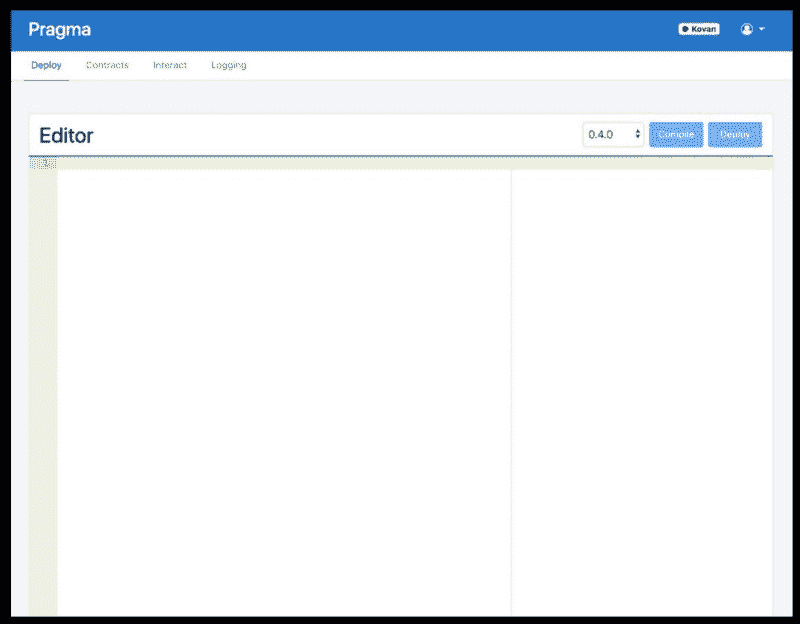
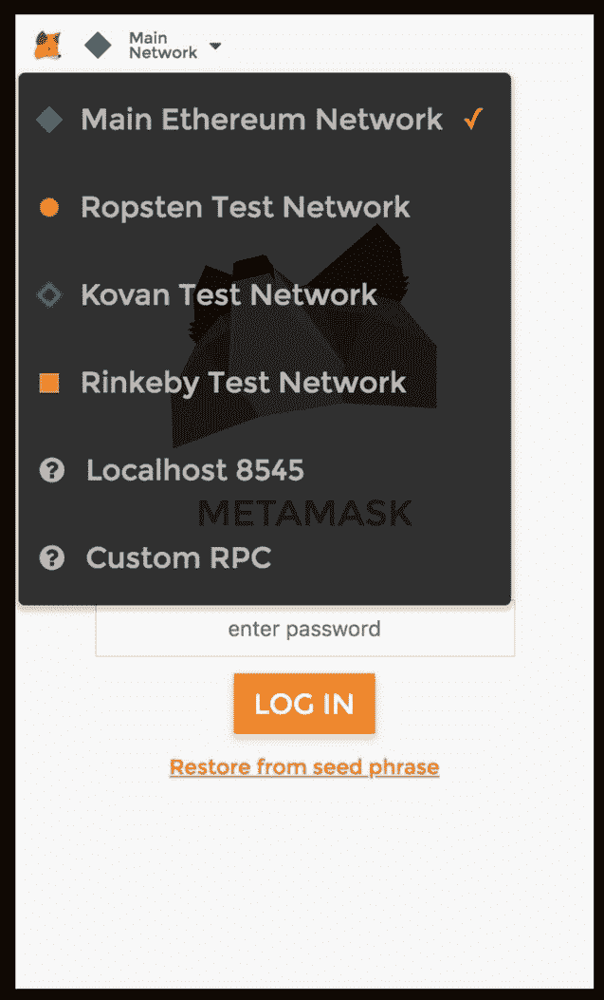
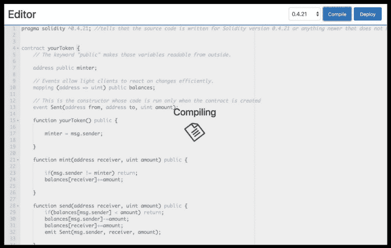
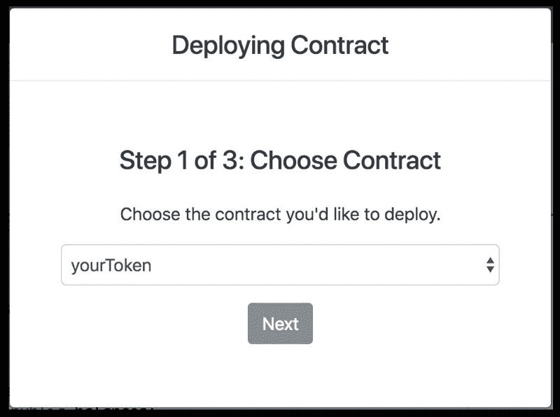
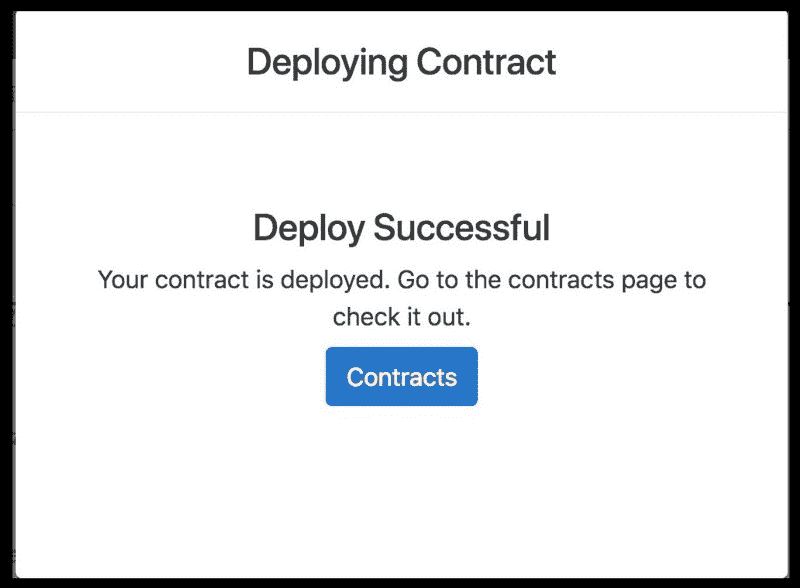
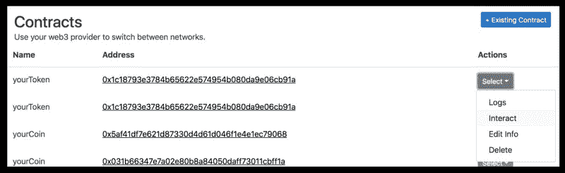
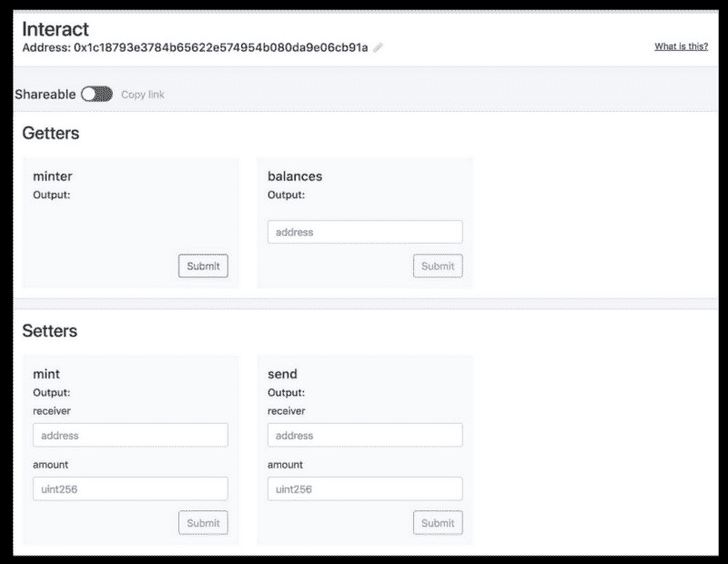
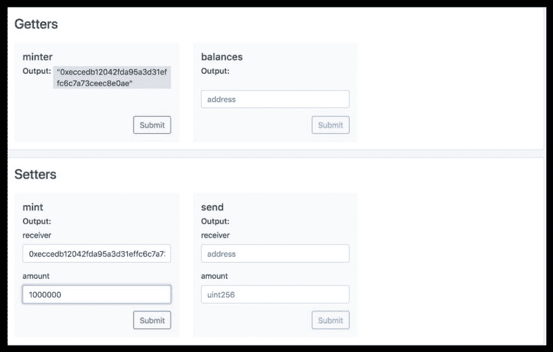
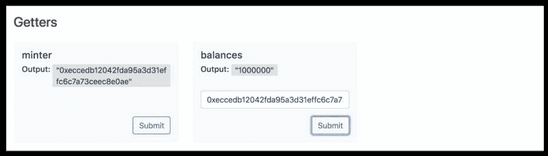

# 如何编写和部署您的第一份智能合同

> 原文：<https://www.freecodecamp.org/news/how-to-write-and-deploy-your-first-smart-contract-341d5e2ffb35/>

作者:Avadhoot Kulkarni

# 如何编写和部署您的第一份智能合同


自从[以太坊](https://ethereum.org)在 2015 年年中的出现给加密领域增光添彩以来，加拿大-俄罗斯程序员 Vitalik Buterin 的革命性发明已经催生了许多新的去中心化应用(dApps)。随着无数 dApps 的建立，以太坊的成功主要归功于其智能合约的实施。

有趣的是，智能合约的发明可以追溯到 1996 年。计算机科学家 Nick Szabo 提出了术语“智能合同”，并解释如下:

> “我称这些新合同为‘智能’,因为它们远比它们无生命的纸质祖先更具功能性。没有暗示使用人工智能。智能合同是一组以数字形式规定的承诺，包括协议，在协议中双方履行这些承诺"
> 
> — [尼克·萨伯](http://www.fon.hum.uva.nl/rob/Courses/InformationInSpeech/CDROM/Literature/LOTwinterschool2006/szabo.best.vwh.net/smart_contracts_2.html)，1996 年

他的工作后来启发了许多其他研究人员和科学家，包括创造以太坊的维塔利克。

### 基本信息

在我们深入研究本指南之前，理解两个重要的概念是很重要的。

我们首先需要了解的是以太坊虚拟机( **EVM** )是什么。它的唯一目的是充当基于以太坊的智能合约的运行时环境。把它想象成一台运行所有智能合约的全球超级计算机。顾名思义，EVM 是虚拟的，而不是物理机器。你可以[在这里](https://themerkle.com/what-is-the-ethereum-virtual-machine/)了解更多关于 EVM 的信息。

我们需要理解的第二个概念是什么是**气** *。*在 EVM，天然气是一种计量单位，用于为智能合同的每笔交易分配费用。发生在 EVM 的每一个计算都需要气体。越是复杂繁琐，执行智能合同需要的汽油就越多。

每笔交易都规定了它愿意为每单位天然气支付的天然气价格，允许市场决定天然气价格和计算操作成本(以天然气计量)之间的关系。两者相加，总用气量乘以支付的气价，得出交易支付的总费用。

```
Fee for transaction = Total gas used * gas price;
```

点击阅读更多关于天然气的信息[。](https://ethereum.stackexchange.com/questions/3/what-is-meant-by-the-term-gas)

现在，您已经对什么是智能合约以及智能合约如何运行有了基本的了解，我们可以直接进入如何制定我们自己的智能合约了！

### 安装

我们将为此使用一个工具:Pragma。这是一个易于使用的平台，用于创建和部署智能合同。[在这里注册](https://www.withpragma.com/)然后编辑:



登录元掩码。如果你还没有安装 MetaMask，[你可以从这里开始](https://help.indorse.io/hc/en-us/articles/360001815251-Using-MetaMask-on-Indorse)。

切换到 Pragma 和 MetaMask 中的 Kovan 测试网络。为了给你一个关于测试网的简要概述，请查看[这篇文章](https://karl.tech/intro-guide-to-ethereum-testnets/)。



以太坊主网是官方的以太坊网络。它更安全，使用乙醚，具有真正的货币价值。

测试网是游乐场以太网，其中以太被认为没有货币价值。开发人员在为他们的用户将应用程序部署到 mainnet 之前，使用这些操场来测试应用程序。

要在这些网络之间切换，请单击元掩码图标旁边的网络名称并选择网络。本教程请选择 **Kovan** 。

### 撰写智能合同

下面的合同将实现最简单形式的加密货币。凭空产生硬币是可能的，但只有创建合同的人才能做到这一点(实现不同的发行方案是微不足道的)。此外，任何人都可以互相发送硬币，而无需注册用户名和密码。你只需要一副以太坊钥匙。

```
pragma solidity ^0.4.21; //tells that the source code is written for Solidity version 0.4.21 or anything newer that does not break functionality

contract yourToken {
    // The keyword "public" makes those variables readable from outside.

    address public minter;

    // Events allow light clients to react on changes efficiently.
    mapping (address => uint) public balances;

    // This is the constructor whose code is run only when the contract is created
    event Sent(address from, address to, uint amount);

    function yourToken() public {

        minter = msg.sender;

    }

    function mint(address receiver, uint amount) public {

        if(msg.sender != minter) return;
        balances[receiver]+=amount;

    }

    function send(address receiver, uint amount) public {
        if(balances[msg.sender] < amount) return;
        balances[msg.sender]-=amount;
        balances[receiver]+=amount;
        emit Sent(msg.sender, receiver, amount);

    }

}
```

yourToken

这段代码基本上让你铸造和发送令牌到其他帐户。

让我们一行一行地看一下:

```
pragma solidity ^0.4.21;
```

这表明源代码是为 Solidity 版本 0.4.21 或任何不破坏功能的更新版本编写的。这是为了确保代码在新的编译器版本中不会有不同的行为。

```
contract yourToken
```

与您的令牌相关的所有内容都包含在此合同中。本质上，实体契约是位于以太坊区块链某个地址的函数和状态(代码和数据)的集合。

```
address public minter;
```

这是铸币厂的地址。关键字“public”使得这些变量可以从外部读取。

```
event Sent(address from, address to, uint amount);
```

事件允许轻型客户端(UI)有效地对变化做出反应。

```
function yourToken() public {
  minter = msg.sender;
} 
```

让我们把你的以太坊地址作为合同的签字人。您需要通过元掩码访问合同才能铸造。我们将在部署合同后再次讨论这个问题。

```
function mint(address receiver, uint amount) public {
  if(msg.sender != minter) return;
  balances[receiver]+=amount;
} 
```

这个功能可以让你铸造你想要的硬币数量。你想铸造多少代币都可以。if 条件告诉系统如果你不是 minter 就停止执行，这是在你的 Token 函数中设置的。

如果你实际上是铸币者，它会让你铸造代币。

```
function send(address receiver, uint amount) public {
  if(balances[msg.sender] < amount) return;
  balances[msg.sender]-=amount;
  balances[receiver]+=amount;
  emit Sent(msg.sender, receiver, amount);
}
```

这是一个让一个地址将令牌发送到另一个地址的功能。它需要两个参数:接收者和数量。它从发件人的地址中减少金额，并将相同的金额添加到收件人的地址中。我们之前声明的 Event Sent 现在用于进行传输。目前，我们保留了发件人的 msg.sender，即 minter，因为我们不想使合同复杂化。

就是这样。你的合同现在已经准备好了，让我们来编辑它。

### 编译和部署智能合同



一旦合同完成，让我们在区块链上部署它。如前所述，我们将使用 Kovan testnet 来部署契约。



检查智能合同是否已部署。

对于我为本教程部署的契约，[这是事务](https://kovan.etherscan.io/tx/0x96a3b24fedd12e79a6e16adf0dd05970e0a011510f302fdadc9d1559ad90a8fc)。你也可以在你合同下的 Pragma 中看到。



### 在 Pragma 中与智能合约交互



Let’s mint 1000000 tokens!


Signing the transaction



Yay!

这就是了。你的第一份智能合同，部署在区块链。:)

随着一些非常有用的工具的出现，引入了许多新概念。这可能有点让人不知所措，但没关系！试着理解这些概念，然后跟着它跑。

你创造过什么简单却有趣的智能合约吗？把它们贴在评论里，我会加在帖子里供参考。

有问题吗？在评论里添加他们或者加入我们的电报群[直接和我们对话](https://t.me/indorseio)。