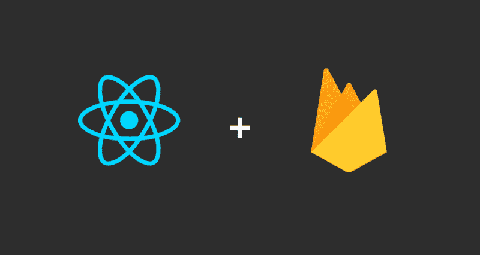
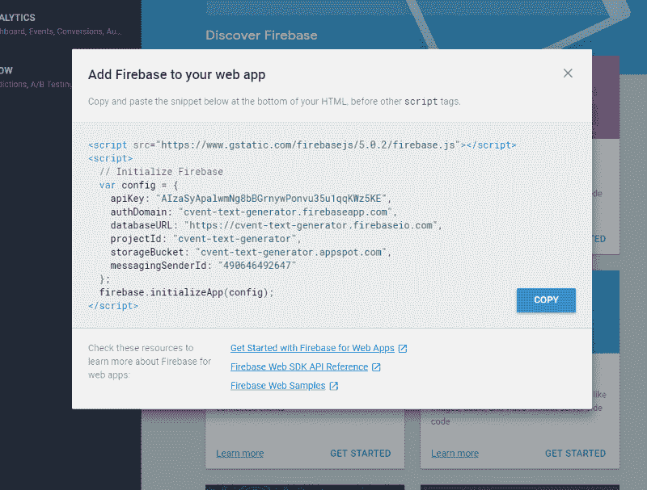
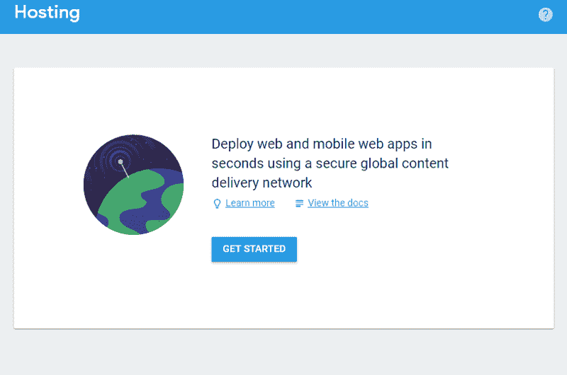
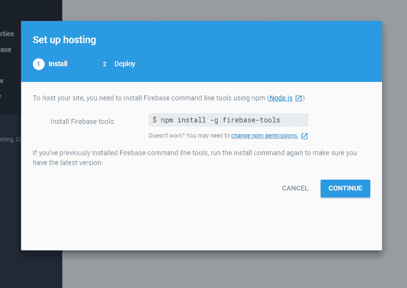
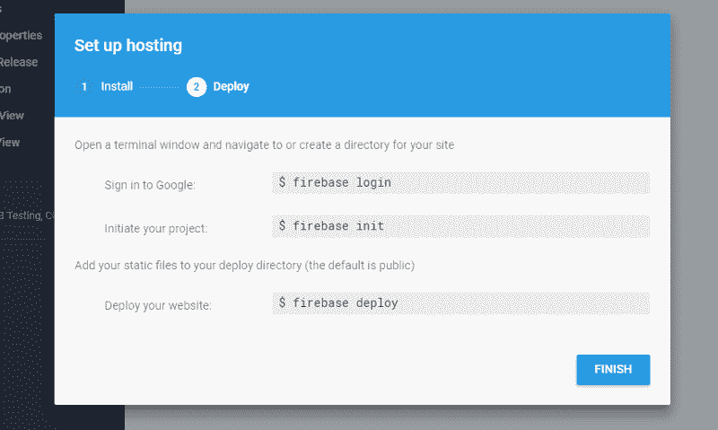
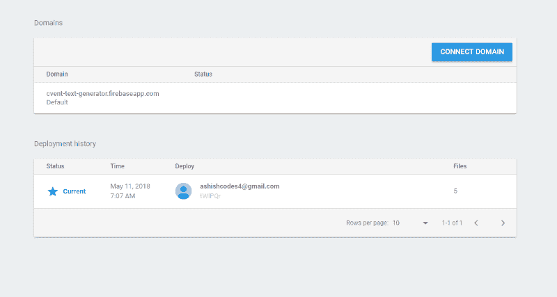

# React 和 Firebase 是托管您的 web 应用程序所需的一切

> 原文：<https://www.freecodecamp.org/news/react-and-firebase-are-all-you-need-to-host-your-web-apps-f7ab55919f53/>

阿什什·南丹·辛格

# React 和 Firebase 是托管您的 web 应用程序所需的一切



许多现代 web 开发故事都没有好的结局，因为涉及到复杂的技术和完成工作所采用的开发方法。

真正的问题是，我们如何才能使这一旅程不那么痛苦，或者我应该说更有成果和更有效？理想情况下，我们选择的技术应该是成熟的，并且有强大的社区支持。

在本文中，我们将探讨两种已经非常成熟并得到社区大力支持的技术，它们使我们能够更有效地创建实时 web 应用程序。

#### 先决条件:

*   你知道一些反应，至少是最基本的
*   您已经安装了 Node.js 和 NPM
*   你知道如何使用命令行

#### 所以这是我们今天要讲的内容:

*   使用 create-react-app 创建简单的 React 应用程序
*   登录 Firebase 控制台，创建一个新项目
*   用一个简单的命令将其部署到 **Firebase** 主机

当我最初尝试将一个 **React** web 应用程序部署到 **Firebase** 主机上，并想要启动和运行 web 应用程序**T5 时，我遇到了一些障碍。我发现把我进行的所有研究汇编成一篇综合性的文章来帮助社区可能是有用的。所以让我们开始吧。**

概括地说，本文分为三个部分:

1.  准备一个非常基本的 **React** 应用程序
2.  创建一个 **Firebase** 账户
3.  将我们的 **Firebase** 控制台连接到我们的 **React** 应用程序

### 第 1 部分-创建 React 应用程序

你可能知道**create-react-app myapp***是为 React 应用创建基本样板的最佳方式。它不仅创建了一个非常基本的样板文件，还添加了 React 运行所需的依赖项。*

*如果您没有意识到这一行命令的真正魔力和绝对威力，请尝试从头开始为 React 创建一个目录。只有那时你才会意识到真正的痛苦。向那些一开始就设置了这个命令的开发人员大声欢呼。*

*首先，我们需要在我们的机器上安装 **create-react-app** 。*

```
*`$ npm install -g create-react-app`*
```

*上面命令中的-g 标志在机器上全局安装 NPM 软件包。*

*一旦完成，我们将使用这个包获得 React 的基本样板。*

```
*`$ create-react-app myapp`*
```

*这将创建一个名为 **myapp** 的目录。现在我们需要导航到该目录并运行下面的命令。*

```
*`$ cd myapp$ npm start`*
```

*一旦您运行上面的命令，一个本地开发服务器应该在位置 **localhost:3000** 启动并呈现初始的 React 应用程序*

*我希望这是快速和简单的。我们还需要完成最后一步，但让我们先来看看 **Firebase** 。在那之后，我们将回到最后一步，使用 React。*

### *第 2 部分- Firebase 设置*

*在我们开始设置它之前，让我们先了解一下什么是 **Firebase** 。*

***Firebase** 是一个移动和 web 应用程序开发平台，为开发者提供大量工具和服务，帮助他们开发高质量的应用程序，扩大用户群，并赚取更多利润。*

*在设置 Firebase 之前，我们先来看看它的[历史](https://en.wikipedia.org/wiki/Firebase)。*

#### *简史*

*回到 2011 年，在被称为 Firebase 之前，它是一家名为 Envolve 的初创公司。Envolve 作为一个产品为开发者提供了一个 API，可以将在线聊天功能集成到他们的网站中。*

*该公司注意到，开发人员正在使用 Envolve 在他们的用户之间同步应用程序数据，如实时游戏状态，而不仅仅是聊天消息。*

*这导致 Envolve 的创始人詹姆斯·坦普林和 T2·安德鲁·李将聊天系统和实时架构分开。2012 年 4 月，Firebase 作为一家独立的公司成立，提供具有实时功能的后端即服务。*

*在 2014 年被谷歌收购后， **Firebase** 迅速发展成为今天这样的多功能移动和网络平台巨头。*

*这张图片描述了 Firebase 的全部功能。*

*

Firebase in a nutshell* 

#### *Firebase 登录*

*让我们从这个开始:去[https://firebase.google.com/](https://firebase.google.com/)用你的谷歌账户登录。登录后，点击**进入控制台**。你会看到一个选项**创建一个新项目**。*

*一旦创建了项目，您就可以将 Firebase 添加到任何 Android 或 iOS 移动应用程序甚至 web 应用程序中。*

### *第 3 部分-燃烧和反应*

*点击选项**将 Firebase 添加到您的 web 应用程序**。您将看到一个带有代码片段的对话框。*

**

*将这段代码添加到项目中的**index.html**文件的最底部。确保这段代码被添加到 index.html 文件中的任何其他脚本标签之前。*

*如果你仔细观察上面的图片，你会发现在底部提供了一些链接。点击第一个链接，查看**Web 应用 Firebase 入门**。您将看到下面的屏幕。*

**

*点击开始。*

**

*转到根目录，在终端中输入上面的命令。这将把 Firebase 工具下载到本地机器上。*

*下一步也是最后一步是初始化 Firebase，并将目录中的源代码部署到 Firebase。*

**

*一旦您点击 finish，并且您已经按照上面的所有步骤将它们输入到您的终端中，您应该在 web 页面上显示一个最近部署记录的列表。*

**

### *回访反应，如约而至*

*还记得在上面的 React 部分，我说过我们会回来做最后一件事吗？我们现在就去做。*

*导航到创建应用程序的目录。*

*React 的工作方式是让您创建一个构建版本。如果你有一个相当密集的应用程序，这是它建立的所有庞大代码库的一个缩小版。*

*要获得这个缩小和压缩的版本，我们可以使用我们的终端和一个非常有用的命令:*

```
*`$ npm run build`*
```

*这将在您的应用程序目录中创建一个名为 **build** 的新文件夹。这个文件夹包含一些文件，这些文件是整个 React 应用程序中最重要的部分。*

### *结论*

*如果您已经仔细遵循了所有的步骤，并且阅读了一点官方文档，那么所有这些应该都是小菜一碟。*

*就我个人而言，我觉得 **Firebase 已经彻底改变了开发者测试和使用托管即服务的方式**。这是一种更简单、更轻松的高效托管应用的方式，无需深究托管的细节。*