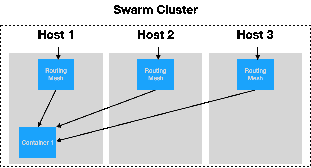

# 如何用 Docker Swarm 管理更多的容器

> 原文：<https://www.freecodecamp.org/news/how-to-manage-more-containers-with-docker-swarm-332b5fc4c346/>

诺兰·格雷斯

# 如何用 Docker Swarm 管理更多的容器


扩展到单台服务器之外是理解容器的一个重要特性。当您开始使用容器来简化应用程序的伸缩时，事情真的开始变得有趣了。假设您已经使用 Docker 容器进行开发和测试。现在您可以开始直播了。

如何确保您的应用程序有足够的资源？如果你像病毒一样传播，你将如何扩大规模？

这就是你应该开始使用像 **Swarm** 这样的容器编排器的地方。给你带来 Docker 的同一个组织建立了 Swarm。Swarm 的存在是为了管理机器集群上的 Docker 容器。Docker Swarm 使部署、管理和扩展容器变得容易。

在本文中，我们将介绍集群上容器编排的基础知识。我们将讨论 Docker Swarm 的特性，包括如何启动 Swarm、部署应用程序以及扩展应用程序。如果你不熟悉 Docker，可以看看我的其他文章。

[Docker 是什么？](https://medium.com/pintail-labs/docker-series-what-is-docker-9eddca88f434)
[开始你的第一个容器](https://medium.com/pintail-labs/docker-series-starting-your-first-container-92dfd1dc859)
[创建你的第一个 Dockerfile](https://medium.com/pintail-labs/docker-series-creating-your-first-dockerfile-573bfea4991)
[构建你的第一个映像](https://medium.com/pintail-labs/docker-series-building-your-first-image-8a6f051ae637)
[移动经过一个容器](https://medium.com/pintail-labs/docker-series-moving-past-one-container-bf32b45831d3)

准备好了就回来。


你可能听过我称 Swarm 为容器编制器。我这么说是什么意思？Swarm 负责管理和组织运行在集群上的主机和 Docker 容器。

可以把 Swarm 想象成一个理解如何运行 Docker 命令的应用程序。你告诉它你所有的 Docker 主机在哪里，你想运行什么容器，Swarm 会处理剩下的事情。Swarm 管理网络、访问、容器状态、扩展服务、负载平衡，甚至在主机无响应时重新定位容器。

在本文中，我们将在您的本地机器上启动一个 Docker Swarm。通过我们的本地 Swarm，我们将熟悉最常见的命令并部署一些服务。

### 开始蜂群

要开始，您需要安装 Docker-CE。为了帮助你在你的机器上安装 Docker，请访问 Docker-CE 网站。

一旦你成功安装了 Docker，启动你的第一个 Docker Swarm 就像运行一个命令一样简单。打开您的终端或命令行，运行下面的命令。

```
> docker swarm init
```

你做到了！你正在运行你的第一个蜂群。

如果您在 AWS 这样的云平台或服务器场中运行这个主机，那么向您的 swarm 集群添加更多节点是很简单的。只需按照 Docker 文档中关于如何[创建蜂群](https://docs.docker.com/engine/swarm/swarm-tutorial/create-swarm/)的说明。该文档将向您展示如何手动初始化 Docker Swarm 集群并向其中添加节点。

另一个选择是建立你自己的牧场主集群。在你设置了 Rancher 之后，你可以让它为你做繁重的工作。Rancher 是我在探索不同容器编排器的特性时使用的一项服务。Rancher 使启动一个机器集群和启动一个您选择的容器编排器变得很容易。Rancher 有一个漂亮的交互式 web 仪表板，可以轻松地旋转不同的管弦乐队，包括 Swarm、Mesos 或 Kubernetes。

你可以在 Rancher 文档中找到关于 Rancher 和[使用 Rancher 启动蜂群](http://rancher.com/docs/rancher/v1.6/en/swarm/)的信息。

出于本文的目的，我们将坚持在本地机器上运行一个节点。这将使我们更容易熟悉 Docker Swarm 和 Swarm CLI。

### 部署成群体

现在你已经运行了你的蜂群，让我们开始一些容器吧！如果你熟悉 Docker，部署到 Docker Swarm 应该是小菜一碟。用于为 Docker-CE 部署服务和堆栈的命令与用于 Docker Swarm 的命令相同。

要部署 [pintail-whoami](https://github.com/pintail-ai/pintail-whoami) docker 映像，运行下面的命令。

```
> docker service create --name pintail-whoami -p 80:80 pintailai/pintail-whoami:0.0.1
```

打开浏览器，进入 *http://localhost* ，你应该会看到下面的页面。


用于启动该服务的命令可能与 Docker-CE 完全相同，但当连接到 Swarm 时，事情的工作方式会有所不同。

当在集群中运行服务时，最大的不同是运行容器的物理位置。Docker Swarm 会在任何有资源的主机上启动一个容器。因此，仅仅因为您从一台主机上启动一个容器，并不意味着容器将在那里运行。

那么，如何访问可以在集群中任何地方启动的服务呢？

Docker Swarm 有一个非常有用的工具来解决这个问题，叫做 Swarm routing mesh。路由网格管理运行容器的入口。默认情况下，Swarm 使所有服务都可以通过每个 Docker 主机上发布的端口访问。



假设您有一个包含三台 Docker 主机的集群。如果您将一个服务部署到您发布在端口 80 上的群，那么从哪个主机访问该端口并不重要——您将被路由到您的服务。

在现实世界中，如果您有一个 web 应用程序和一个 Rest API，您可以将 web 应用程序部署在端口 80 上，将 API 部署在 8080 上。通过这种配置，您可以扩展运行应用程序不同部分的容器数量。但是您可以始终确保 Swarm 集群中任何节点上的端口 80 会将您带到网站，而端口 8080 会将您带到 Rest API。

群路由网状网有其优点和缺点。这种默认配置有其局限性，但它旨在使入门尽可能容易。随着应用程序变得越来越复杂，路由网格可以配置为不同的行为，并且可以部署不同的服务来使用不同的路由配置。欲了解更多信息，请查看[群模式路由网格文档](https://docs.docker.com/engine/swarm/ingress/)。

### 扩展您的服务

现在我们有了一个正在运行的服务，让我们加快速度吧！

想象一下，你正在生产中的 Docker Swarm 上运行你的网站，你的网站开始成为黑客新闻的趋势。您的流量增加了两倍，您需要处理额外的负载。要将运行的容器数量增加三倍，只需运行以下命令:

```
> docker service scale pintail-whoami_pintail-whoami=3
```

转眼间。Docker Swarm 扩展您正在运行的副本的数量，并将流量路由到容器。在上面的命令完成后，回到你的浏览器中的“Pintail.ai Docker 示例”,点击几次刷新。当路由网格将您导航到不同的容器时，您应该会看到数字发生了变化。

Swarm 使扩展服务变得容易，因此您可以担心更大的问题。

### 打扫

现在让我们清理我们的容器，蜂拥而至。

要删除 pintail-whoami 堆栈，运行

```
> docker stack rm pintail-whoami
```

小心下一个命令。如果你在群内运行其他东西，它将被删除。

要删除您的 Swarm 集群，请运行

```
> docker swarm leave --force
```

因此，在本文中，我们启动了一个群主机，讨论了向我们的集群添加节点，启动并扩展了一项服务，并讨论了群路由网格。希望这篇介绍能帮助你更好地理解容器编排和 Docker Swarm。

这篇文章仅仅触及了容器和 Swarm 的皮毛，但是我希望它能给你一些帮助你继续学习的内容。

如果您有任何意见、问题或担忧，请告诉我。我总是乐于接受反馈，并希望听到您的建议。如果你喜欢这篇文章，请给我留下很多掌声让我知道。