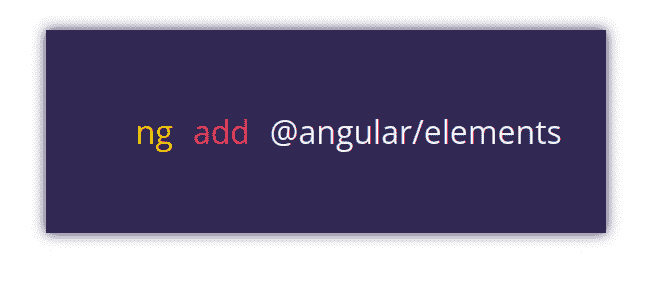
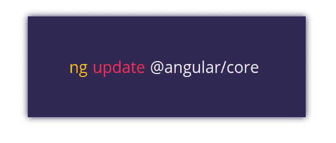
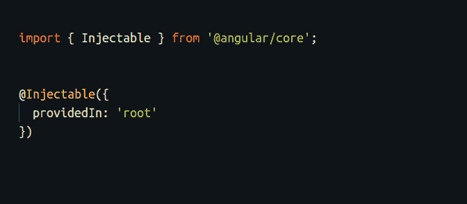
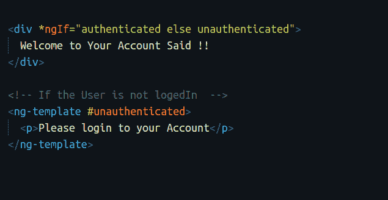
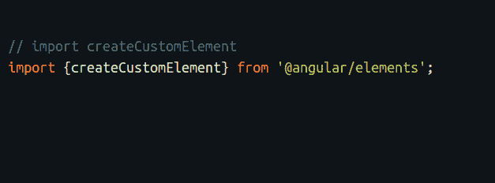
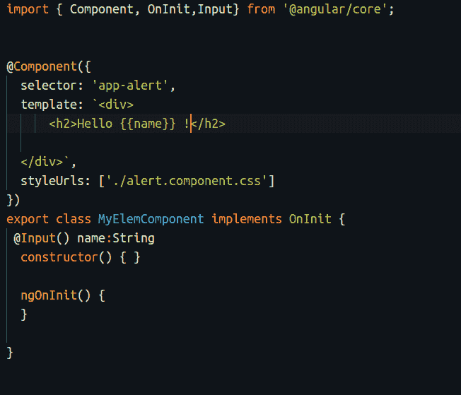
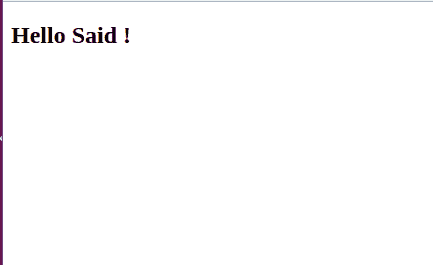

# Angular 6 及其新特性——三分钟解释

> 原文：<https://www.freecodecamp.org/news/angular-what-is-the-new-briefly-e6837348dd3a/>

[Angular](https://angular.io) 在[6 . 0 . 0](https://angular.io/)版本中推出了一些令人惊叹的新功能，尤其是 Angular-cli。现在，有了 Angular 6，您可以轻松地更新您的旧包，使用 Angular 元素创建原生 web 元素，以及许多其他事情。我们来看看吧！

### ng 添加

`**ng add**`是 Angular-cli 中的一个新命令，可帮助您在 Angular 应用程序中安装和下载新的软件包。它的工作原理与 npm 相同，但并不取代它。

### ng 更新

也是一个新的 Angular-cli 命令。它用于更新和升级您的软件包。这真的很有帮助，例如，当你想从 Angular 5 升级到 Angular 6，或者你的 Angular 应用程序中的任何其他包。

### 在服务本身内部声明提供者

在这次更新之前，您必须在`**app.module.ts**`中声明 providers 数组

现在有了 Angular 6，您可以通过将`**providedIn:root**` 属性放在“`**@injectable"**` **装饰器中，在管理器内部提供服务。**

### 使用 ng-template 代替 template 指令

你可以使用 `**ng-template**`来呈现 HTML，而不是新版本 Angular 中的`**template**`标签。`**ng-template**`是一个角元素，当它与[结构指令](https://angular.io/guide/structural-directives)一起使用时起作用，如`***ngFor**`和`***ngIf**`

### 角度元素

角 6 向我们介绍了角元素。您可以将 Angular 元素呈现为原生 web 元素，它们被解释为可信的 HTML 元素。

您可以通过运行以下命令添加角度元素:

在组件中导入`**createCustomElement**`。

然后创建您的定制元素！

`**MyElemComponent.ts**`

结果是:

**注意:**您必须实现`@angular/platform-browser`中的`**DomSanitizer**`方法，使您的定制元素成为可信的 HTML 标签。

你可以在这里了解更多关于角元素

### 升级到 RxJS 6.0.0

Angular 6 使用最新版本的 Rxjs 库。现在，您可以在 Angular 应用程序中享受 RxJS 6 的最新功能:)

### 包扎

Angular 本身在 Angular 内核上并没有太多突破性的改变，但是 Angular-cli 真的很让人激动。Angular 团队更加关注性能，轻松地构建 PWAs，提供一个良好的工作环境，以便以一种简单的方式与 Angular 一起工作。

你可以在推特上找到我。

> 顺便说一下，我最近和一个强大的软件工程师团队合作开发了一个移动应用程序。这个组织非常棒，产品交付得非常快，比我合作过的其他公司和自由职业者快得多，我想我可以诚实地向他们推荐其他项目。如果你想联系我，请发邮件给我—[said@devsdata.com](mailto:said@devsdata.com)。