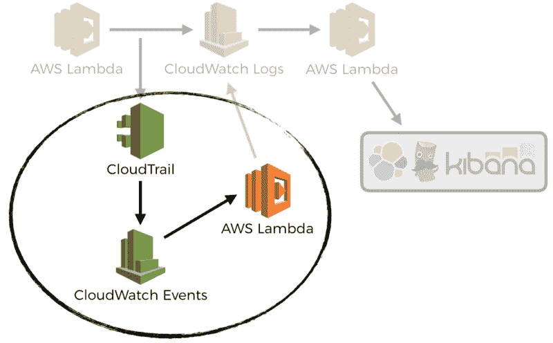
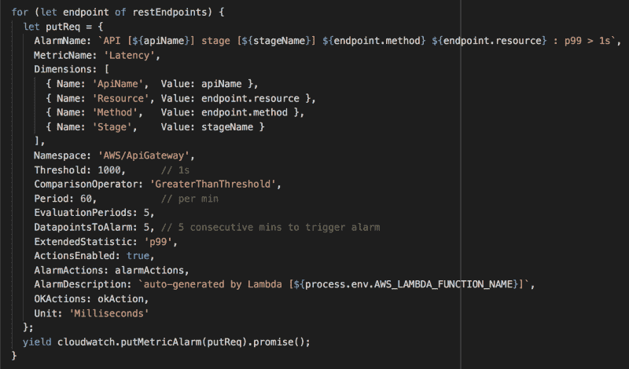
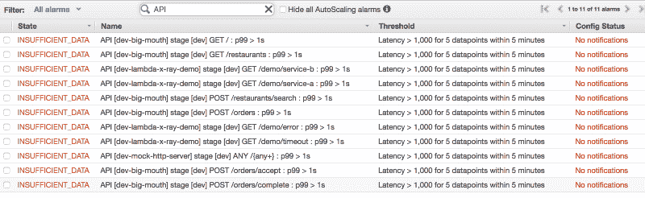

# 如何使用 CloudWatch 事件和 Lambda 为 API 自动创建 CloudWatch 警报

> 原文：<https://www.freecodecamp.org/news/how-to-auto-create-cloudwatch-alarms-for-apis-with-cloudwatch-events-and-lambda-b128920857aa/>

作者:崔琰

# 如何使用 CloudWatch 事件和 Lambda 为 API 自动创建 CloudWatch 警报

在[之前的一篇文章](https://theburningmonk.com/2017/08/centralised-logging-for-aws-lambda/)中，我讨论了如何使用**云观察事件**将**云观察日志组**自动订阅到一个 Lamb da 函数。这样做的好处是，我们不需要人工过程来确保所有的 Lamb 数据日志都被转发到我们的日志聚合服务。

虽然这本身是有用的，但它只是触及了我们所能做的事情的表面。 **Cloud Trail** 和 **Cloud Watch Events** 让许多日常操作步骤的自动配对变得很容易，当然是在 **Lamb da** 的帮助下？

我与 **API Gate way** 和 **Lamb da** 合作了很多。每当尤尔创建一个新的 API，或者进行修改时，你需要做几件事:

*   启用部署阶段的**详细指标**
*   在云观察中设置仪表板，显示请求计数、延迟和错误计数
*   为 P99 延迟和错误计数设置**云监控警报**

因为这些都是人为的步骤，它们经常被忽略。

你有没有忘记在你的 API 中增加一个新的端点后更新仪表盘？你还记得在这个新的端点上设置 P99 延迟警报吗？关于 4XX 或 5xx 错误数量的警报如何？

我接触过的大多数团队都有一些关于这些的建议，但是他们没有办法执行这些建议。结果是，该条件在补丁中被应用，并且不能被依赖。我发现这种方法与团队的规模不相称。

当你是一个小团队时，它是有效的。每个人都有一个共同的理解，这是必要的。当团队变大时，您需要自动化来帮助实施这些条件。

事实上，我们可以使用相同的模式自动匹配这些人工步骤。在我的课程[的](https://bit.ly/production-ready-serverless)[监控](https://livevideo.manning.com/module/38_9_5/)单元中，我演示了如何通过三个简单步骤实现这一点:

*   **云迹**captures**Cre at eDe deploy**请求 **API Gate way**
*   **云观察事件**反对此捕获请求
*   **Lamb da** 功能，启用详细的计量表，并为每个端点创建警报

如果您使用少于框架的[服务器，那么您可能会得到如下所示的函数:](https://serverless.com/framework/docs/)

从上面的代码中可以看出一些需要注意的事情:

*   我正在使用[server less-IAM-roles-per-function](https://github.com/functionalone/serverless-iam-roles-per-function)plug in 来赋予函数阿泰角色
*   该功能需要精确的`apigateway:PATCH`来启用详细的矩阵
*   该函数需要每个任务的`apigateway:GET`来获取 API 名称和 REST 端点
*   该功能需要`cloudwatch:PutMetricAlarm`时间来创建报警
*   用于**云监控警报**的环境变量规格 SNS 顶级 IC

捕获的事件如下所示:

我们可以在`detail.requestParameters`属性中找到`restApiId`和`stageName`。这就是我们所需要的，来确定有哪些端点，以及我们需要创建哪些警报。

在 han dler 函数中，您可以在这里找到[和](https://github.com/theburningmonk/manning-aws-lambda-in-motion/blob/master/functions/create-alarms.js)，我们执行几个步骤:

*   通过对 API Gate way 的`updateStage`调用启用详细的计量表
*   通过对 API Gate way 的`getResources`调用获得 REST 端点的列表
*   通过对 API Gate way 的`getRestApi`调用获得 REST API 名称
*   对于每个剩余端点，在`AWS/ApiGateway`名称空间中创建一个 P99 延迟警报

现在，每当我创建一个新的 API 时，我会让**云观察警报**在一个端点的 99%延迟连续 5 分钟超过 1 秒时提醒我。

所有这些，仅仅用几行代码？

您可以进一步利用这一功能，并利用其他功能:

*   为每个端点的 5xx 错误创建云观察警报
*   为 API 创建云观察仪表板

所以你有它！一种自动完成人工操作任务的有用模式。

在你告诉我 ACloudGuru 的人开发的 ACloudGuru AWS Alerts 无服务器插件之前，是的，我知道它。它看起来很整洁，但是它仍然是开发人员必须记住要做的一些事情。

那需要学科。

我的经验告诉我，你永远不能依赖纪律。这就是为什么我建议在适当的地方设置一个平台来生成这些警报。