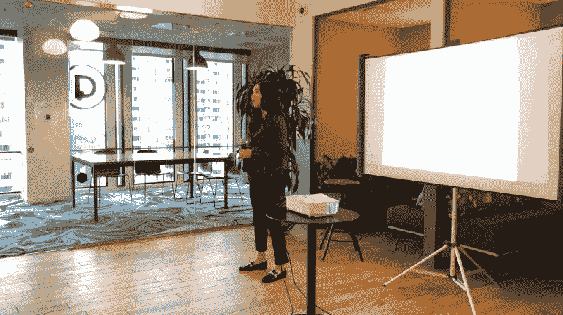
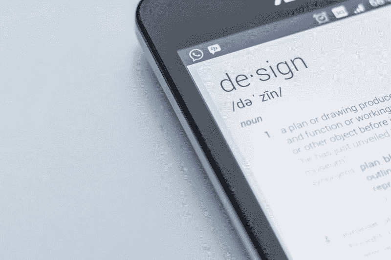

# 作为一名女性，我在科技行业的第一次演讲中学到了什么

> 原文：<https://www.freecodecamp.org/news/what-i-learned-giving-my-first-talk-as-a-woman-in-tech-88031c4bc51e/>

蒂芙尼·伊顿

# 作为一名女性，我在科技行业的第一次演讲中学到了什么

我变得非常热衷于扩展我帮助其他设计师实现他们职业生涯中个人目标的方式。赋予 UX 权力和传播福音的热情已经以不同的形式表现出来，比如在我的第一次播客中发言、讨论和管理我自己的班级。

上个月，我决定在校外做我的第一次“公开”演讲。支持和机遇来自于[女性对话设计](https://womentalkdesign.com)。

Women Talk Design 是一个提升女性和非二元个体对话的平台。他们为活动组织者提供工具、方法和信息，以吸引更多不同的演讲者。

这个项目的创始人是 Christina Wodtke，她是一位了不起的老师，也是我在学校和职业生涯中的导师。她坚强的个性，令人惊叹的经历，克服困难的能力，以及将她被给予的任何东西转化为有形价值的能力，给了我勇气去义无反顾地追求我想要的任何东西。她让我相信，如果我下定决心，有决心和毅力，我可以做任何事。

我深信，号召人们行动起来的更有效的方式之一是通过引人入胜的故事。以编故事的形式发表公开演讲是整个 UX 设计领域固有的一种技能，这种技能对我和我帮助他人的目标来说非常有价值。

在这篇文章中，我将讲述我从第一次演讲中学到的东西。

### 以适合我的方式准备演讲

我第一次演讲的过程让我明白了如何创造未来的演讲。首先，你可能需要考虑一些约束。因为这个活动要求我们做一个最多只有 5 分钟的灯光演讲，所以我不得不简洁地表达我的信息。我只能包括最必要的信息来支持我的演讲。

所以你需要决定:你想传达的信息是什么？

约束允许我对我的演讲目标持现实态度。我准备演讲的方式是**先把它写下来，然后练习，去掉我演讲时不流畅的部分**。这使得我更容易减少冗余，并专注于重要的部分，以确定我是否在做一个更长的演讲，但不会给我的信息带来任何额外的价值。

从经验来看，每一次谈话都有一个教训或与教训相关的行动步骤。我发现**开始构建谈话的一个好方法是有一个中心信息，并围绕它创造要点**。这些可能是联系或证明你的信息的经历、统计数据、冲突和解决方案、一个难忘的事件等等。

这里有一篇由 [Christina Wodtke](https://www.freecodecamp.org/news/what-i-learned-giving-my-first-talk-as-a-woman-in-tech-88031c4bc51e/undefined) 写的好文章，讲述了如何策划一场精彩的演讲以及故事的重要性。

### 人们想听你说话

我在发言的时候，发现在座的每个人都很支持，都把注意力集中在我身上。这给了我更多的鼓励，让我能够舒服而自信地演讲。

每当你演讲时，人们都会去听。这就是为什么他们在那里摆在首位。他们想从你的经历中学习。发表演讲可能会带来超高的压力和高风险，因为它会给你带来巨大的压力。但是你不应该这样想。大多数情况下，人们希望你成功。他们想听听你的旅程。

在演讲中加入故事是很重要的，因为这能让人们感同身受，产生共鸣，并更专注于你要说的内容。我发现演讲在这方面很有力量，因为我知道人们希望我成功地演讲。我也想教他们一些新的东西，激励他们。

### 每个人都有故事要讲

故事很有力量。它们让我们能够以相关的方式分享我们的经历，并对我们的观众产生深远的影响。在这次活动中，我有机会听了其他演讲者的演讲。听到他们的故事真是太棒了。

虽然有一些经历我没有经历过，但听到女人们谈论她们的方式让我觉得我是她们旅程的一部分，这让我大开眼界。我听的所有演讲都教会了我一些新的或有效的东西，我可以把它们与我的生活联系起来。

如果你觉得自己无话可说，那你就是在骗自己。你肯定有值得分享的故事，每个人都喜欢故事。你只需要找到对你来说超级重要的信息或个人故事。

### 说话是一个反复的过程

我不断修改我的演讲，从如何吸引听众到我希望听众记住的中心信息。我发现向我的同学或随机的人展示真的很有帮助，因为它让我了解人们如何接收我的信息。我得到了有用的反馈，关于我的演讲中没有意义的部分，什么时候停顿而不是说得太快，微笑和语调。这让我能够加强我的演讲，并发展更好的实践。

我明白了没有“完美”的谈话这回事。总会有你想要改进的地方，尤其是一些小事情，比如强调谈话的某个部分，或者你想说更多的时候。

对我来说，我尽量少担心小细节，而是担心整体的执行。我相信，如果我能够自信地传达我的信息并引发讨论，那么一场演讲就是成功的。如果人们能够带着可以应用到生活中的有价值的东西离开，我觉得很成功。

### 实践

练习让我在观众面前更舒服、更自信地说话，而不会太在意别人对我的看法。而且反正你也不应该太在意，因为你不可能让所有人都满意。我相信准备充分比准备不足要好，因为这表明你在乎并愿意在工作中超越自我。

我相信你投入的大量实践会让你的信息更有力量。就我而言，在演讲前的 3-4 周内，每周练习几次，让我在未来的演讲中更加自如。

除了在人前和镜子前练习，我还看了 TED 演讲。观看 TED 演讲和其他女性演讲者并从中获得灵感，让我了解并观察她们如何用手势、语调和投射进行交流。他们也给了我很大的鼓舞，让我讲述我的故事，当我不相信我能成功演讲时，不要放弃。

### 结论

几年前，我绝不会考虑自己在公共场合发言。但我的使命是通过我的工作与人们深入交流并赋予他们力量，这是我前进的动力。我想继续接触他人，这意味着走出我的舒适区，挑战自己。

女性谈话设计很棒，因为它为女性提供了一个练习和演讲的安全空间。这是一个奇妙的、相互支持的网络，每个人都给彼此信心和鼓励去追求自己的激情，并最终互相帮助。如果我们想平衡性别差距，拥有更平等的代表权，我们需要更多地参与科技活动，发出我们的声音。我们需要激励下一代女孩，让她们有能力挑战现有的性别规范，即作为一名女性意味着什么。

我受到那些有勇气站在舞台上讲述自己故事的女性的鼓舞。他们经常面临逆境，无论是在个人生活中还是在工作中。他们经常克服困难，挑战社会规范。她们的故事证明了她们可以像男人一样强大和成功。

*查看我在 **[UX 研究](http://skl.sh/2nal9ZT)** 上的 Skillshare 课程，学习新知识！*

为了帮助你开始拥有自己的设计生涯，这里有一些来自 [**Rookieup**](https://transactions.sendowl.com/stores/8219/107314) 的神奇工具，我曾经在这个网站上得到资深设计师的指导。

*   [在经验丰富的设计师的帮助下制作作品集](https://transactions.sendowl.com/stores/8221/107314)
*   [巩固和建立您的投资组合的基本工具](https://transactions.sendowl.com/stores/8219/107314)

链接到其他一些很酷的读物:

*   [我从两次面试和收到谷歌的邀请中学到了什么](https://medium.com/google-design/what-i-learned-from-interviewing-and-receiving-offers-from-google-two-times-e1d1a7b715bc)
*   作为一名应届毕业生，我在脸书面试。以下是我对设计的了解
*   [旅程规划是获得共鸣的关键](https://uxplanet.org/journey-mapping-is-key-to-gaining-empathy-1da5b54655e1)
*   [UX 立足于理性，而非设计](https://uxplanet.org/ux-is-grounded-in-rationale-not-design-49e8f77b8f58)