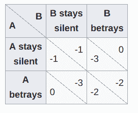
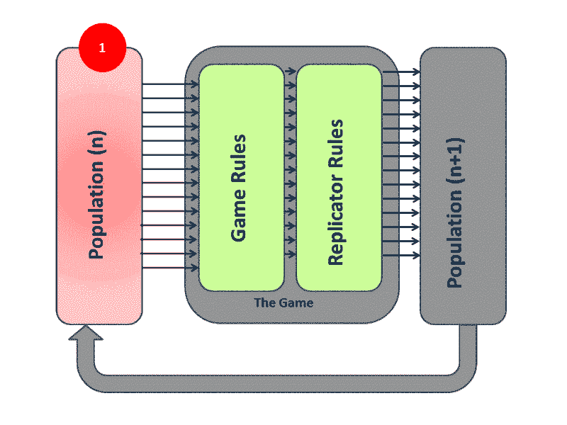

# 需要进化:博弈论和人工智能

> 原文：<https://www.freecodecamp.org/news/game-theory-and-ai-where-it-all-started-and-where-it-should-all-stop-82f7bd53a3b4/>

埃琳娜·尼西奥蒂

# 需要进化:博弈论和人工智能

人工智能(AI)充满了无法回答的问题和无法分配到正确问题的答案。在过去，它为其坚持错误的做法付出了停滞期的代价，即所谓的 AI winters。然而，人工智能的日历刚刚进入春天，应用程序正在蓬勃发展。

然而，人工智能的一个分支长期以来一直被忽视。这个演讲是关于强化学习的，它最近在像 AlphaGo 和 T2 这样的游戏中展示了令人印象深刻的结果。但是让我们诚实地说:这些不是强化学习的胜利。在这些情况下，变得更深的是深度神经网络，而不是我们对强化学习的理解，强化学习保持了几十年前达到的深度。

当应用于现实生活问题时，强化学习的情况更糟。如果训练机器人在绳子上保持平衡听起来很难，那么尝试训练一组机器人赢得足球比赛，或者训练一组无人机监控移动目标。

在我们失去树枝，甚至更糟的是失去大树之前，我们必须加深对这些应用程序的理解。博弈论是研究拥有共同目标的玩家团队的最常见方法。它可以借给我们在这些环境中指导学习算法的工具。

但是让我们看看为什么常见的方法不是常识性的方法。

> 消灭一个错误和建立一个新的真理或事实一样好，有时甚至更好。 *—查尔斯·达尔文*

首先，让我们先熟悉一下这些领域的一些术语和基础知识。

### 博弈论

#### **一些有用术语**

*   游戏:像大众理解的游戏一样，它可以是玩家采取行动的任何环境，其结果将取决于他们。
*   **玩家:**游戏内的战略决策者。
*   策略:给定游戏中可能出现的一系列情况，玩家将采取的行动的完整计划。
*   **收益:** 玩家在游戏中达到特定结果时获得的收益。
*   平衡:游戏中双方都做出决定并达到结果的那一点。
*   纳什均衡:一种均衡，在这种均衡中，如果其他参与者的策略保持不变，任何参与者都不能通过改变自己的策略而获益。
*   优势策略:当对一个玩家来说，一个策略比另一个策略更好时，不管这个玩家的对手怎么玩，都会出现优势策略。

#### **囚徒困境**

这可能是文献中最著名的游戏。下图展示了它的收益矩阵。一个收益矩阵胜过千言万语。对于一个有经验的人来说，提供描述一个游戏所需的所有信息就足够了。但是让我们不要那么简洁。

Prisoner’s dilemma payoff matrix

警察逮捕了两名罪犯，罪犯 A 和罪犯 b。尽管臭名昭著，但由于缺乏证据，这些罪犯不能因正在调查的罪行而被监禁。但他们可以因较轻的指控而被拘留。

他们被监禁的时间长短将取决于他们在审讯室里会说些什么，这就产生了这个游戏。每个罪犯(玩家)都有机会保持沉默或者告发其他罪犯(玩家)。收益矩阵描述了根据结果每个玩家将被监禁多少年。例如，如果玩家 A 保持沉默，玩家 B 告发他们，玩家 A 将服刑 3 年(-3)，玩家 B 不服刑(0)。

如果你仔细回顾收益矩阵，你会发现一个玩家的逻辑行动是背叛对方，或者用博弈论的术语来说，背叛是优势策略。这会导致博弈的纳什均衡，每个参与者的收益都是-2。

有什么奇怪的吗？是的，或者至少应该如此。如果两个玩家都同意保持沉默，他们都会得到更高的奖励-1。囚徒困境是一个博弈的例子，在这个博弈中，理性会导致比合作更糟糕的结果。

#### **一些历史备注**

博弈论起源于经济学，但今天是一个跨学科的研究领域。它的父亲约翰·冯·诺依曼(你会注意到约翰在这个领域有很好的职业前景)，是第一个对游戏的普遍概念给出严格表述的人。他将研究局限于两个人的游戏，因为他们更容易分析。

随后，他与奥斯卡·莫根施特恩合著了一本书，奠定了预期效用理论的基础，并塑造了博弈论的进程。大约在那个时候，约翰·纳西引入了纳什均衡的概念，这有助于描述游戏的结果。

### 强化学习

人们很快就意识到博弈论的应用有多么广泛。从游戏到生物、哲学，等等，还有人工智能。博弈论现在与多个玩家通过强化学习的环境密切相关，这是一个称为多代理强化学习的领域。这种情况下的应用例子是机器人团队，其中每个玩家都必须学习如何表现得有利于自己的团队。

#### **一些有用术语**

*   **代理:**相当于玩家。
*   **奖励:**相当于一笔收益。
*   **状态:**描述代理所处情况的所有必要信息。
*   **动作:**相当于游戏中的一步棋。
*   类似于策略，它定义了代理在特定状态下将采取的行动
*   **环境:**智能体在学习过程中与之交互的一切。

#### 应用程序

想象以下场景:一队无人机被释放到森林中，以便尽早预测和定位火灾，让消防员做出反应。无人机是自主的，必须探索森林，了解哪些条件可能引起火灾，并相互合作，以便它们使用少量电池和通信覆盖森林的广阔区域。

这种应用属于环境监测领域，人工智能可以将其预测技能借给人类干预。在一个日益复杂的技术世界和一个受到威胁的物理世界中，我们可以将吉卜林的名言解释为“人类不可能无处不在，因此他制造了无人机。”

分散式架构是另一个有趣的应用领域。像物联网和区块链这样的技术创造了巨大的网络。信息和处理分布在不同的物理实体中，这一特征被认为提供了隐私、效率和民主化。

不管你是想用传感器来减少一个国家家庭的能源消耗，还是想取代银行系统，去中心化都是新的趋势。

然而，让这些网络变得智能具有挑战性，因为我们引以为豪的大多数人工智能算法都是数据和计算密集型的。强化学习算法可用于有效的数据处理，并使网络适应其环境的变化。在这种情况下，研究单个算法如何合作是很有趣的，而且对整体效率也有好处。

Deep or collective learning? AI research has based its harvest on increasingly deeper networks, but it could be that the answers to challenging problems come from collective knowledge, not deep-rooted individuals. Did we miss the forest?

### 不仅仅是游戏

将人工智能问题转化为像囚徒困境这样的简单游戏很有诱惑力。在测试新技术时，这是一种常见的做法，因为它提供了一个计算成本低廉且直观的测试平台。然而，重要的是不要忽略问题的实际特征，如噪声、延迟和有限的内存，对算法的影响。

也许人工智能研究中最误导人的假设是用迭代的静态游戏来表示交互。例如，一种算法可以在每次想要做出决定时应用囚徒困境游戏，这是一种假设代理人在此过程中没有学习或改变的公式。但是学习对代理人的行为会有什么影响呢？和别人的互动不会影响它的策略吗？

这个领域的研究集中在合作的进化上，罗伯特·阿克塞尔罗德研究了囚徒困境迭代版本中的最优策略。阿克塞尔罗德组织的[锦标赛](https://en.wikipedia.org/wiki/The_Evolution_of_Cooperation#Axelrod%27s_tournaments)表明，适应时间和互动的策略，即使听起来像针锋相对一样简单，也非常有效。人工智能社区[最近](https://arxiv.org/abs/1803.00162)研究了**连续囚徒困境** *，*下的学习，但这方面的研究仍处于不成熟状态。

多智能体与单智能体学习的区别在于增加的复杂性。训练一个深度神经网络已经够痛苦的了，而添加新的网络作为代理的一部分，会使问题变得更加困难。

一个不太明显但更重要的问题是缺乏这类问题的理论性质。单代理强化学习是一个很好理解的领域，因为理查德·贝尔曼和克里斯托弗·沃特金斯已经提供了学习所需的算法和证明。然而，在多主体的情况下，证明失去了有效性。

只是为了说明一些令人困惑的困难:一个代理执行一个学习算法来学习如何对其环境做出最佳反应。在我们的例子中，环境包括其他代理，它们也执行学习算法。因此，算法在动作之前必须考虑其动作的效果。

### **前期关注点**

这种担忧始于博弈论的发源地:经济学。让我们从在经典博弈论下研究一个系统时所做的一些假设开始。

**理性:**一般在博弈论中，为了推导纳什均衡，假设完全理性。这大致意味着代理人总是为自己的利益而行动。

**完整信息:** 每个代理人都知道游戏的一切，包括规则，其他玩家知道什么，他们的策略是什么。

**常识:** 有一个事实的常识在一群代理人当中当:所有代理人都知道 **p** ，他们都知道所有代理人都知道 **p** ，他们都知道他们都知道所有代理人都知道 **p** ，以此类推**ad infinity***。有一些有趣的谜题，比如蓝眼睛的岛民，描述了常识对问题的影响。*

1986 年，肯·阿罗表达了他对经典博弈论的保留意见。

> 在本文中，我想理清经济理论中理性假设的一些含义。特别是，我想强调的是，理性不仅仅是个人的财产，尽管它通常以这种方式出现。相反，它不仅聚集了它的力量，而且还聚集了它所嵌入的社会环境中的意义。在非常理想的情况下，这是最有可能的。当这些条件不再成立时，理性假设变得紧张，甚至可能自相矛盾。

如果你发现 Arrow 对经典博弈论有点苛刻，你认为你最近的购买有多理性？或者说，你今天的一顿饭，投入了多少意识和努力？

但阿罗对理性的假设没有那么多担心。他担心这件事的影响。对于一个理性的代理人来说，你需要为他们提供做出决定所需的所有信息。这需要无所不知的玩家，这在两个方面是不好的:首先，它对玩家的信息存储和处理提出了不切实际的要求。第二，博弈论不再是**博弈论**，因为你可以用一个中心统治者代替所有的玩家(这有什么意思呢？).

从这个角度来看，信息的价值是另一个有趣的地方。我们已经讨论过拥有所有信息是不可行的。但是假设玩家知识有限呢？那会有帮助吗？

你可以问这个领域的任何人，但是可以说不确定性下的优化是困难的。是的，仍然存在古老的纳什均衡。问题是它们是无限的。博弈论不会给你提供评价它们的论据。所以，即使你达到了一个，你也不应该把它看得那么重要。

### **强化学习关注点**

在这一点上，你应该怀疑人工智能的应用要比经典博弈论所关注的例子复杂得多。仅提及在机器人应用中应用纳什均衡方法的道路上的一些障碍:想象一下在 RoboCup 中作为一个机器人足球队的队长。你的球员和对手有多快，多强，多聪明？对手队用什么策略？你应该如何奖励你的球员？一个进球是祝贺的唯一理由吗，还是为一个好传球鼓掌也会改善球队的行为？显然，仅仅熟悉足球规则不会让你赢得比赛。

如果博弈论已经引发了几十年的争论，如果它是建立在不切实际的假设上，如果它为现实的任务提供了复杂且鲜为人知的解决方案，为什么我们还在追求它？很明显，这是我们在群体推理中唯一拥有的东西。如果我们真的理解了群体是如何相互作用和合作来实现他们的目标，心理学和政治学就会清晰得多。

多智能体强化学习领域的研究人员要么对他们的算法的理论性质进行彻底的讨论(尽管经常表现出良好的结果)，要么传统地研究纳什均衡的存在性。在该领域的一名年轻研究人员看来，后一种方法似乎很难在严格、不切实际的假设下证明理论上存在无限且价值可疑的解决方案，这些解决方案在实践中永远不会被利用。

### **进化博弈论**

进化博弈理论的出现并不是最近的事，然而它在人工智能领域的深远应用花了很长时间才被认可。起源于生物学，1973 年由约翰·m·史密斯和乔治·r·普莱斯引入，作为经典博弈论的替代。这些改变是如此深刻，以至于我们可以谈论一种全新的方法。

推理的主体不再是玩家本身，而是玩家群体。因此，概率策略被定义为参与人做出选择的百分比，而不是经典博弈论中一个参与人选择一个行动的概率。这消除了理性的、无所不知的代理人的必要性，因为策略随着行为模式而进化。进化过程类似于达尔文理论。玩家遵循适者生存和随机突变的原则进行繁殖，可以用一组微分方程来优雅地描述，称为**复制者动力学**。

在下图中，我们可以看到这个系统的三个重要部分。一个群体代表了一个代理团队，并以混合策略为特征。游戏规则决定了群体的收益，这也可以看作是进化算法的适应值。最后，复制器规则描述了种群将如何基于适应值和进化过程的数学属性而进化。

Image credit: By HowieKor [CC BY-SA 3.0 ([https://creativecommons.org/licenses/by-sa/3.0](https://creativecommons.org/licenses/by-sa/3.0))], from Wikimedia Commons

纳什均衡的概念和追求被**进化稳定策略** *所取代。*如果一个策略对遵循另一个策略的一群智能体的入侵是免疫的，只要入侵的种群是小的，则该策略可以具有这种特征。因此，团队的行为可以在动力系统的稳定性这个广为人知的领域中进行研究，比如[李亚普诺夫稳定性](https://en.wikipedia.org/wiki/Lyapunov_stability)。

> 达到平衡需要一个不平衡的过程。在存在非均衡的情况下，理性行为意味着什么？个人推测平衡过程吗？如果是的话，那么在某种意义上，这种不平衡是否可以被认为是一种更高级的平衡过程？

在上面的段落中，Arrow 似乎在努力找出一个游戏的动态属性。进化博弈论能回答他的问题吗？

最近，著名的强化学习算法，如 [Q-learning、](https://link.springer.com/chapter/10.1007/978-3-540-39857-8_38)在这种新的方法下进行了研究，并得出了有意义的结论。如何使用这个新工具最终取决于应用程序。

我们可以按照向前的方法，推导出一个学习算法的动态模型。或者反过来，我们从一些期望的动态属性开始，设计一个展示它们的学习算法。

我们可以描述性地使用复制器动力学，来可视化聚合。或者规定地调整算法以便收敛到最优解。后者可以通过消除盲目调整的需要，极大地降低我们今天面临的艰巨任务的深度网络训练的复杂性。

### 结论

不难追溯博弈论和人工智能的道路何时以及为何变得错综复杂。然而，更难的是忽略 AI，特别是多智能体强化学习，在遵循经典博弈论方法时必须面对的限制。

进化博弈论听起来很有前途，既提供了理论工具，也提供了实践优势，但我们只有尝试过才会真正知道。在这种情况下，进化不会自然产生，而是出于研究团体对改进的有意识的斗争。但这不正是进化的本质吗？

偏离惯性推动你的方向需要一些努力，但是强化学习，尽管在人工智能领域取得了普遍的成功，仍然非常需要提升。