# 我如何以及为什么决定测试驱动开发值得我花费时间

> 原文：<https://www.freecodecamp.org/news/test-driven-development-i-hated-it-now-i-cant-live-without-it-4a10b7ce7ed6/>

作者:罗纳利·席尔瓦

我第一次读到测试驱动开发(TDD)是在一些技术评论博客上，但是我几乎没有读过(或者想过)。当人们已经知道逻辑的时候，为什么还要先写测试**？**

这到底是怎么回事？首先编写测试，逐步构建逻辑，并在迭代中完成。有趣的是，当你给两个程序员五分钟来编写一个简单的斐波那契数列，并让其中一个做 TDD 时，在五分钟结束时，做 TDD 的程序员可能会说“我有测试！”但是他们还没有完成代码。另一方面，另一个人会完成整个斐波纳契数列，并优化它。

### **为什么要使用 TDD？单元测试还不够好吗？**

去年年底，我终于和 TDD 面对面了。在为期三个月的训练营中，我们被迫总是用 TDD 做事情。我已经够纠结的了，所以每当要写测试的时候，我的大脑总是会反抗。

我的大脑问，当我可以直接编码逻辑时，为什么我们要先写测试？我们不能以后再写吗？所有功能完成后？

How it looks when our TDD mentor convince us

让我简单地给你一个 TDD 的概述。

假设我正在创建一个斐波那契函数。我可能会问，斐波纳契数列上最简单的断言是什么？
= >如果输入为 1 则返回 1。

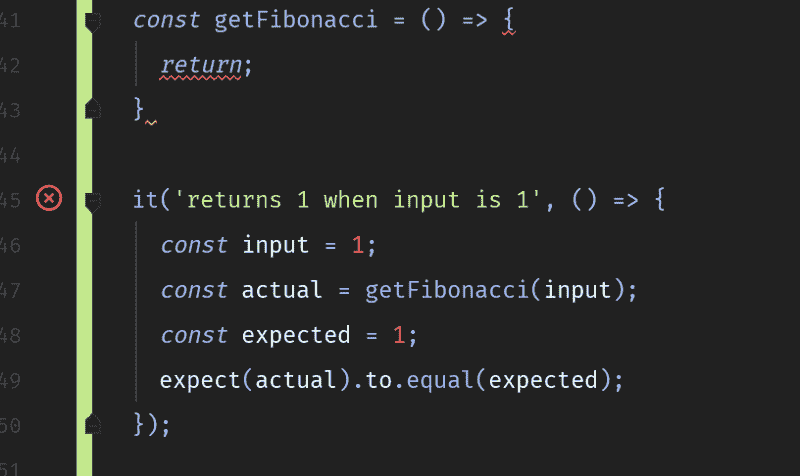

Writing test first, no logic coded!

这个断言最简单的解决方案是什么？***最简单的解决办法**，我是说真的。*

*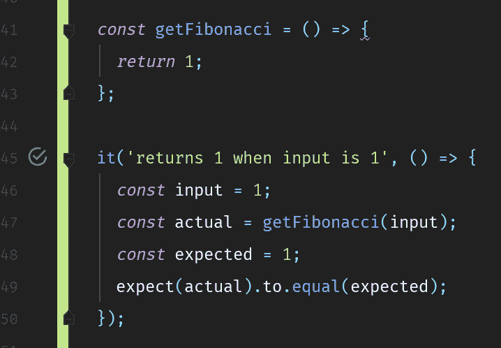*

*下一步。斐波那契的下一个最简单的断言是什么？
= >对于输入= 3，返回 2*

*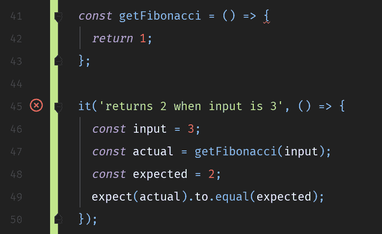*

*同样，让我们快速解决这个问题。只需返回并添加一些分支。*

*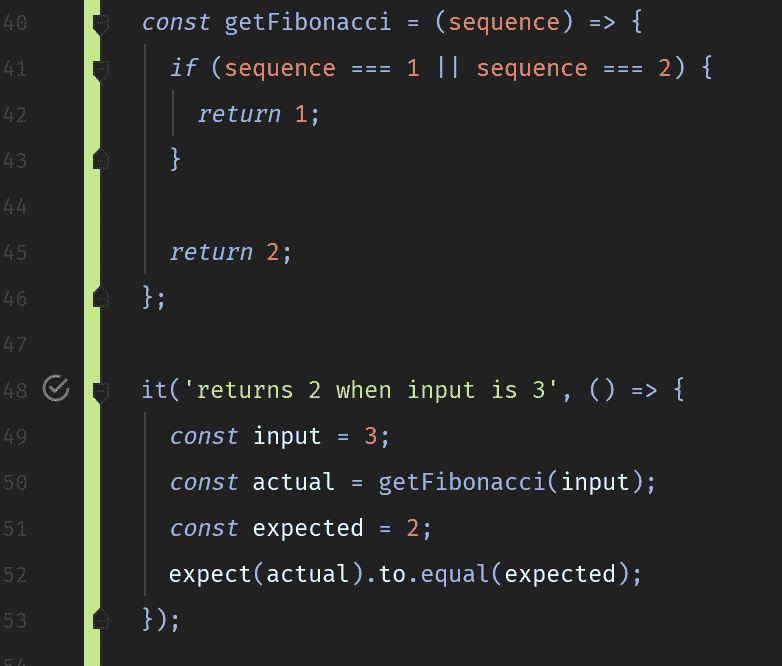*

*转移到另一个期望。瞄准一个更大的数字。迭代地、增量地做。*

*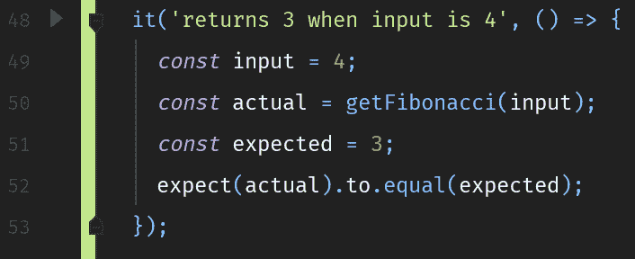*

*继续下去，直到你得到斐波那契函数的好解。如果你想练习更多，试着在过程中加入记忆(别忘了——用 TDD)。*

*你注意到我们在那里做了什么吗？您的主张，以及我们如何定义解决方案？你的思维过程被分成五个关键点:*

***简单&增量设计—** 你必须考虑一个特定的功能可以做的最简单的事情是什么，以及接下来会发生什么。斐波那契的例子完美地描述了这一点。*

***断言—** 您对该功能的期望是什么？你如何描述这种期望？其他人会很快理解吗？
一些测试库为你提供了测试描述功能。那个字符串是解释你的代码在做什么的唯一冗长的东西。*

*确保这是一个好的解释，否则你会在假期接到电话，因为你的不可读测试用例失败了，没有人知道为什么。*

*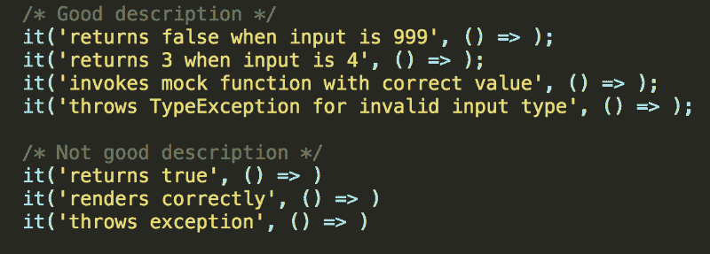

Your assertion and how you state it matters.* 

*可测试的设计——你应该如何设计它才能可测试？看看下面这两个片段。*

*第一个:*

*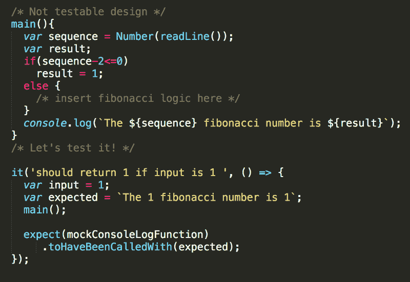

Look how messy it is if your code is not testable.* 

*通过进行 TDD，因为你首先编写测试，你必须确保你的代码是**可测试的** *。*从例子中可以看出，你甚至没有测试你的斐波那契函数。相反，您在代码中测试斐波那契逻辑的**副作用**，这将调用 console.log 函数。*

*另一件事是，当你重构它时，你永远不知道哪个失败了，是 console.log()还是你的 fibonacci 块。这样，TDD 引导我们增加代码的模块化。*

*现在，让我们看看第二个片段。*

*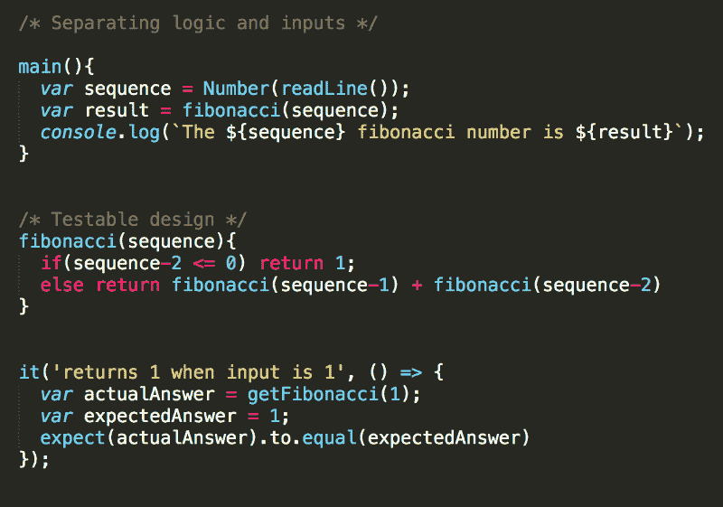*

*在第二个例子中，我们可以看到我们测试的是特定的斐波那契函数，而不是另一个函数。我们相信，在我们所述的条件下，该功能运行良好。我们确信，如果另一个函数调用我们的斐波那契函数失败了，那不是来自我们的代码。*

***否定和转折** —当事情不对劲时，你会期待什么:它是用 null 调用的吗？它会抛出异常吗？应该如何处理？代码中可能会发生什么？这个循环中可能发生的最奇怪、最诡异的事情是什么？什么测试能发现这一点？*

*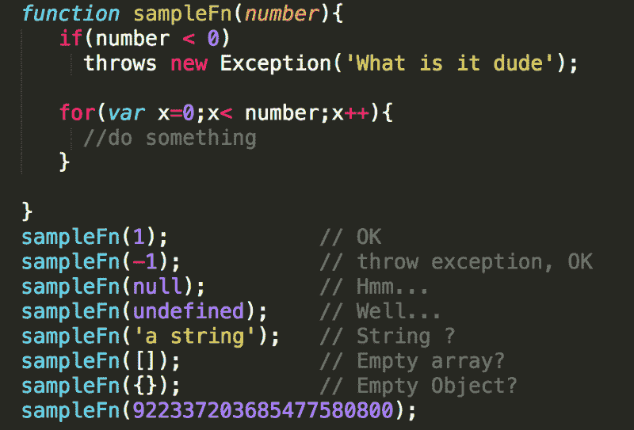

How many possibilities are there?* 

***界限** —你应该从你的职能中期待这一点吗？你确定不是别的班的责任？*

**

### *我的 TDD 问题*

*是的，确实很慢。有时，你的时间会加倍，因为你同时在写测试和逻辑。这使得如何使用键盘变得很重要(打字速度、更好的快捷键用法等等)。*

*更糟糕的是——当需求改变时——你不得不重构或删除并重写你努力工作的测试代码。这意味着测试代码是您编写的将来更有可能被删除的代码。你正在反复地做这件事。删除。代码。重写。又来了。循环往复！*

***想想吧。为什么要编写更容易被删除的代码呢？***

*“不，这就够了。当我找到一个强有力的理由来解释为什么我应该花时间去写那些我可能会删除的代码时，我会去做的”，我对自己说。*

*就在那时，我不知不觉地开始自掘坟墓。*

### *为什么我改变了主意*

*大约两个月后，当我被分配到一个根本没有很好地实施 TDD 的小组时，我得到了启示。*

*我的意思是，他们实现了 TDD，**但是**他们没有进行测试。他们懒得去修复那些失败的测试用例(它们经常因为需求改变而失败)。这是因为世界上最老生常谈的原因:他们没有时间。他们必须设定最后期限。*

*看完情况，我嘟囔了一句“看，看！这个 TDD 在制作界是行不通的！”这让我对很多事情产生了疑问:这个 TDD 值得我去争取吗？TDD 值得花时间吗？它能带来任何商业价值吗？*

*过了一段时间，我意识到问题呈指数级增长，任务被延迟，混乱盛行，开发人员的体验变得非常糟糕——所有这些都是因为他们执行 TDD 很差而且不认真。这比根本不写测试更糟糕。*

*以下是它引起的一些问题:*

*   *当我添加一个新特性或重构一些东西时，我不知道代码是否失败，因为测试已经失败了。*

*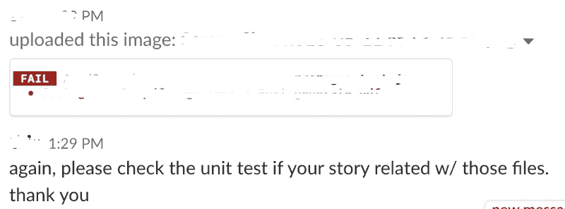

We do not know which tests do I fails on, because almost all of it already failing before! -_-* 

*   *我们被迫对代码覆盖率有很高的门槛。毫无疑问，程序员既聪明又狡猾。他们编写没有预期的测试，比如冒烟测试。这是他们对这种特殊逻辑进行的**唯一的**测试。就像是，我们只知道它在所有东西都着火后才失灵。多危险啊。*

*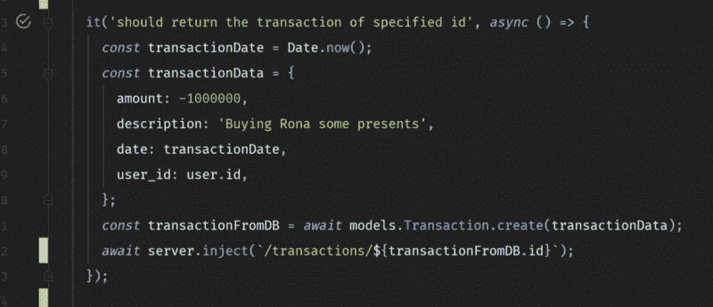

Always passing, anyway! All hail code coverage!* 

*   *我们使用 CI/CD 进行部署。我们总是部署，即使它失败了，这很可怕:你永远不知道是你的产品本身失败了，还是因为你没有修复测试。*

*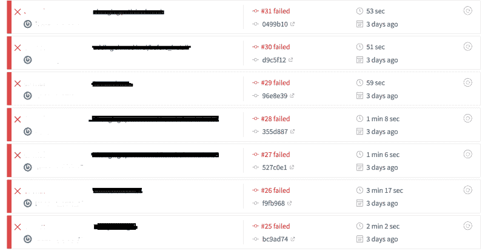

Test is failing, deploy anyway!* *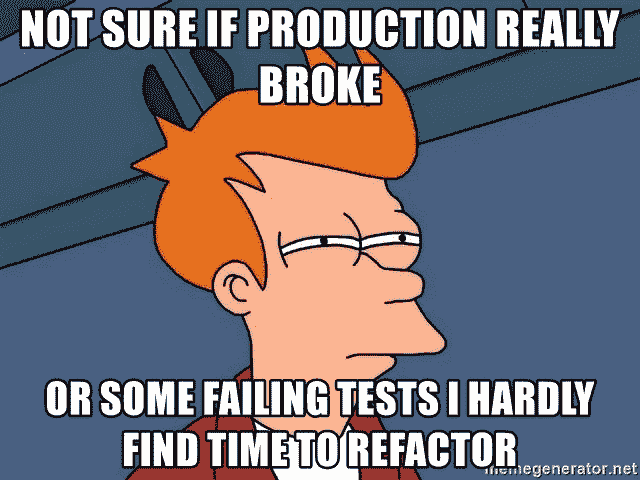*

*   *制作完成后，我们最终修复了奇怪的、完全没有意识到的错误。我们以前从未想过那些奇怪的情况。(有没有发现一种情况，当一个 try-catch 块中的某个东西失败了，但是没有抛出异常？)*

*哦，太可怕了！*

*分析完情况，迭代做了，反思了，才知道 TDD 其实是一个金块。如果做得好，它可以让我们成为更好的开发者。*

### *为什么我现在喜欢 TDD*

#### *有了 TDD，你会有更少的 bug*

*你几乎不会错过你在测试中能捕捉到的东西。*

*当你得到一个需求时，你首先为它写一个测试。然后运行测试，看看它是否会先失败。当您添加逻辑时，您会看到它是否通过。*

*看到它失败是很重要的，因为你知道是什么破坏了你的代码。从长远来看，这种做法确保了代码中的所有行都经过了良好的测试。*

#### ***TDD 为你节省大量时间*(未来)****

*CI/CD 非常依赖测试。如果你写了错误的测试(或者测试太少)，你已经浪费了五个小时去寻找它不能捕捉的错误。如果你写了好的测试，花五分钟多写一些更深入更完整的代码，你就可以在将来节省调试时间。*

#### ***TDD 处理编码的人类方面***

*主要是疏忽和遗忘。如果你直接写所有的逻辑，比如说，到第 190 行的末尾，你可能会忘记为什么在第 19 行把一个变量乘以 100。*

*但是，通过增量地做并陈述我们代码的断言，我们逐渐建立了我们的理解。这让我们更好地理解代码及其行为。*

*额外的收获是，我们有一些活的和功能性的代码文档。如果删除前面的一行，您可以看到哪个测试失败了，并且立即知道原因。*

#### ***TDD 帮助你集中注意力***

*程序员倾向于写太多的代码，或者写太多的代码。或者他们试图为从来不存在的情况做计划。通常，当我的团队练习结对时，我发现与其他不使用 TDD 的团队相比，TDD 允许我们编写更少的代码。在编码时，我们专注于让测试用例通过——不多不少。*

#### *TDD 也有益于你的大脑*

*甚至在部署代码之前，您就可以证明代码已经准备好投入生产。你不必担心你之前已经测试过的东西。你不必向你的项目经理吹嘘项目进展如何，因为你可以向他们展示测试正在通过！*

*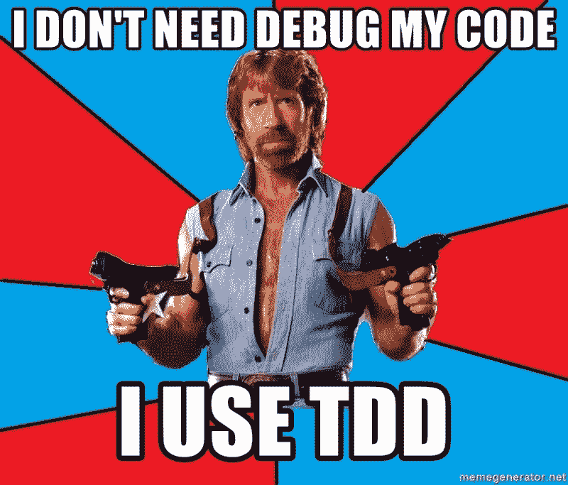*

*然而，TDD 并不是**永远** 你的银弹。这需要时间。甚至在开始做任何事情之前，您就必须建立项目——比如环境、模拟和存根。*

*但是记住，花在编写测试上的时间不是浪费时间。你现在投资的时间是为了以后节省时间。这是您在构建系统时所做的投资，因为您是在更多代码的基础上构建代码的。而且你想让它的基础尽可能的牢固。TDD 给了你这些。*

*最后，如果你不做 TDD，你可能会损失一大笔钱。**这可能需要时间，但从长远来看，这对你和你的团队都有好处。***