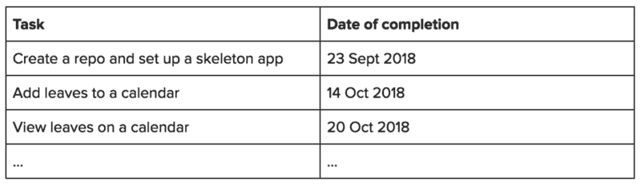
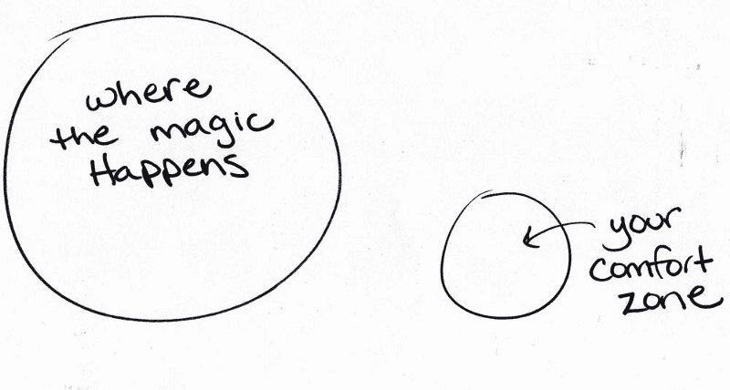
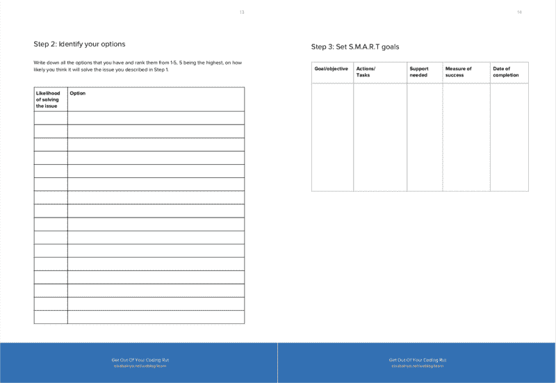

# 如何走出编码的窠臼，继续你的事业

> 原文：<https://www.freecodecamp.org/news/how-to-get-out-of-your-coding-rut-and-move-forward-with-your-career-4d656e0cc1c1/>

伊莎贝尔·尼奥

# 如何走出编码的窠臼，继续你的事业


Dear programmers, developers, software engineers, are you feeling stuck in your career?

你是不是一个编码员(程序员、开发人员、软件工程师等等)觉得自己被困在仓鼠轮子上，没有灵感和动力去写漂亮的代码？你曾经非常喜欢的一份工作感觉很无聊，或者更糟，很痛苦？你想知道你的职业生涯还有比这更重要的吗？

我是一名工程经理，曾经和你一样是一名程序员。相信我，在我的开发生涯中，我曾多次陷入困境，不管我是在一家顶级科技公司工作，还是在一家令人兴奋的小型初创公司工作。

每一次，我都按照我将在本文中与您分享的步骤，成功地走出了编码的窠臼。

本指南涵盖了七个步骤，帮助你摆脱程序员的束缚，推动你的职业发展。遵循这些步骤，你会再次找到你的最佳状态。

```
Step 1: Assess your current situation
```

```
Step 2: Identify your options
```

```
Step 3: Set S.M.A.R.T goals
```

```
Step 4: Get out of your comfort zone
```

```
Step 5: Be at the service of others
```

```
Step 6: Take a good break
```

```
Step 7: Review your progress
```

现在，让我们开始吧。


### 第一步:评估你的现状

为什么你觉得自己陷入了程序员的职业生涯？从问自己几个问题开始。我概述了一些常见的场景，这些场景可能会让程序员觉得自己陷入了职业生涯。有些是内部驱动的，比如想要创造更多的影响，而有些是外部驱动的，比如想要得到认可。

#### **场景 1:没有挑战感**

你在目前的职位上没有感到挑战吗？你觉得你每天做的事情就是修复 bug 吗？你我都知道修复 bug 对于确保你的软件或产品的质量很重要，但是你的工作肯定不仅仅是修复 bug，对吗？

#### **场景 2:未被识别**

你觉得你的工作没有得到认可吗？你是否觉得你的努力被忽视了，因为不是每个人都理解或欣赏你刚刚发布的特性的技术复杂性？每个开发人员最讨厌的是，设计师或产品经理是否因为它看起来漂亮而得到更多的信任？

#### **场景 3:不产生影响**

你觉得你没有通过你的角色产生影响吗？您的代码如何对业务目标做出贡献？你怎样才能为你工作的公司增加价值？

#### **场景 4:跟不上最新**

技术总是在变化和进步。你觉得你的技能和专业知识很快就会过时吗？你担心自己在不久的将来会失业吗？你想学习不同的框架还是编程语言？

#### **场景 5:感觉不兴奋**

从表面上看，不感到兴奋可能看起来类似于不感到挑战。但是在这里感觉不到兴奋意味着你已经完全失去了对编码的热爱。你准备做一些不同的事情，一个完全不同的角色，一个不涉及 ide 和把代码推给公司回购的角色。

一旦你确定了自己的需求和愿望，了解了自己的现状，下一步就是想出选择并采取行动。

> ***行动:*** *把你的现状写在一张纸上或者你的工作表中(你可以在本文末尾下载)。如果你属于我确定的场景之一，写下场景的名称而不是编号。*


### 第二步:确定你的选择

既然你知道你想要什么，下一步就是看看你的选择。你想知道那里有什么，你需要为自己创造什么。

这就是这个过程的发展方向。

*寻找要解决的问题- >想出各种解决方案，并将你所寻找的内容融入到你的解决方案中- >与你的经理分享- >采取*行动

这里有一点需要注意:如果你有一个好的经理，她会欣赏你的积极主动。你不是带着问题或抱怨去找她，而是带着解决方案来。她可能会给你反馈或者只是鼓励的话语。一切都准备好了。

然而，我们都知道情况并非总是如此。并不是所有的经理或公司都支持你，但你的工作是首先询问而不是假设。如果你觉得在你提出要求并尽了最大努力之后，你哪里也去不了，那可能是时候开始寻找其他地方了。

回到流程:为了帮助你开始，我将为每个场景列出几个选项。

#### **场景 1:没有挑战感**

*   创建内部工具
*   自动化手动流程
*   改进现有工具的部分或全部

#### **场景 2:未被识别**

*   通过非正式会议教育利益相关者和非技术人员
*   邀请业内的其他人来你的公司演讲
*   为你的工作感到自豪，找机会向非技术人员谈论你工作的来龙去脉，也许是在你公司的内部活动中

#### **场景 3:不产生影响**

*   获取显示业务绩效的数据，如价值驱动树(VDT)
*   向战略或分析方面的人寻求培训，教你诸如增加功能采用等驱动因素如何影响收入和其他结果
*   改进直接增加业务价值的东西，例如通过持续部署改进发布过程来加快上市时间，或者引入工具和过程来提高技术人员的生产力

#### **场景 4:跟不上最新**

*   投入时间学习
*   为开源项目做贡献
*   创建一个宠物项目

#### **场景 5:感觉不兴奋**

*   与不同角色或不同部门的人交谈，了解他们的工作
*   参加行业活动和聚会，看看外面有什么
*   自愿无偿工作，以获得不同角色的经验

> ***行动*** *:在一张纸上或你的工作表中，写下你所有的选项。你可能会发现我列出的一些选项对你很有吸引力，尽管你并不完全属于那种情况。这些都不是一成不变的，所以你可以随意选择你喜欢的。*


### 第三步:设定 S.M.A.R.T 目标

假设你和你的经理分享了想法，她非常支持你。你已经准备好投入其中了。但在你开始采取行动之前，我希望你为你计划执行的每个选项设定 S.M.A.R.T .目标。

南 M.A.R.T 代表具体的、可衡量的、可实现的、现实的和及时的。没有 S.M.A.R.T 目标，你将无法跟踪或衡量自己的进展。

假设你选择了“创建一个内部工具”

想象一下，你的公司没有管理休假的工具，当涉及到各种项目的资源分配时，它使你的经理的工作非常辛苦。

你可以为此创建一个内部工具:姑且称之为休假管理应用程序。无论你是用你熟悉的编程语言还是你想学习的新语言来写，都取决于你自己。如果你是一个纯粹的后端开发人员，这可能也是一个学习前端开发的好机会。或者，您可能希望与公司中具有不同技能的人一起合作完成这个项目。

请记住，你可能会在你的正常工作职责之外做这个项目，所以在填写完成日期时要考虑到这一点。您的 S.M.A.R.T 目标将包括以下信息。



Subset of a S.M.A.R.T goal

> **行动** : *写下你所有选项的 S.M.A.R.T 目标。这也是一个很好的练习，以确保你给了他们足够的思考，并且你没有超出你的能力范围。您可以使用我在工作表中提供的 S.M.A.R.T 目标模板。*


### 第四步:走出你的舒适区

有一句非常著名的谚语说，“神奇发生在你的舒适区之外。”还有一个插图来描述这句谚语。



*Magic happens outside your comfort zone.*

我希望你花几分钟时间看看这个插图，让它深入你的大脑。

现在，你想摆脱困境，让你的职业向前发展，这样你对你的职业又感觉良好了。我们大多数人大约 33%的时间花在工作上，所以带着你的目标冒一点风险，走出你的舒适区，挑战自己，见证奇迹的发生。

举个例子，你的目标可能是为一个开源项目做贡献。所以你找到一个小项目来做贡献，一个你已经很了解并且以前用过的项目。你选择那个项目是因为你想有一个小的学习曲线。

但是如果你选择一个你不熟悉的不同的项目，一个用不同的框架或编程语言编写的项目呢？我鼓励你挑战自己，因为当你达到目标时，你会觉得不可思议。

另一个挑战自己的方法是在你的最初目标上引入一个延伸目标。商业词典将延伸目标定义为

> 无法通过渐进或微小的改进来实现，但需要将自己扩展到极限才能实现。

例如，你的延伸目标不是在 10 周内完成项目，而是在 7 周内完成，并保持相同的质量和功能。

> **行动** : *回顾你从第三步开始的目标，或者修改它们使之更具挑战性，或者增加一个挑战性目标。*


### 第五步:为他人服务

你知道快乐的头号秘密吗？它不是金钱、地位或物质财富。因此，如果你认为你可以通过加薪、升职或给自己买一个闪亮的新玩意来摆脱常规，感到更快乐，那么你会失望的。

快乐的秘密是回馈和为他人服务。我曾经和一位梦想通过工作过上有意义的生活的开发人员交谈过，她向我透露，“我只是一名开发人员，我所能做的就是写代码，我能做些什么来帮助别人呢？”

嗯，她，还有你，可以做很多事情来回报。你可以以比你想象的更多的方式为他人服务。以下是一些方法:

1.  指导低年级学生，无论他们是在你的团队还是在社区
2.  在一个非盈利项目上与他人合作
3.  挑选重要但有时很平凡的任务
4.  投资于团队成员的职业发展
5.  改进低效的东西，例如，流程、模板、脚本
6.  慷慨地付出你的时间和知识
7.  志愿参加社区活动
8.  做一个有困难的同事的倾听者
9.  教非技术人员如何做基本的技术工作，比如检查电子邮件，使用谷歌，等等。
10.  帮助解决工作场所的重要问题，例如多样性和包容性

你可能不会通过做上面的任何一件或所有事情来改变世界，但是你肯定会对一些人的生活产生影响。

> 行动 : *在一张纸上或你的工作表中列出你已经为他人服务而做的事情。在清单上再加几件事，并尽快开始做。*


### 第六步:好好休息一下

你有没有遇到过这样的情况:过去三天你一直在试图解决一个失败的问题，但却没有找到问题的答案？你一直非常努力地工作，甚至在办公桌前吃午饭，整天戴着耳机，这样你就不会分心。

然后，一位同事走到你的办公桌前，请你和她一起去咖啡馆喝杯咖啡。你觉得说不不好，所以你走出办公室，和你的同事去了一家咖啡馆。当你回到办公桌前，再次查看你的代码时，你突然明白了，你找到了根本原因，并在不到一个小时的时间内修复了失败。

你知道你为什么突然发现这个问题吗？因为你休息了一段时间。你的大脑得到了一个充电的机会，重新活跃起来。

同样，如果你觉得自己被困在了职业生涯中，不再享受以前的快乐，那么是时候好好休息一下了。而且不一定要休息很久。也许几天到几周就足够了。

一旦你有一点时间休息，你会突然变得清晰，明白你下一步想要什么。可能是同一个角色，有一些不同，也可能是完全不同的角色。一旦你有了清晰的思路，你就能充满信心地前进。

> **行动** : *看看你的日历，看看什么时候——我不是说如果而是什么时候，因为相信我，你肯定能做到——你可以在接下来的三个月里休息几天或几周。然后把它写在一张纸上或你的工作表上，承诺抽出这段时间。*


### 第七步:回顾你的进步

每两周或至少每个月回顾一次你的进展，问问你自己你是否认为你正朝着正确的方向前进。比如，你还觉得没有挑战吗？你还是没被认出来吗？有什么改善吗？

根据您的情况和您正在探索的选项，对于某些事情，反馈循环可能需要更长时间，例如，获得认可、产生影响等等。

重要的是，你必须诚实地面对自己，回答你是否认为自己正朝着正确的方向前进。

如果你的答案是肯定的，那么我们都很好。继续你的好工作。

如果你的答案是否定的，那么问问你自己为什么。有一个古老但有用的技巧是问五个为什么，我鼓励你这么做。向你信任的人伸出援手也是一个好主意，这样他们可以成为你的共鸣板，帮助你从不同的角度看待你的处境。

> 动作 : *在你的日历上设置一个提醒，定期回顾你的进步。也写下你想问自己的问题和一些你可能想联系的人的名字。*



Printable worksheet

您可以从我的网站下载可打印的工作表。

**感谢您的阅读！**

**订阅[我的简讯](http://eisabainyo.net/weblog/subscribe/)接收关于科技事业、领导力&人生的文章。**