# JavaScript 符号、迭代器、生成器、异步/等待和异步迭代器——都有简单的解释

> 原文：<https://www.freecodecamp.org/news/some-of-javascripts-most-useful-features-can-be-tricky-let-me-explain-them-4003d7bbed32/>

作者 rajaraodv

# JavaScript 符号、迭代器、生成器、异步/等待和异步迭代器——都有简单的解释


有些 JavaScript (ECMAScript)特性比其他特性更容易理解。看起来很奇怪——像 C/C++中的指针。设法同时看起来像原语和对象。

这些特征都是相互关联的，并且相互依赖。所以你不能理解一件事而不理解另一件事。

所以在这篇文章中，我将涵盖`symbols`、`global symbols`、`iterators`、`iterables`、`generators`、`async/await` 和`async iterators`。**我将首先解释"*为什么*"它们在那里，并通过一些有用的例子展示它们如何工作。**

> 这是相对高级的学科，但不是火箭科学。这篇文章应该让你很好地掌握所有这些概念。

好了，我们开始吧。？


### 标志

在 ES2015 中，创建了一个名为`symbol`的新的(第 6 个)数据类型。

#### 为什么？

三个主要原因是:

#### 原因 1 —添加具有向后兼容性的新核心功能

JavaScript 开发人员和 ECMAScript 委员会( [TC39](http://ecma-international.org/memento/TC39.htm) )需要一种方法来添加新的对象属性，而不破坏现有的方法，如`for in`循环或 JavaScript 方法，如`Object.keys`。

例如，如果我有一个对象，`var myObject = {firstName:'raja', lastName:'rao'}` ，如果我运行`Object.keys(myObject)`，它将返回`[firstName, lastName]`。

现在，如果我们添加另一个属性，比如说`newProperty`到`myObject`，如果你运行`Object.keys(myObject)`，那么**应该** **仍然**返回旧值(也就是说，以某种方式让它忽略新添加的`newproperty`)，并且只显示`[firstName, lastName]`——而不是`[firstName, lastName, newProperty]`。怎么做呢？

我们以前真的不能这么做，所以创建了一个新的数据类型`Symbols`。

如果你添加`newProperty`作为一个符号，那么`Object.keys(myObject)`将会忽略它(因为它不知道它)，并且仍然返回`[firstName, lastName]`！

#### 原因 2——避免名称冲突

他们还想保持这些特性的独特性。这样，他们可以不断地向 global 添加新的属性(你也可以添加对象属性),而不用担心名称冲突。

例如，假设您有一个对象，您正在将一个自定义的`toUpperCase`添加到全局的 `Array.prototype`中。

现在，假设你加载了另一个库(或者 ES2019 发布了),它有一个不同版本的`Array.prototype.toUpperCase.`,那么你的函数可能会因为名字冲突而中断。

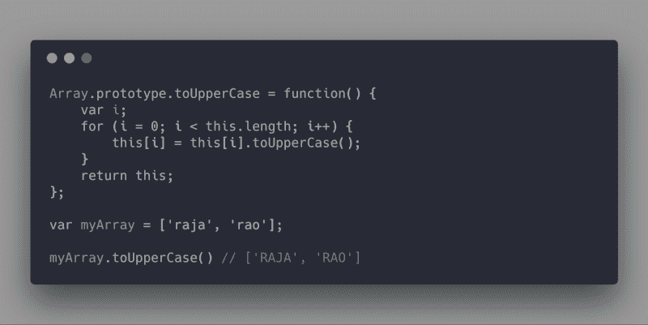

那么如何解决这个你可能不知道的域名冲突呢？这就是`Symbols`的用武之地。它们在内部创建唯一的值，允许您创建 add 属性，而不用担心名称冲突。

#### 原因# 3——通过“众所周知”的符号启用核心方法挂钩

假设你想要一些核心函数，比如说`String.prototype.search`来调用你的自定义函数。即`‘somestring’.search(myObject);`要调用`myObject’s`搜索函数，并把 `‘somestring’` 作为参数传递！我们如何做到这一点？

这就是 ES2015 提出一系列全球符号的地方，这些符号被称为“众所周知”的符号。只要**你的**对象拥有这些符号中的一个作为属性，你就可以重定向核心函数来调用你的函数！

我们现在不能谈论太多，所以我将在本文的稍后部分讨论所有细节。但首先，让我们了解一下符号实际上是如何工作的。

#### 创建符号

您可以通过调用名为`Symbol`的全局函数/对象来创建一个符号。该函数返回一个数据类型为`symbol`的值。

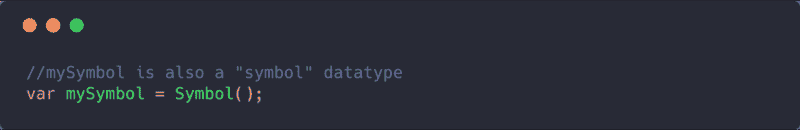

注意:符号可能看起来像对象，因为它们有方法，但它们没有——它们是原语。你可以认为它们是“特殊”的对象，与常规对象有一些相似之处，但它们的行为不像常规对象。

例如:符号和对象一样有方法，但是和对象不同，它们是不可变的和唯一的。

#### 符号不能由“新建”关键字创建

因为符号不是对象，`new`关键字应该返回一个对象，所以我们不能使用`new`返回一个`symbols` 数据类型。

```
var mySymbol = new Symbol(); //throws error
```

#### 符号有“描述”

符号可以有描述，这只是为了记录。

```
//mySymbol variable now holds a "symbol" unique value//its description is "some text"const mySymbol = Symbol('some text');
```

#### 符号是独特的

```
const mySymbol1 = Symbol('some text');const mySymbol2 = Symbol('some text');mySymbol1 == mySymbol2 // false
```

#### 如果我们使用“Symbol.for”方法，符号的行为就像一个单例

你可以通过 `Symbol.for(<ke` y >创建一个`symbol`，而不是通过`Symbol()`创建一个`symbol`。这需要一个“键”(字符串)来创建一个符号。如果一个键上有 `th`的符号已经存在，它就简单地返回旧的符号！因此，如果我们使用`e the Symb` ol.for 方法，它的行为就像一个单例。

```
var mySymbol1 = Symbol.for('some key'); //creates a new symbolvar mySymbol2 = Symbol.for('some key'); // **returns the same symbolmySymbol1 == mySymbol2 //true 
```

使用`.for`的真正原因是在一个地方创建一个符号，并从其他地方访问同一个符号。

**注意:** `Symbol.for`将使符号不唯一，因为如果**键**相同，您将最终覆盖这些值！所以如果可能的话尽量避免这种情况！

#### 符号的“描述”与“关键”

只是为了让事情更清楚，如果不使用`Symbol.for`，那么符号就是唯一的。但是，如果你使用它，那么如果你的`key` 不唯一，那么返回的符号也将是不唯一的。

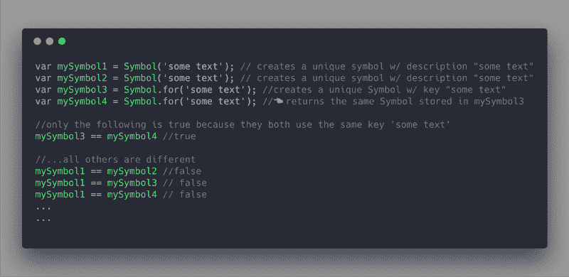

#### 符号可以是对象特性键

这是符号的一个非常独特的地方，也是最令人困惑的地方。虽然它们看起来像一个物体，但它们是基本体。我们可以像字符串一样将符号作为属性键附加到对象上。

事实上，这是使用符号的主要方式之一——作为对象属性！

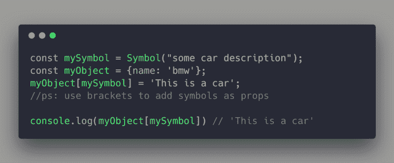

**注意:**作为符号的对象属性被称为“键控属性”。

#### 方括号运算符与点运算符

不能使用点运算符，因为点运算符只作用于字符串属性，所以应该使用方括号运算符。

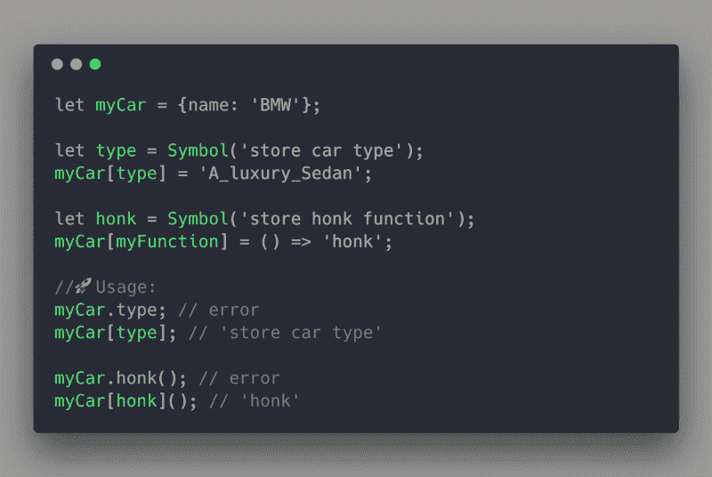

### 使用符号的 3 个主要原因——综述

现在我们知道了符号是如何工作的，让我们再来看看这三个主要原因。

#### **原因#1 —符号对于循环和其他方法是不可见的**

下例中的 for-in 循环遍历对象`obj`，但它不知道(或忽略)`prop3`和`prop4`，因为它们是符号。

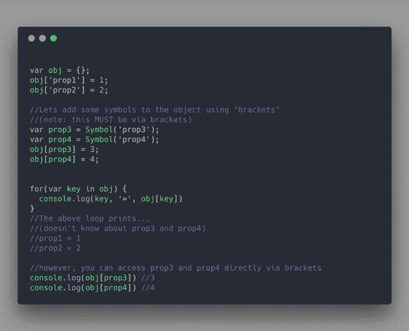

下面是另一个例子，其中`Object.keys`和`Object.getOwnPropertyNames`忽略了符号属性名。

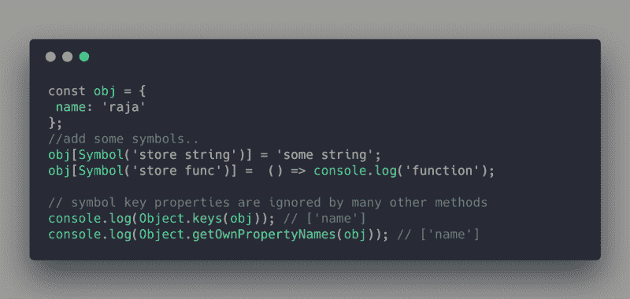

#### **原因#2 —符号是唯一的**

假设您希望在全局`Array`对象上有一个名为`Array.prototype.includes`的特性。它将与 JavaScript (ES2018)自带的默认`includes`方法相冲突。怎么加才不会碰撞？

首先，创建一个名为`includes`的变量，并给它分配一个符号。然后使用括号符号将这个变量(现在是一个符号)添加到全局变量`Array`中。分配任何你想要的功能。

最后使用括号符号调用该函数。但是请注意，您必须传递括号中的实际符号，如:`arr[includes]()`，而不是作为字符串。

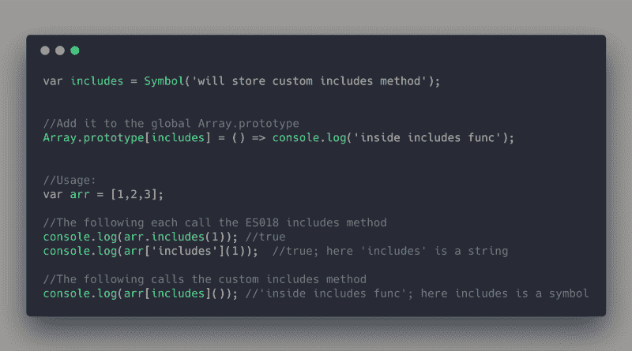

#### 原因三。众所周知的符号(即“全球”符号)

默认情况下，JavaScript 会自动创建一组符号变量，并将它们分配给全局`Symbol`对象(是的，与我们用来创建符号的`Symbol()`相同)。

在 ECMAScript 2015 中，这些符号随后被添加到数组、字符串等核心对象的`String.prototype.search`和`String.prototype.replace`等核心方法中。

这些符号的一些例子是:`Symbol.match`、`Symbol.replace`、`Symbol.search`、`Symbol.iterator`和`Symbol.split`。

由于这些全局符号是全局的和公开的，我们可以让核心方法调用我们的自定义函数，而不是内部函数。

#### `*Symbol.search*`一个例子

例如，String 对象的`String.prototype.search`公共方法搜索 regExp 或字符串，如果找到就返回索引。


在 ES2015 中，它首先检查查询 regExp (RegExp 对象)中是否实现了`Symbol.search`方法。如果是这样，那么它调用该函数并将工作委托给它。像 RegExp 这样的核心对象实现了真正起作用的符号`Symbol.search`。

#### Symbol.search 的内部工作方式(默认行为)

1.  解析`‘rajarao’.search(‘rao’);`
2.  将“rajarao”转换为字符串对象`new String(“rajarao”)`
3.  将“rao”转换成 RegExp 对象`new Regexp(“rao”)`
4.  调用“rajarao”字符串对象的`search`方法。
5.  `search`方法在内部调用“rao”对象上的`Symbol.search`方法(将搜索委托回“rao”对象)并传递“rajarao”。大概是这样:`"rao"[Symbol.search]("rajarao")`
6.  `"rao"[Symbol.search]("rajarao")`将索引结果作为`4`返回给`search`函数，最后，`search`将`4`返回给我们的代码。

下面的伪代码片段显示了代码的内部工作方式:

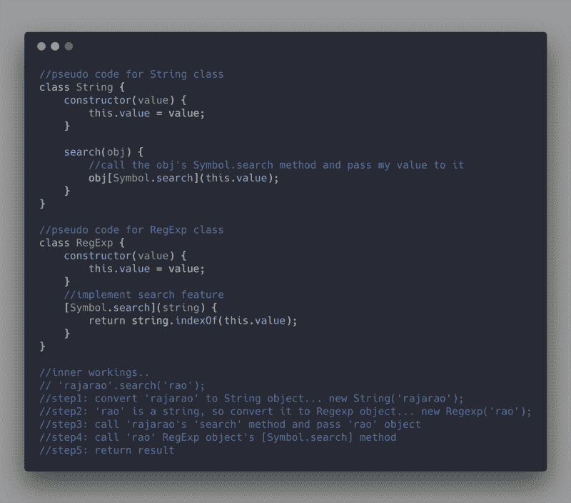

但美妙之处在于，您不再需要传递 RegExp。您可以传递任何实现`Symbol.search`的自定义对象，并返回您想要的任何内容，这将继续工作。

让我们来看看。

#### 定制 String.search 方法来调用我们的函数

下面的例子展示了我们如何让`String.prototype.search`调用我们的`Product`类的搜索函数——感谢`Symbol.search`全局`Symbol`。

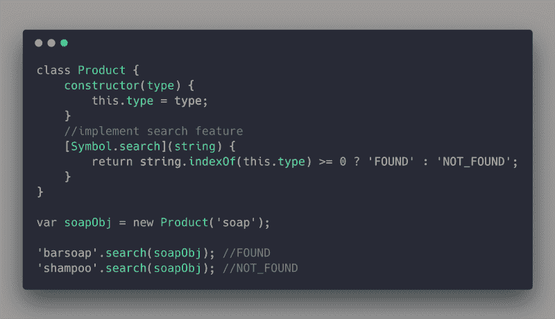

#### Symbol.search 的内部工作方式(自定义行为)

1.  解析`‘barsoap’.search(soapObj);`
2.  将“barsoap”转换成字符串对象`new String(“barsoap”)`
3.  由于`soapObj`已经是一个对象，所以不要做任何转换
4.  调用“barsoap”字符串对象的`search`方法。
5.  `search`方法在“`soapObj`”对象上内部调用`Symbol.search`方法(也就是说，它将搜索委托回“`soapObj`”对象)并传递“barsoap”。大概是这样:`soapObj[Symbol.search]("barsoap")`
6.  `soapObj[Symbol.search]("barsoap")`将索引结果作为`FOUND`返回给`search`函数，最后，`search`将`FOUND`返回给我们的代码。

希望你现在已经很好地掌握了符号。

好，让我们继续讨论迭代器。


### 迭代器和可迭代对象

#### 为什么？

在我们几乎所有的应用程序中，我们不断地处理数据列表，我们需要在浏览器或移动应用程序中显示这些数据。通常，我们编写自己的方法来存储和提取数据。

但问题是，我们已经有了标准方法，如`for-of`循环和扩展操作符(`…`)来从标准对象(如数组、字符串和地图)中提取数据集合。为什么我们不能对我们的对象也使用这些标准方法呢？

在下面的例子中，我们不能使用 for-of 循环或 spread 操作符从我们的`Users`类中提取数据。我们必须使用自定义的`get`方法。

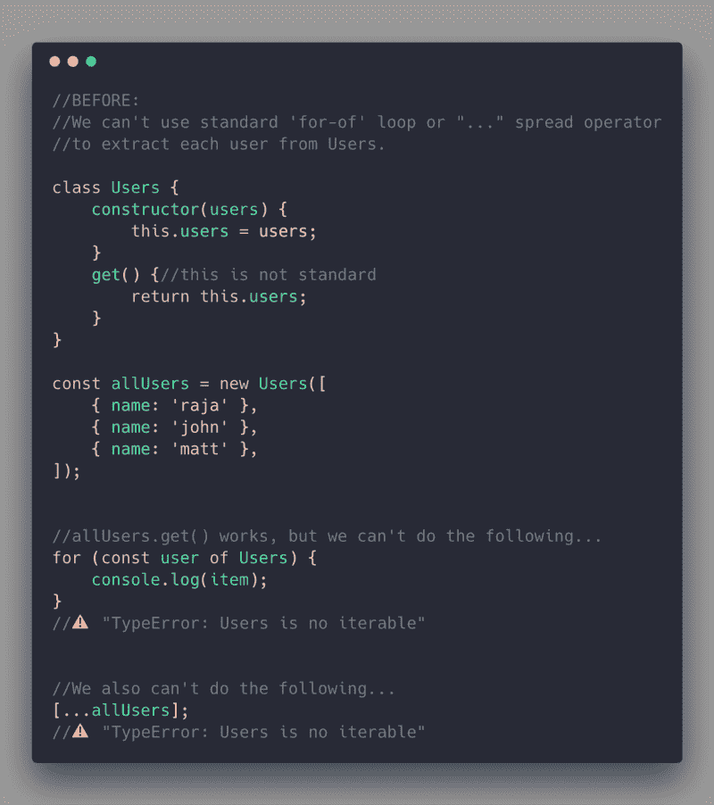

但是，能够在我们自己的对象中使用这些现有的方法不是很好吗？为了实现这一点，我们需要有所有开发人员都可以遵循的规则，并使他们的对象与现有方法一起工作。

如果它们遵循这些规则从它们的对象中提取数据，那么这样的对象被称为“可迭代的”。

规则是:

1.  主对象/类应该存储一些数据。
2.  主对象/类必须有全局“众所周知”的符号`symbol.iterator`作为它的属性，按照规则#3 到#6 实现特定的方法。
3.  这个`symbol.iterator`方法必须返回另一个对象——一个“迭代器”对象。
4.  这个“迭代器”对象必须有一个名为`next`的方法。
5.  `next`方法应该能够访问存储在规则#1 中的数据。
6.  如果我们调用`iteratorObj.next()`，它应该从规则#1 返回一些存储的数据，如果它想返回更多的值，则以`{value:<stored data>, **done:**` false}格式返回，如果它不想返回更多的数据，则以`or as {**done**:` true}格式返回。

如果遵循了所有这 6 条规则，那么主对象被称为规则#1 中的“ **iterable** ”。它返回的对象被称为“**迭代器**”。

让我们看看如何使我们的`Users`对象和 iterable:

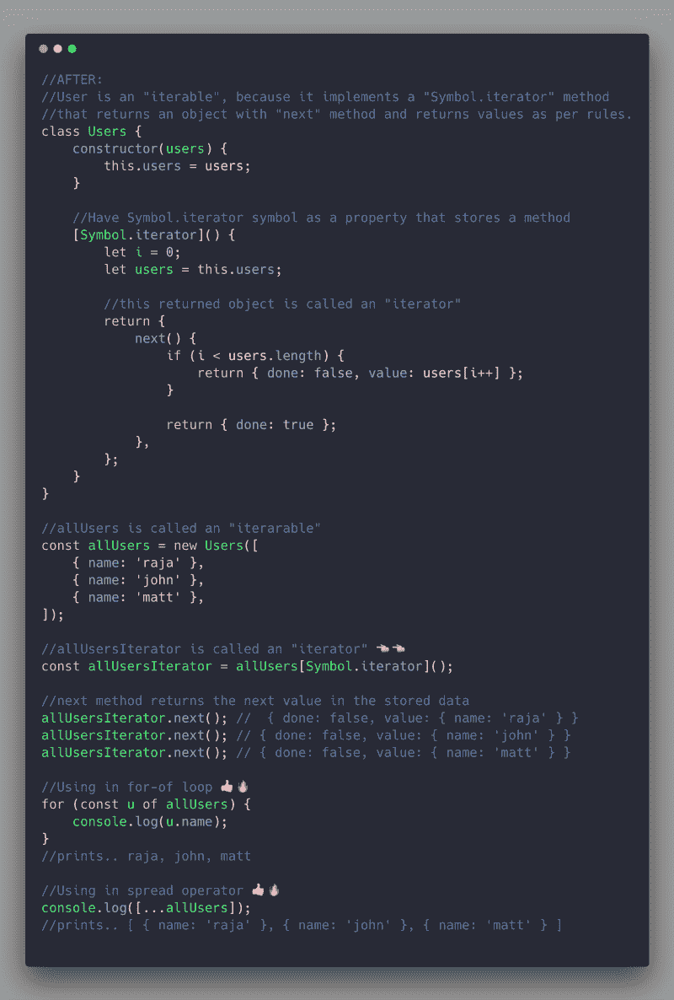

Please click to zoom

**重要提示**:如果我们传递一个`iterable` ( `allUsers` ) `for-of` 循环或者扩展操作符，在内部他们调用`<iterable>[Symbol.itera` tor】()得到迭代器`(like allUsersIt`操作符)然后使用迭代器提取数据。

所以在某种程度上，所有这些规则都有一个标准的方法来返回一个`iterator`对象。


### 发电机功能

#### **为什么？**

有两个主要原因:

1.  为可迭代对象提供更高层次的抽象
2.  提供更新的控制流来帮助处理类似“回调地狱”的事情。

下面就让我们来详细了解一下。

#### 原因 1——可重复项的包装器

我们可以简单地创建一个称为“生成器”的方法来简化事情，而不是通过遵循所有这些规则来使我们的类/对象成为一个`iterable`。

以下是关于发电机的一些要点:

1.  生成器方法在类中有一个新的`*<myGenerat`或>语法，生成器函数有 s `yntax function * myGenerat`或(){}。
2.  调用生成器`myGenerator()`会返回一个`generator`对象，该对象也实现了`iterator`协议(规则)，因此我们可以使用它作为一个现成的`iterator`返回值。
3.  生成器使用特殊的`yield`语句返回数据。
4.  `yield`语句跟踪先前的调用，并简单地从停止的地方继续。
5.  如果你在一个循环中使用`yield`，那么每次我们调用迭代器上的`next()`方法时，它只会执行一次。

#### **例 1:**

下面的代码向您展示了如何使用一个生成器方法(`*getIterator()`)而不是使用`Symbol.iterator`方法并实现遵循所有规则的`next`方法。

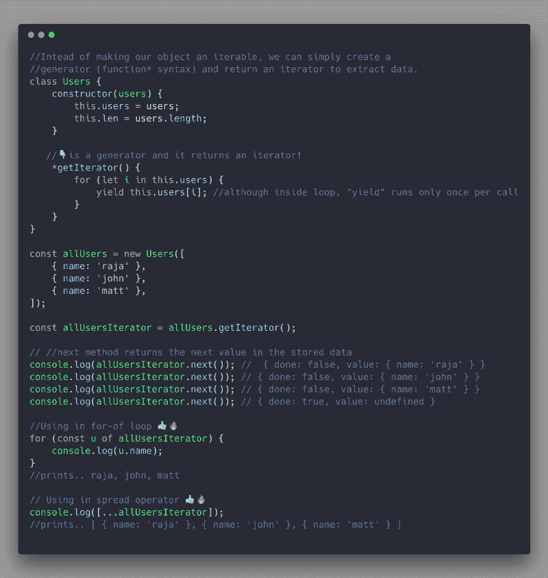

Using generators inside a Class

#### **例 2:**

你可以进一步简化它。使一个函数成为一个生成器(使用*语法)，并使用`yield`一次返回一个值，如下所示。

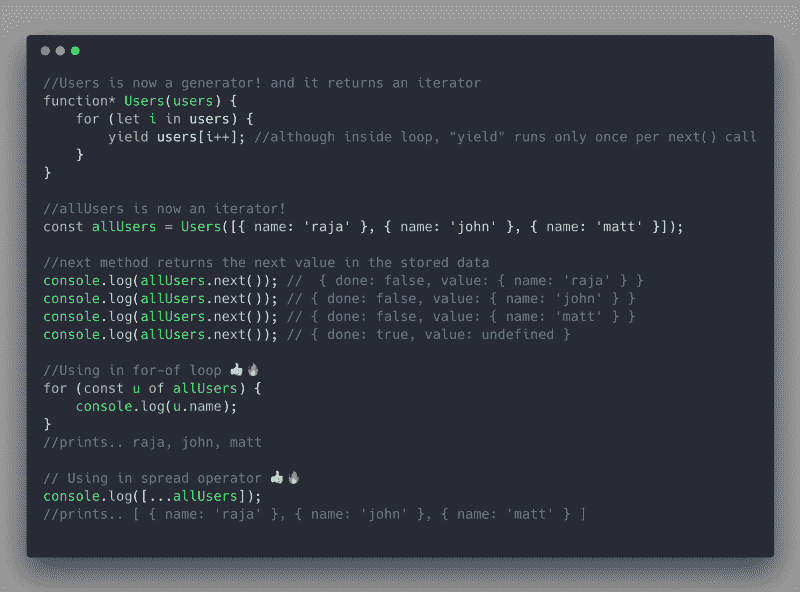

Using Generators directly as functions

**重要提示**:虽然在上面的例子中，我用“迭代器”这个词来表示`allUsers`，但它实际上是一个`generator`对象。

除了`next`方法之外，生成器对象还有类似`throw`和`return`的方法！但出于实用目的，我们可以将返回的对象仅用作“迭代器”。

#### 原因 2——提供更好、更新的控制流

帮助提供新的控制流，帮助我们以新的方式编写程序，并解决诸如“回调地狱”之类的问题。

请注意，与普通函数不同，生成器函数可以`yield`(存储函数的`state`和`return`值)，并且还可以在它产生的地方获取额外的输入值。

下图，它每次看到`yield`，都能返回值。您可以使用`generator.next(“some new value”)`并在它产生的地方传递新值。

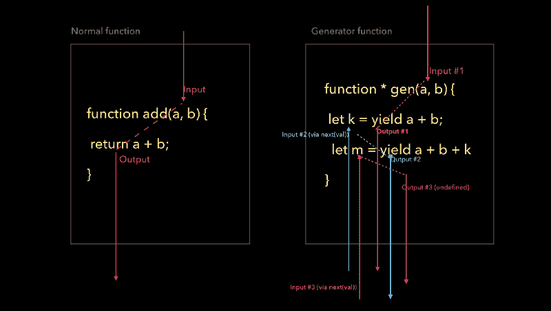

Normal function vs Generator function

下面的例子更具体地说明了控制流是如何工作的:

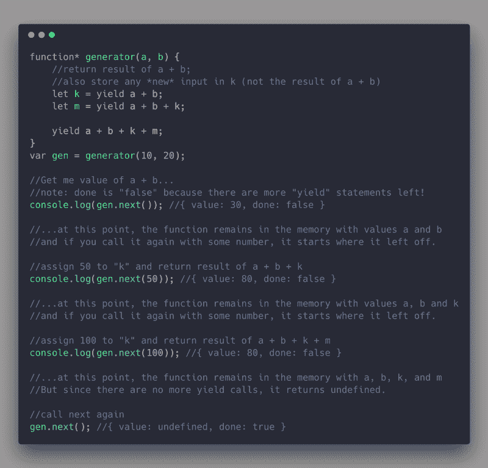

Generator control flow

### 生成器语法和用法

发生器功能可通过以下方式使用:

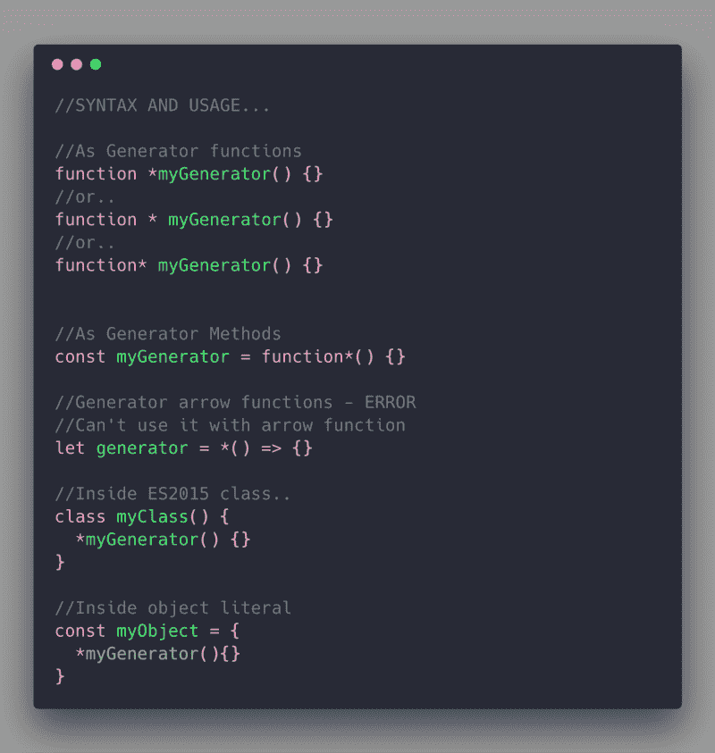

#### **我们可以在“yield”之后有更多的代码(不同于“return”语句)**

就像`return`关键字一样，`yield`关键字也返回值——但是它允许我们在让步后拥有代码！

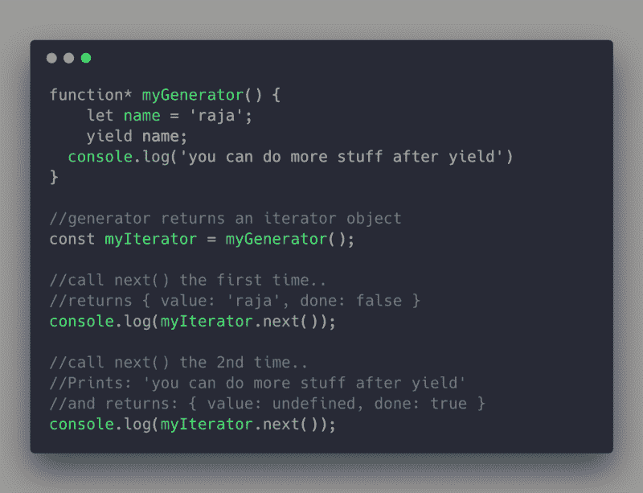

#### 你可以有多重收益

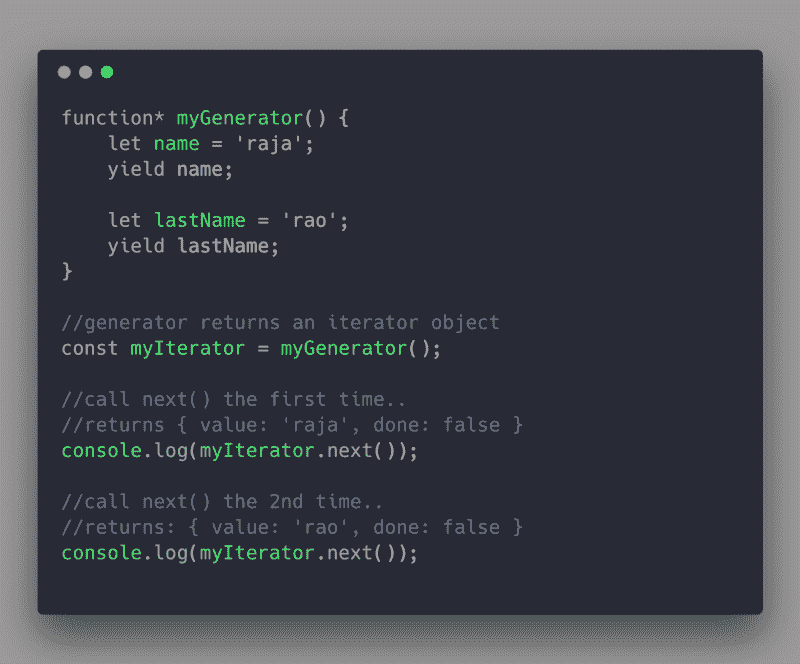

you can have multiple yield statements

#### 通过“next”方法向生成器来回发送值

迭代器`next`方法也可以将值传递回生成器，如下所示。

事实上，这个特性使生成器能够消除“回调地狱”。稍后你会学到更多。

这个特性也在像 [redux-saga](https://redux-saga.js.org/) 这样的库中大量使用。

在下面的例子中，我们用一个空的`next()`调用来调用迭代器以获得问题。然后，当我们第二次调用`next(23)`时，我们将`23`作为值传递。

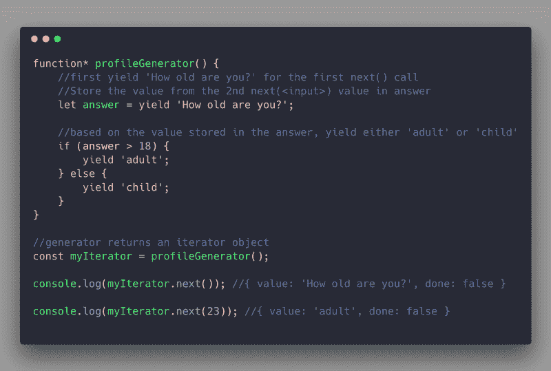

Passing value back to the generator from outside via “next”

#### 生成器有助于消除“回调地狱”

你知道，如果我们有多个异步调用，我们就会进入[回调地狱](http://callbackhell.com/)。

下面的例子展示了像“ [co](https://github.com/tj/co) 这样的库是如何使用生成器特性的，这个特性允许我们通过`next`方法传递一个值来帮助我们同步地编写异步代码。

注意在步骤#5 和步骤#10 中，`co`函数如何通过`next(result)`将承诺的结果传递回生成器。

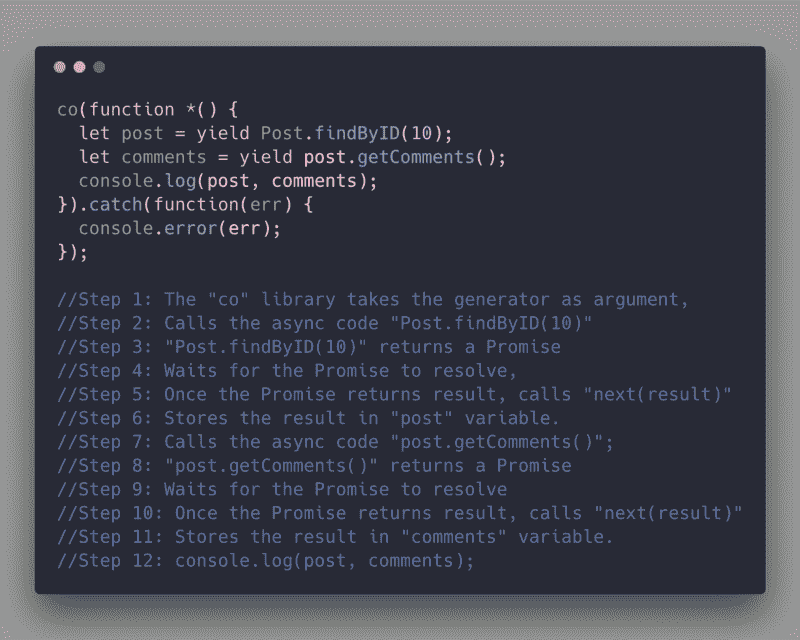

Step-by-Step explanation of libs like “co” that use “next(<someval>)”

好了，让我们继续讨论异步/等待。


### 异步/等待

#### **为什么？**

正如您之前看到的，生成器可以帮助消除“回调地狱”，但是您需要一些像`co`这样的第三方库来实现这一点。但是“回调地狱”是一个如此大的问题，ECMAScript 委员会决定为 Generator 的这一方面创建一个包装器，并推出了新的关键字`async/await`。

生成器和 Async/Await 之间的区别在于:

1.  async/await 使用`await`而不是`yield`。
2.  只有承诺才能奏效。
3.  它不使用`function*`，而是使用`async function`关键字。

所以`async/await`本质上是生成器的一个子集，有一个新的语法糖。

关键字`async`告诉 JavaScript 编译器对函数进行不同的处理。每当编译器到达该函数中的关键字`await`时就会暂停。它假设`await`后的表达式返回一个承诺，并等到承诺被解决或拒绝后再继续。

在下面的例子中，`getAmount`函数正在调用两个异步函数`getUser`和`getBankBalance`。我们可以在一个承诺中做到这一点，但是使用`async await`更加优雅和简单。


### 异步迭代器

#### **为什么？**

这是一个非常常见的场景，我们需要在一个循环中调用异步函数。因此，在 ES2018(已完成的提案)中，TC39 委员会提出了一个新的符号`Symbol.asyncIterator`和一个新的构造`for-await-of`，以帮助我们轻松地循环异步函数。

常规迭代器对象和异步迭代器的主要区别如下:

#### **迭代器对象**

1.  迭代器对象的`next()`方法返回值类似于`{value: ‘some val’, done: false}`
2.  用法: `iterator.next() //{value: ‘some val’, done: false}`

#### **异步迭代器对象**

1.  异步迭代器对象的 next()方法**返回一个承诺**，这个承诺后来被解析成类似于`{value: ‘some val’, done: false}`的东西
2.  用法:`iterator.next().then(({ value, done })=> {//{value: ‘some val’, done: fals` e}}

下面的例子展示了`for-await-of`是如何工作的，以及如何使用它。

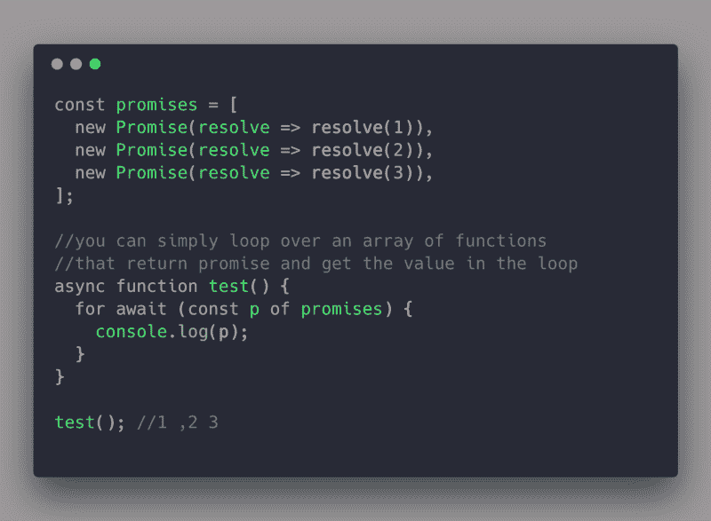

for-await-of (ES2018)

### 摘要

**符号** —提供全球唯一的数据类型。你主要使用它们作为对象属性来添加新的行为，这样你就不会破坏像`Object.keys`和`for-in`循环这样的标准方法。

**众所周知的符号**——是 JavaScript 自动生成的符号，可用于在我们的自定义对象中实现核心方法

**Iterables** —是任何存储数据集合并遵循特定规则的对象，以便我们可以使用标准的`for-of`循环和`...` spread 操作符从其中提取数据。

**迭代器**——由 Iterables 返回并具有`next`方法——它实际上从`iterable`中提取数据。

**生成器**——为可迭代对象提供更高层次的抽象。它们还提供了新的控制流，可以解决类似回调地狱这样的问题，并为类似`Async/Await`这样的事情提供构建模块。

**Async/Await** —为生成器提供更高层次的抽象，以便专门解决回调地狱问题。

**异步迭代器** —一个全新的 2018 特性，有助于在异步函数数组上循环，以获得每个异步函数的结果，就像在普通循环中一样。

差不多就是这样！

### 进一步阅读

#### ECMAScript 2015+

1.  [以下是 ECMAScript 2016、2017 和 2018](https://medium.freecodecamp.org/here-are-examples-of-everything-new-in-ecmascript-2016-2017-and-2018-d52fa3b5a70e) 中所有新内容的示例
2.  [查看这些有用的 ECMAScript 2015 (ES6)提示和技巧](https://medium.freecodecamp.org/check-out-these-useful-ecmascript-2015-es6-tips-and-tricks-6db105590377)
3.  [ES6 中修复的 5 个 JavaScript“坏”部分](https://medium.com/@rajaraodv/5-javascript-bad-parts-that-are-fixed-in-es6-c7c45d44fd81#.7e2s6cghy)
4.  [ES6 中的“类”是新的“坏”的部分吗？](https://medium.com/@rajaraodv/is-class-in-es6-the-new-bad-part-6c4e6fe1ee65#.4hqgpj2uv)

我的其他帖子可以在这里找到。

### 如果这有用，请点击拍手？下面扣几下，以示支持！⬇⬇⬇