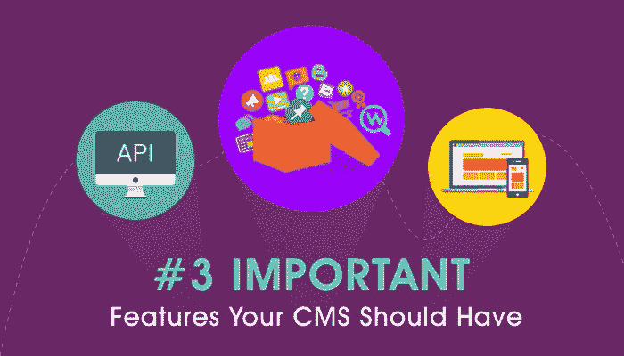

# 如何根据这些重要特征选择合适的 CMS

> 原文：<https://www.freecodecamp.org/news/important-features-your-cms-should-have-d4664455558e/>

作者:瑞秋·雷

# **如何根据这些重要特征选择合适的 CMS**

内容管理系统(CMS)是一个基于 web 的应用程序。具有不同访问级别的多个用户可以操作数据，以及修改网站/项目或互联网应用程序的内容。

Important features your CMS should have

如果你正在 [**开发一个新网站**](https://www.goodfirms.co/directory/cms/top-website-development-companies) ，内容管理系统是你最好的选择，因为你将完全控制你的内容和产品销售。最大的好处是你可以在一个屋檐下管理你的整个互联网营销策略。

CMS 允许您管理和分配不同级别的用户权限。选择 CMS 时，您需要记住两件事:

*   找出你的利益相关者
*   优先考虑他们的需求。

现在，决定一个 [**CMS 平台**](https://en.wikipedia.org/wiki/Content_management_system) 类似于购买一部新的智能手机。

想知道怎么做？

让我解释一下。

### 为您和您的团队选择合适的 CMS

当你坐下来买一部新的智能手机时，可供选择的数量之多会让你大吃一惊。CMS 也是如此。可供选择的平台数量惊人。

一方面，有像 WordPress、Joomla 和 Drupal 这样的流行和知名的平台。另一方面，大约有 1000–2000 种开源网络内容管理系统可供选择。

每个 CMS 都有自己的一套功能。有些平台可能提供您需要的所有必备功能，而其他平台可能提供无与伦比的直观体验。因此，对于哪些特性是至关重要的，这变得令人困惑，因为有许多基本特性是所有 CMS 平台所共有的。

这里有一些你在选择 CMS 平台时应该考虑的基本特性。它们在所有平台上都很常见:

*   平台应该是稳固和方便的
*   它应该有一个简单的导航
*   平台应该是灵活的
*   站点维护成本应该不会很高
*   该平台应该有一个简化的创作过程

除了这些基本特性，还有三个非常重要的特性是你的 CMS 应该具备的。让我们更详细地看看它们:

#### **1)开放的 API**

说到 CMS，API 是最常用的术语。从马克·扎克伯格到隔壁的开发者，每个人都在谈论 API。是什么让 API 成为如此重要的特性？

应用程序编程接口(API)是一种中间软件，它促进两个系统之间的数据交换，以便它们可以轻松地交互和共享数据。

带有开放 API 的 CMS 允许您创建一个网站，并构建与其内容管理工具分离的应用程序，并通过 API 进行集成。这为您提供了使用您选择的前端工具的好处。此外，您将能够轻松地将定制的 CMS 与其他外部和内部系统集成在一起。这在商业上是可行的，也节省了大量时间。

#### **2)开箱即用插件**

插件允许你毫不费力地定制你的网站的属性。

它们有助于增强网站的可扩展性和功能性。

寻找一个内置搜索引擎优化工具的 CMS 平台。有了这些，你可以为读者和搜索引擎优化页面。拥有 SEO 插件将有助于你添加页面标题，放入元数据描述，也将有助于遵守可访问性准则。这也有助于防止重复内容。

此外，在决定平台时，确保你选择的平台提供社交媒体工具和在线营销工具。这将使您可以轻松地将社交媒体共享按钮添加到您的任何内容片段或页面。

插件还允许您集成 ERP(企业资源规划器)和 CRM(客户关系管理)系统。确保你选择的平台有这样的插件。

WordPress 作为一个 CMS 平台提供了许多插件。此外，它是最受欢迎的平台，市场上对 WordPress 网站开发有巨大的需求。为了获得满足你的网络开发需求的最佳服务，你可以雇佣顶级 WordPress 开发公司**。**

#### ****3)设计独立性****

**最后，你选择的平台应该足够开放，允许修改设计和布局。定制的设计会对用户产生巨大的影响，从而让他们在页面上停留更长时间。该平台还应该提供定制界面的灵活性，以便您可以为管理内容提供最佳体验。平台不应该把模板强加给你。相反，它应该足够灵活，允许定制。**

**CMS 平台应该为您提供更改模板的权限，这样您就可以让您的内容脱颖而出。它还可以让你在你的页面上突出你想突出的某些方面。**

**CMS 应该给你自由调整和重新构建一些方面，使其符合你的需要和要求。**

**此外，个性化的设计会鼓励客户浏览你的内容并停留在页面上，而不是快速浏览。**

### ****总而言之****

**既然你已经知道了哪些特性值得期待，你就可以选择你想要的 CMS 平台，去掉其他的。**

**毕竟，一个好的内容管理系统是一个平台，它能够整合您的所有业务需求和要求，并尽可能减少限制。**

**无论是微数据需求还是易于使用的模板，您的 CMS 都应该具备上述重要功能，以便您的企业能够向所有客户提供无缝的数字体验。**