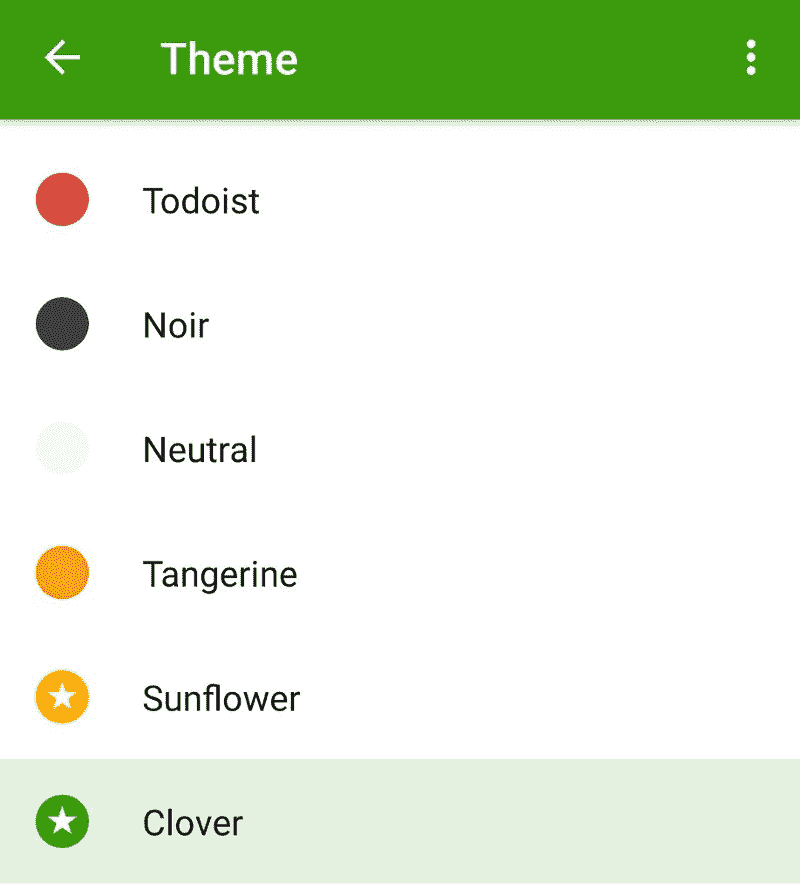
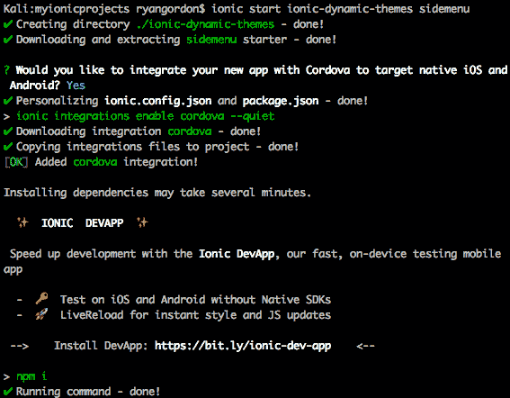
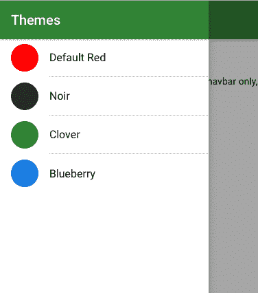
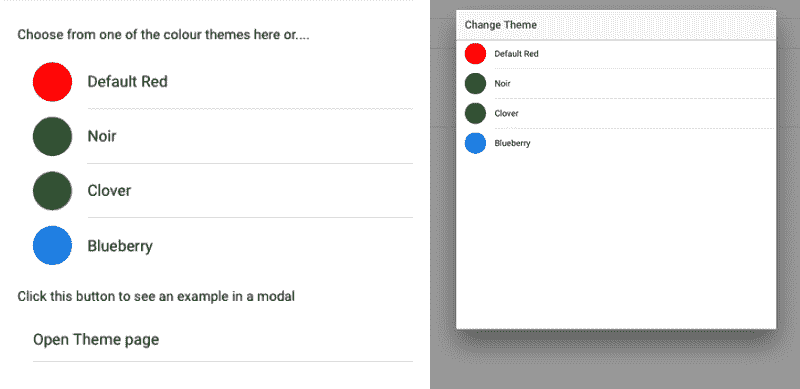
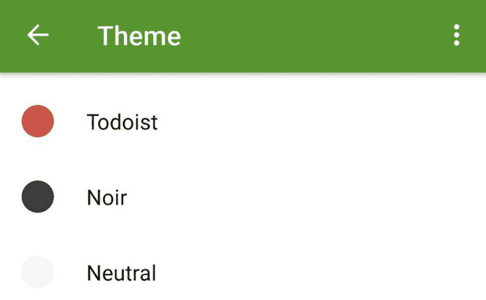

# 如何动态主题化你的 Ionic 应用并让你的用户满意

> 原文：<https://www.freecodecamp.org/news/how-to-dynamically-theme-your-ionic-application-and-make-your-users-happy-ffa17e15dbf7/>

瑞安·戈登

# 如何动态主题化你的 Ionic 应用并让你的用户满意

为你的移动应用程序设计一个时尚的配色方案是非常耗时的。为什么不让用户选择自己喜欢的主题呢？

这是我最喜欢的应用功能之一。对于那些不想被一种主色方案束缚，或者想个性化主题以适应自己风格的用户来说，它提供了一个很好的体验。



A great example of dynamic themes in the ToDoist app

在这篇文章中，我们将完成一个项目，这个项目有许多主题，用户可以像上面一样在运行时选择。当用户选择一个主题时，理想情况下，这种变化应该实时发生，而不是要求用户重新打开应用程序。

### 安装和入门

如果你以前没有用过 Ionic，它是一个移动应用框架，可以让你用 HTML、CSS 和 Typescript 编写移动应用。有了一个共享的代码库，你可以开发一个 iOS 或 Android 应用程序，也可以将其部署为一个 web 应用程序。

要安装 Ionic，请打开终端并输入:

`npm install -g ionic@latest`

> 注意:您必须已经安装了[节点 JS 和 npm](https://nodejs.org/en/download/) 。如果你得到一个错误代码“EACCES”，那么你可能需要 sudo 或者 admin 权限。

对于本教程，sidemenu 模板提供了一个很好的起点。要使用此模板生成项目，请在终端中输入以下命令:

`ionic start <name of your app> si` demenu



Example terminal output from the CLI

项目生成后，使用以下命令进入目录:

`cd <name of your a` pp >

现在你已经有了一个带有侧菜单和两个页面的 Ionic 项目了！要查看您的作品，请在您的终端中输入`ionic serve`。

#### 设置前两个主题:红色与黑色

为了设置前两个主题，我们需要完成一些步骤。几乎所有这些步骤都需要遵循，以便让主题工作。

首先，我们需要表示一个 SCSS 文件，它将在应用主题时使用。在项目的`src/theme`目录中，您会发现一个`variables.scss`。相应的主题文件也位于这里。创建一个名为的新文件:

```
red.theme.scss
```

这个文件将用于应用第一个主题。从这个文件中，任何默认的离子样式都可以被覆盖。对于如何应用主题，有两种选择:

选项 1:只设计导航条和某些元素的样式

选项 2:将主题应用于所有背景内容

下面是两个选项都适用的示例。代码中途有一个检查点。如果您不想设计整个应用程序的样式，请注释掉它下面的其余代码:

这是创建的第一个 SCSS 文件！接下来将是黑暗模式。创建另一个名为的新文件:

```
noir.theme.scss
```

这个文件将用于应用第二个主题。我们不需要为第二个主题做太多改变，只需要将 hexcode 值改为一种颜色，比如`#33333`。

不过，需要注意的是，**我们需要将 SCSS 的** **从`theme-red`重命名为这个主题特有的**。我就叫我的`theme-noir`。

下一步是将 SCSS 文件导入应用程序本身。这很重要，否则主题不会加载到应用程序中。转到位于`src/app/app.scss`的`app.scss`文件，您可以像这样导入主题:

```
@import '../theme/red.theme';@import '../theme/noir.theme';
```

现在我们已经创建并导入了主题文件到项目中，SCSS 这边的事情已经处理好了！现在来看看打字稿和 HTML。

### 以编程方式更改主题

更改主题本身只需要简单设置的三个步骤:

*   应用程序的包装
*   在运行时改变主题的功能
*   保存当前主题状态的东西

#### AppState 类

AppState 类将是一个可注入的 Angular 组件，它保存当前的主题，也可以用来更新主题。

除了它有一个内部状态变量之外，它的工作原理没有什么特别的。当调用 Get 操作时，将返回状态的克隆。当 Set 发生时，状态的一个属性用一个新值更新，在这个例子中是主题。

AppState 将保存当前主题并允许修改，但是它需要被导入到您想要使用它的组件中。

当第一次使用 CLI 设置 Ionic app 时，您会在`app.component.ts`中找到以下代码:

```
// used for an example of ngFor and navigation
```

```
this.pages = [
```

```
{ title: 'Default Red Theme', component: HomePage },
```

```
{ title: 'List', component: ListPage }
```

```
];
```

显示的数组用于为侧菜单提供内容。这个侧菜单将作为我们在这个项目的主题切换器，而不是一个导航菜单。

更改 **this.pages** 中的值，以反映您希望用户看到的主题的名称(如将要应用的主题文件，以及任何其他资产，如图像文件)。

在这个例子中,“主题文件”将是我们想要使用的 CSS 类的名称。在应用程序运行时，我们已经导入了 SCSS 文件。因此，我们不是访问文件本身，而是访问文件中的根类。在红色主题的情况下，将应用“主题-黑色”类。

#### 显示可用的主题并应用包装

我们需要采取的最后一步是添加一个包装器 div。这将是`app.html`文件中的顶层元素。这个包装器将应用选择的主题，允许子元素接收样式更新。`app.html`中的一个例子如下:

```
<!-- Wrapper over the app which will use the theming-->
```

```
<div class="{{global.state['theme']}}">
```

```
 //in here you will have the rest of app.html 
```

```
</div>
```

就显示而言，如果您遵循上面的方法，将`this.pages`数组重命名为`this.themes`，这样它就可以保存您可用的主题，那么您不需要更改任何其他内容来显示！

侧菜单最初是用来推送应用程序中可用的页面，但现在它是一个很好的主题切换器。每个可用主题的名称都使用 NgFor 和一些与`this.themes`数组的数据绑定来显示。结果将是一个非常简单的列表，其中将有每个条目的主题名称。当一个条目被点击时，该主题将被应用。

在 [Github repo](https://github.com/Ryan-Gordon/ionic-dynamic-themes) 上，你可以找到一个更好的例子，每个条目旁边都有一个颜色指示器。



### 概述

好了，是时候快速回顾一下我们在这里做了什么。到目前为止，我们已经实现了以下变化，以使主题工作:

*   为每个想要的主题创建主题 SCSS 文件
*   将创建的主题文件导入位于`src/app/app.scss`的主 Sass 文件
*   设置一个 AppState 类来保存当前应用的主题
*   设置一个非常小的 changeTheme 函数，它将在 AppState 中设置一个新的主题
*   在将应用主题的`app.html`上添加了一个包装元素

要在这里创建更多的主题，复制一个你已经创建的主题文件，重命名，并在这个新文件中改变十六进制颜色值。你想做多少就做多少！只是要确保你也在`app.scss`中导入这个新的主题文件，就像你对第一个主题文件所做的那样，否则它不会工作。

通过这五个步骤，你可以在任何 Ionic 应用程序中进行动态主题化。这个解决方案的美妙之处在于它可以在所有平台上很好地工作，因为它没有使用本地插件——所有东西都是 HTML、CSS 和 TS 格式的。

作为奖励，在 [GitHub repo](https://github.com/Ryan-Gordon/ionic-dynamic-themes) 上，我实现了另外两种方式来呈现可用的主题。



Option 2 on the left and a model option on the right

### 结论:

动态主题使我们不用担心我们选择的颜色方案是否适合所有的观众。我们可以简单地实现所有的配色方案，让用户在运行时选择他们更喜欢的方案，而不是用不同的方案做大量的模型来评估。

这样做的一个潜在好处是，我们可以从用户那里收集关于哪个主题最适合他们的分析。在讨论的`changeTheme`函数中，可以发送一个 webhook 或一些事件来指定用户的选择。通过这种方式，开发者可以收集到真实的用户反馈，知道哪些主题有效，哪些无效。

本教程的所有源代码都可以在这个 [Github repo](https://github.com/Ryan-Gordon/ionic-dynamic-themes) 中找到。



One last look

请考虑在回购上留个星。我欢迎任何和所有的补充。