# 关于政策梯度的介绍

> 原文：<https://www.freecodecamp.org/news/an-introduction-to-policy-gradients-with-cartpole-and-doom-495b5ef2207f/>

托马斯·西蒙尼尼

# 关于政策梯度的介绍

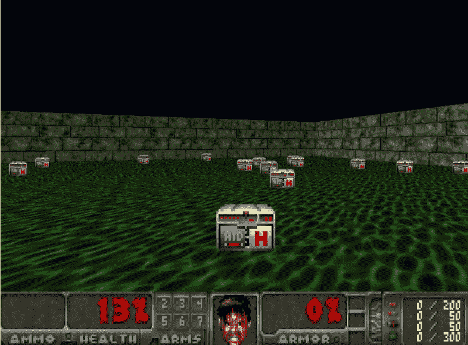

Our environment for this article

> 本文是 Tensorflow 深度强化学习课程的一部分？️.查看这里的教学大纲。

在最近两篇关于 [Q-learning](https://medium.freecodecamp.org/diving-deeper-into-reinforcement-learning-with-q-learning-c18d0db58efe) 和[深度 Q 学习](https://medium.freecodecamp.org/an-introduction-to-deep-q-learning-lets-play-doom-54d02d8017d8)的文章中，我们使用了基于值的强化学习算法。在给定的状态下，为了选择采取哪种行动，我们采取 Q 值最高的行动(我在每个状态下将获得的最大预期未来回报)。因此，在基于价值的学习中，政策的存在仅仅是因为这些行动价值的估计。

今天，我们将学习一种基于策略的强化学习技术，称为策略梯度。

我们将实现两个代理。第一个将学会保持平衡。

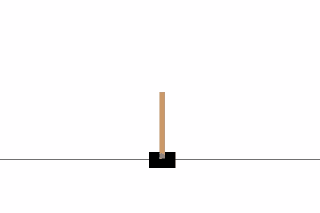

第二个将是一个通过收集生命值学会在厄运的敌对环境中生存的代理。


Our Policy Gradients Agent

在基于策略的方法中，我们不是学习告诉我们给定一个状态和一个动作的期望回报总和的值函数，而是直接学习将状态映射到动作的策略函数(选择动作而不使用值函数)。

它意味着我们直接尝试优化我们的策略函数π，而不用担心一个值函数。我们将直接参数化π(选择一个没有值函数的动作)。

当然，我们可以使用价值函数来优化策略参数。但是值函数将不会用于选择动作。

在本文中，您将了解到:

*   什么是政策梯度，它的优点和缺点
*   如何在 Tensorflow 中实现？

### 为什么使用基于策略的方法？

#### 两类政策

策略可以是确定性的，也可以是随机的。

确定性策略是将状态映射到动作的策略。你给它一个状态，函数返回一个要采取的动作。

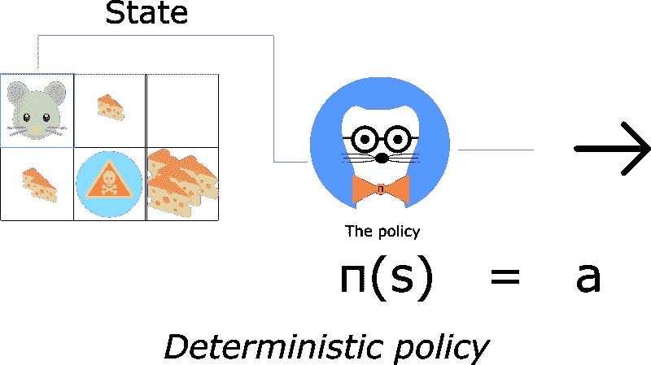

确定性策略用于确定性环境中。在这些环境中，采取的行动决定了结果。不存在不确定性。例如，当你下棋时，你把你的棋子从 A2 移动到 A3，你肯定你的棋子会移动到 A3。

另一方面，随机策略输出行动的概率分布。

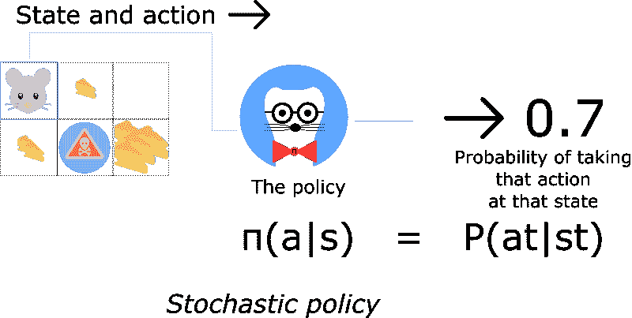

这意味着我们有可能采取不同的行动，而不是确定采取行动 *a* (例如向左)，在这种情况下，我们有 30%的可能性选择向南。

当环境不确定时，使用随机策略。我们称这个过程为部分可观测马尔可夫决策过程(POMDP)。

大多数情况下，我们将使用第二种策略。

#### 优势

> 但是深度 Q 学习真的很棒！为什么使用基于策略的强化学习方法？

使用策略梯度有三个主要优势。

#### 趋同；聚集

首先，基于策略的方法具有更好的收敛特性。

基于价值的方法的问题是，它们在训练时会有很大的波动。这是因为对于估计的动作值的任意小的变化，动作的选择可能显著地改变。

另一方面，有了政策梯度，我们只要跟着梯度走就能找到最佳参数。我们看到我们的政策在每一步都在顺利更新。

因为我们沿着梯度寻找最佳参数，所以我们保证收敛于局部最大值(最坏情况)或全局最大值(最好情况)。

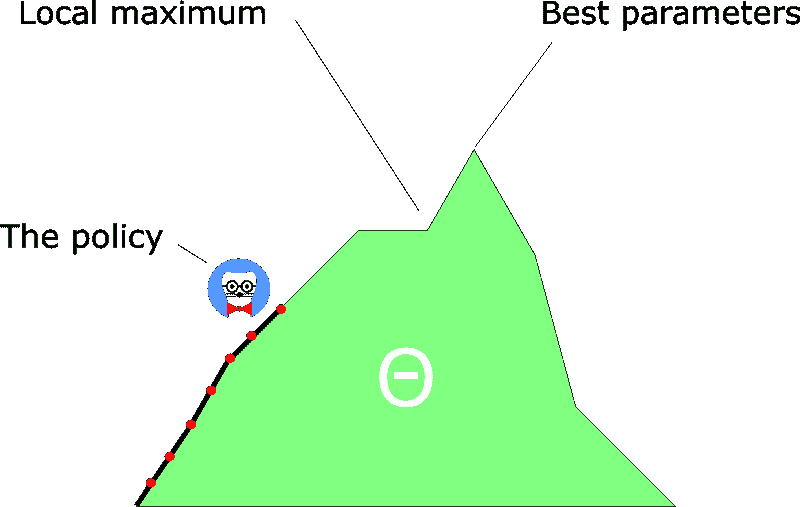

#### 政策梯度在高维行动空间中更有效

第二个优点是，策略梯度在高维操作空间中，或者在使用连续操作时更有效。

深度 Q 学习的问题在于，在给定当前状态的情况下，他们的预测会在每个时间步为每个可能的行为分配一个分数(最大预期未来回报)。

但是如果我们有无限的行动可能性呢？

例如，对于自动驾驶汽车，在每个状态下，你可以有(几乎)无限的行动选择(以 15、17.2、19.4、鸣喇叭……转动方向盘)。我们需要为每个可能的动作输出一个 Q 值！

另一方面，在基于策略的方法中，您只是直接调整参数:由于这一点，您将开始理解最大值将是什么，而不是在每一步直接计算(估计)最大值。

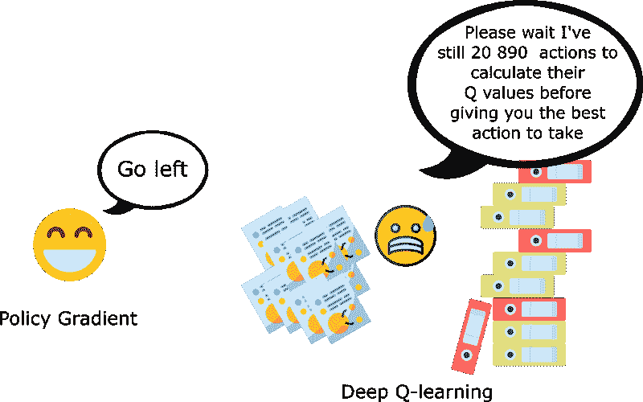

#### 政策梯度可以学习随机政策

第三个好处是政策梯度可以学习随机政策，而价值函数不能。这有两个后果。

其中之一是我们不需要实现勘探/开采的权衡。随机策略允许我们的代理探索状态空间，而不总是采取相同的行动。这是因为它输出了动作的概率分布。因此，它无需硬编码就能处理探索/开发的权衡。

我们也摆脱了感知混叠的问题。感知混淆是指我们有两个看起来(或实际上)相同的状态，但需要不同的动作。

我们举个例子。我们有一个智能吸尘器，它的目标是吸走灰尘，避免杀死仓鼠。

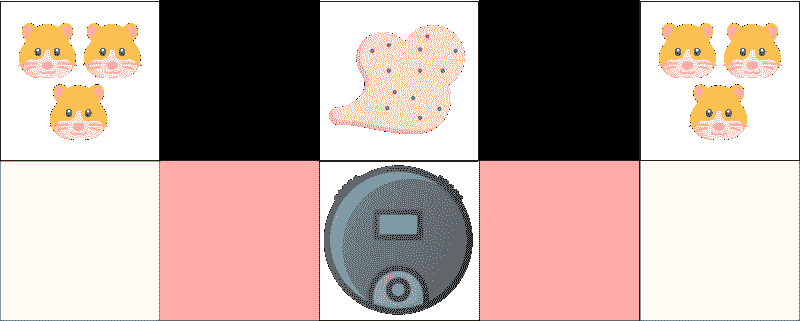

This example was inspired by the excellent course make by David Silver: [http://www0.cs.ucl.ac.uk/staff/d.silver/web/Teaching_files/pg.pdf](http://www0.cs.ucl.ac.uk/staff/d.silver/web/Teaching_files/pg.pdf)

我们的吸尘器只能感知墙壁的位置。

问题是:这两个红色的案例是有别名的状态，因为代理察觉到每两个案例的上下壁。

在确定性策略下，当处于红色状态时，策略要么向右移动，要么向左移动。无论哪种情况都会导致我们的特工卡住，永远吸不到灰尘。

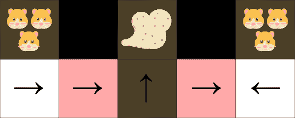

在基于值的 RL 算法下，我们学习准确定性策略(“ε贪婪策略”)。因此，我们的特工可能要花很长时间才能找到灰尘。

另一方面，最优随机策略在灰色状态下会随机向左或向右移动。结果，它将不会被卡住，并且将以高概率达到目标状态。

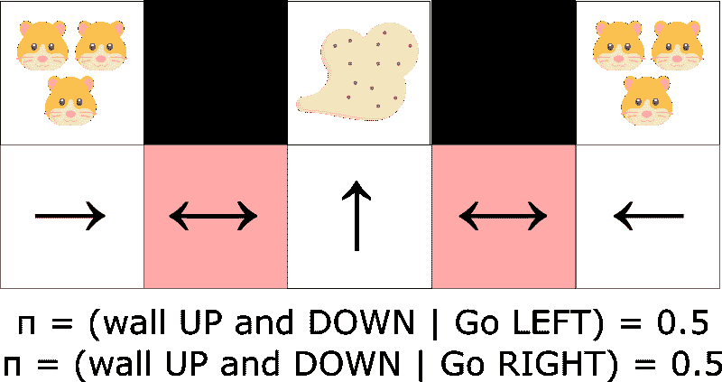

#### 不足之处

自然，政策梯度有一个很大的缺点。很多时候，它们收敛于局部最大值，而不是全局最优值。

与总是试图达到最大值的深度 Q 学习不同，政策梯度收敛得更慢，一步一步地。他们可能需要更长的时间来训练。

然而，我们会看到这个问题的解决方案。

### 策略搜索

我们的策略π有一个参数θ。这个π输出动作的概率分布。

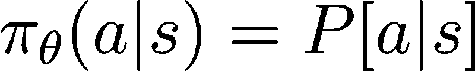

Probability of taking action a given state s with parameters theta.

厉害！但是我们怎么知道我们的政策好不好呢？

请记住，策略可以被视为一个优化问题。我们必须找到最佳参数(θ)来最大化一个得分函数 J(θ)。

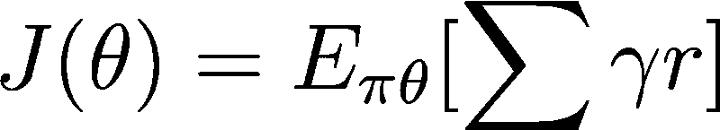

有两个步骤:

*   用策略得分函数 J(θ)衡量π(策略)的质量
*   使用策略梯度上升来找到改善π的最佳参数θ。

这里的主要思想是 J(θ)会告诉我们π有多好。政策梯度上升将帮助我们找到最佳政策参数，以最大限度地增加良好行动的样本。

#### 第一步:策略得分函数 J( **θ)**

为了衡量我们的政策有多好，我们使用一个称为目标函数(或政策得分函数)的函数来计算政策的预期回报。

三种方法同样适用于优化策略。选择只取决于环境和你的目标。

首先，在情节环境中，我们可以使用起始值。计算从第一个时间步(G1)返回的平均值。这是整集的累计打折奖励。

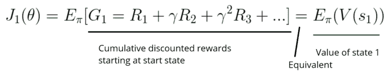

这个想法很简单。如果我总是从某个状态 s1 开始，从这个状态开始到结束，我会得到多少总回报？

我们希望找到最大化 G1 的政策，因为这将是最优政策。这是由于第一篇文章中解释的奖励假说[。](https://medium.freecodecamp.org/an-introduction-to-reinforcement-learning-4339519de419)

例如，在《突围》中，我玩了一个新游戏，但是在摧毁了 20 块砖块之后我丢了球(游戏结束)。新的剧集总是在同一个州开始。

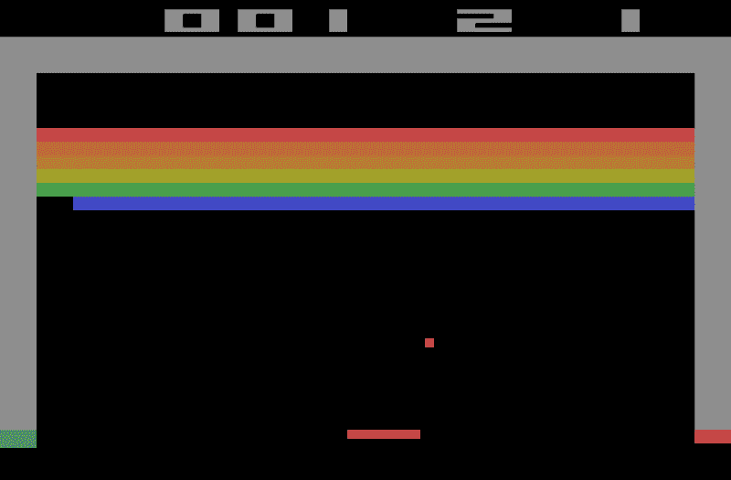

我用 J1(θ)计算分数。打 20 块砖不错，但是我想提高分数。为此，我需要通过调整参数来改善我的动作的概率分布。这发生在步骤 2 中。

在连续的环境中，我们可以使用平均值，因为我们不能依赖于特定的起始状态。

现在，每个状态值都由相关状态出现的概率进行加权(因为有些比其他发生得多)。

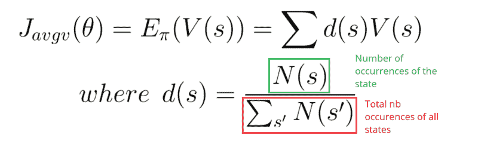

第三，我们可以使用每个时间步的平均回报。这里的想法是，我们希望在每个时间步得到最大的回报。

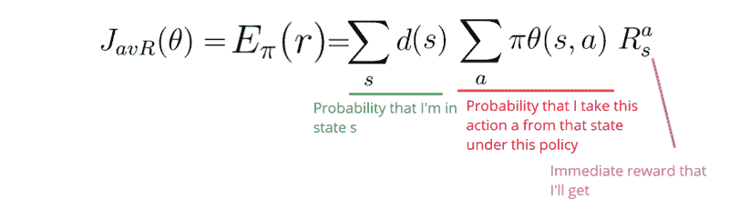

#### 第二步:政策梯度上升

我们有一个政策得分函数，它告诉我们我们的政策有多好。现在，我们想找到一个参数θ，使这个得分函数最大化。最大化得分函数意味着找到最优策略。

为了最大化得分函数 J(θ)，我们需要对策略参数进行梯度上升。

梯度上升是梯度下降的逆过程。记住梯度总是指向最陡的变化。

在梯度下降中，我们取函数中下降最陡的方向。在梯度上升中，我们取函数增长最快的方向。

为什么是梯度上升而不是梯度下降？因为当我们有一个想要最小化的误差函数时，我们使用梯度下降。

但是，分数函数不是错误函数！这是一个得分函数，因为我们想最大化得分，我们需要梯度上升。

想法是找到当前策略π的梯度，该梯度在最大增加的方向上更新参数，并迭代。

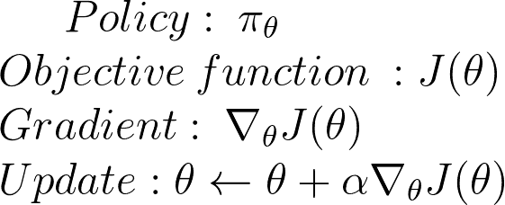

好，现在让我们用数学方法实现它。这部分有点难，但它是理解我们如何得到梯度公式的基础。

我们希望找到使分数最大化的最佳参数θ*:

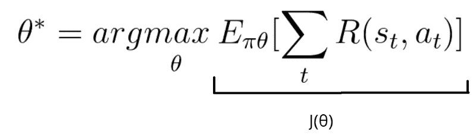

我们的得分函数可以定义为:

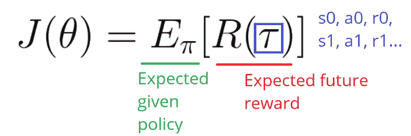

这是给定政策的期望报酬的总和。

现在，因为我们想做梯度上升，我们需要微分我们的得分函数 J(θ)。

我们的得分函数 J(θ)也可以定义为:

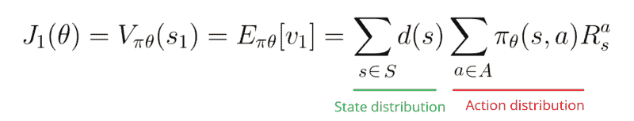

我们这样写函数是为了说明我们在这里面临的问题。

我们知道，政策参数会改变行动的选择方式，并因此改变我们获得的回报以及我们将看到的状态和频率。

因此，以一种确保改进的方式发现政策的变化可能是具有挑战性的。这是因为性能取决于动作选择和进行这些选择的状态分布。

这两者都受到政策参数的影响。策略参数对动作的影响很容易找到，但是我们如何找到策略对状态分布的影响呢？环境的功能是未知的。

因此，我们面临一个问题:当梯度取决于政策变化对状态分布的未知影响时，我们如何估计关于政策θ的∇(梯度)？

解决方案将是使用政策梯度定理。这提供了 J(θ)(性能)相对于策略θ的梯度∇的解析表达式，其不涉及状态分布的微分。

让我们来计算一下:

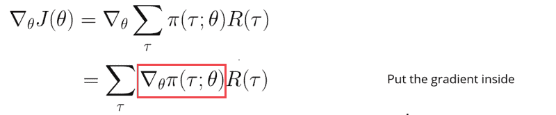

记住，我们处于随机政策的情况下。这意味着我们的策略输出一个概率分布π(τ；θ).在给定当前参数θ的情况下，它输出采取这一系列步骤(s0，a0，r0…)的概率。

但是，微分一个概率函数是很困难的，除非我们能把它转换成对数。这使得区分更加简单。

在这里，我们将使用[似然比技巧](http://blog.shakirm.com/2015/11/machine-learning-trick-of-the-day-5-log-derivative-trick/),将得到的分数替换成对数概率。

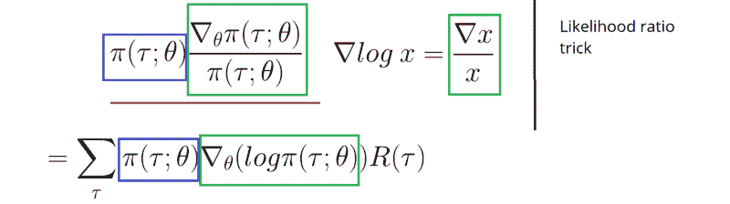

现在让我们将总和转换回期望值:

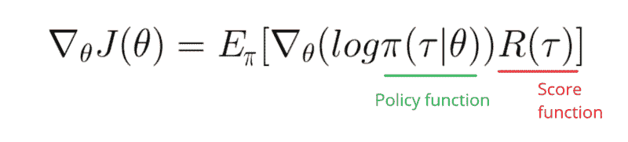

如您所见，我们只需要计算日志策略函数的导数。

既然我们已经完成了，而且已经做了很多，我们可以总结一下政策梯度:

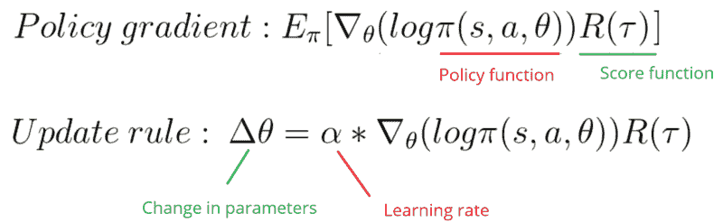

这个策略梯度告诉我们，如果我们想获得更高的分数，我们应该如何通过改变参数θ来改变策略分布。

r(τ)类似于标量值分数:

*   如果 R(τ)很高，这意味着平均而言，我们采取的行动会带来高回报。我们希望推动看到的行动的概率(增加采取这些行动的概率)。
*   另一方面，如果 R(τ)很低，我们希望降低看到的动作的概率。

这种政策梯度导致参数向有利于回报最高的行动的方向移动最多。

### 蒙特卡洛政策梯度

在我们的笔记本中，我们将使用这种方法来设计策略梯度算法。我们使用蒙特卡罗，因为我们的任务可以分成几集。

```
Initialize θfor each episode τ = S0, A0, R1, S1, …, ST:    for t <-- 1 to T-1:        Δθ = α ∇theta(log π(St, At, θ)) Gt        θ = θ + Δθ
```

```
For each episode:    At each time step within that episode:         Compute the log probabilities produced by our policy function. Multiply it by the score function.         Update the weights
```

但是我们面临这个算法的问题。因为我们只在一集结束时计算 R，所以我们对所有动作进行平均。即使采取的一些行动非常糟糕，如果我们的得分相当高，我们也会将所有行动平均分为良好。

所以要有一个正确的政策，我们需要大量的样本…这导致学习缓慢。

### 如何改进我们的模型？

我们将在下一篇文章中看到一些改进:

*   演员评论家:基于价值的算法和基于政策的算法的混合体。
*   近似策略梯度:确保与先前策略的偏差保持相对较小。

### 让我们用横杠和厄运来实现它

> 我们制作了一个视频，其中我们用 Tensorflow 实现了一个**策略梯度代理，它学习玩 Doom？？在生死攸关的环境中。**

**可以直接进入[深度强化学习课程 repo 中的笔记本。](https://github.com/simoninithomas/Deep_reinforcement_learning_Course)**

**侧手翻:**

**厄运:**

**就这些！你刚刚创造了一个学会在厄运环境中生存的代理人。厉害！**

不要忘记自己实现代码的每一部分。尝试修改我给你的代码真的很重要。尝试添加纪元，改变架构，改变学习速率，使用更硬的环境…等等。玩得开心！

在下一篇文章中，我将讨论深度 Q 学习的最新改进:

*   **固定 Q 值**
*   **优先体验回放**
*   **双 dqm**
*   **决斗网络**

**如果你喜欢我的文章，**请点击？下面是你喜欢文章**的次数，所以其他人会在媒体上看到它。别忘了跟着我！**

**如果你有任何想法、意见、问题，欢迎在下面评论或者给我发邮件:hello@simoninithomas.com，或者发推特给我[@托马斯莫尼尼](https://twitter.com/ThomasSimonini)。**


#### **不断学习，保持牛逼！**

#### 【Tensorflow 深度强化学习课程？️

**？s[yllabus](https://simoninithomas.github.io/Deep_reinforcement_learning_Course/)**

**？V [视频版](https://www.youtube.com/channel/UC8XuSf1eD9AF8x8J19ha5og?view_as=subscriber)**

**第一部分:[强化学习简介](https://medium.com/p/4339519de419/edit)**

**第二部分:[用 Q-Learning](https://medium.freecodecamp.org/diving-deeper-into-reinforcement-learning-with-q-learning-c18d0db58efe)** 深入强化学习

**第三部分:[深度 Q-Learning 入门:来玩毁灭战士](https://medium.freecodecamp.org/an-introduction-to-deep-q-learning-lets-play-doom-54d02d8017d8)**

**Part 3+: [深度 Q 学习的改进:决斗双 DQN，优先体验重放，固定 Q 目标](https://medium.freecodecamp.org/improvements-in-deep-q-learning-dueling-double-dqn-prioritized-experience-replay-and-fixed-58b130cc5682)**

**第四部分:[厄运与翻跟头的政策梯度介绍](https://medium.freecodecamp.org/an-introduction-to-policy-gradients-with-cartpole-and-doom-495b5ef2207f)**

第五部分:[优势演员介绍评论方法:我们来玩刺猬索尼克吧！](https://medium.freecodecamp.org/an-intro-to-advantage-actor-critic-methods-lets-play-sonic-the-hedgehog-86d6240171d)

**第六部分:[最接近策略优化(PPO)与刺猬索尼克 2 和 3](https://towardsdatascience.com/proximal-policy-optimization-ppo-with-sonic-the-hedgehog-2-and-3-c9c21dbed5e)**

**第七部分:[好奇心驱动学习变得容易第一部分](https://towardsdatascience.com/curiosity-driven-learning-made-easy-part-i-d3e5a2263359)**