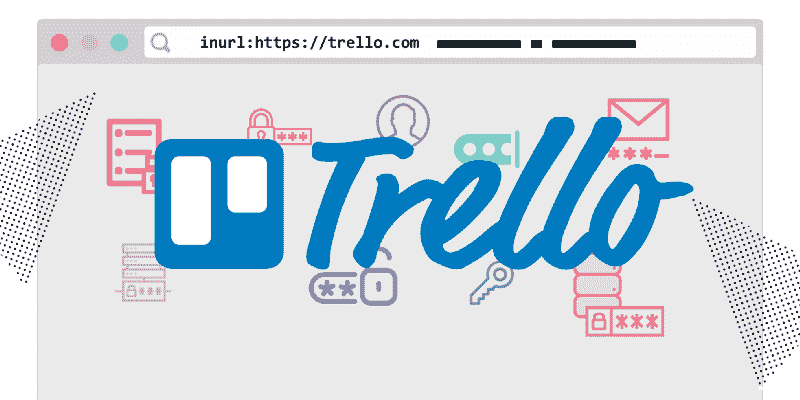
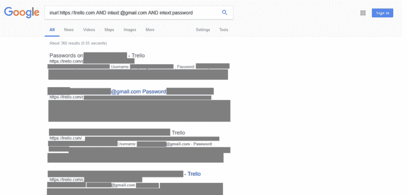
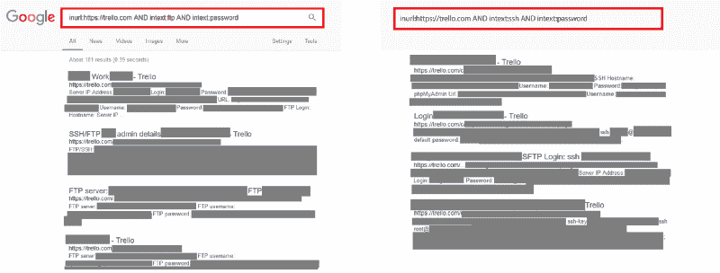
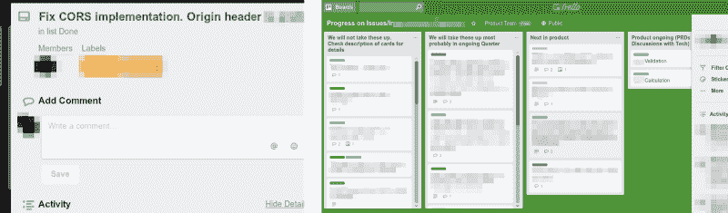
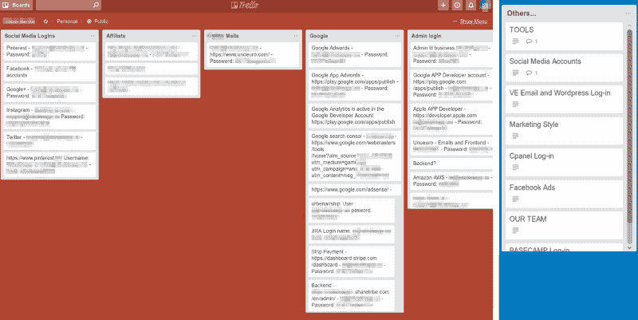
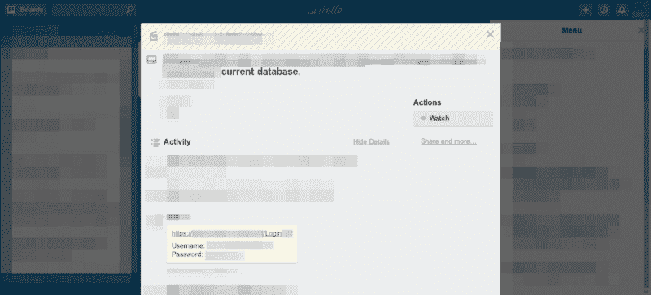

# 我是如何使用一个简单的谷歌查询从几十个公共的特雷罗论坛中挖掘密码的

> 原文：<https://www.freecodecamp.org/news/discovering-the-hidden-mine-of-credentials-and-sensitive-information-8e5ccfef2724/>

Kushagra Pathak

# 我是如何使用一个简单的谷歌查询从几十个公共的特雷罗论坛中挖掘密码的



几天前的 4 月 25 日，在调查时，我发现许多个人和公司将他们的敏感信息放在他们的公共论坛上。像**未修复的漏洞和安全漏洞**、**这样的信息，他们社交媒体账户**、**电子邮件账户**、**服务器**和**管理仪表板**的凭证，都可以在他们的公共 Trello 板上找到，所有搜索引擎都在索引这些信息，任何人都可以很容易地找到它们。

### 我是如何发现这一点的？

我用下面的搜索查询搜索了运行[漏洞奖励计划](https://en.wikipedia.org/wiki/Bug_bounty_program)的[吉拉](https://www.atlassian.com/software/jira)公司的实例:

```
inurl:jira AND intitle:login AND inurl:[company_name]
```

> 注意:我使用了 Google dork 查询，有时也称为 dork。这是一个搜索字符串，它使用高级搜索操作符来查找网站上不容易找到的信息。——[WhatIs.com](https://whatis.techtarget.com/definition/Google-dork-query)

我输入了`Trello`来代替`[company name]`。谷歌在 Trello 论坛上展示了一些结果。它们的可见性被设置为 Public，并向一些吉拉实例显示登录详细信息。世界标准时间上午 8 点 19 分左右。

我非常震惊和惊讶？

那么，为什么这是一个问题呢？嗯， [Trello](https://trello.com/tour) 是一个管理项目和个人任务的在线工具。它有用来管理这些项目和任务的委员会。用户可以将他们的板的可见性设置为私有或公共。

发现这个漏洞后，我想——为什么不检查其他安全问题，如电子邮件帐户凭证？

我继续修改我的搜索查询，把重点放在包含 Gmail 账户密码的 Trello 板上。

```
inurl:https://trello.com AND intext:@gmail.com AND intext:password
```



而 SSH 和 FTP 呢？

```
inurl:https://trello.com AND intext:ftp AND intext:password
```

```
inurl:https://trello.com AND intext:ssh AND intext:password
```



### ？我还发现了什么

使用这种技术几个小时后，我发现了更多惊人的发现。我一直在改变我的搜索查询。

一些公司使用 Trello 板来管理在他们的应用程序和网站中发现的错误和安全漏洞。



人们还使用公共特雷罗板作为**花式** 公共密码管理器来获取他们组织的凭证。

一些例子包括服务器、 [CMS](https://en.wikipedia.org/wiki/Content_management_system) 、 [CRM](https://en.wikipedia.org/wiki/Customer_relationship_management) 、商务电子邮件、社交媒体账户、网站分析、Stripe、AdWords 账户等等。



Examples of public Trello boards which contain sensitive credentials

这是另一个例子:



An NGO sharing login details to their Donor Management Software (database) which contained a lot of PII ([personally identifiable information](https://en.wikipedia.org/wiki/Personally_identifiable_information)), and details like donor and financial records

在那之前，我没有关注任何特定的公司或 Bug 赏金项目。

但是在我发现这件事的九个小时后，我已经找到了几乎 25 家泄露一些非常敏感信息的公司的联系方式。所以我举报了他们。为他们中的一些人寻找详细的联系方式是一项乏味且具有挑战性的任务。

我在一个 bug 赏金猎人的私人空间和一个 infosec Discord 服务器上发布了这个消息。在发现这个特雷罗技巧后，我也在推特上发了这个消息。那里的人和我一样惊讶。

然后人们开始告诉我，他们通过我分享的 Trello 技术找到了一些很酷的东西，如商业电子邮件、吉拉证书和 Bug Bounty 程序的敏感内部信息。


在发现这种 Trello 技术近 10 个小时后，我开始测试专门运行 Bug Bounty 程序的公司。然后，我开始使用搜索查询来查找一家知名的拼车公司。

```
inurl:https://trello.com AND intext:[company_name]
```

我立刻找到了一个 Trello board ，里面有一个雇员的商业电子邮件账户的登录信息，还有一个包含一些内部信息。

为了证实这一点，我联系了他们安全团队的一个人。他们说，他们收到了一份报告，内容是关于一个包含我之前一名员工的电子邮件凭据的董事会，以及另一个包含一些内部信息的董事会。安全团队要求我向他们提交一份完整的报告，因为这是一个新发现。

不幸的是，我的报告被关闭了。拼车公司后来发现，他们已经收到了一份关于我找到的 Trello board 的报告。

在接下来的几天里，**我向另外 15 家公司**报告了他们的 Trello 董事会泄露其组织高度敏感信息的问题。一些是大公司，但许多没有运行一个 Bug 赏金程序。

然而，这 15 家公司中有一家正在运行一个 Bug 赏金项目，所以我通过它向他们进行了汇报。不幸的是，他们没有奖励我，因为这是一个他们目前没有支付的问题。？

#### 更新—2018 年 5 月 18 日:

就在几天前，我发现一堆**公共 Trello 板**包含非常敏感的信息(包括登录信息！)**指政府**。太神奇了！

[下网](https://thenextweb.com/security/2018/05/10/psa-saving-passwords-in-public-trello-boards-is-a-really-really-bad-idea/)和[安全事务](https://securityaffairs.co/wordpress/72380/data-breach/trello-data-leak.html)对此也有报道。

#### 更新—2018 年 8 月 17 日:

最近几个月，我发现英国和加拿大政府总共有 **50 个 Trello 板**包含内部机密信息和证书。[对这次拦截](https://www.freecodecamp.org/news/discovering-the-hidden-mine-of-credentials-and-sensitive-information-8e5ccfef2724/undefined)写了一篇详细的文章[在这里](https://theintercept.com/2018/08/16/trello-board-uk-canada/)。

[**英国和加拿大政府通过错误配置热门项目管理网站 Trello 上的页面，意外地向整个…**](https://theintercept.com/2018/08/16/trello-board-uk-canada/)
[*暴露了密码和安全计划，英国政府和…*theintercept.com 政府](https://theintercept.com/2018/08/16/trello-board-uk-canada/)

#### 更新—2018 年 9 月 24 日:

八月，**我发现了 60 个公共的 Trello 板**，一个公共的吉拉和一堆联合国**的 Google 文档**，里面包含了多个 FTP 服务器的凭证，社交媒体&电子邮件账户，大量的内部通信和文档。[截击](https://www.freecodecamp.org/news/discovering-the-hidden-mine-of-credentials-and-sensitive-information-8e5ccfef2724/undefined)写了一篇关于它的详细文章[这里](https://theintercept.com/2018/09/24/united-nations-trello-jira-google-docs-passwords)。

[**联合国不小心将密码和敏感信息暴露给整个互联网**](https://theintercept.com/2018/09/24/united-nations-trello-jira-google-docs-passwords)
[*联合国不小心公布了密码、内部文件和有关网站的技术细节……*theintercept.com](https://theintercept.com/2018/09/24/united-nations-trello-jira-google-docs-passwords)

感谢你阅读我的故事。

如果你喜欢这篇文章，给我一些掌声？

你可以在推特上关注我✌️

[**Kushagra Pathak(@xKushagra)| Twitter**](https://twitter.com/xKushagra)
[*Kushagra Pathak 的最新推文(@ xKushagra)。安全研究员？‍?|找工作。？twi*tter.com](https://twitter.com/xKushagra)

感谢 [CyberSecStu](https://twitter.com/cybersecstu/) *、* [太妃](https://twitter.com/PolarToffee) *和* freeCodeCamp 编辑团队*帮助我校对和编辑这篇文章。*