# 如何使用 Webpack 4 简化 React.js 开发过程

> 原文：<https://www.freecodecamp.org/news/how-to-develop-react-js-apps-fast-using-webpack-4-3d772db957e4/>

玛格丽塔·奥布拉兹索娃

# 如何使用 Webpack 4 简化 React.js 开发过程


Original photo at: [https://www.instagram.com/p/BiaH379hrAp/?taken-by=riittagirl](https://www.instagram.com/p/BiaH379hrAp/?taken-by=riittagirl)

在真实的开发世界中，我们必须非常快速地添加新功能。在本教程中，我将向你展示你可以做的一切来简化这个过程，并达到 120%的开发速度。

你可能会问，为什么是 T1？

因为做手工在编程的时候是极其反生产的。我们希望尽可能自动化。因此，我将向您展示 React 开发流程的哪些部分可以使用 Webpack v4.6.0 进行调整。

由于我已经在之前的[](https://hackernoon.com/a-tale-of-webpack-4-and-how-to-finally-configure-it-in-the-right-way-4e94c8e7e5c1)****中完成了设置 webpack 配置的第一步，我就不再赘述了。在那里，我更详细地描述了如何配置 Webpack。我假设您已经熟悉了 Webpack 配置的基础知识，所以我们可以从一个现成的设置开始。****

### **设置 Webpack**

**在您的 *webpack.config.js* 中，输入以下代码:**

```
`// webpack v4const path = require('path');const HtmlWebpackPlugin = require('html-webpack-plugin');const WebpackMd5Hash = require('webpack-md5-hash');const CleanWebpackPlugin = require('clean-webpack-plugin');`
```

```
`module.exports = {  entry: { main: './src/index.js' },  output: {    path: path.resolve(__dirname, 'dist'),    filename: '[name].[chunkhash].js'  },  module: {    rules: [      {        test: /\.js$/,        exclude: /node_modules/,        use: {          loader: "babel-loader"        }      }    ]  },  plugins: [     new CleanWebpackPlugin('dist', {} ),    new HtmlWebpackPlugin({      inject: false,      hash: true,      template: './src/index.html',      filename: 'index.html'    }),    new WebpackMd5Hash()  ]};`
```

**而在你的 *package.json* 中:**

```
`{ "name": "post", "version": "1.0.0", "description": "", "main": "index.js", "scripts": {  "build": "webpack --mode production",  "dev": "webpack --mode development" },  "author": "", "license": "ISC", "devDependencies": {    "babel-cli": "^6.26.0",    "babel-core": "^6.26.0",    "babel-loader": "^7.1.4",    "babel-preset-env": "^1.6.1",    "babel-preset-react": "^6.24.1",    "babel-runtime": "^6.26.0",    "clean-webpack-plugin": "^0.1.19",    "html-webpack-plugin": "^3.2.0",    "react": "^16.3.2",    "react-dom": "^16.3.2",    "webpack": "^4.6.0",    "webpack-cli": "^2.0.13",    "webpack-md5-hash": "0.0.6"  }}`
```

**现在您可以下载您的节点模块了:**

```
`npm i`
```

**并用【index.html】的和*的*将 *src/* 文件夹添加到您的项目中**

**首先在 *src/index.html* 中:**

```
`<html>  <head>  </head>  <body>    <div id="app"></div>    <script src="<%= htmlWebpackPlugin.files.chunks.main.entry %>"></script>  </body></html>`
```

**然后在 *src/index.js* 中:**

```
`console.log("hello, world");`
```

**让我们运行开发脚本:**

```
`npm run dev`
```

**你知道了:它已经编译好了！现在让我们也为它配置 React。**

### **设置您的 React 项目**

**因为 React 使用一种叫做 JSX 的特殊语法，我们需要转换代码。如果我们去 babel 的网站，它有 React 的[预设。](https://babeljs.io/docs/plugins/preset-react/)**

```
`npm install --save-dev babel-cli babel-preset-react`
```

**我们的*。babelrc* 文件应该是这样的:**

```
`{  "presets": ["env", "react"]}`
```

**向您的 *index.js* 添加一些应用程序初始化:**

```
`import React from 'react';import { render } from 'react-dom';`
```

```
`class App extends React.Component {`
```

```
`render() {    return (      <div>        'Hello world!'      </div>    );  }}`
```

```
`render(<App />, document.getElementById('app'));`
```

**并运行开发脚本:**

```
`npm run dev`
```

**如果你设法生成了一个*。/dist* 文件夹里有 index.html*和一个主文件*还有一个哈希，**你做得很棒！我们有我们的应用程序编译！****

### **设置 web 开发服务器**

**从技术上来说，我们不必这样做，因为有许多基于节点的服务器用于前端应用程序。但是我推荐 **webpack-dev-server** ，因为它被设计为与 webpack 一起工作，并且它支持一系列很好的特性，例如**热模块替换**、**源地图，等等**。**

**正如他们在[官方文档页面](https://github.com/webpack/webpack-dev-server)中提到的:**

> **将 [webpack](https://webpack.js.org/) 与提供实时重新加载的开发服务器一起使用。这应该仅用于开发。**

****这里可能会有点混乱:**如何让 webpack-dev-server 只为 dev 模式工作？**

```
`npm i webpack-dev-server --save-dev`
```

**在你的 *package.json* 中，调整**

```
`"scripts": {  "dev": "webpack-dev-server --mode development --open",  "build": "webpack --mode production"}`
```

**现在它应该会启动一个服务器，并自动打开你的浏览器标签。**

**此时，您的 *package.json* 如下所示:**

```
`{ “name”: “post”, “version”: “1.0.0”, “description”: “”, “main”: “index.js”, “scripts”: {   "dev": "webpack-dev-server --mode development --open",   "build": "webpack --mode production" }, “author”: “”, “license”: “ISC”, “devDependencies”: {   “babel-cli”: “6.26.0”,   “babel-core”: “6.26.0”,   “babel-loader”: “7.1.4”,   “babel-preset-env”: “1.6.1”,   “babel-preset-react”: “6.24.1”,   “babel-runtime”: “6.26.0”,   “clean-webpack-plugin”: “0.1.19”,   “html-webpack-plugin”: “3.2.0”,   “react”: “16.3.2”,   “react-dom”: “16.3.2”,   “webpack”: “4.6.0”,   “webpack-cli”: “2.0.13”,   “webpack-dev-server”: “3.1.3”,   “webpack-md5-hash”: “0.0.6” }}`
```

**现在，如果你试图修改应用程序中的某些内容，浏览器应该会自动刷新页面。**

**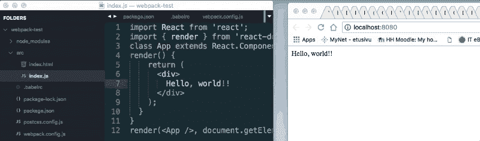**

**接下来，你需要下载 React devtools 作为 Chrome 扩展。**

****

**这样你可以更容易地从 Chrome 控制台调试你的应用程序。**

### **ESLint 配置**

**我们为什么需要它？嗯，一般来说我们不用它。但是 ESLint 是一个方便的工具。在我们的例子中，它将呈现我们的代码(在编辑器和终端中，以及在浏览器上),并突出显示我们的错误、错别字和错误(如果有的话)。这叫做**林挺**。**

**ESLint 是一个开源的 JavaScript 林挺实用程序，最初由 Nicholas C. Zakas 于 2013 年 6 月创建。它有替代方案，但是到目前为止，它在 ES6 和 React 上工作得很好，可以发现常见问题，并与生态系统的其他部分集成。**

**现在，让我们为自己的新项目在本地安装它。当然，此时的 ESLint 有大量的设置。你可以在官方网站上了解更多关于他们的信息[。](https://eslint.org/docs/about/)**

```
`npm install eslint --save-dev`
```

```
`./node_modules/.bin/eslint --init`
```

**最后一个命令将创建一个配置文件。系统将提示您在三个选项中进行选择:**

**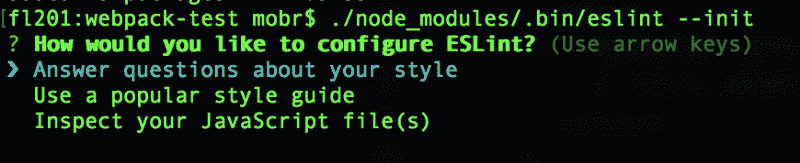**

**在本教程中，我选择了第一个:答题。以下是我的回答:**

**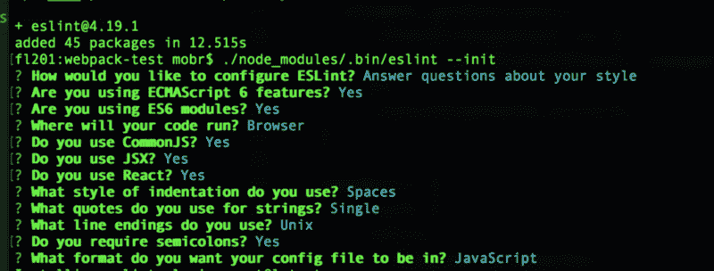**

**这将把 *.eslintrc.js* 文件添加到您的项目目录中。我生成的文件如下所示:**

```
`module.exports = {    "env": {        "browser": true,        "commonjs": true,        "es6": true    },    "extends": "eslint:recommended",    "parserOptions": {        "ecmaFeatures": {            "experimentalObjectRestSpread": true,            "jsx": true        },        "sourceType": "module"    },    "plugins": [        "react"    ],    "rules": {        "indent": [            "error",            4        ],        "linebreak-style": [            "error",            "unix"        ],        "quotes": [            "error",            "single"        ],        "semi": [            "error",            "always"        ]    }};`
```

**到目前为止什么都没发生。尽管这是一个非常有效的配置，但这还不够——我们必须将它与 Webpack 和我们的文本编辑器集成在一起才能工作。正如我提到的，我们可以在代码编辑器、终端(作为一个 linter)或预提交钩子中使用它。我们现在将为我们的编辑器配置它。**

#### **Visual Studio 代码的设置**

**如果你想知道，ESLint 几乎为每个主要的代码编辑器都提供了插件，包括 **Visual Studio Code，Visual Studio，SublimeText** ， **Atom，WebStorm，甚至 vim。**所以，继续下载[自己的文本编辑器](https://prettier.io/docs/en/editors.html)的版本。我将在这个演示中使用 **VS 代码。****

****

**现在我们可以看到出现了一些代码错误。这是因为项目有一个配置文件，当一些规则没有遵守时，它会链接代码并报错。**

**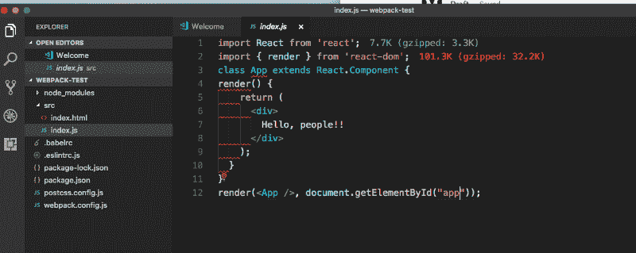**

**您可以通过检查错误消息来手动调试它，或者您可以利用它，只需按 save，它就会自动修复问题。**

**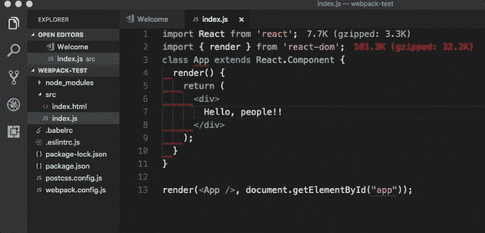**

**现在，您可以开始调整 ESLint 设置:**

```
`module.exports = {    "env": {        "browser": true,        "commonjs": true,        "es6": true    },    "extends": ["eslint:recommended", "plugin:react/recommended"],    "parserOptions": {        "ecmaFeatures": {            "experimentalObjectRestSpread": true,            "jsx": true        },        "sourceType": "module"    },    "plugins": [        "react"    ],    "rules": {        "indent": [            "error",            2        ],        "linebreak-style": [            "error",            "unix"        ],        "quotes": [            "warn",            "single"        ],        "semi": [            "error",            "always"        ]    }};`
```

**如果您错误地包含了双引号而不是单引号，这不会破坏构建。它还将为 JSX 增加一些支票。**

#### **添加更漂亮**

**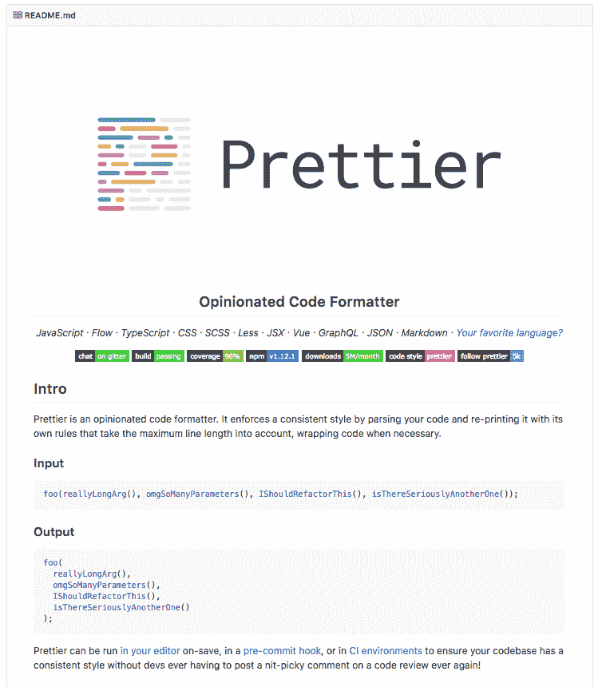**

**Prettier 是当今最流行的格式化程序之一，它被编码社区广泛接受。它可以添加到 ESLint，[你的编辑器](https://prettier.io/docs/en/editors.html)，也可以作为预提交钩子安装。**

**

I will install it to my VS code here** 

**一旦你安装了它，你可以试着再次检查你的代码。如果我们写一些奇怪的缩进并按下 save，它现在应该会自动格式化代码。**

**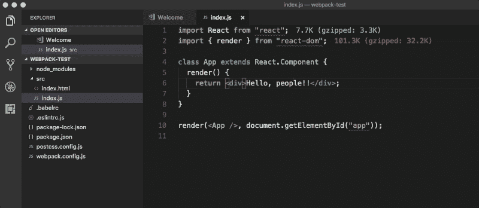**

**这还不够。为了让 ESLint 同步工作，不发出两次相同的错误，甚至不产生规则冲突，你需要将它与你的 ESLint 集成在一起。**

```
`npm i --save-dev prettier eslint-plugin-prettier`
```

**在官方文件中，他们推荐你使用 yarn，但是 npm 现在也可以。向您的 *.eslintrc.json* 文件添加:**

```
`...  sourceType: "module"},plugins: ["react", "prettier"],extends: ["eslint:recommended", "plugin:react/recommended"],rules: {  indent: ["error", 2],  "linebreak-style": ["error", "unix"],  quotes: ["warn", "single"],  semi: ["error", "always"],  "prettier/prettier": "error"}...`
```

****现在我们想扩展我们的 ESLint 规则来包含更漂亮的规则:****

```
`npm i --save-dev eslint-config-prettier`
```

**并在您的 eslint 配置中添加一些扩展:**

```
`...extends: [  "eslint:recommended",  "plugin:react/recommended",  "prettier",  "plugin:prettier/recommended"]...`
```

**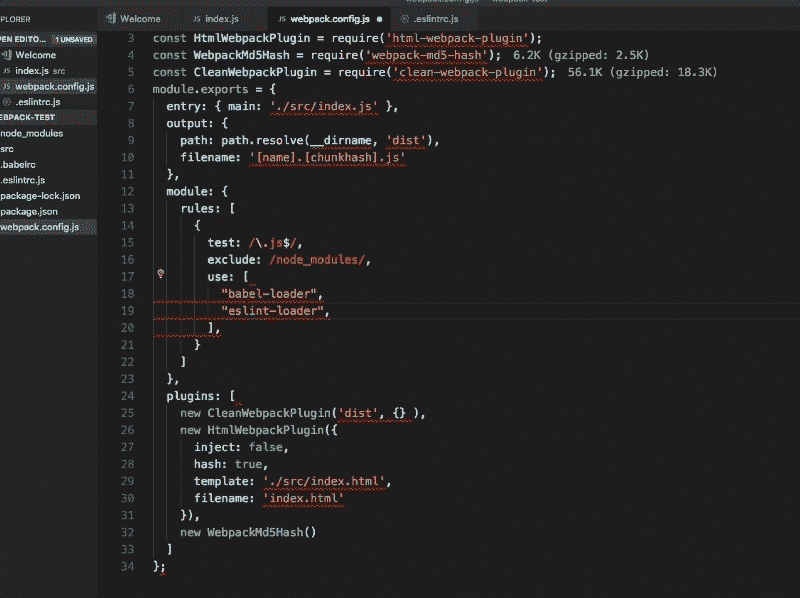**

**我们再给它增加一些[配置](https://prettier.io/docs/en/options.html)。你应该这样做，以避免缺省的更漂亮的规则和你的 ESLint 规则之间的不匹配，就像我现在这样:**

**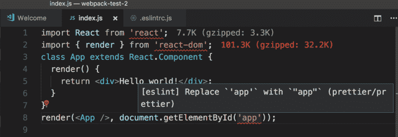**

**beauty 借用了 ESLint 的[覆盖格式](http://eslint.org/docs/user-guide/configuring#example-configuration)。这允许您将配置应用于特定文件。**

**您现在可以以*的形式为它创建一个配置文件。js* 文件。**

```
`nano prettier.config.js`
```

**现在，粘贴该文件:**

```
`module.exports = {  printWidth: 80,  tabWidth: 2,  semi: true,  singleQuote: true,  bracketSpacing: true};`
```

**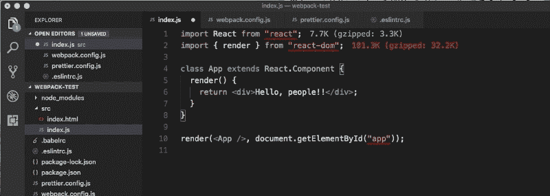**

**现在，当您按下 save 时，您会看到您的代码被自动格式化。那样不是更漂亮吗？一语双关。**

**我的 *package.json* 长这样:**

```
`{ "name": "post", "version": "1.0.0", "description": "", "main": "index.js", "scripts": {  "build": "webpack --mode production",  "dev": "webpack-dev-server --mode development --open" }, "author": "", "license": "ISC", "devDependencies": {  "babel-cli": "^6.26.0",  "babel-core": "^6.26.0",  "babel-loader": "^7.1.4",  "babel-preset-env": "^1.6.1",  "babel-preset-react": "^6.24.1",  "babel-runtime": "^6.26.0",  "clean-webpack-plugin": "^0.1.19",  "eslint": "^4.19.1",  "eslint-config-prettier": "^2.9.0",  "eslint-plugin-prettier": "^2.6.0",  "eslint-plugin-react": "^7.7.0",  "html-webpack-plugin": "^3.2.0",  "prettier": "^1.12.1",  "react": "^16.3.2",  "react-dom": "^16.3.2",  "webpack": "^4.6.0",  "webpack-cli": "^2.0.13",  "webpack-dev-server": "^3.1.4",  "webpack-md5-hash": "0.0.6" }}`
```

**现在我们已经设置好了，让我们快速回顾一下:ESLint 监视你的代码中的错误，Prettier 是一个样式格式化工具。ESLint 有更多的方法来捕捉错误，而 Prettier 可以很好地格式化你的代码。**

```
`// webpack v4const path = require('path');const HtmlWebpackPlugin = require('html-webpack-plugin');const WebpackMd5Hash = require('webpack-md5-hash');const CleanWebpackPlugin = require('clean-webpack-plugin');module.exports = {  entry: { main: './src/index.js' },  output: {    path: path.resolve(__dirname, 'dist'),    filename: '[name].[chunkhash].js'  },  module: {    rules: [      {        test: /\.js$/,        exclude: /node_modules/,        use: {          loader: "babel-loader"        }      }    ]  },  plugins: [     new CleanWebpackPlugin('dist', {} ),    new HtmlWebpackPlugin({      inject: false,      hash: true,      template: './src/index.html',      filename: 'index.html'    }),    new WebpackMd5Hash()  ]};`
```

#### **问题:在 Visual Studio 代码中，Prettier 不会自动格式化代码**

**一些人指出 VS 代码不能和 Prettier 一起工作。**

**如果你的漂亮插件在保存的时候没有自动格式化代码，你可以通过添加这个代码到 VS 代码设置来修复它:**

```
`"[javascript]": {    "editor.formatOnSave": true  }`
```

**如这里描述的。**

#### **将 ESLint 加载程序添加到管道中**

**由于 ESLint 是在项目中配置的，所以一旦你运行 dev server，它也会在你的终端中抱怨。**

**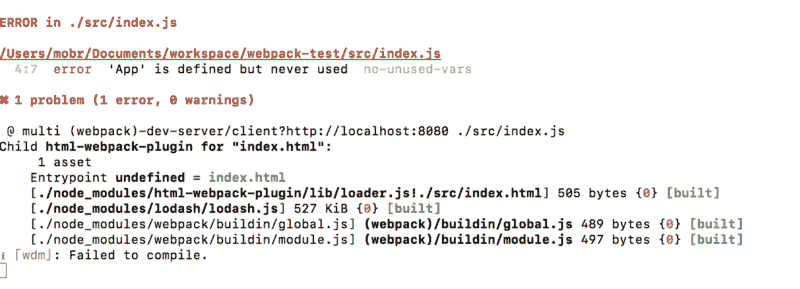**

> ****注**:虽然有可能做到，但目前我不推荐使用 ESLint 作为加载器。它将打破源映射设置，我在以前的文章[中详细描述了如何解决 Webpack 问题。实际案例。](https://medium.com/@riittagirl/how-to-solve-webpack-problems-the-practical-case-79fb676417f4)我将在这里展示如何设置它，以防有人已经修复了他们的错误。**

**Webpack 有自己的 [ESLint 加载器](https://www.npmjs.com/package/eslint-loader)。**

```
`npm install eslint-loader --save-dev`
```

**你必须将 ESLint 添加到规则中。使用运输装载机(如`babel-loader`)时，确保它们的顺序正确(从下到上)。否则，文件将在经过`babel-loader`处理后被检查**

```
`...module: {  rules: [    {      test: /\.js$/,      exclude: /node_modules/,      use: [{ loader: "babel-loader" }, { loader: "eslint-loader" }]    }  ]},...`
```

**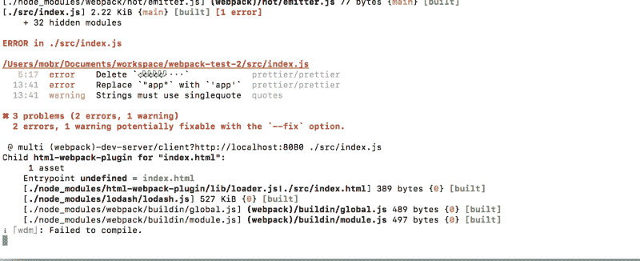**

**以下是您可能遇到的一些问题:**

*   **将未使用的变量添加到索引文件中**

**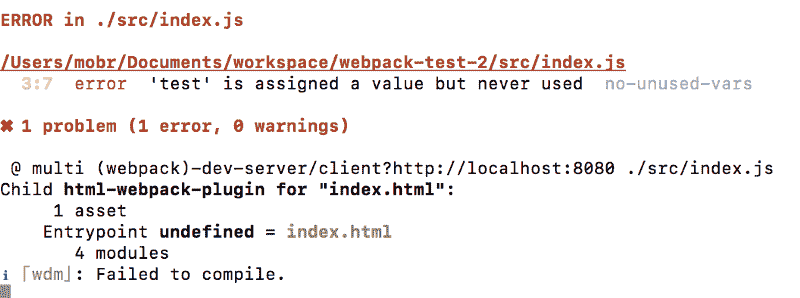**

**如果你偶然发现这个错误(no-unused-vars)，在 GitHub 上的[这个问题](https://github.com/babel/babel-eslint/issues/6)和这里的中有很好的解释。**

**我们可以通过添加一些规则来解决这个问题，这里解释和[这里解释](https://github.com/yannickcr/eslint-plugin-react/blob/master/docs/rules/jsx-uses-vars.md)。**

**您可能已经注意到，这里会出现 [no-unused-vars](https://eslint.org/docs/rules/no-unused-vars) 错误。你需要让它成为一个警告而不是一个错误，因为这样更容易进行快速开发。您需要在 ESLint 中添加一个新规则，这样就不会出现默认错误。**

**你可以在这里和这里阅读更多关于这个设置的[。](https://eslint.org/docs/rules/no-unused-vars)**

```
`...semi: ['error', 'always'],'no-unused-vars': [  'warn',  { vars: 'all', args: 'none', ignoreRestSiblings: false }],'prettier/prettier': 'error'}...`
```

**这样，我们将得到相当多的错误和警告消息。**

**我喜欢拥有自动修复功能的想法，但让我们明确一点:我并不热衷于让事情神奇地改变。为了避免这种情况，我们现在可以提交 autofix。**

### **提交前挂钩**

**在使用 Git 工具时，人们通常非常小心。但是我向你保证，这个非常简单明了。使用 Pre commit 钩子使得团队在每个项目文件中都有一致的代码风格，没有人可以提交没有风格的代码。像这样为您的项目设置 Git 集成:**

```
`git initgit add .nano .gitignore (add your node_modules there)git commit -m "First commit"git remote add origin your origingit push -u origin master`
```

**这里有一些关于 [git 挂钩](https://www.atlassian.com/git/tutorials/git-hooks)和[使用更漂亮的](https://prettier.io/docs/en/precommit.html)的好文章。**

**对于那些说你只能在本地做的人——不，那不是真的！**

**你可以使用安德烈·奥科涅奇尼科夫的[这个](https://github.com/okonet/lint-staged)资源库中的 lint-stage 工具来完成。**

### **添加属性类型**

**让我们在应用程序中创建一个新组件。到目前为止，我们的 *index.js* 是这样的:**

```
`import React from 'react';import { render } from 'react-dom';`
```

```
`class App extends React.Component {  render() {    return <div>Hello</div>;  }}render(<App />, document.getElementById('app'));`
```

**出于演示目的，我们将创建一个名为 Hello.js 的新组件。**

```
`import React from 'react';class Hello extends React.Component {  render() {    return <div>{this.props.hello}</div>;  }}export default Hello;`
```

**现在将它导入到您的 *index.js* 文件中:**

```
`import React from 'react';import { render } from 'react-dom';import Hello from './Hello';class App extends React.Component {  render() {    return (      <div>      <Hello hello={'Hello, world! And the people of the world!'} />     </div>   );  }}render(<App />, document.getElementById('app'));`
```

**我们应该看到元素，但 ESLint 抱怨说:**

**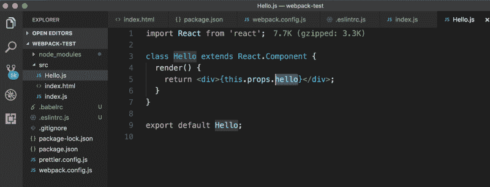**

****错误:[eslint]“hello”在道具验证(react/prop-types)中丢失****

**在 React v16 中，为了避免类型混淆，必须添加[属性类型](https://www.tutorialspoint.com/reactjs/reactjs_props_validation.htm)。你可以在这里了解更多关于[的信息。](https://reactjs.org/docs/typechecking-with-proptypes.html)**

```
`import React from 'react';import PropTypes from 'prop-types';class Hello extends React.Component {  render() {    return <div>{this.props.hello}</div>;  }}Hello.propTypes = {  hello: PropTypes.string};export default Hello;`
```

**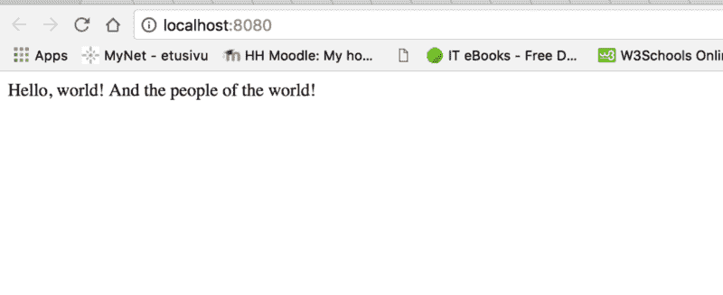**

### **热模块更换**

**现在您已经检查了代码，是时候向 React 应用程序添加更多组件了。到目前为止你只有两个，但在大多数情况下你有几十个。**

**当然，每次你在项目中改变一些东西的时候，在刷新时重新编译整个应用程序是不可取的。你需要一个更快的方法来做这件事。**

**因此，让我们添加热模块更换，又名 HMR。在[文档](https://webpack.js.org/concepts/hot-module-replacement/)中，它被描述为:**

> **热模块替换(HMR)在应用程序运行时交换、添加或删除[模块](https://webpack.js.org/concepts/modules/)，无需完全重新加载。这可以在几个方面大大加快开发速度:**

> **保留在完全重新加载过程中丢失的应用程序状态。**

> **通过只更新更改的内容来节省宝贵的开发时间。**

> **更快地调整样式——几乎可以与在浏览器的调试器中改变样式相媲美。**

**我不打算深入研究它在这里如何工作的技术细节:那将是另一篇文章的主题。但是下面是如何配置它:**

```
`...output: {  path: path.resolve(__dirname, 'dist'),  filename: '[name].[chunkhash].js'},devServer: {  contentBase: './dist',  hot: true},module: {  rules: [...`
```

### **和 HMR 一起解决小问题**

**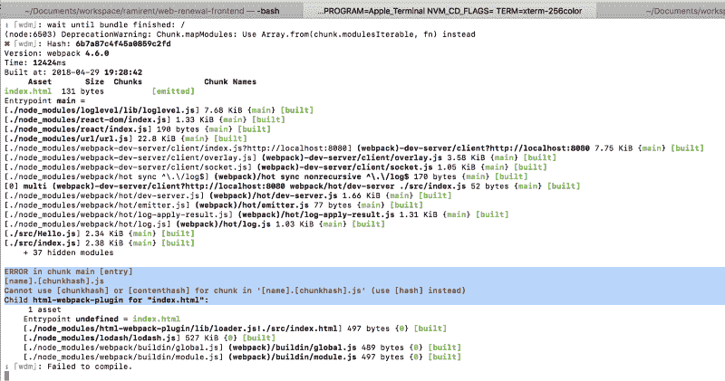**

**我们必须用 hash 替换 chunkhash，因为显然 webpack 已经在上次之后修复了这个问题。现在我们有热模块更换工作！**

```
`...module.exports = {   entry: { main: './src/index.js' },   output: {     path: path.resolve(__dirname, 'dist'),     filename: '[name].[hash].js'   },   devServer: {     contentBase: './dist',...`
```

### **解决 bug**

**如果我们在这里运行开发脚本:**

**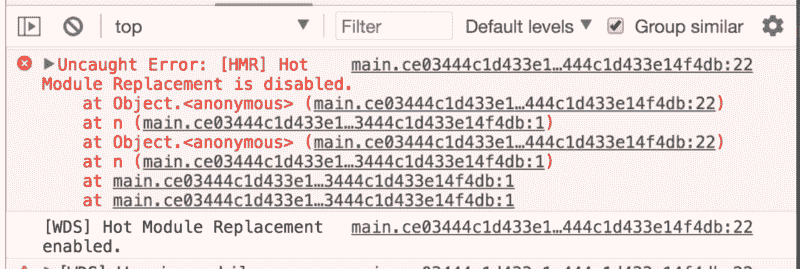**

**然后使用[这个问题](https://github.com/webpack/webpack/issues/1151)中的提示来修复它。**

**接下来，将— hot 标志添加到 *package.json* 中的开发脚本:**

```
`..."scripts": {   "build": "webpack --mode production",   "dev": "webpack-dev-server --hot"}...`
```

### **源地图:**

**正如我上面提到的，**源地图不能与 ESLint loader 一起工作。**我在这里提出了一个[的问题。](https://github.com/webpack-contrib/eslint-loader/issues/227#issuecomment-386798932)**

> **通常，您不希望它们出现在您的项目中(因为您希望从 ESLint 错误消息中调试您的项目)。他们也因使 HMR 变慢而出名。**

**你可以在这里和这里了解更多[和](https://github.com/facebook/create-react-app/pull/109#issuecomment-234674331)[。](https://github.com/facebook/create-react-app/pull/109#issuecomment-234674331)**

**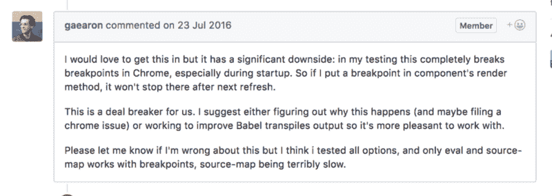**

**但是如果你想要源地图，添加它们最简单的方法是通过 [devtools](https://webpack.js.org/configuration/devtool/) 选项。**

```
`...module.exports = {  entry: { main: './src/index.js' },  output: {    path: path.resolve(__dirname, 'dist'),    filename: '[name].[hash].js'  },  devtool: 'inline-source-map',  devServer: {    contentBase: './dist',    hot: true  },  ...`
```

**注意:除非您以正确的方式指定环境，否则源映射将不起作用。你可以在这里阅读我调试[的过程。下面我会给你一个剧透，并解释我是如何解决这个问题的。](https://medium.com/@riittagirl/how-to-solve-webpack-problems-the-practical-case-79fb676417f4)**

**如果我们现在在代码中创建一个错误，它将显示在控制台中，并为我们指出正确的位置:**

**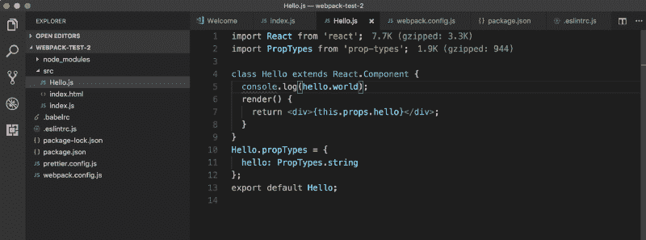**

**…至少我们是这样认为的。但是没有:**

**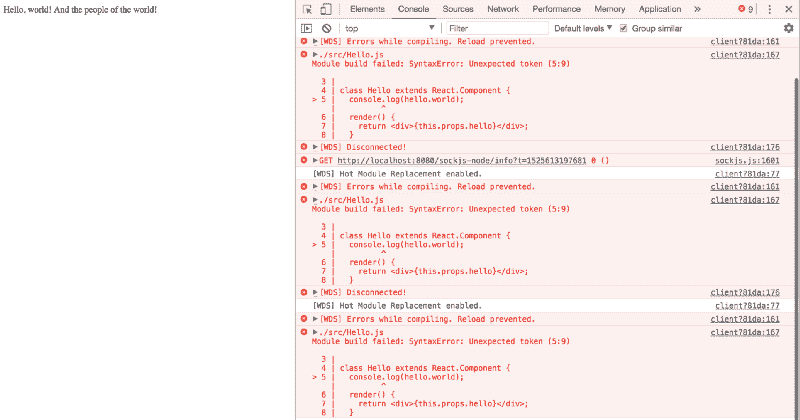

That is wrog behaviour** 

**您需要像这样更改环境变量:**

```
`..."main": "index.js","scripts": {  "build": "webpack --mode=production",  "start": "NODE_ENV=development webpack-dev-server --mode=development --hot"},"author": ""...`
```

***网页包. config.js***

```
`...devtool: 'inline-source-map',devServer: {  contentBase: './dist',  open: true}...`
```

**现在成功了！**

**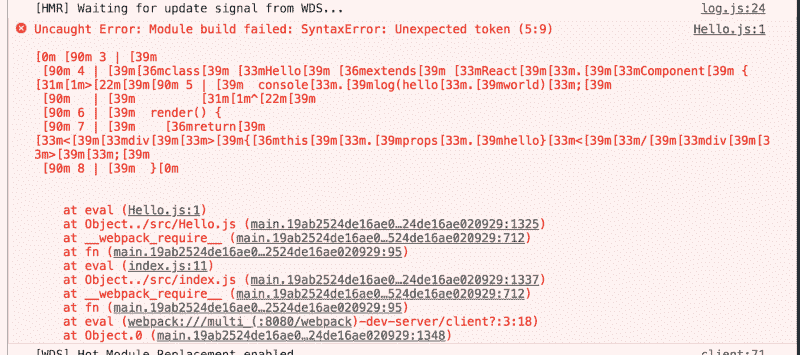

As you can see, we are pointed to the exact file where the error occured!** 

**现在您已经成功地为您的项目设置了开发环境！**

**让我们回顾一下:**

*   **我们建立了网络包**
*   **我们创建了第一个 React 组件**
*   **我们包含了 ESLint 来检查代码中的错误**
*   **我们设置了热模块更换**
*   **我们(可能)添加了源地图**

****注意**:当你读到这篇文章的时候，许多 npm 的依赖关系可能会改变，同样的配置可能不适合你。我恳请您在下面的评论中留下您的错误，以便我稍后可以编辑它。**

****请为这篇文章订阅并鼓掌！谢谢！****

****更多资料:****

**[**surviviejs—Webpack**](https://survivejs.com/webpack/)
[*在数周未能配置 web pack 后，我在寻找另一个教程时偶然发现了 surviviejs 的书……*survivejs.com](https://survivejs.com/webpack/)[**web pack 4 和模块捆绑的初学者指南—SitePoint**](https://www.sitepoint.com/beginners-guide-webpack-module-bundling/)
[*web pack 是一个模块捆绑器。它的主要目的是捆绑 JavaScript 文件以便在浏览器中使用，然而它也是……*www.sitepoint.com](https://www.sitepoint.com/beginners-guide-webpack-module-bundling/)**