# 从建造一座城市看 HTML、CSS 和 JavaScript 的关系

> 原文：<https://www.freecodecamp.org/news/the-relationship-between-html-css-and-javascript-explained-by-building-a-city-a73a69c6343/>

凯文·科诺年科

# 从建造一座城市看 HTML、CSS 和 JavaScript 的关系

如果你曾经去过像纽约这样适合步行的城市，那么你就会明白 HTML、CSS 和 JavaScript 是如何协同工作的。

当你开始学习 web 开发时，通常可以尝试一系列关于 HTML、CSS 和 JavaScript 原理的基础挑战。然而，每个挑战都发生在沙盒环境中，不会一次测试你的多种语言。

例如,“JavaScript 简介”教程通常会关注循环和“if”语句等基础知识，而不是将 JavaScript 与 HTML 一起使用。

完成这些初步练习后，你就到了需要建立第一个完整网站的时候了。即使这是一个您从未打算发布的单页个人网站，您仍然会面临一系列新的挑战，例如:

1.  我如何连接这三种不同类型的文件？
2.  在我将它们连接起来之后，它们将如何一起工作？
3.  我如何在自己的电脑上测试所有这些？

思考了一会儿之后，我意识到这些部分一起工作，就像城市仍然可以运转一样。即使企业不断迁入或迁出，或者房地产开发商正在改造某些街区，这一点也适用。

因此，我将向您展示如何用这三个部分建立您的第一个开发环境。为了理解这个教程，你只需要知道 HTML，CSS 和 JavaScript 的基础部分。

即使你一生中没有写过任何代码，你仍然能够理解如何连接这三种语言。

### HTML、CSS 和 JavaScript 的区别

假设你负责规划城市中一个新社区的布局。这个社区将会有一些住宅楼，一些餐馆，一个银行分行和一个购物中心。

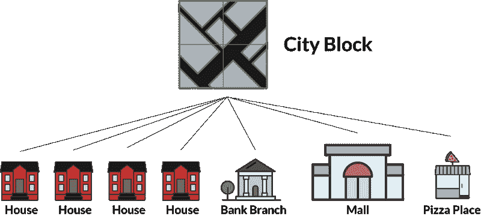

Our neighborhood’s layout

这似乎是一维的。换句话说，每个建筑只是地图上的一个点，没有细微差别。但是当你再深入一点，你会发现每栋建筑实际上都有三个你可以改变的部分:

1.  建筑本身的结构
2.  建筑物的内部和外部装饰
3.  参观者在每栋建筑中可以发挥的实际功能

这对应于您可以在第一个网站中使用的三种不同类型的文件。

一个 **HTML 文件**包含页面本身的结构。这有点像建筑的结构。

CSS 文件包含页面的样式。它允许你改变颜色，定位等等。这有点像建筑本身的设计。

一个 **JavaScript 文件**决定了页面上的动态和交互元素。它决定了当用户在某些元素中单击、悬停或键入时会发生什么。这有点像建筑的功能。

让我们以其中一所房子为例。一栋房子有两间卧室、两间浴室和两层楼。那是大楼的 HTML。

它是砖造的，有一扇实木门。与建筑的 CSS 相对应。

在房子里你能做什么？你可以吃饭，睡觉，做饭…任何你在家做的事情，真的！那是建筑的 JavaScript。

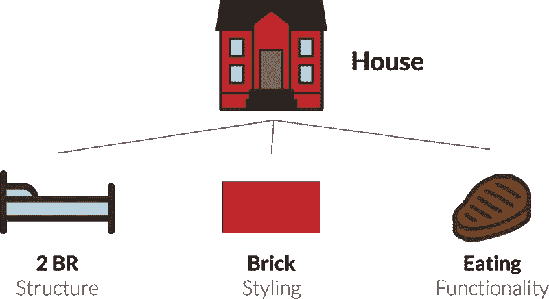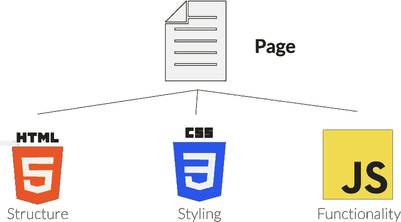

### 一个基本文件目录的例子

由于这三种语言各有不同的用途，所以 web 开发人员通常为每种语言使用单独的文件。这种想法被称为“[关注点分离](https://en.wikipedia.org/wiki/Separation_of_concerns)”——每个文件在整个站点中应该有不同的功能。

虽然从技术上来说，你可以将所有的代码包含在一个 HTML 文件中，但是随着你的站点的增长，这最终会导致重复的代码。

让我们看看创建一个完整的房子所需的代码。这三个文件必须在同一个**目录**——你电脑上的一个文件夹。在这种情况下，让我们把文件夹叫做*房子*。在我们的 house 文件夹中，每种类型都有一个文件。我将调用主 HTML 文件*索引*，主 CSS 文件*样式*，主 JavaScript 文件*脚本*。

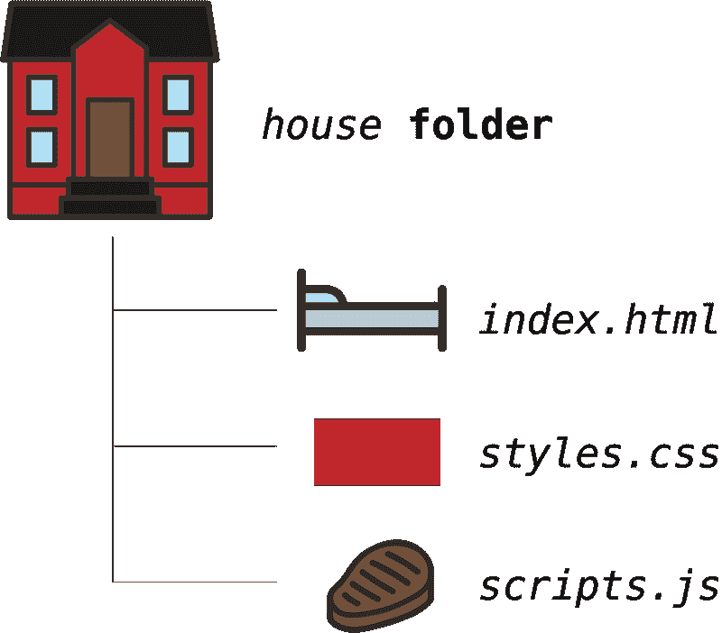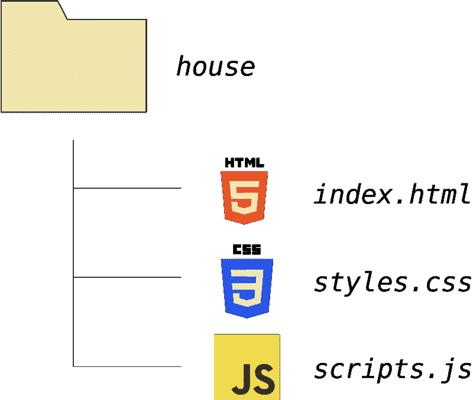

现在我们可以了解文件在代码中链接的方式。

我们的 HTML 文件实际上有三个独立的部分:

1.  `<he` ad >，你可以在其中加入元数据和谷歌字体等服务的链接。
2.  `<bo` dy >，其中包含实际的 HTML 元素。
3.  `<scri` pt >标签，可以链接到谷歌分析和 JavaScript 文件

现在，所有三个文件都包含在一个文件夹中，所以 HTML 文件中的文件路径非常简单。

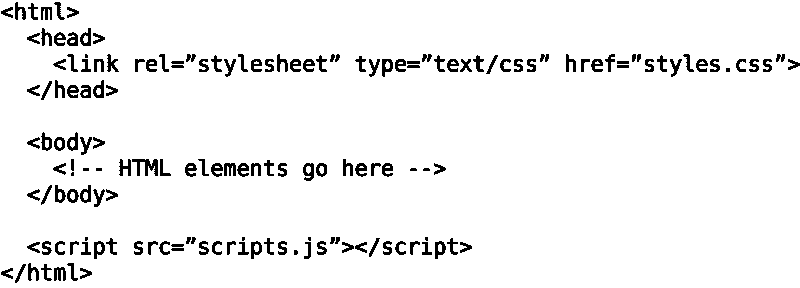

标签将允许你创建一个单独的样式表，用于所有使用 style s.css 文件的砖房。

并且`<scri` pt >标签允许你在 scri pts.js 文件中创建一组适用于任何类型的 home i *的函数。*

### 场景 1:一家新的披萨连锁店开业了(CSS 文件更改)

让我们看一个真实世界的例子。想象一下，在这个小区里，有一栋楼是一家披萨店，叫邻里披萨(很棒的名字)。但是，邻里披萨正在苦苦挣扎，达美乐(一家大型披萨连锁店)决定买下这块地产，转而为邻里服务。

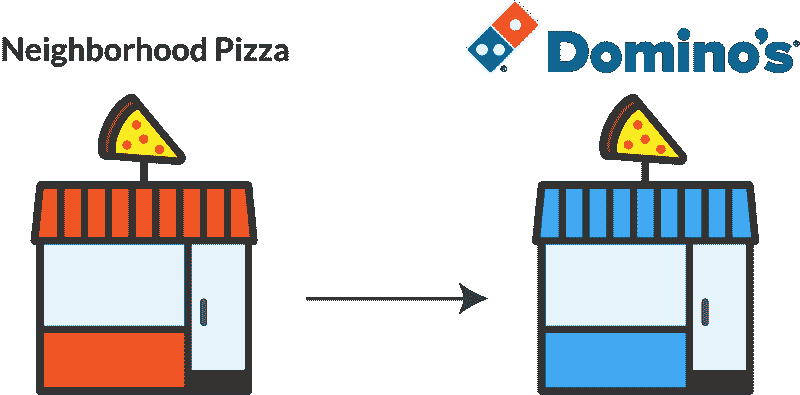

你知道这对代码意味着什么吗？

好吧，让我们仔细想想这三个部分。

1.  建筑的结构是一样的。还是那个披萨店。这就是 HTML。
2.  建筑的功能是一样的。它仍然存在是为了提供比萨饼，当顾客进来时，那是他们唯一期望的事情。这就是 JavaScript。
3.  但是建筑的造型和品牌是不同的！这意味着 CSS 是新的。

所以，我们现在已经创建了一个新的 CSS 文件(姑且称之为 *Dominos.css* )。我们需要创建一个名为*披萨*的文件夹，以显示我们现在正在谈论披萨店，并用 *dominos.css* 替换旧的 *styles.css* 文件。

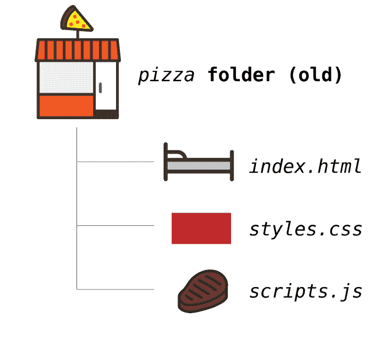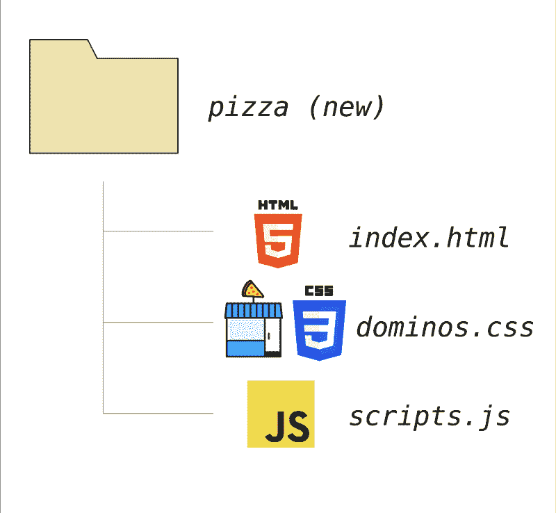

### 场景 2:一栋新的公寓楼

这是另一个例子。假设你的邻居正在经历一些中产阶级化。这意味着更富裕的居民正在搬进来，更昂贵的住房正在建造。一些房地产开发商决定买下很多有房子的地方，拆除房子，然后建一些漂亮的公寓。

让我们想想这对我们的文件系统意味着什么。

1.  功能是一样的。它还是一个家。这意味着 JavaScript 是一样的。
2.  CSS 必须是不同的，因为公寓建筑的风格不可能和房子一样！
3.  而且 HTML 文件肯定不一样，因为两栋楼结构完全不一样。

让我们把新的建筑叫做*apartment.html*，新的 CSS 叫做 *fancy.css* 。因为我们有了一个全新的 HTML 文件，我们不仅仅是链接一个新的 CSS 文件。整个页面都不一样了。它还链接到一个新的 CSS 文件。

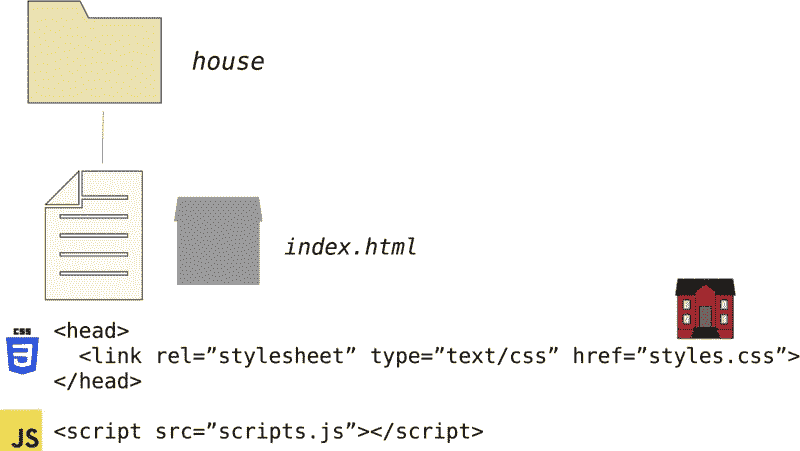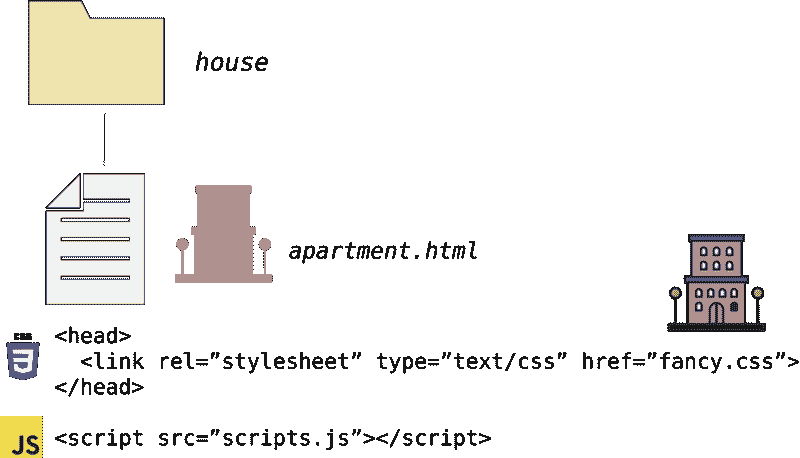

CSS 和 JavaScript 文件只是修改 HTML。它们需要在 HTML 文件中被引用才能被加载。这就是为什么在上图中，文件夹本身是相同的。但是 HTML 文件和将它链接到其他文件的代码是不同的。

### 创建包含多个文件夹的文件目录

到目前为止，我们一次只讨论了一种类型的建筑。但这有点像只有一个页面的网站——非常不寻常。甚至个人网站也可能有“关于”页面、“作品集”页面等等。那么当有多个建筑时会发生什么呢？你如何构建你的文件目录？

假设你的邻居有一家银行、一家购物中心和一家披萨店。这有点像一个有三页的网站。每一个都是一个 HTML 文件，链接着一个 CSS 文件和 JavaScript 文件。

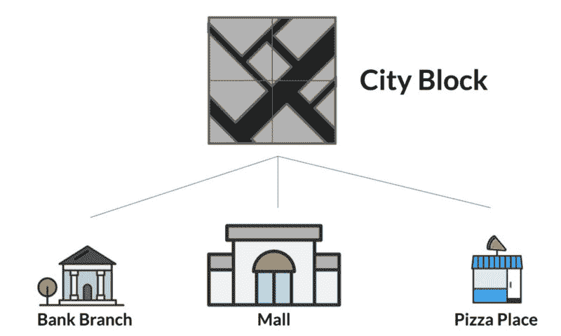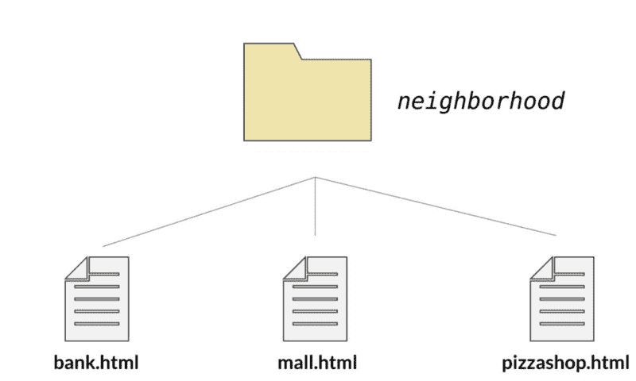

但是，请注意，我们没有在一个更大的邻居文件夹中使用三个子文件夹！虽然我们当然可以这样做，但许多前端开发人员喜欢为所有 JS 文件创建一个单独的*脚本*文件夹，并为所有 CSS 文件创建一个*样式*文件夹。

随着网站的发展，你会发现一些 CSS 和 JavaScript 是可重用的，并且可以链接到多个 HTML 文件。“脚本和样式”文件夹允许您组织工作并减少冗余代码。

在我们的示例中，您可以在商场和披萨店订购油腻的披萨。因此，您可能希望两者共享一个 JavaScript 文件，但在各自的 JavaScript 文件中也有独特的功能。

不管怎样，这是整个文件目录的潜在布局。

请注意，HTML 文件和文件夹在更大的*邻域*文件夹中的深度是相同的。为了引用同一级别文件夹中的文件，需要以文件夹名而不是文件名开始文件路径。因此，如果您想从 bank.html 内部引用 *bank.css* 文件，您可以使用`scripts/bank.css`作为文件路径。

### 获取最新教程

你喜欢这个教程吗？为它“鼓掌”，并在评论中让我知道。或者，通过订阅我的时事通讯来获取我最新的 web 开发解释: