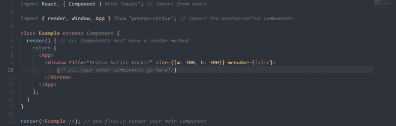
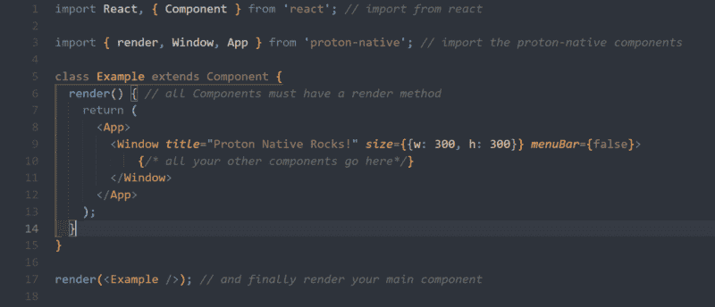
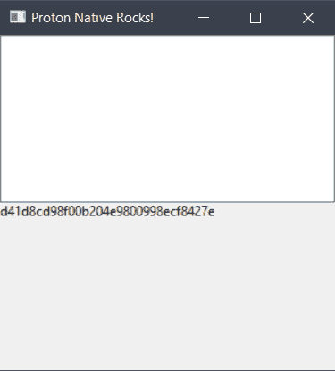
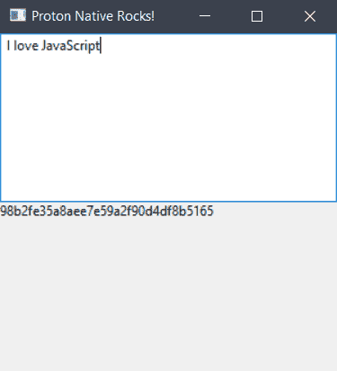

# 如何用 JavaScript 构建原生桌面应用(质子原生)

> 原文：<https://www.freecodecamp.org/news/build-native-desktop-apps-with-javascript-a49ede90d8e9/>

作者:穆罕默德·萨尔曼

# 如何用 JavaScript 构建原生桌面应用(质子原生)

在写这篇文章的时候，我想到了阿特伍德定律:

> 任何可以用 JavaScript 编写的应用程序，最终都会用 JavaScript 编写。杰夫·阿特伍德



don’t worry about it

[最初发布在我的博客上！](https://code.nimrey.me/how-to-build-native-desktop-apps-with-js/)

今天我们就来看看[质子原生](https://proton-native.js.org)，用它做一个简单的 app。

与**电子**应用不同，用**质子原生**构建的应用实际上是**原生**(因此得名)并且不是基于 chromium 的网络应用。

**质子原生**就像**反应原生**但是对于桌面来说。它编译成本地平台代码，所以它看起来和执行起来像一个本地应用。

所以让我们开始吧。

#### Windows 操作系统

通过运行以下命令安装构建工具:

```
npm install --global --production windows-build-tools
```

#### Linux 操作系统

您将需要这些库:

*   libgtk-3-dev
*   构建-基本

#### 苹果个人计算机

你什么都不需要。

现在运行以下命令:

```
npm install -g create-proton-app
```

和

```
create-proton-app my-app
```

做一个新项目。

用您喜欢的代码编辑器打开项目目录。该目录应该如下所示:

```
 └───node_modules
 ├───.babelrc
 ├───index.js
 ├───package.json
 └───package-lock.json
```

`index.js`应该是这样的:



*As you can see it look like React/React Native File*

就像任何 react 或 React 原生项目一样，我们导入 React 库并创建一个类组件。

`App`元素只是一个容纳`Window` 和`Menu`的容器，`Window`有三个道具:`title`(窗口标题)、`size`(获取一个包含窗口宽度和高度的对象)和`menuBar`(设置为 false，因为我们不想要菜单栏)。

在我们开始编码之前，让我们使用`npm`安装`crypto`:

```
npm i crypto
```

我们将使用`crypto`通过 MD5 算法对文本进行哈希运算。

### 索引. js

```
import React, { Component } from "react";
import { render, Window, App, Box, Text, TextInput } from "proton-native";
import crypto from "crypto";

class Example extends Component {
  state = { text: "", md5: "" };

  hash = text => {
    this.setState({ text });

    let md5 = crypto
      .createHash("md5")
      .update(text, "utf8")
      .digest("hex");

    this.setState({ md5 });
  };
  render() {
    return (
      <App>
        <Window
          title="Proton Native Rocks!"
          size={{ w: 300, h: 300 }}
          menuBar={false}
        >
          <Box>
            <TextInput onChange={text => this.hash(text)} />
            <Text>{this.state.md5}</Text>
          </Box>
        </Window>
      </App>
    );
  }
}

render(<Example />);
```

我首先导入了`Text`和`TextInput`，以便以后使用。然后在`class`中将`text`和`md5`设置为`state` 对象中的空字符串后，我创建了一个接受`text`参数的函数`hash`。

在`hash`函数中，我们将状态设置为`text`，并声明`md5`来存储加密文本(如下)

```
this.setState({ text });
let md5 = crypto.createHash("md5")
  .update(text, "utf8").digest("hex");
```

并将状态对象设置为更新后的`md5`。

```
this.setState({ md5 });
```

`render`方法返回某个`jsx`元素。`Box`元素就像 React 里的`div`，或者 React Native 里的`View`，持有`TextInput`和`Text`。这是因为父窗口元素不允许有多个子元素。

`TextInput`有一个`onChange`属性，每次文本改变时都会被调用。因此，我们将其设置为一个粗箭头函数，该函数接受一个`text`参数并返回我们之前声明的`hash`函数。

所以现在每次文本改变的时候，`text`都被散列并设置为`md5`。

现在如果我们用

```
npm run start
```

这个窗口应该会弹出:



如果我们输入一些文本，它会被哈希为 md5，如下所示:



你可能会说“它看起来很丑——让我们给它添加一些样式。”嗯，在写这篇文章的时候，质子原生仍然处于它的婴儿期。它有很多问题，并且不支持样式，但是这是一个有趣的项目。

如果你想为这个项目做贡献，请查看[回购](https://github.com/kusti8/proton-native)。

如果您有任何问题或建议，请随时发表评论或在 Twitter 上联系我 [@4msal4](https://twitter.com/4msal4) ，不要忘记点击那个鼓掌按钮:)

👇看看我以前的故事👇

[如何用 React Native 搭建新闻 app](https://medium.freecodecamp.org/create-a-news-app-using-react-native-ced249263627)。