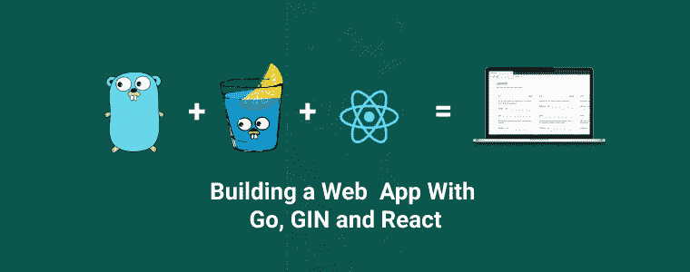
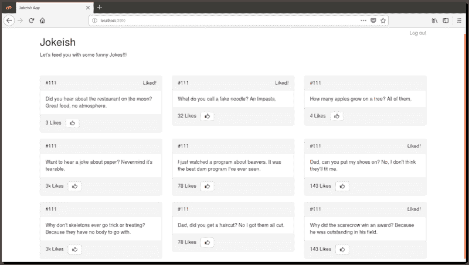
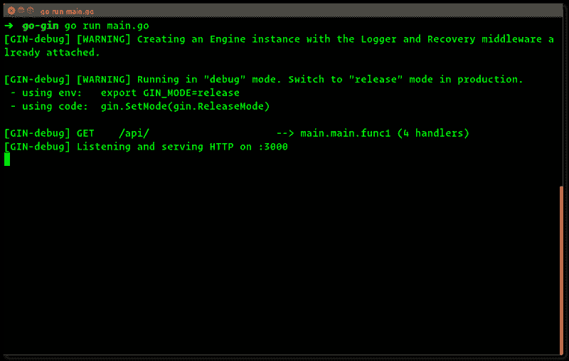
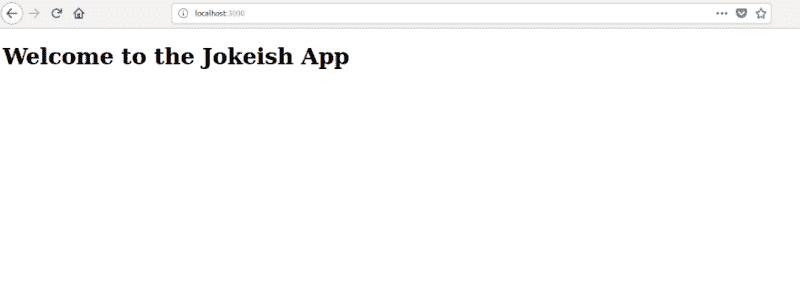
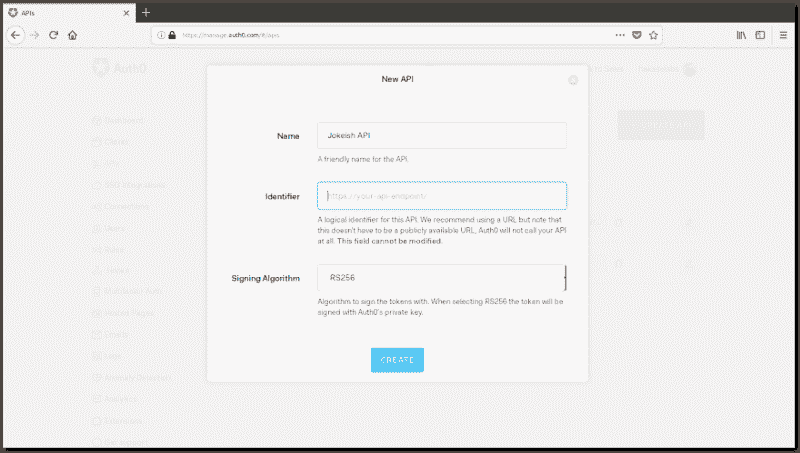
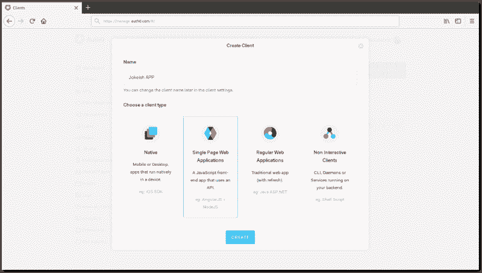
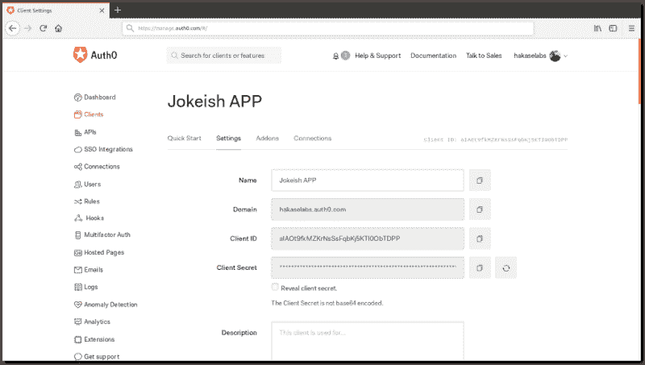
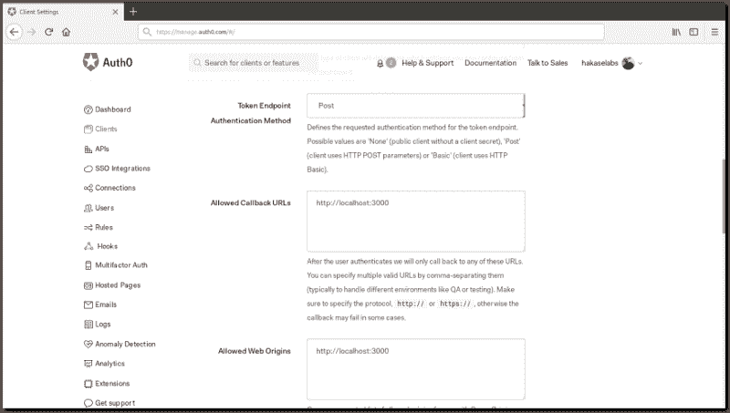
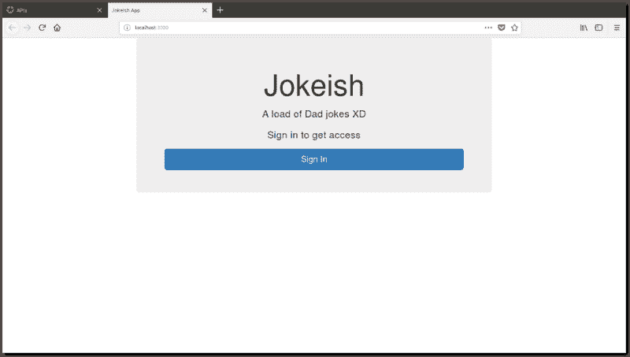
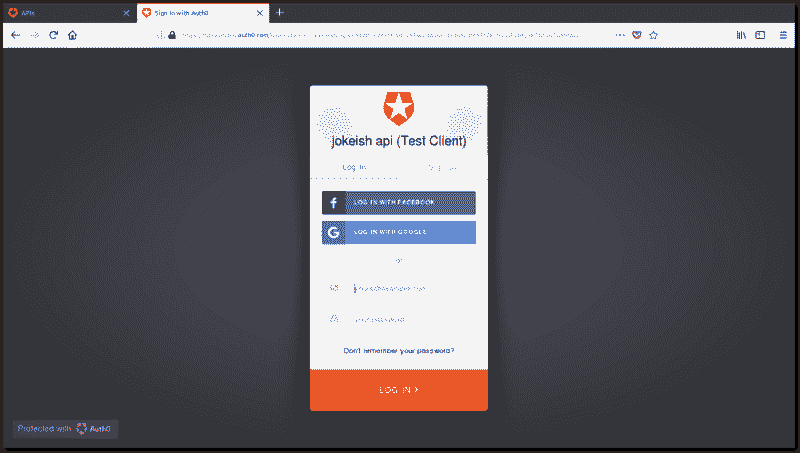

# 如何使用 Go、Gin 和 React 构建 web 应用程序

> 原文：<https://www.freecodecamp.org/news/how-to-build-a-web-app-with-go-gin-and-react-cffdc473576/>

弗朗西斯·桑迪

# 如何使用 Go、Gin 和 React 构建 web 应用程序



> *本文原载于[我的博客](https://hakaselogs.me/2018-04-20/building-a-web-app-with-go-gin-and-react)T3*

**TL；DR:** 在本教程中，我将向您展示用 Go 和 Gin 框架构建一个 web 应用程序并为其添加认证是多么容易。查看 Github [repo](https://github.com/codehakase/golang-gin) 获取我们将要编写的代码。

**Gin** 是一个高性能的微框架。它提供了一个非常简约的框架，只带有构建 web 应用程序和微服务所需的最基本的特性、库和功能。它使得从模块化的、可重用的部分构建请求处理管道变得简单。它通过允许您编写可以插入一个或多个请求处理程序或请求处理程序组的中间件来实现这一点。

### 杜松子酒特色

Gin 是一个快速、简单但功能齐全且非常高效的 Go web 框架。看看下面的一些特性，让它成为你下一个 Golang 项目值得考虑的框架。

*   **速度:**杜松子酒是为速度而生的。该框架提供了基于基数树的路由和较小的内存占用。没有反射。可预测的 API 性能。
*   **无崩溃** : Gin 有能力在运行时捕捉崩溃或混乱，并能从中恢复。这样，您的应用程序将始终可用。
*   **路由:** Gin 提供了一个路由接口，允许您表达 web 应用程序或 API 路由的外观。
*   JSON 验证: Gin 可以轻松地解析和验证 JSON 请求，检查所需值的存在。
*   错误管理: Gin 提供了一种方便的方法来收集 HTTP 请求期间发生的所有错误。最终，中间件可以将它们写入日志文件或数据库，并通过网络发送它们。
*   **内置渲染:** Gin 为 JSON、XML 和 HTML 渲染提供了一个易于使用的 API。

### 先决条件

按照本教程，你需要在你的机器上安装 Go，一个网页浏览器来查看应用程序，以及一个命令行来执行构建命令。

Go，或通常所说的 **Golang** ，是谷歌开发的一种用于构建现代软件的编程语言。Go 是一种旨在高效快速完成工作的语言。Go 的主要优势包括:

*   强类型和垃圾回收
*   极快的编译时间
*   内置的并发性
*   广泛的标准库

前往 Go 网站的[下载部分](https://golang.org/dl/)让 Go 在你的机器上运行。

### 用 Gin 构建应用程序

我们将用 **Gin** 构建一个简单的笑话列表应用程序。我们的应用程序会列出一些愚蠢的爸爸笑话。我们将为它添加身份验证，这样所有登录的用户都将有权喜欢和查看笑话。

这将允许我们演示如何使用 **Gin** 来开发 web 应用程序和/或 API。



我们将利用 Gin 提供的以下功能:

*   中间件
*   按指定路线发送
*   路线分组

### 准备，就位，开始

我们将在一个`main.go`文件中编写整个 Go 应用程序。因为这是一个小应用程序，所以只需从终端使用`go run`就可以轻松构建应用程序。

我们将在 Go 工作区中创建一个新目录`golang-gin`，然后在其中创建一个`main.go`文件:

```
$ mkdir -p $GOPATH/src/github.com/user/golang-gin
$ cd $GOPATH/src/github.com/user/golang-gin
$ touch main.go
```

`main.go`文件的内容:

```
package main

import (
  "net/http"

  "github.com/gin-gonic/contrib/static"
  "github.com/gin-gonic/gin"
)

func main() {
  // Set the router as the default one shipped with Gin
  router := gin.Default()

  // Serve frontend static files
  router.Use(static.Serve("/", static.LocalFile("./views", true)))

  // Setup route group for the API
  api := router.Group("/api")
  {
    api.GET("/", func(c *gin.Context) {
      c.JSON(http.StatusOK, gin.H {
        "message": "pong",
      })
    })
  }

  // Start and run the server
  router.Run(":3000")
}
```

我们需要为静态文件创建更多的目录。在与`main.go`文件相同的目录中，我们创建一个`views`文件夹。在`views`文件夹中，创建一个`js`文件夹和一个`index.html`文件。

现在,`index.html`文件非常简单:

```
<!DOCTYPE html>
<html>
<head>
  <title>Jokeish App</title>
</head>

<body>
  <h1>Welcome to the Jokeish App</h1>
</body>
</html>
```

在测试我们目前所拥有的内容之前，让我们安装添加的依赖项:

```
$ go get -u github.com/gin-gonic/gin
$ go get -u github.com/gin-gonic/contrib/static
```

为了查看什么在工作，我们需要通过运行`go run main.go`来启动我们的服务器。



应用程序运行后，在浏览器中导航至`http://localhost:3000`。如果一切顺利，你应该看到 1 级标题文本**欢迎使用 Jokeish 应用程序**显示。



### 定义 API

让我们在我们的`main.go`文件中为我们的 API 定义添加更多的代码。我们将用两条路线`/jokes/`和`/jokes/like/:jokeID`更新我们的`main`功能，到达路线组`/api/`。

```
func main() {
  // ... leave the code above untouched...

  // Our API will consit of just two routes
  // /jokes - which will retrieve a list of jokes a user can see
  // /jokes/like/:jokeID - which will capture likes sent to a particular joke
  api.GET("/jokes", JokeHandler)
  api.POST("/jokes/like/:jokeID", LikeJoke)
}

// JokeHandler retrieves a list of available jokes
func JokeHandler(c *gin.Context) {
  c.Header("Content-Type", "application/json")
  c.JSON(http.StatusOK, gin.H {
    "message":"Jokes handler not implemented yet",
  })
}

// LikeJoke increments the likes of a particular joke Item
func LikeJoke(c *gin.Context) {
  c.Header("Content-Type", "application/json")
  c.JSON(http.StatusOK, gin.H {
    "message":"LikeJoke handler not implemented yet",
  })
}
```

`main.go`文件的内容应该是这样的:

```
package main

import (
  "net/http"

  "github.com/gin-gonic/contrib/static"
  "github.com/gin-gonic/gin"
)

func main() {
  // Set the router as the default one shipped with Gin
  router := gin.Default()

  // Serve frontend static files
  router.Use(static.Serve("/", static.LocalFile("./views", true)))

  // Setup route group for the API
  api := router.Group("/api")
  {
    api.GET("/", func(c *gin.Context) {
      c.JSON(http.StatusOK, gin.H {
        "message": "pong",
      })
    })
  }
  // Our API will consit of just two routes
  // /jokes - which will retrieve a list of jokes a user can see
  // /jokes/like/:jokeID - which will capture likes sent to a particular joke
  api.GET("/jokes", JokeHandler)
  api.POST("/jokes/like/:jokeID", LikeJoke)

  // Start and run the server
  router.Run(":3000")
}

// JokeHandler retrieves a list of available jokes
func JokeHandler(c *gin.Context) {
  c.Header("Content-Type", "application/json")
  c.JSON(http.StatusOK, gin.H {
    "message":"Jokes handler not implemented yet",
  })
}

// LikeJoke increments the likes of a particular joke Item
func LikeJoke(c *gin.Context) {
  c.Header("Content-Type", "application/json")
  c.JSON(http.StatusOK, gin.H {
    "message":"LikeJoke handler not implemented yet",
  })
}
```

让我们再次运行我们的应用程序`go run main.go`，并访问我们的路线。`http://localhost:3000/api/jokes`将返回一个`200 OK`头响应，带有消息`jokes handler not implemented yet`。对`http://localhost:3000/api/jokes/like/1`的 POST 请求返回一个`200 OK`报头和消息`Likejoke handler not implemented yet`。

### 笑话数据

因为我们已经有了 routes 定义集，它只做一件事(返回一个 JSON 响应)，所以我们将通过添加一些代码来增加代码库的味道。

```
// ... leave the code above untouched...

// Let's create our Jokes struct. This will contain information about a Joke

// Joke contains information about a single Joke
type Joke struct {
  ID     int     `json:"id" binding:"required"`
  Likes  int     `json:"likes"`
  Joke   string  `json:"joke" binding:"required"`
}

// We'll create a list of jokes
var jokes = []Joke{
  Joke{1, 0, "Did you hear about the restaurant on the moon? Great food, no atmosphere."},
  Joke{2, 0, "What do you call a fake noodle? An Impasta."},
  Joke{3, 0, "How many apples grow on a tree? All of them."},
  Joke{4, 0, "Want to hear a joke about paper? Nevermind it's tearable."},
  Joke{5, 0, "I just watched a program about beavers. It was the best dam program I've ever seen."},
  Joke{6, 0, "Why did the coffee file a police report? It got mugged."},
  Joke{7, 0, "How does a penguin build it's house? Igloos it together."},
}

func main() {
  // ... leave this block untouched...
}

// JokeHandler retrieves a list of available jokes
func JokeHandler(c *gin.Context) {
  c.Header("Content-Type", "application/json")
  c.JSON(http.StatusOK, jokes)
}

// LikeJoke increments the likes of a particular joke Item
func LikeJoke(c *gin.Context) {
  // confirm Joke ID sent is valid
  // remember to import the `strconv` package
  if jokeid, err := strconv.Atoi(c.Param("jokeID")); err == nil {
    // find joke, and increment likes
    for i := 0; i < len(jokes); i++ {
      if jokes[i].ID == jokeid {
        jokes[i].Likes += 1
      }
    }
    // return a pointer to the updated jokes list
    c.JSON(http.StatusOK, &jokes)
  } else {
    // Joke ID is invalid
    c.AbortWithStatus(http.StatusNotFound)
  }
}

// NB: Replace the JokeHandler and LikeJoke functions in the previous version to the ones above
```

我们的代码看起来不错，让我们继续测试我们的 API。我们可以用`cURL`或`postman`进行测试，然后向`http://localhost:3000/jokes`发送一个`GET`请求以获得笑话的完整列表，向`http://localhost:3000/jokes/like/{jokeid}`发送一个`POST`请求以增加对笑话的喜欢。

```
$ curl http://localhost:3000/api/jokes

$ curl -X POST http://localhost:3000/api/jokes/like/4
```

### 构建用户界面(React)

我们已经有了 API，所以让我们构建一个前端来呈现来自 API 的数据。为此，我们将使用 React。我们不会太深入 React，因为这超出了本教程的范围。如果你需要了解更多关于 React 的知识，请查阅官方[教程](https://facebook.github.io/react/docs/tutorial.html)。你可以用任何你喜欢的前端框架来实现 UI。

### 设置

我们将编辑`index.html`文件来添加运行 React 所需的外部库。然后我们需要在`views/js`目录下创建一个`app.jsx`文件，其中包含我们的 React 代码。

我们的`index.html`文件应该是这样的:

```
<!DOCTYPE html>
<html>

<head>
  <meta charset="UTF-8" />
  <meta name="viewport" content="width=device-width, initial-scale=1.0, maximum-scale=1.0, user-scalable=no" />
  <title>Jokeish App</title>
  <script src="http://code.jquery.com/jquery-2.1.4.min.js"></script>
  <script src="https://cdn.auth0.com/js/auth0/9.0/auth0.min.js"></script>
  <script type="application/javascript" src="https://unpkg.com/react@16.0.0/umd/react.production.min.js"></script>
  <script type="application/javascript" src="https://unpkg.com/react-dom@16.0.0/umd/react-dom.production.min.js"></script>
  <script type="application/javascript" src="https://unpkg.com/babel-standalone@6.26.0/babel.js"></script>
  <script type="text/babel" src="js/app.jsx"></script>
  <link href="https://maxcdn.bootstrapcdn.com/bootstrap/3.3.6/css/bootstrap.min.css" rel="stylesheet">
</head>

<body>
  <div id="app"></div>
</body>

</html>
```

### 构建我们的组件

在 React 中，视图被分解成组件。我们需要构建一些组件:

*   一个`App`组件作为启动应用程序的主入口
*   一个面向未登录用户的`Home`组件
*   一个`LoggedIn`组件，其内容只对经过身份验证的用户可见
*   和显示笑话列表的`Joke`组件。

我们将在`app.jsx`文件中写入所有这些组件。

### 应用程序组件

这个组件启动了我们整个 React 应用程序。它根据用户是否经过身份验证来决定显示哪个组件。我们将从它的基础开始，然后用更多的功能更新它。

```
class App extends React.Component {
  render() {
    if (this.loggedIn) {
      return (<LoggedIn />);
    } else {
      return (<Home />);
    }
  }
}
```

### 家用部件

该组件向未登录的用户显示，同时显示一个按钮，打开一个托管锁定屏幕，用户可以在那里注册或登录。我们稍后会添加这个功能。

```
class Home extends React.Component {
  render() {
    return (
      <div className="container">
        <div className="col-xs-8 col-xs-offset-2 jumbotron text-center">
          <h1>Jokeish</h1>
          <p>A load of Dad jokes XD</p>
          <p>Sign in to get access </p>
          <a onClick={this.authenticate} className="btn btn-primary btn-lg btn-login btn-block">Sign In</a>
        </div>
      </div>
    )
  }
}
```

### 登录组件

该组件在用户通过身份验证时显示。它在它的`state`中存储了一个笑话数组，该数组在组件挂载时被填充。

```
class LoggedIn extends React.Component {
  constructor(props) {
    super(props);
    this.state = {
      jokes: []
    }
  }

  render() {
    return (
      <div className="container">
        <div className="col-lg-12">
          <br />
          <span className="pull-right"><a onClick={this.logout}>Log out</a></span>
          <h2>Jokeish</h2>
          <p>Let's feed you with some funny Jokes!!!</p>
          <div className="row">
            {this.state.jokes.map(function(joke, i){
              return (<Joke key={i} joke={joke} />);
            })}
          </div>
        </div>
      </div>
    )
  }
}
```

### 笑话成分

`Joke`组件将包含来自要显示的笑话响应的每个条目的信息。

```
class Joke extends React.Component {
  constructor(props) {
    super(props);
    this.state = {
      liked: ""
    }
    this.like = this.like.bind(this);
  }

  like() {
    // ... we'll add this block later
  }

  render() {
    return (
      <div className="col-xs-4">
        <div className="panel panel-default">
          <div className="panel-heading">#{this.props.joke.id} <span className="pull-right">{this.state.liked}</span></div>
          <div className="panel-body">
            {this.props.joke.joke}
          </div>
          <div className="panel-footer">
            {this.props.joke.likes} Likes &nbsp;
            <a onClick={this.like} className="btn btn-default">
              <span className="glyphicon glyphicon-thumbs-up"></span>
            </a>
          </div>
        </div>
      </div>
    )
  }
}
```

我们已经编写了我们的组件，所以现在让我们告诉 React 在哪里呈现应用程序。我们将把下面的代码块添加到我们的`app.jsx`文件的底部。

```
ReactDOM.render(<App />, document.getElementById('app'));
```

让我们重启我们的 Go 服务器`go run main.go`，并前往我们的应用程序的 URL `http://localhost:3000/`。你会看到`Home`组件正在被渲染。


### 使用 Auth0 保护我们的笑话应用

用户每次登录时，Auth0 都会发出 [JSON Web 令牌](https://jwt.io/)。这意味着你可以拥有一个稳固的[身份基础设施](https://auth0.com/docs/identityproviders)，包括[单点登录](https://auth0.com/docs/sso/single-sign-on)，用户管理，对社交身份提供商(脸书，Github，Twitter 等)的支持。)、企业身份提供者(Active Directory、LDAP、SAML 等。)和您自己的用户数据库，只需几行代码。

通过使用 Auth0，我们可以很容易地在我们的 GIN 应用程序中设置认证。你需要一个账户来跟进这一部分。如果您还没有 Auth0 帐户，[现在就注册一个](https://auth0.com/signup)。

> *免责声明:这不是赞助内容。*

### 创建 API 客户端

我们的令牌将使用 Auth0 生成，因此我们需要从我们的 Auth0 仪表板创建一个 API 和一个客户端。同样，如果你还没有注册，请[注册](https://auth0.com/signup)一个 Auth0 帐户。

要创建一个新的 API，导航到仪表板中的[API 部分](https://manage.auth0.com/#/apis)，并点击**创建 API** 按钮。



选择一个 API **名称**和一个**标识符**。标识符将是中间件的**受众**。**签名算法**应该是 **RS256** 。

要创建新的客户端，请导航到您的仪表板中的[客户端部分](https://dev.to/codehakase/building-a-web-app-with-go-gin-and-react-5ke)，并单击**创建客户端**按钮。选择类型`Regular Web Applications`。



一旦创建了客户端，记下`client_id`和`client_secret`，因为我们稍后会用到它们。



我们必须将 API 所需的凭证添加到环境变量中。在根目录中，创建一个新文件`.env`，并向其中添加以下内容，以及来自 Auth0 仪表板的详细信息:

```
export AUTH0_API_CLIENT_SECRET=""
export AUTH0_CLIENT_ID=""
export AUTH0_DOMAIN="yourdomain.auth0.com"
export AUTH0_API_AUDIENCE=""
```

### 保护我们的 API 端点

目前，我们的 API 对全世界开放。我们需要保护我们的终端，因此只有授权用户才能访问它们。

我们将利用一个 **JWT 中间件**来检查到达我们端点的每个请求的有效 **JSON Web 令牌**。

让我们创建我们的中间件:

```
// ...

var jwtMiddleWare *jwtmiddleware.JWTMiddleware

func main() {
  jwtMiddleware := jwtmiddleware.New(jwtmiddleware.Options{
    ValidationKeyGetter: func(token *jwt.Token) (interface{}, error) {
      aud := os.Getenv("AUTH0_API_AUDIENCE")
      checkAudience := token.Claims.(jwt.MapClaims).VerifyAudience(aud, false)
      if !checkAudience {
        return token, errors.New("Invalid audience.")
      }
      // verify iss claim
      iss := os.Getenv("AUTH0_DOMAIN")
      checkIss := token.Claims.(jwt.MapClaims).VerifyIssuer(iss, false)
      if !checkIss {
        return token, errors.New("Invalid issuer.")
      }

      cert, err := getPemCert(token)
      if err != nil {
        log.Fatalf("could not get cert: %+v", err)
      }

      result, _ := jwt.ParseRSAPublicKeyFromPEM([]byte(cert))
      return result, nil
    },
    SigningMethod: jwt.SigningMethodRS256,
  })

  // register our actual jwtMiddleware
  jwtMiddleWare = jwtMiddleware

  // ... the rest of the code below this function doesn't change yet
}

// authMiddleware intercepts the requests, and check for a valid jwt token
func authMiddleware() gin.HandlerFunc {
  return func(c *gin.Context) {
    // Get the client secret key
    err := jwtMiddleWare.CheckJWT(c.Writer, c.Request)
    if err != nil {
      // Token not found
      fmt.Println(err)
      c.Abort()
      c.Writer.WriteHeader(http.StatusUnauthorized)
      c.Writer.Write([]byte("Unauthorized"))
      return
    }
  }
}
```

在上面的代码中，我们有一个新的`jwtMiddleWare`变量，它在`main`函数中初始化。它用于`authMiddleware`中间函数。

如果你注意到，我们正在从环境变量中提取我们的服务器端凭证(这是一个 **12 因素应用**的原则之一)。我们的中间件检查并接收来自请求的令牌，并调用`jwtMiddleWare.CheckJWT`方法来验证发送的令牌。

让我们也编写返回 JSON Web 密钥的函数:

```
// ... the code above is untouched...

// Jwks stores a slice of JSON Web Keys
type Jwks struct {
  Keys []JSONWebKeys `json:"keys"`
}

type JSONWebKeys struct {
  Kty string   `json:"kty"`
  Kid string   `json:"kid"`
  Use string   `json:"use"`
  N   string   `json:"n"`
  E   string   `json:"e"`
  X5c []string `json:"x5c"`
}

func main() {
  // ... the code in this method is untouched...
}

func getPemCert(token *jwt.Token) (string, error) {
  cert := ""
  resp, err := http.Get(os.Getenv("AUTH0_DOMAIN") + ".well-known/jwks.json")
  if err != nil {
    return cert, err
  }
  defer resp.Body.Close()

  var jwks = Jwks{}
  err = json.NewDecoder(resp.Body).Decode(&jwks)

  if err != nil {
    return cert, err
  }

  x5c := jwks.Keys[0].X5c
  for k, v := range x5c {
    if token.Header["kid"] == jwks.Keys[k].Kid {
      cert = "-----BEGIN CERTIFICATE-----\n" + v + "\n-----END CERTIFICATE-----"
    }
  }

  if cert == "" {
    return cert, errors.New("unable to find appropriate key.")
  }

  return cert, nil
}
```

### 使用 JWT 中间件

使用中间件非常简单。我们只是将它作为参数传递给我们的路由定义。

```
...

api.GET("/jokes", authMiddleware(), JokeHandler)
api.POST("/jokes/like/:jokeID", authMiddleware(), LikeJoke)

...
```

我们的`main.go`文件应该是这样的:

```
package main

import (
  "encoding/json"
  "errors"
  "fmt"
  "log"
  "net/http"
  "os"
  "strconv"

  jwtmiddleware "github.com/auth0/go-jwt-middleware"
  jwt "github.com/dgrijalva/jwt-go"
  "github.com/gin-gonic/contrib/static"
  "github.com/gin-gonic/gin"
)

type Response struct {
  Message string `json:"message"`
}

type Jwks struct {
  Keys []JSONWebKeys `json:"keys"`
}

type JSONWebKeys struct {
  Kty string   `json:"kty"`
  Kid string   `json:"kid"`
  Use string   `json:"use"`
  N   string   `json:"n"`
  E   string   `json:"e"`
  X5c []string `json:"x5c"`
}

type Joke struct {
  ID    int    `json:"id" binding:"required"`
  Likes int    `json:"likes"`
  Joke  string `json:"joke" binding:"required"`
}

/** we'll create a list of jokes */
var jokes = []Joke{
  Joke{1, 0, "Did you hear about the restaurant on the moon? Great food, no atmosphere."},
  Joke{2, 0, "What do you call a fake noodle? An Impasta."},
  Joke{3, 0, "How many apples grow on a tree? All of them."},
  Joke{4, 0, "Want to hear a joke about paper? Nevermind it's tearable."},
  Joke{5, 0, "I just watched a program about beavers. It was the best dam program I've ever seen."},
  Joke{6, 0, "Why did the coffee file a police report? It got mugged."},
  Joke{7, 0, "How does a penguin build it's house? Igloos it together."},
}

var jwtMiddleWare *jwtmiddleware.JWTMiddleware

func main() {
  jwtMiddleware := jwtmiddleware.New(jwtmiddleware.Options{
    ValidationKeyGetter: func(token *jwt.Token) (interface{}, error) {
      aud := os.Getenv("AUTH0_API_AUDIENCE")
      checkAudience := token.Claims.(jwt.MapClaims).VerifyAudience(aud, false)
      if !checkAudience {
        return token, errors.New("Invalid audience.")
      }
      // verify iss claim
      iss := os.Getenv("AUTH0_DOMAIN")
      checkIss := token.Claims.(jwt.MapClaims).VerifyIssuer(iss, false)
      if !checkIss {
        return token, errors.New("Invalid issuer.")
      }

      cert, err := getPemCert(token)
      if err != nil {
        log.Fatalf("could not get cert: %+v", err)
      }

      result, _ := jwt.ParseRSAPublicKeyFromPEM([]byte(cert))
      return result, nil
    },  
    SigningMethod: jwt.SigningMethodRS256,
  })

  jwtMiddleWare = jwtMiddleware
  // Set the router as the default one shipped with Gin
  router := gin.Default()

  // Serve the frontend
  router.Use(static.Serve("/", static.LocalFile("./views", true)))

  api := router.Group("/api")
  {
    api.GET("/", func(c *gin.Context) {
      c.JSON(http.StatusOK, gin.H{
        "message": "pong",
      })
    })
    api.GET("/jokes", authMiddleware(), JokeHandler)
    api.POST("/jokes/like/:jokeID", authMiddleware(), LikeJoke)
  }
  // Start the app
  router.Run(":3000")
}

func getPemCert(token *jwt.Token) (string, error) {
  cert := ""
  resp, err := http.Get(os.Getenv("AUTH0_DOMAIN") + ".well-known/jwks.json")
  if err != nil {
    return cert, err
  }
  defer resp.Body.Close()

  var jwks = Jwks{}
  err = json.NewDecoder(resp.Body).Decode(&jwks)

  if err != nil {
    return cert, err
  }

  x5c := jwks.Keys[0].X5c
  for k, v := range x5c {
    if token.Header["kid"] == jwks.Keys[k].Kid {
      cert = "-----BEGIN CERTIFICATE-----\n" + v + "\n-----END CERTIFICATE-----"
    }
  }

  if cert == "" {
    return cert, errors.New("unable to find appropriate key")
  }

  return cert, nil
}

// authMiddleware intercepts the requests, and check for a valid jwt token
func authMiddleware() gin.HandlerFunc {
  return func(c *gin.Context) {
    // Get the client secret key
    err := jwtMiddleWare.CheckJWT(c.Writer, c.Request)
    if err != nil {
      // Token not found
      fmt.Println(err)
      c.Abort()
      c.Writer.WriteHeader(http.StatusUnauthorized)
      c.Writer.Write([]byte("Unauthorized"))
      return
    }
  }
}

// JokeHandler returns a list of jokes available (in memory)
func JokeHandler(c *gin.Context) {
  c.Header("Content-Type", "application/json")

  c.JSON(http.StatusOK, jokes)
}

func LikeJoke(c *gin.Context) {
  // Check joke ID is valid
  if jokeid, err := strconv.Atoi(c.Param("jokeID")); err == nil {
    // find joke and increment likes
    for i := 0; i < len(jokes); i++ {
      if jokes[i].ID == jokeid {
        jokes[i].Likes = jokes[i].Likes + 1
      }
    }
    c.JSON(http.StatusOK, &jokes)
  } else {
    // the jokes ID is invalid
    c.AbortWithStatus(http.StatusNotFound)
  }
}
```

让我们安装`jwtmiddleware`库:

```
$ go get -u github.com/auth0/go-jwt-middleware
$ go get -u github.com/dgrijalva/jwt-go
```

让我们获取环境文件，并重启我们的应用服务器:

```
$ source .env
$ go run main.go
```

现在，如果我们尝试访问任何端点，我们将面临一个`401 Unauthorized`错误。这是因为我们需要随请求一起发送一个令牌。

### 使用 Auth0 登录并反应

让我们实现一个登录系统，以便用户可以登录或创建帐户，并获得我们的笑话。我们将把以下 Auth0 凭证添加到我们的`app.jsx`文件中:

*   `AUTH0_CLIENT_ID`
*   `AUTH0_DOMAIN`
*   `AUTH0_CALLBACK_URL` -你的应用程序的网址
*   `AUTH0_API_AUDIENCE`

> *您可以从您的 Auth0 [管理仪表板](https://manage.auth0.com/)中找到`AUTH0_CLIENT_ID`、`AUTH0_DOMAIN`和`AUTH0_API_AUDIENCE`数据。*

我们需要设置一个 Auth0 重定向到的`callback`。导航到仪表板中的“Clients”部分。在设置中，我们将回拨设置为`[http://localhost:3000](http://localhost:3000:)` [:](http://localhost:3000:)



有了凭证，让我们更新 React 组件。

#### 应用程序组件

```
const AUTH0_CLIENT_ID = "aIAOt9fkMZKrNsSsFqbKj5KTI0ObTDPP";
const AUTH0_DOMAIN = "hakaselabs.auth0.com";
const AUTH0_CALLBACK_URL = location.href;
const AUTH0_API_AUDIENCE = "golang-gin";

class App extends React.Component {
  parseHash() {
    this.auth0 = new auth0.WebAuth({
      domain: AUTH0_DOMAIN,
      clientID: AUTH0_CLIENT_ID
    });
    this.auth0.parseHash(window.location.hash, (err, authResult) => {
      if (err) {
        return console.log(err);
      }
      if (
        authResult !== null &&
        authResult.accessToken !== null &&
        authResult.idToken !== null
      ) {
        localStorage.setItem("access_token", authResult.accessToken);
        localStorage.setItem("id_token", authResult.idToken);
        localStorage.setItem(
          "profile",
          JSON.stringify(authResult.idTokenPayload)
        );
        window.location = window.location.href.substr(
          0,
          window.location.href.indexOf("#")
        );
      }
    });
  }

  setup() {
    $.ajaxSetup({
      beforeSend: (r) => {
        if (localStorage.getItem("access_token")) {
          r.setRequestHeader(
            "Authorization",
            "Bearer " + localStorage.getItem("access_token")
          );
        }
      }
    });
  }
  setState() {
    let idToken = localStorage.getItem("id_token");
    if (idToken) {
      this.loggedIn = true;
    } else {
      this.loggedIn = false;
    }
  }

  componentWillMount() {
    this.setup();
    this.parseHash();
    this.setState();
  }

  render() {
    if (this.loggedIn) {
      return <LoggedIn />;
    }
    return <Home />;
  }
}
```

我们用三个组件方法(`setup`、`parseHash`和`setState`)和一个生命周期方法`componentWillMount`更新了 App 组件。`parseHash`方法初始化`auth0` `webAuth`客户端，并将散列解析为可读性更好的格式，保存到 localSt。为了显示锁定屏幕，捕获并存储用户令牌，并向我们的 API 的任何请求添加正确的授权头

#### 家用部件

我们的主页组件将被更新。我们将为`authenticate`方法添加功能，这将触发托管锁定屏幕显示，并允许我们的用户登录或注册。

```
class Home extends React.Component {
  constructor(props) {
    super(props);
    this.authenticate = this.authenticate.bind(this);
  }
  authenticate() {
    this.WebAuth = new auth0.WebAuth({
      domain: AUTH0_DOMAIN,
      clientID: AUTH0_CLIENT_ID,
      scope: "openid profile",
      audience: AUTH0_API_AUDIENCE,
      responseType: "token id_token",
      redirectUri: AUTH0_CALLBACK_URL
    });
    this.WebAuth.authorize();
  }

  render() {
    return (
      <div className="container">
        <div className="row">
          <div className="col-xs-8 col-xs-offset-2 jumbotron text-center">
            <h1>Jokeish</h1>
            <p>A load of Dad jokes XD</p>
            <p>Sign in to get access </p>
            <a
              onClick={this.authenticate}
              className="btn btn-primary btn-lg btn-login btn-block"
            >
              Sign In
            </a>
          </div>
        </div>
      </div>
    );
  }
}
```

#### 登录组件

我们将更新`LoggedIn`组件，以便与我们的 API 进行通信，并提取所有笑话。它将把每个笑话作为一个`prop`传递给`Joke`组件，后者呈现一个引导面板。让我们写下这些:

```
class LoggedIn extends React.Component {
  constructor(props) {
    super(props);
    this.state = {
      jokes: []
    };

    this.serverRequest = this.serverRequest.bind(this);
    this.logout = this.logout.bind(this);
  }

  logout() {
    localStorage.removeItem("id_token");
    localStorage.removeItem("access_token");
    localStorage.removeItem("profile");
    location.reload();
  }

  serverRequest() {
    $.get("http://localhost:3000/api/jokes", res => {
      this.setState({
        jokes: res
      });
    });
  }

  componentDidMount() {
    this.serverRequest();
  }

  render() {
    return (
      <div className="container">
        <br />
        <span className="pull-right">
          <a onClick={this.logout}>Log out</a>
        </span>
        <h2>Jokeish</h2>
        <p>Let's feed you with some funny Jokes!!!</p>
        <div className="row">
          <div className="container">
            {this.state.jokes.map(function(joke, i) {
              return <Joke key={i} joke={joke} />;
            })}
          </div>
        </div>
      </div>
    );
  }
}
```

#### 笑话成分

我们还将更新`Joke`组件来格式化从父组件(`LoggedIn`)传递给它的每个笑话条目。我们还将添加一个`like`方法，这将增加像一个笑话。

```
class Joke extends React.Component {
  constructor(props) {
    super(props);
    this.state = {
      liked: "",
      jokes: []
    };
    this.like = this.like.bind(this);
    this.serverRequest = this.serverRequest.bind(this);
  }

  like() {
    let joke = this.props.joke;
    this.serverRequest(joke);
  }
  serverRequest(joke) {
    $.post(
      "http://localhost:3000/api/jokes/like/" + joke.id,
      { like: 1 },
      res => {
        console.log("res... ", res);
        this.setState({ liked: "Liked!", jokes: res });
        this.props.jokes = res;
      }
    );
  }

  render() {
    return (
      <div className="col-xs-4">
        <div className="panel panel-default">
          <div className="panel-heading">
            #{this.props.joke.id}{" "}
            <span className="pull-right">{this.state.liked}</span>
          </div>
          <div className="panel-body">{this.props.joke.joke}</div>
          <div className="panel-footer">
            {this.props.joke.likes} Likes &nbsp;
            <a onClick={this.like} className="btn btn-default">
              <span className="glyphicon glyphicon-thumbs-up" />
            </a>
          </div>
        </div>
      </div>
    )
  }
}
```

### 把所有的放在一起

UI 和 API 完成后，我们就可以测试我们的应用程序了。我们将从启动服务器`source .env && go run main.go`开始，然后从任何浏览器导航到`http://localhost:3000`。您应该看到带有登录按钮的`Home`组件。点击登录按钮将重定向到托管锁页面(创建帐户或登录)以继续使用该应用程序。

**首页:**



**Auth0 托管锁屏:**



**登录应用视图:**


### 结论

恭喜你。您已经学习了如何使用 Go 和 Gin 框架构建应用程序和 API。

我错过了什么重要的事情吗？请在评论中告诉我。

你可以在推特上跟我打招呼