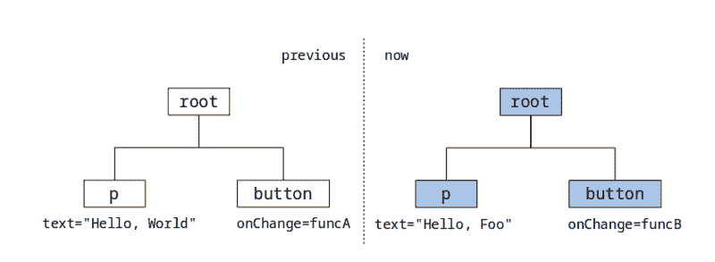
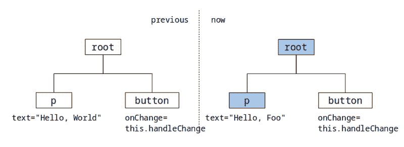

# 在 React 中绑定事件处理程序的最佳方式

> 原文：<https://www.freecodecamp.org/news/the-best-way-to-bind-event-handlers-in-react-282db2cf1530/>

作者查尔斯·李

# 在 React 中绑定事件处理程序的最佳方式


Image: [Flickr](https://www.flickr.com/photos/calliope/4079232480/) by liz west

在 React 中绑定事件处理程序可能很棘手(这要感谢 JavaScript)。对于那些了解 Perl 和 Python 历史的人来说，TMTOWTDI(有多种方法)和 TOOWTDI(只有一种方法)应该是熟悉的词汇。不幸的是，至少对于事件绑定来说，JavaScript 是一种 TMTOWTDI 语言，这总是让开发人员感到困惑。

在本帖中，我们将探索在 React 中创建事件绑定的常用方法，我将向您展示它们的优缺点。最重要的是，我会帮你找到“唯一的一条路”——或者至少是我最喜欢的。

本帖假设你了解绑定的必要性，比如我们为什么要做`this.handler.bind(this)`，或者`function() { console.log(this); }`和`() => { console.log(this)`的区别；}.如果你对这些问题感到困惑，索拉博·米斯拉有一个惊人的 T4 解释。

### render()中的动态绑定

第一种常用的情况是在`render()`函数中调用`.bind(this)`。例如:

```
class HelloWorld extends Component {  handleClick(event) {}  render() {    return (      <p>Hello, {this.state.name}!</p>      <button onClick={this.handleClick.bind(this)}>Click</button>    );  }}
```

这当然行得通。但是想想一件事:如果`this.state.name`变了会怎么样？

你可能会说改变`this.state.name`会导致组件重新`render()`。很好。组件将呈现以更新名称部分。但是按钮会被渲染吗？

考虑 React 使用虚拟 DOM 的事实。当 render 发生时，它会将更新的虚拟 DOM 与以前的虚拟 DOM 进行比较，然后只将更改的元素更新到实际的 DOM 树。

在我们的例子中，当调用`render()`时，也会调用`this.handleClick.bind(this)`来绑定处理程序。这次调用将会生成一个**全新的处理程序**，它与第一次调用`render()`时使用的处理程序完全不同！



Virtual DOM for dynamic binding. Elements in Blue will be re-rendered.

如上图，之前调用`render()`时，`this.handleClick.bind(this)`返回`funcA`，这样 React 就知道`onChange`是`funcA`。

后来，当`render()`再次被调用时，`this.handleClick.bind(this)`返回`funcB`(注意它每次被调用都返回一个新函数)。这样 React 就知道`onChange`不再是`funcA`，也就是说`button`需要重新渲染。

一键可能不是问题。但是，如果你有 100 个按钮呈现在一个列表中呢？

```
render() {  return (    {this.state.buttons.map(btn => (      <button key={btn.id} onChange={this.handleClick.bind(this)}>        {btn.label}      </button>    ))}  );}
```

在上面的例子中，任何按钮标签的改变都会导致所有按钮被重新呈现，因为所有按钮都会生成一个新的`onChange`处理程序。

### 在构造函数()中绑定

一种古老的方法是在构造函数中进行绑定。没什么特别的:

```
class HelloWorld extends Component {  constructor() {    this.handleClick = this.handleClickFunc.bind(this);  }  render() {    return (<button onClick={this.handleClick}/>);  }}
```

这种方式比前一种方式好得多。调用`render()`不会为`onClick`生成新的处理程序，所以只要按钮没有改变，>上的`<butt`就不会被重新渲染。



Virtual DOM for binding in constructor. Elements in Blue will be re-rendered.

### 用箭头函数绑定

使用 ES7 类属性(目前由 [Babel](https://babeljs.io/docs/plugins/transform-class-properties/) 支持)，我们可以在方法定义处进行绑定:

```
class HelloWorld extends Component {  handleClick = (event) => {    console.log(this.state.name);  }  render() {    return (<button onClick={this.handleClick}/>)  }}
```

在上面的代码中，`handleClick`是一个赋值，相当于:

```
constructor() {  this.handleClick = (event) => { ... }；}
```

所以一旦组件被初始化，`this.handleClick`就再也不会改变了。这样，它确保了>上的`<butt`不会被重新渲染。这种方法可能是进行绑定的最佳方式。它很简单，容易阅读，最重要的是，它很有效。

### 用箭头函数动态绑定多个元素

使用相同的箭头函数技巧，我们可以对多个输入使用相同的处理程序:

```
class HelloWorld extends Component {  handleChange = name => event => {    this.setState({ [name]: event.target.value });  }  render() {    return (      <input onChange={this.handleChange('name')}/>      <input onChange={this.handleChange('description')}/>    )  }}
```

乍一看，由于其简单性，这看起来相当惊人。然而，如果你仔细考虑，你会发现它和第一种方法有同样的问题:每次调用`render()`时，两个`<inp`和>都会被重新渲染。

事实上，我确实认为这种方法很聪明，我也不想为每个字段编写多个`handleXXXChange`。幸运的是，这种类型的“多用户处理程序”不太可能出现在列表中。这意味着只有几个`<inp` ut >组件被重新渲染，可能不会有性能问题。

反正它给我们带来的好处远大于性能损失。因此，我建议你直接使用这种方法。

如果这些性能问题变得严重，我建议在进行绑定时缓存处理程序(但这会降低代码的可读性):

```
class HelloWorld extends Component {  handleChange = name => {    if (!this.handlers[name]) {      this.handlers[name] = event => {        this.setState({ [name]: event.target.value });      };    }    return this.handlers[name];    }   render() {    return (      <input onChange={this.handleChange('name')}/>      <input onChange={this.handleChange('description')}/>    )  }}
```

### 结论

在 React 中进行事件绑定时，我们必须非常仔细地检查处理程序是否是动态生成的。当受影响的组件只出现一两次时，这通常不是问题。但是当事件处理程序出现在列表中时，这会导致严重的性能问题。

#### 解决方法

*   尽可能使用箭头函数绑定
*   如果您必须动态生成绑定，那么如果绑定成为性能问题，请考虑缓存处理程序

感谢阅读！我希望这篇文章是有帮助的。如果你觉得这个帖子有用，请推荐给更多的人分享。

*更新:*

[Omri Luzon](https://www.freecodecamp.org/news/the-best-way-to-bind-event-handlers-in-react-282db2cf1530/undefined) 和 [Shesh](https://www.freecodecamp.org/news/the-best-way-to-bind-event-handlers-in-react-282db2cf1530/undefined) 提到了`lodash-decorators`和`react-autobind`包，方便绑定。就我个人而言，我并不热衷于自动完成任何事情(我总是试图将此类绑定保持在最低限度)，但自动绑定绝对是一种编写干净代码并节省更多精力的好方法。代码应该是这样的:

```
import autoBind from 'react-autobind';class HelloWorld() {  constructor() {    autoBind(this);  }
```

```
 handleClick() {    ...  }  render() {    return (<button onClick={this.handleClick}/>);  }}
```

由于`autoBind`会自动处理绑定，所以没有必要使用箭头函数 trick ( `handleClick = () =>` {})来做绑定，在 t `he rende` r()函数中可以直接使用 ick。