# 以下是用 JavaScript 发出 HTTP 请求的最流行的方法

> 原文：<https://www.freecodecamp.org/news/here-is-the-most-popular-ways-to-make-an-http-request-in-javascript-954ce8c95aaa/>

JavaScript 有很好的模块和方法来发出 HTTP 请求，可以用来发送或接收来自服务器端资源的数据。在这篇文章中，我们将看看用 JavaScript 进行 HTTP 请求的几种流行方法。

### 埃阿斯

Ajax 是发出异步 HTTP 请求的传统方式。可以使用 HTTP POST 方法发送数据，使用 HTTP GET 方法接收数据。我们来看看，提个`GET`要求。我将使用 JSONPlaceholder，这是一个面向开发人员的免费在线 REST API，它以 JSON 格式返回随机数据。

要在 Ajax 中进行 HTTP 调用，需要初始化一个新的`XMLHttpRequest()`方法，指定 URL 端点和 HTTP 方法(在本例中为 GET)。最后，我们使用`open()`方法将 HTTP 方法和 URL 端点绑定在一起，并调用`send()`方法来发出请求。

我们通过使用`XMLHTTPRequest.onreadystatechange`属性来记录对控制台的 HTTP 响应，该属性包含在触发`readystatechanged`事件时要调用的事件处理程序。

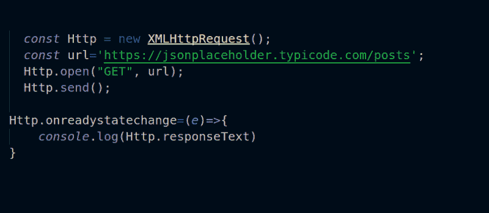

```
const Http = new XMLHttpRequest();
const url='https://jsonplaceholder.typicode.com/posts';
Http.open("GET", url);
Http.send();

Http.onreadystatechange = (e) => {
  console.log(Http.responseText)
}
```

如果您查看您的浏览器控制台，它将返回 JSON 格式的数据数组。但是我们如何知道请求是否完成了呢？换句话说，我们如何用 Ajax 处理响应？

属性有两个方法，`readyState`和`status`，它们允许我们检查请求的状态。

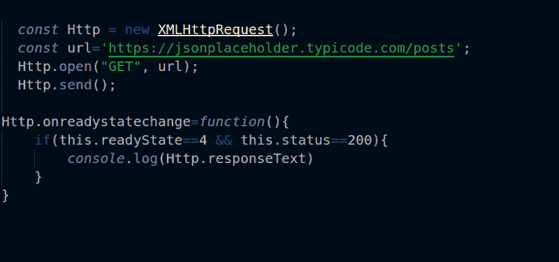

如果`readyState`等于 4，则表示请求完成。`readyState`属性有 5 个响应。点击了解更多关于[的信息。](https://developer.mozilla.org/en-US/docs/Web/API/XMLHttpRequest/readyState)

除了用 JavaScript 直接进行 Ajax 调用，还有其他更强大的方法进行 HTTP 调用，比如 jQuery 方法`$.Ajax`。我现在将讨论这些。

### jQuery 方法

jQuery 有许多方法可以轻松处理 HTTP 请求。为了使用这些方法，您需要在项目中包含 jQuery 库。

```
<script src="https://ajax.googleapis.com/ajax/libs/jquery/3.3.1/jquery.min.js"></script>
```

#### $.创建交互式、快速动态网页应用的网页开发技术

jQuery Ajax 是进行 HTTP 调用的最简单的方法之一。

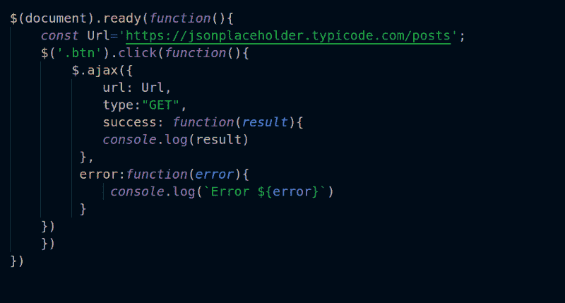

的美元。ajax 方法有许多参数，有些是必需的，有些是可选的。它包含两个回调选项`success`和`error`来处理收到的响应。

#### $.获取方法

的美元。get 方法用于执行 GET 请求。它有两个参数:端点和回调函数。

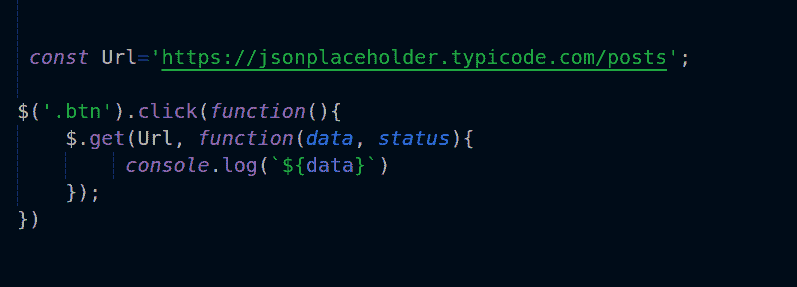

#### $.邮政

`**$.post**`方法是向服务器发送数据的另一种方式。它有三个参数:`url`、要发布的数据和一个回调函数。

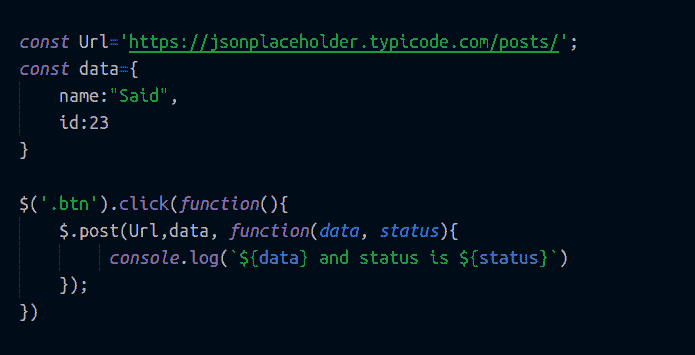

#### $.getJSON

`$.getJSON`方法只检索 JSON 格式的数据。它有两个参数:`url`和一个回调函数。

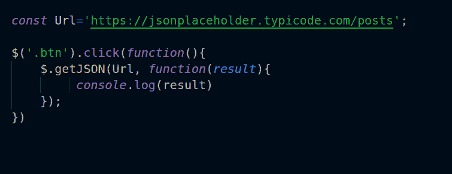

jQuery 有所有这些方法来请求或向远程服务器发送数据。但是您实际上可以将所有这些方法放入一个方法中:`$.ajax`方法，如下例所示:

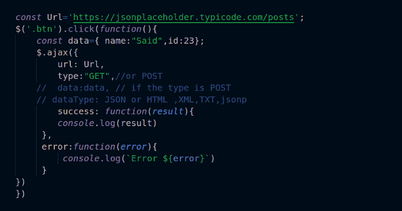

### 取得

是一个新的强大的 web API，它允许你进行异步请求。事实上，`fetch`是最好的，也是我最喜欢的 HTTP 请求方式之一。它返回一个“承诺”，这是 ES6 的一大特点。如果你不熟悉 ES6，可以在[这篇](https://medium.freecodecamp.org/write-less-do-more-with-javascript-es6-5fd4a8e50ee2)文章中了解一下。承诺允许我们以更智能的方式处理异步请求。让我们来看看`fetch`在技术上是如何工作的。

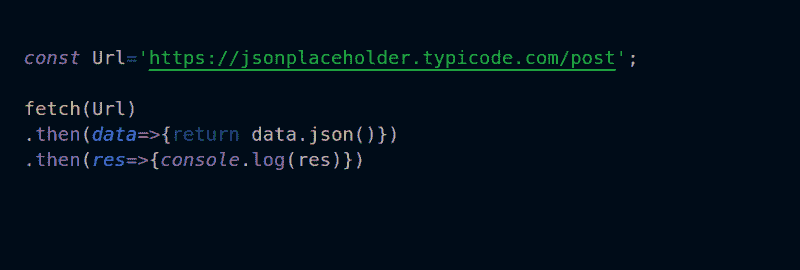

`fetch`函数有一个必需的参数:`endpoint` URL。它还有其他可选参数，如下例所示:

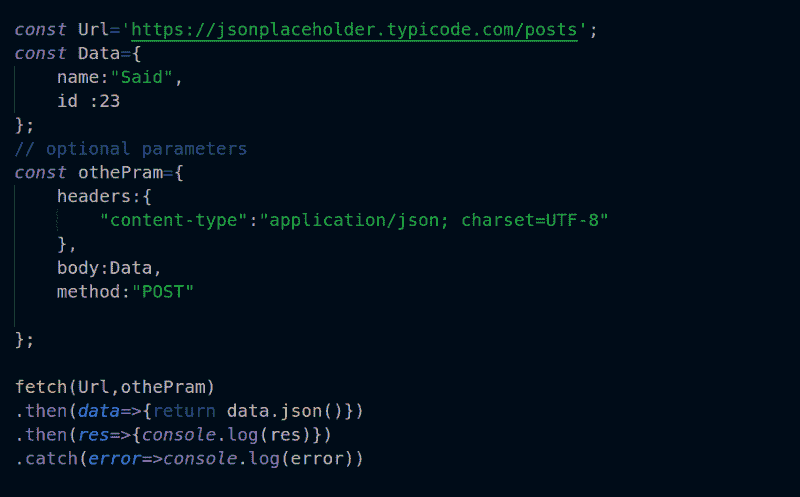

如您所见，`fetch`对于发出 HTTP 请求有很多优势。你可以在这里了解更多。此外，在 fetch 中还有其他模块和插件，允许我们向服务器端发送和从服务器端接收请求，例如 [axios](https://github.com/axios/axios) 。

### 阿克斯

Axios 是一个用于发出 HTTP 请求的开源库，提供了许多优秀的特性。让我们来看看它是如何工作的。

#### 用法:

首先，你需要包括 Axios。有两种方法可以将 Axios 包含到您的项目中。

首先，您可以使用 npm:

```
npm install axios --save
```

那么你需要导入它

```
import axios from 'axios'
```

其次，您可以使用 CDN 包含 axios。

```
<script src="https://unpkg.com/axios/dist/axios.min.js"></script>
```

#### 使用 axios 发出请求:

使用 Axios，您可以使用`GET`和`POST`从服务器检索和发布数据。

#### 获取:

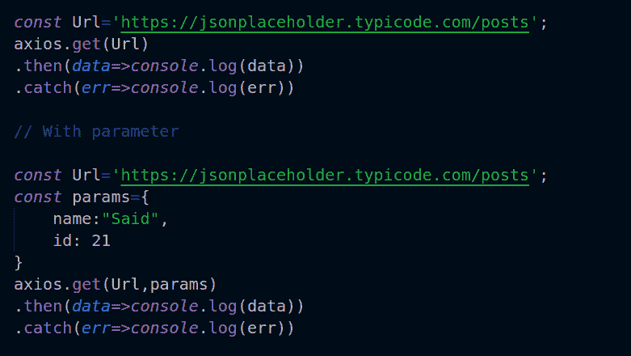

`axios`带一个必需参数，也可以带第二个可选参数。这将一些数据作为一个简单的查询。

#### 帖子:

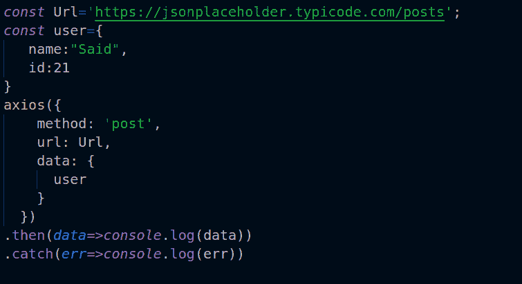

[Axios](https://github.com/axios/axios) 返回一个“承诺”如果您熟悉承诺，您可能知道承诺可以执行多个请求。你可以用 axios 做同样的事情，同时运行多个请求。

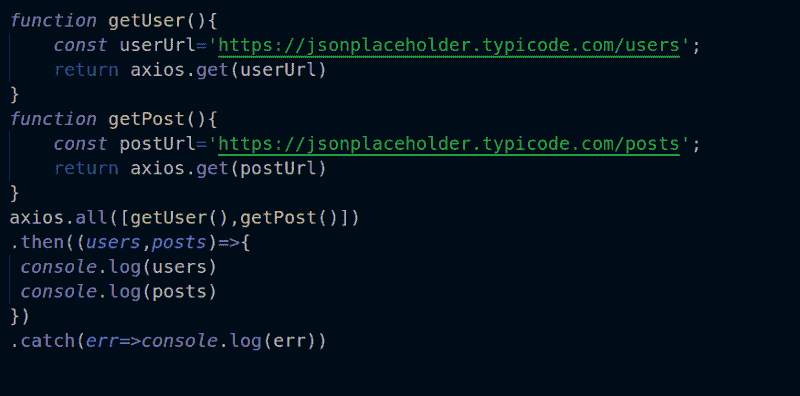

Axios 支持许多其他方法和选项。你可以在这里探索它们[。](https://github.com/axios/axios)

### 角度 HttpClient

Angular 有自己的 HTTP 模块，可以与 Angular 应用程序配合使用。它使用 [RxJS](http://reactivex.io/rxjs/) 库来处理异步请求，并提供许多选项来执行 HTTP 请求。

#### 使用 Angular HttpClient 调用服务器

要使用 Angular HttpClient 发出请求，我们必须在 Angular 应用程序中运行我们的代码。所以我创造了一个。如果你不熟悉 Angular，看看我的文章，[学习如何在 20 分钟内创建你的第一个 Angular 应用](https://medium.freecodecamp.org/learn-how-to-create-your-first-angular-app-in-20-min-146201d9b5a7)。

我们需要做的第一件事是在`app.module.ts`中导入`HttpClientModule`

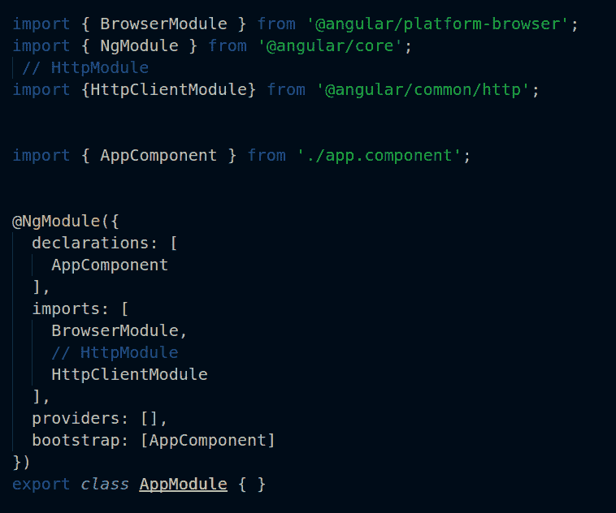

然后，我们必须创建一个服务来处理请求。您可以使用 [Angular CLI](https://cli.angular.io/) 轻松生成服务。

```
ng g service  FetchdataService
```

然后，我们需要在`fetchdataService.ts`服务中导入 HttpClient，并将其注入构造函数内部。

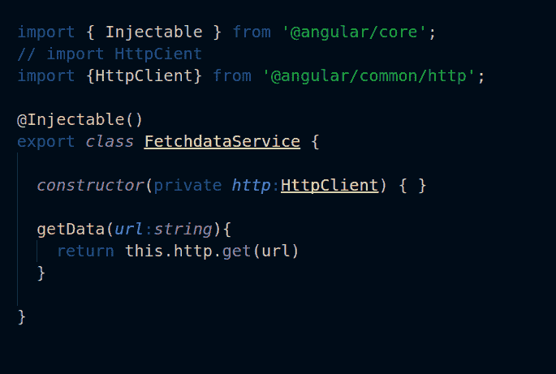

并在`app.component.ts`中导入`fetchdataService`

```
//import
import { FetchdataService } from './fetchdata.service';
```

最后，调用服务并运行它。

`app.component.ts:`

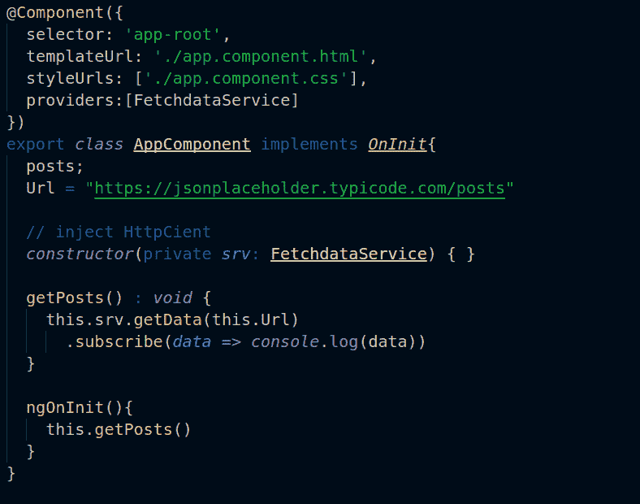

你可以在 Stackblitz 上查看演示示例[。](https://stackblitz.com/edit/angular-httpclinent)

### 包扎

我们刚刚介绍了用 JavaScript 发出 HTTP 调用请求的最流行的方法。

谢谢你的时间。喜欢的话，鼓掌到 50，点击关注，在 [Twitter](https://twitter.com/SaidHYN) 上联系我。

顺便说一下，我最近和一个强大的软件工程师团队合作开发了我的一个移动应用程序。这个组织非常棒，产品交付得非常快，比我合作过的其他公司和自由职业者快得多，我想我可以诚实地向他们推荐其他项目。想联系就发邮件给我——[](mailto:said@devsdata.com)**。**