# 如何使用 RxJs 进行反应式思考并制作移动物体的动画

> 原文：<https://www.freecodecamp.org/news/thinking-reactively-how-to-animate-with-movement-objects-using-rxjs-692518b6f2ac/>

如今，许多软件系统不得不处理异步行为和与时间相关的问题。

持续连接、分布式系统、基于微服务的架构、云、无阻塞平台——所有这些东西的结果是我们必须以某种方式处理异步性和时间。我们的软件系统必须学会如何处理事件流，这些事件流本质上是异步的。

反应式编程提供了基于函数式编程风格的强大工具，帮助我们对在这样一个世界中工作的系统进行建模。但是这些系统要求我们在设计解决方案时进行反应式思考。

反应式思维通常是一种挑战，任何视角的改变也是如此。同时，这可能比你想象的要容易。只要看看现实世界中发生的事情，并尝试用一种简单明了的方式描绘出来。

在本文中，我的目的是向您展示如何应用反应式和功能性思维以自然的方式解决一个众所周知的问题:如何用受控的运动来制作一个对象的动画。我用的比喻是一辆汽车，它可以根据遥控器发出的指令加速和刹车。

在实现中，我们将使用 RxJs、ReactiveX 的 JavaScript 版本和 Typescript。

完整演示实现的代码可以在[这里](https://github.com/EnricoPicci/mobile-object-observables)找到。

如果你喜欢这个，[这是围绕这些主题的第二篇文章](https://medium.com/@enrico.piccinin/reactive-thinking-how-to-design-a-distributed-system-with-rxjs-websockets-and-node-57d772f89260)。

### 快速回顾动力学的简单基础

如果你想改变一个物体的速度，你需要对它施加一个力，这个力反过来会对同一个物体施加一个加速度。如果知道物体的加速度 **A** 的值，就可以用公式计算出在一定时间间隔内其速度 **dV** 的变化 **dT**

***dV = A * dT***

类似地，如果你知道速度 **V，**，那么你可以用下面的公式计算时间间隔 **dT** 内空间 **dS** 的变化

***dS = V * dT***

结论:如果你有一个加速度 **A** 加到一个初速度为 **V0，**的物体上，你可以用它的平均值来近似物体在时间间隔 **dT** 内的速度，就像这样:

***average level =(v 0+V1)/2 =(v 0+v 0+dV)/2 = v 0+A/2 * dT***

然后用公式计算出相同区间 **dT** 内空间 **dS** 的近似变化量

***dS = average level * dT = v 0 * dT+A/2 * dT***

时间间隔 **dT 越短，**越接近。

### “用运动来激活一个物体”是什么意思

如果我们想用加速度控制的运动来制作一个物体的动画，(也就是说，如果我们想模拟一个物体在受力的情况下如何运动)，我们必须引入时间维度。

我们必须将时间划分为间隔 dT，计算每个 dT 所经过的空间，并显示每个间隔的新位置。

#### 使用拉动式方法——询问信息

我们可以使用上面的函数，**从中提取**我们需要的信息(给定一定的加速度****和初速度 V** ，物体在最后的时间间隔 **dT** 中移动了多少)。我们将得到函数的结果，并使用它来计算新的位置，只要我们能够以某种方式记住以前的位置。**

**如果我们依赖于拉方法，则是调用者(软件组件)调用完成大部分工作的函数。它保持和更新状态，控制时间，并管理整个运动。**

#### ****反应方式:推(和命令)方式****

**如果你想到一辆由某人遥控的汽车，你可能会想到:**

*   **车辆以规则的频率将其位置和速度传送给控制器**
*   **控制器可以改变车辆的加速度(转向和制动只是沿空间轴的加速度变化)来引导车辆的运动**

**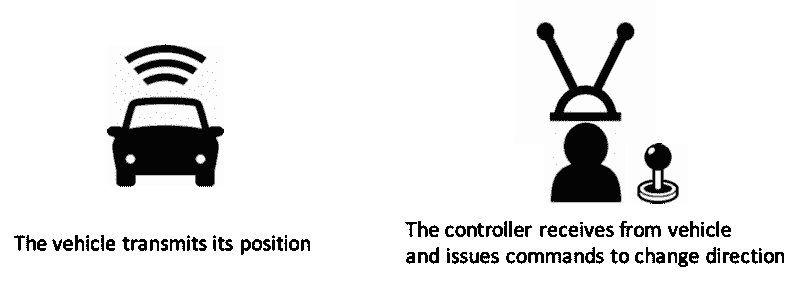**

**这种方法有利于明确划分责任:**

1.  **车辆负责在任何时候将其状态传送给任何相关方**
2.  **控制器负责监听车辆传输的数据，并发出正确的命令**

**反应式编程提供了工具来构建一个软件解决方案来镜像这个模型。这可能是您在现实世界中所期望的:**

*   **传输其动态细节(例如，速度、位置、方向)的车辆——可观测的**
*   **监听这种传输并发出加速、减速、转向和刹车命令的控制器——观察者**

### **反应式实施— RxJs**

**为了开发解决方案，我们使用 Typescript 作为编程语言，并通过 RxJs 实现使用 ReactiveX 模型。但是这些概念可以很容易地移植到 ReactiveX 支持的许多其他语言中。**

#### ****mobile object 类——表示在空间中移动的对象****

**我们将使用具有函数式编程风格的反应式技术来构建我们的模拟器。但是我们仍然会使用良好的面向对象(OO)概念来为我们的实现建立一个清晰的框架。所以让我们从 MobileObject 类开始:**

```
`export class MobileObject {

}`
```

**这个类将代表以固定的时间间隔传输所有关于其动态的相关数据的对象，如速度、位置和加速度。在这堂课中，我们将被动地学习。**

#### **让我们介绍一下可观察先生，我们移动对象的核心**

**众所周知，要进行远程控制，车辆必须不断向控制器传输自身数据，即:**

*   **它目前的速度**
*   **它目前的位置**
*   **自从上次时间间隔以来，它的位置和速度变化了多少**

**这只是一段时间内车辆发出的**数据流。react vex**可观测**是一种对携带数据的**事件流建模的方式**。因此，我们可以使用可观测量来模拟车辆传输的数据。****

#### **我们的时钟:一系列的时间间隔**

**我们需要创建的第一件事是时间间隔序列。此序列中发出的每个事件都知道自其前一个事件以来经过的时间，如下图所示:**

**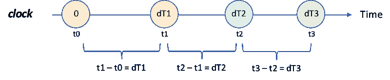

Our clock: a sequence of time intervals** 

**使用 RxJs，我们可以使用以下函数创建一个具有可观测值的**时钟**:**

```
`private buildClock(frameApproximateLenght: number) {
  let t0 = Date.now();
  let t1: number;
  return Observable.timer(0, frameApproximateLenght)
    .do(() => t1 = Date.now())
    .map(() => t1 - t0)
    .tap(() => t0 = t1)
    .share();
}
const clock = buildClock(xxx);`
```

**姑且称这个可观测的 ***时钟*** 。我们的 ***时钟*** 大约每 *xxx* 毫秒发射一次。由 ***时钟*** 发出的每个事件将携带自上次发出以来经过的精确毫秒数。**

**我们将在后面讨论动画帧时看到，为什么这种创建可观察的时间间隔的方法是方便的。稍后我们还将介绍为什么在创建*时钟时使用`share`操作符很重要。***

#### *****计算一个时间间隔内速度和空间的变化*****

***让我们假设移动物体受到加速度 **A** 。现在我们有了一个 ***时钟*** ，我们可以使用公式 **dV = A * dT 来计算速度 **dV** 的变化。**使用这个公式和 RxJs 的`map`运算符，我们可以创建一个可观测值，它显示速度随时间的变化:***

***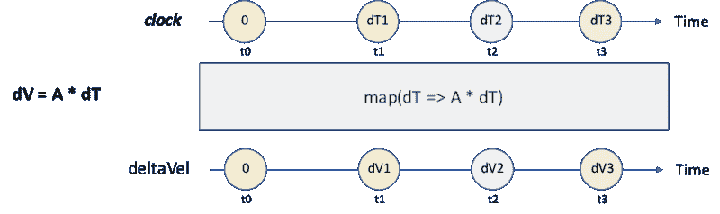

Variation of speed as a sequence of events over time*** 

***如果我们在时间 *tX* 以可变速度`vel`存储，我们可以用公式 **dS = vel * dT + A / 2 * dT** 计算下一个时间间隔 *t(X+1)* 的近似空间变化。再一次，使用`map`操作符，我们可以获得一个可观测的发射空间随时间的变化。***

***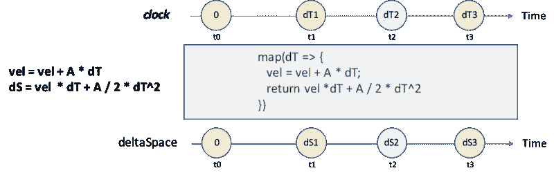

Variation of space as a sequence of events over time*** 

***使用同样的方法，我们可以建立一个可观察对象，它在*时钟的每一个滴答发出所有关于移动物体动力学的相关信息，仅仅从它的加速度 **A** 开始。我们把这种可观测的 ***动力学*** 。****

****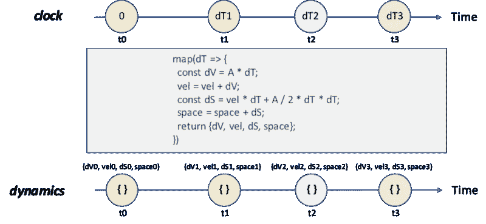****

****但是加速度可以改变——那又怎样？****

****如果我们知道加速度 **A** 并且如果 **A** 是一个常数，这是有效的。****

****如果加速度随时间变化会发生什么？也许我们从加速度 **A0** 开始，然后经过一段时间 **P0** 一个力把它变成 **A1** ，然后经过 **P1** 它变成 **A2** *，*然后变成 **A3** ，如下图所示。****

****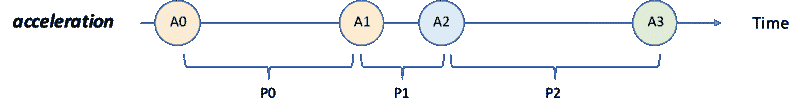

Acceleration over time as an observable**** 

*******加速度*** 看起来像是可观测的，不是吗？每个事件代表 MobileObject 加速度的一个变化(即一个新的力被施加到 MobileObject 上的事实)。****

****知道了 **A0** ，我们可以使用根据上述逻辑构建的可观测值 ***dyn0*** 来计算在 **P0** 期间移动物体的速度和位置。当加速度发生变化时，我们仍然可以计算速度和位置，但我们必须放弃 ***dyn0*** 和`***switch***`而采用新的可观测值 ***dyn1*** ，它与 ***dyn0、*** 的构建逻辑相同，但现在使用了新的加速度 **A1** 。当加速度变为 **A2** 然后变为 **A3** 时，重复相同的切换。****

****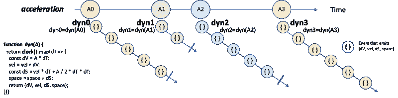

Switch observable when acceleration changes**** 

****这就是操作符`switchMap`派上用场的地方。通过`switchMap`我们可以将 ***加速度*** 可观测值转换成新版本的 ***动力学*** 可观测值。它可以接收一个由 ***加速度*** 发出的新值，开始一个新的可观测值 **dynX，**完成先前的可观测值 ***dynX-1*** ，并发出它在此处理过程中剥离的各种类型的 ***dynX*** 可观测值所产生的所有事件。下图说明了`switchMap`机制。****

****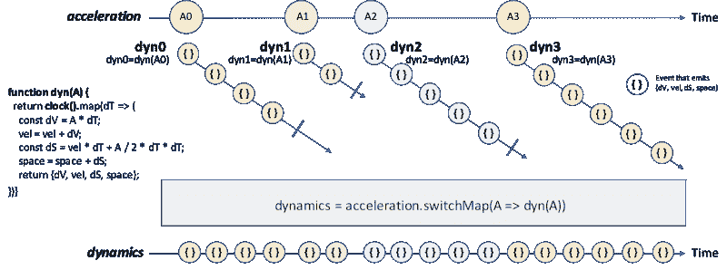****

#### ****现在欢迎主题先生——移动对象的加速器踏板****

****为此，我们需要创建加速器踏板。这是一种允许外部**控制器**改变 MobileObject 加速度的机制。****

******加速需要控制，所以我们需要一个指挥机制。******

****要改变移动物体的加速度，我们需要在**控制器**做出决定时，使 ***加速度*** 可观测值发出事件。如果我们需要控制一个可观察对象何时发射，我们需要查看 **Subject** ，RxJs 提供的另一种类型。****

****主体是提供以下方法的可观察对象:****

*   ******next(val)** :以 **val** 为值发出事件****
*   ******error()** :以错误终止自身****
*   ******完成()**:优雅地完成****

****所以，如果我们想改变加速度随时间的变化，我们可以创建*加速度可观测作为主体，然后使用 next()方法在需要时发出事件。*****

*****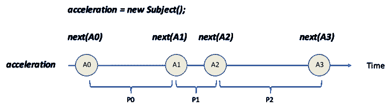

Acceleration as a Subject***** 

#### *****将所有内容包装到 MobileObject 类中*****

*****现在我们已经拥有了所有需要的部分，我们只需要将它们组装成一个连贯的 MobileObject 类。*****

*****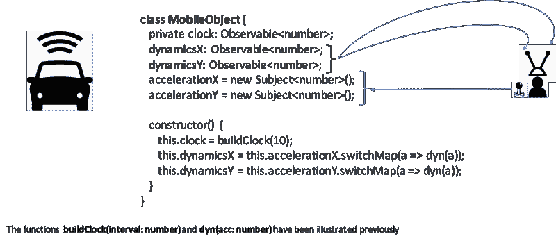*****

*****简而言之，这就是 MobileObject 在反应式世界中的建模方式。有:*****

*   *****示例中的一些可观测值 *dynamicsX* 和 *dynamicsY* 发出关于其沿空间不同维度的动力学数据(在上面的示例中，在二维平面中只有 2，X 和 Y)*****
*   ****一些主题，例子中的*加速度 X* 和*加速度 Y* ，允许控制器沿着不同的维度改变加速度****
*   ****确定时间间隔频率的内部时钟****

****在一个二维空间中，我们有两个不同的可观测物发射出空间的变化。如果我们想要一个连贯的运动，这样的可观测量需要相同的 ***时钟*** 。而 ***时钟*** 本身就是一个可观测的。为了让它们可以共享相同的可观测值，我们在之前描述的`buildClock()`函数的末尾添加了`share()`运算符。****

### ****最后一击:刹车****

****让我们非常简单地来看这个问题。如果你想让一辆以速度 **V0** 行驶的汽车停下或减速，你必须给汽车施加一个与速度方向相反的加速度。****

****一段时间后，汽车的速度将变为 0，此时汽车不再有加速度。****

****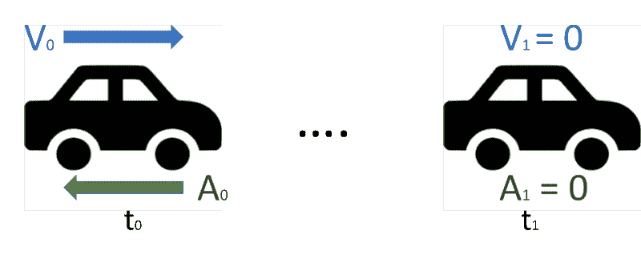

What braking means**** 

****为了获得制动效果，我们必须知道移动物体的方向，并在移动物体达到速度 0 时停止负加速度。****

****知道方向很容易。我们只需根据我们感兴趣的轴，获取由 ***dynamicsX*** 或 ***dynamicsY*** 可观察到的第一个事件，并检查最后一个事件的速度是正还是负。速度的符号是方向。****

```
**`directionX = mobileObject.dynamicsX
.take(1)
.map(dynamics => dynamics.vel > 0 ? 1 : -1)`**
```

*******directionX*** 是只发射一个事件的可观测。如果速度为正，发出的值为 1，否则为-1。****

****因此，当 MobileObject 收到刹车命令时，它所要做的就是获得方向并施加相反的加速度，就像这样:****

```
**`directionX
.switchMap(
   // BRAKE is a constant of acceleration when mobileObject brakes
   dir => mobileObject.accelerationX.next(-1 * dir * BRAKE)
)`**
```

****我们快到了。我们只需要确定，一旦速度达到，或者接近，我们去掉任何加速度。这就是我们如何得到我们想要的。****

```
**`directionX
.switchMap(
   // BRAKE is a constant of acceleration when mobileObject brakes
   dir => {
      mobileObject.accelerationX.next(-1 * dir * BRAKE);
      return mobileObject.dynamicsX
      // VEL_0 is a small value below which we consider vel as 0
      .filter(dynamics => Math.abs(dynamics.vel) < VEL_0)
      .do(() => mobileObject.accelerationX.next(0)
      .take(1)
   }
).subscribe()`**
```

****这里，在发出制动加速命令后，我们简单地选择第一个事件 ***dynamicsX*** 可观察到的速度小到足以被认为是 0。然后我们发出一个命令，施加一个等于零的加速度。添加最后一个`take(1)`操作符是为了确保我们立即取消订阅，因为 brake observable 已经完成了它的工作。****

****这段代码需要一些改进才能真正流畅地工作，但它足以传达反应制动的基本知识。****

### ****回到起点:动画****

****所有这些可能看起来不错，但我们仍然想动画我们的移动对象。例如，我们希望创建一个应用程序，用户可以通过一个 4 按钮控制台发出加速命令，并看到移动项目相应地移动。****

****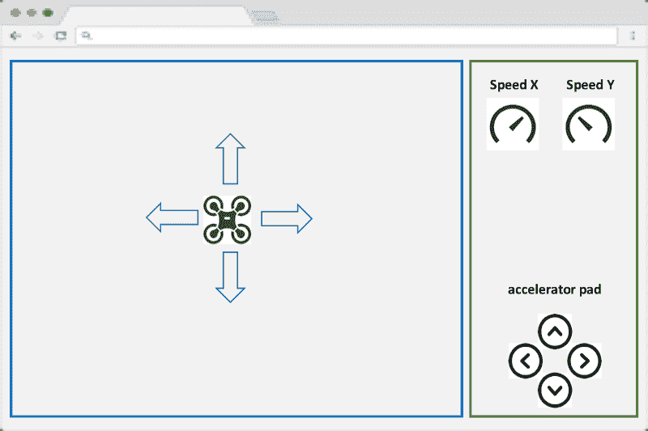

A sample app to control MobileObject and see its movement**** 

****这样的 app 充当 MobileObject 的**控制器**和显示动画的监视器。****

#### ******发布命令******

****控制 MobileObject 的运动意味着我们需要应用加速度。浏览器 app 可以使用 MobileObject 提供的***acceleration x***subject 来实现，如下面的代码片段所示。****

```
**`<button id="positiveAccX" 
   (mousedown)="pAccX()" (mouseup)="releaseAccX()"/>

// mobileObject contains the instance we want to control
const accelerationValue = 100;
pAccX() {
   mobileObject.accelerationX.next(accelerationValue);
}
releaseAccX() {
   mobileObject.accelerationX.next(0);
}`**
```

****按下鼠标按钮时，加速度为 100，松开鼠标按钮时，加速度设置为 0，模拟加速踏板。****

#### ******显示动画动作******

****MobileObject 公开了 ***dynamicsX*** 和 ***dynamicsY*** ，这两个观察对象持续发出关于沿各自轴运动的数据(例如，增量空间、当前速度、沿 X 和 Y 的加速度)。因此，浏览器应用程序必须订阅它们以接收这些事件流，并在发出每个事件时更改 MobileObject 的位置，如以下示例片段所示:****

```
**`interface Dynamics {deltaVel: number; vel: number; deltaSpace: number; space: number}
const mobileObjectElement = document.querySelector('.mobileobj');
mobileObject.dynamicsX.subscribe(
   (dyn: Dynamics) => {
     const currentPositionX = mobileObjectElement.style.left;
     const deltaSpaceX = dyn.deltaSpace;
     mobileObjectElement.style.left = currentPositionX + deltaSpace;
   }
)`**
```

#### ******动画帧******

****浏览器异步工作，无法预先确定何时准备好显示新的框架。动画或运动模拟是通过随时间改变对象的位置来提供的。流畅的动画会改变浏览器显示的每一帧的位置。****

****RxJs 提供了一个名为`animationFrame`的**调度器**，它封装了`requestAnimationFrame`浏览器 API。一个**调度器**是一种 RxJs，它控制一个可观察对象发出的事件何时真正发生。****

****我们可以使用 observable 的`animationFrame`和`interval`静态方法来创建一个 Observable，每当浏览器准备好显示一个新的框架时，它就发出一个事件。****

```
**`Observable.interval(0, animationFrame)`**
```

****现在，我们只需要将自上一帧以来经过的时间长度添加到由 this observable 发出的事件中，我们就有了我们需要的东西:每次浏览器准备显示新帧时发出的 observable，其中包含自上一帧显示以来经过的时间量。****

****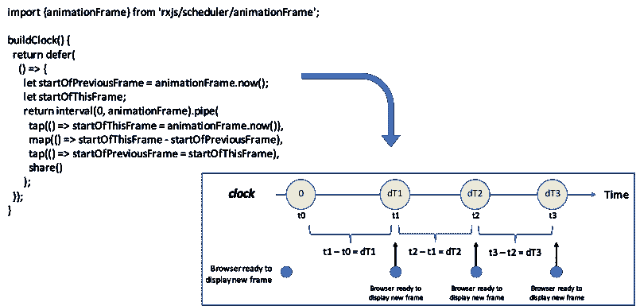

Clock synchronised with animation frame**** 

****这是新的 ***时钟*** ，我们在 MobileObject 中使用它来提供与运动相关的事件流( ***dynamicsX*** 和 ***dynamicsY*** )。这些移动与浏览器准备显示新框架的时间同步。****

****您可能已经注意到，在最后一个代码示例中，语法略有变化。我们现在使用“可管道化”操作符。我们以前没有使用它们，因为它们对我们的推理没有任何帮助。尽管如此，还是有必要介绍一下它们，因为它们代表了从 RxJS 6 开始可以使用的新语法。****

****您可能还注意到了`defer`函数。这是一个 RxJs 函数，它返回一个可观察对象，但是确保函数中定义的逻辑作为一个参数传递给`defer`，只有当可观察对象被订阅时才执行。****

****这允许我们在任何时候执行`buildClock()`方法，可能是在初始化 UI 组件的时候。它还可以让我们确保时钟只有在订阅和正确的时间开始计时。更具体地说，只有当 ***时钟*** 被订阅时，`let startOfPreviousFrame = animationFrame.now();`才会被执行。****

### ****最后但同样重要的是，关于函数式编程风格的一些话****

****在我们讨论的开始，我们谈到了构建表示 MobileObject 随时间移动的数据流。我们称之为 ***动力学*** 可观测，并使用了以下转换逻辑:****

```
**`map(dT => {
  const dV = A * dT;
  vel = vel + dV;
  const dS = vel * dT + A / 2 * dT * dT; 
  space = space + dS;
  return {dV, vel, dS, space};
})`**
```

****这里假设我们已经在某处定义了变量`vel`和`space`，这样它们在作为参数传递给`map`操作符的函数范围内是可见的。****

****传统 OO 程序员想到的第一个解决方案是将这些变量定义为 MobileObject 类的属性。但是这意味着在对象级存储状态信息，这些信息只能由上面所示的`map`操作符中定义的转换来改变。****

****如果让 MobileObject 中的任何逻辑都可以访问这些状态信息，就有可能错误地更改这些信息，从而导致整个对象不一致。另外，任何时候这样的状态被改变，我们必须考虑潜在地依赖于这个状态的逻辑的其他部分。我们需要考虑这种依赖的后果，这有时可能隐藏得很好。****

****这就是函数式编程拯救我们的地方。****

#### ****高级功能****

******高级函数**是返回函数的函数。这个名字可能会让你想起**更高级别的可观测量，**这些可观测量发射出其他可观测量。****

****如果我们有 ***时钟*** 可观测，并且我们知道加速度 **A** ，就可以建立运动物体的 ***动力学*** 可观测。所以我们可以说*是 ***时钟*** 可观测值和**加速度值**的函数。*****

****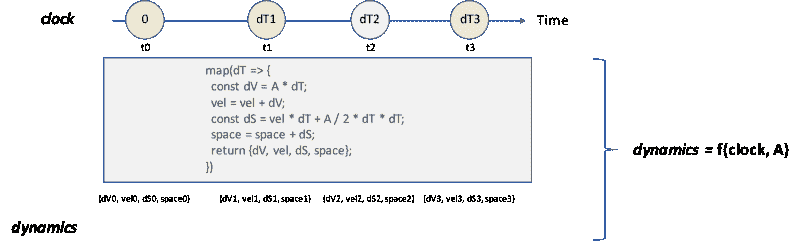****

****我们也可以创建一个函数 **dynamicsF** ，它返回一个函数 **dF。**它又在被调用时，返回可观察到的 ***动力学*** ，如下图所示。****

****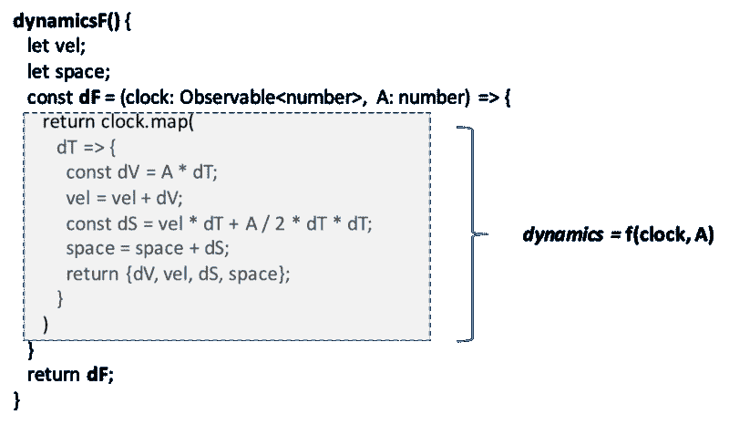

Example of higher order function**** 

****注意，在 **dynamicsF、**中，我们定义了变量`vel`和`space`，它们在 **dF** 中完全可见，使得我们的代码一致且正确。****

****如果我们有一个变量`clock`用来存储 ***时钟*** 可观测值，还有一个变量`acc`用来存储加速度 **A** 的值，我们可以使用刚刚定义的函数 **dynamicsF，**来构建我们的 ***动态*** 可观测值，如下面的代码片段所示。****

```
**`const dynFunction = dynamicsF();
const dynamics = dynFunction(clock, A);`**
```

****关键是现在 **dynFunction** 内部包含了变量`vel`和`space`。它以自己的状态在内部存储它们，这种状态对于函数之外的任何东西都是不可见的。****

****假设 **dynamicsF** 是 MobileObject 类的一个方法，在 MobileObject 构造函数中创建 ***动态*** 可观察对象的代码的最终版本可以写成****

```
**`const dfX = this.dynamicsF();
this.dynamicsX = this.accelerationX
                     .swithMap(a => dfX(this.clock, a));`**
```

****这样做时，我们将关于当前速度和空间的状态信息限制在函数`dfX`中。我们还消除了在 MobileObject 中定义当前速度和空间属性的需要。而且我们提高了重用性，因为 **dynamicsF()** 没有对任何轴的任何引用，并且可以通过函数组合来计算 ***dynamicsX*** 和 ***dynamicsY*** 。****

****通过应用函数式编程风格(在这种情况下是更高的隔离)，我们的代码获得了更高的安全性和更高的重用性。****

### ****结论****

****这是一段相当长的旅程。我们已经看到了一些最重要的 RxJs 操作符的使用，以及主题是如何变得方便的。我们还看到了如何使用函数式编程风格来提高代码的安全性及其可重用性。****

****我希望我已经展示了如何使用反应式思维方法来解决这个问题，有可能构建一个软件解决方案，它非常自然地反映了远程控制对象的真实模型。****

****任何时候，当你不得不面对一个时间和异步起作用的问题时，那么由诸如 RxJs 这样的反应库支持的反应式思维可以引导你进行更简单和更可靠的设计。在这个持续连接的世界中，云、非阻塞平台和微服务、时间和异步将扮演越来越重要的角色。****

****如果您喜欢刚刚阅读的内容，您可能会有兴趣[阅读这篇文章](https://medium.com/@enrico.piccinin/reactive-thinking-how-to-design-a-distributed-system-with-rxjs-websockets-and-node-57d772f89260)，其中我描述了如何构建一个分布式系统来控制和显示分布式环境中的多个移动对象。****

****完整的代码库[可以在这里](https://github.com/EnricoPicci/mobile-object-observables)找到。****

****我要感谢本·莱什，他用他的一次演讲启发了这篇文章。****