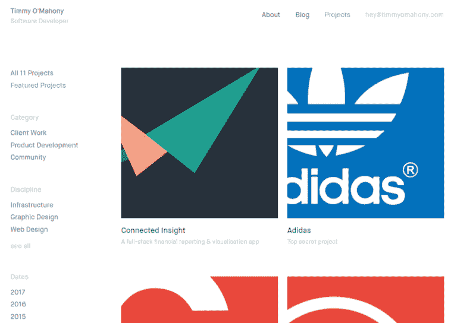
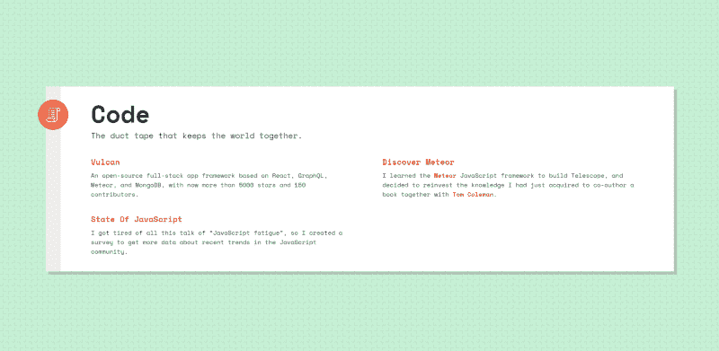
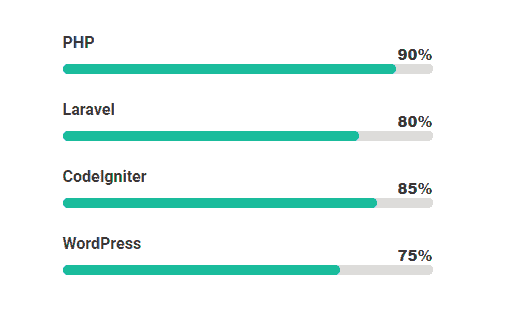
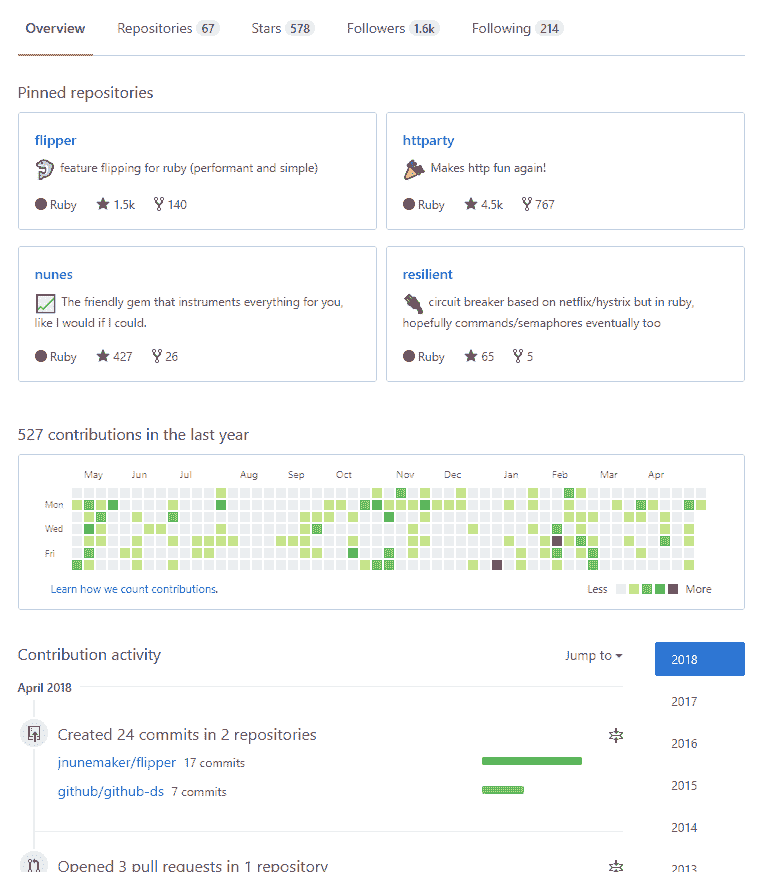
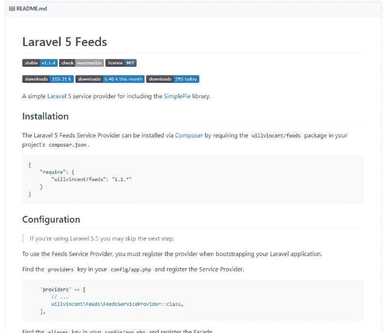
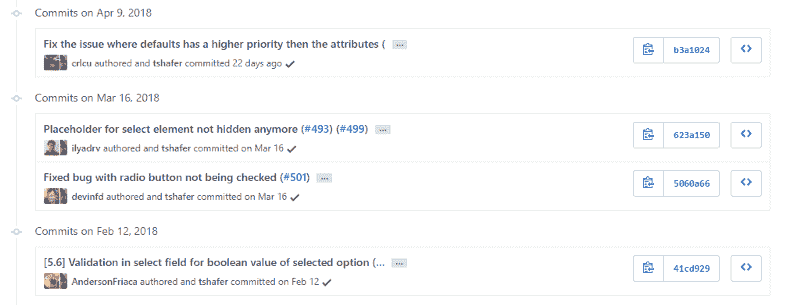

# 如何增加你获得开发人员工作的机会

> 原文：<https://www.freecodecamp.org/news/how-to-increase-your-chances-of-landing-a-development-job-acb6759c66da/>

在最近一份高级开发人员的工作中，我帮助面试和雇佣了我雇主的许多开发团队成员。这是我根据那些采访得出的建议。

作为一名候选人，我在面试最近的职位时也遵循了很多。当我的朋友申请开发职位时，我会向他们推荐这些方法。

### 如何写一封吸引人的电子邮件或求职信

#### 从一个好的钩子开始

> 嗨，史黛西，

> 我看到你的帖子寻找一个全栈 PHP 开发人员。你的搜寻结束了！

> 我最近完成了一个项目，它也使用了 Laravel 的队列工作器和任务调度器。我已经花了很多时间解决这些问题，我相信这些技巧和我下面的经验对你的开发团队来说是非常有价值的。

无论你是写一封电子邮件还是提交一封求职信，开头都需要坚持。上面的方法完成了几件事:

1.  第一句话显示了对这个职位的热情。感叹号在这方面很有用，但是也不要太过了。自然一点。
2.  正如他们所说，第一段通过引用与工作相关的过去项目，直接展示了布丁中的证据。通过将你的经验与工作联系起来，你立即向他们展示了你能为他们的团队带来的价值。

为了有效地写下这条信息，花些时间仔细阅读职位描述和公司信息，找出最好的项目是什么。

#### 展示你的激情

> 我看到你们利用弹性搜索，这是我非常喜欢的工作。我一直在做一个帮助用户开始弹性搜索的公共项目。该项目是一个 Laravel 样板设置，它提取 RSS 提要数据，并使用 REST API for PHP 在弹性搜索服务器中自动索引数据。

> 在这个项目上，我和另外两个贡献者的团队一起工作，我们计划下周发布 1.0 版。你可以在这里查看回购协议。

你正在做一些有趣的副业吗？你有什么与发展相关的有趣成就吗？把它们加在这里，以显示你对发展的热情。如果你能把它和工作联系起来，那就加分了。

人们希望和那些对某件事充满热情并且正在从事很酷的项目的人在一起。雇用你的人会有这种感觉，因为如果你得到这份工作，他们可能会经常和你见面和交流。从他们的角度来看，雇佣一个有趣的人是有帮助的，他们可以和这个有趣的人交谈并向他学习。

我会让这一部分简短明了——最多 1-3 项。你想有影响力，但不冗长。

#### 给他们更多好东西

最后，添加你的作品集和 GitHub 链接，你会让他们兴奋地去查看。

每当我读到一个优秀的开发人员应用程序时，我总觉得好像肩上的重担已经卸下来了。这就是我们要给阅读你的文章的人创造的感觉。

现在让我们来看看如何展示你的作品集。

### 提高投资组合的精确度

An example of a project-focused portfolio by [Timmy O’Mahony](https://timmyomahony.com/projects/featured/)

#### 专注于特定项目

你的投资组合应该尽可能以项目为中心。一旦我访问你的网站，我应该能够看到项目在哪里。

通过展示与工作相关的项目来选择质量而不是数量。我建议根据你申请的工作，改变顺序，甚至删除/隐藏一些项目。

拥有一大堆项目甚至会伤害到你，尤其是当它们在技术上有很大差异的时候。这是因为一些雇主并不热衷于多面手。因此，在这种情况下，在他们寻求的堆栈中展示专业化可能是一个好主意。

#### **确保投资组合网站得到很好的调整**

This is what they’re doing to your portfolio site (Image from [makewebcomics.com](http://makewebcomics.com))

任何开发人员在看到他们正在评估的网站时做的第一件事就是来回调整浏览器窗口的大小。这是为了确保你对这个职位有足够的反应能力。通过使用 Chrome 的设备工具栏，确保所有设备上的一切都可以很好地调整大小，并记住在多种浏览器上测试它。

这真的适用于你正在创建的任何网站。但这是开发商雇佣你的第一件事，第一印象很重要。

#### **发挥创意**

对投资组合的布局和设计进行创新，即使它不是一个前端职位。看到不一样的东西总会脱颖而出。

尽可能不要使用 CSS 模板。有些人会告诉你不要在你的作品集网站上使用 Bootstrap 或 jQuery，因为雇主可能想要检查你的原始 CSS 和 JavaScript 技能。

如果你申请的是前端开发人员，这个建议非常好。但我个人认为你用什么并不重要，只要有创意和用户友好就行。

如果你对设计没有眼光或者没有足够的 CSS 技能，试着采用简单明了的方法。您也可以向前端开发人员朋友寻求帮助。

下面是一个简单干净的投资组合网站的例子。没有什么太奇特的事情发生，但它仍然发送一个非常专业和创造性的氛围。

A simple and clean portfolio site by [Sacha Greif](http://sachagreif.com)

#### 专业提示

不要在你的投资组合里放评级量表(比如 80% Ruby，95% JavaScript)。我以前见过这种情况，它让读者感到困惑，因为他们不知道如何解释它。

Don’t put these or anything like them in on your portfolio site.

让我们继续整理你的 GitHub 档案。

### 打扮一下你的 GitHub

A good example of a active GitHub profile — [John Nunemaker](https://github.com/jnunemaker)

#### **公开回购入门**

作为一名全职工作的开发人员，很难找到时间参与和创建公共项目。但这是那种你必须忍气吞声去做的事情。

如今，每个开发人员都需要一些可用的公共代码。这让雇佣你的人更容易快速浏览你的代码，看看它是否适合他们。

如果你还没有任何公共贡献，尝试添加一个你不介意公开的现有项目。开始贡献永远不会太晚。你可以为已经存在的项目做贡献，或者自己开一个。有大量的想法可供选择，但是试着做一些小的、有趣的、在你的工作范围内的东西。没有必要在这里创造下一个脸书。

#### **展示您的 GitHub 个人资料**

当有人访问你的 GitHub 档案时，首先看到的是你的项目和提交时间表。绿色方框的数量对雇主来说是一个很好的信号，表明你在积极地贡献和合作。

如果你的生活不像你希望的那样环保，试着为自己设定一个承诺挑战，比如在接下来的 30 天里每天都承诺。这可能会激励你稳步继续从事一些公共项目。

#### **为你要展示的项目做好自述**

点击一个项目后，雇主会看到你的自述文件。确保它信息丰富，并向用户展示如何使用你的代码。我强烈建议托管一个版本的实时代码，这样您就可以在自述文件中链接到它。展示代码的工作版本会给你的应用程序加分。

Example of a well documented README ([Laravel 5 Feeds](https://github.com/willvincent/feeds))

#### **清理你的代码**

下一步当然是代码本身。确保你的代码格式良好，易于阅读是关键。如果不干净，考虑重新格式化或重构它。

这是一个很好的实践，特别是如果您刚刚添加了一个以前没有版本控制的项目。返回并对其进行更改将有助于构建您的提交，这意味着更多漂亮的绿色框和活动。

#### **制作好提交消息**

有可能你会和其他被雇佣的开发人员一起在一个团队中工作。因此，他们可能会查看您的项目提交消息。清晰和描述性的信息是最好的，因为你可以和一个团队合作。以下示例显示了一些描述性消息。

Example of descriptive commit messages ([Laravel Collective](https://github.com/LaravelCollective/))

#### **协作**

回到团队这个话题。如果你能展示与其他开发者在你的公共代码上的合作，这真的很有帮助。这有助于向雇主展示你对团队代码库的工作感到满意。

所以，还是那句话，要么做一些公共贡献，要么请朋友帮你做一些小项目。

### 你的简历

这一节更多的是提示。作为一个雇佣其他开发人员的人，我会花更多的时间关注你的实际项目和代码，而不是分析你简历中的时间线和要点。我也不在乎你去了什么学校。这些细节可能对其他行业或公司很有帮助，但老实说，我认为简历在发展领域没什么用处。在这里，您的实际工作和代码最有说服力。

下次你申请的时候，不要只是润色你的简历，试着在以上几点上多花点时间，你一定会在众多申请人中脱颖而出。

如有任何问题，请随时在 twitter 上联系我，并访问 T2 远程黑客，在那里我会帮助开发人员完成远程开发工作。

感谢阅读！