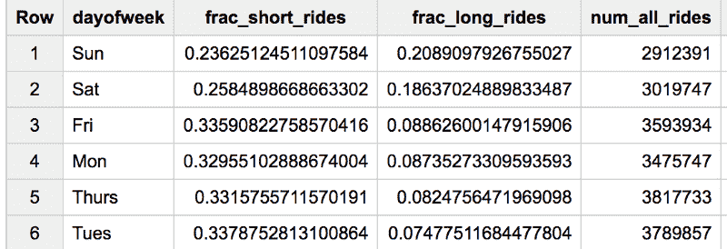

# 如何使用命名结果集和函数编写模块化、可读的 SQL

> 原文：<https://www.freecodecamp.org/news/how-to-write-modular-readable-sql-using-named-result-sets-and-functions-ac49f1ca25c1/>

作者:拉克·拉克什马南

# 如何使用命名结果集和函数编写模块化、可读的 SQL

我的计算机职业生涯包括 C++，然后是 Java，现在是 Python。SQL 充其量仍然是一门外语。因此，为了我自己的理智，我把我的一些编程最佳实践带到了 SQL 中。特别是 WITH 语句一直是我的朋友。


If you write modular, readable SQL, you will have time for long bike rides on the weekend

我将使用 Google BigQuery 中伦敦 bikeshares 的一个[公共数据集来演示。假设我们想知道自行车在周末是否会被租得更久。](https://bigquery.cloud.google.com/table/bigquery-public-data:london_bicycles.cycle_hire)

#### 1.常数，而不是硬编码的数字

好的第一步是定义我们将在整个查询中使用的常数(参见[完整查询](https://bigquery.cloud.google.com/savedquery/663413318684:9b1a705e68b046cd9b44259f6198a215)):

```
#standardsqlWITH constants AS (  SELECT  600 AS SHORT_DUR,         1800 AS LONG_DUR,         ['Sun', 'Mon', 'Tues', 'Wed', 'Thurs', 'Fri', 'Sat'] AS daysofweek),
```

在这里，我把不到 10 分钟的旅程定义为“短”，超过 30 分钟的旅程定义为“长”注意，通过预先定义这些常数，我可以很容易地尝试不同的数字。命名常量的使用也将使查询更具可读性。

#### 2.命名结果集

另一个增加可读性的方法是将查询分解成命名的结果集。我倾向于大量使用 WITH 语句，而不是编写查询和子查询以及计算参数。像 C++或 Python 等语言中的函数一样，命名结果集允许重用和逻辑分离。

我首先定义一个查询来提取我想要的字段，并将这个结果集命名为 bikeshare ( [full query](https://bigquery.cloud.google.com/savedquery/663413318684:9b1a705e68b046cd9b44259f6198a215) ):

```
bikeshare AS (  SELECT    IF(duration < SHORT_DUR, 1, 0) AS short_ride,    IF(duration > LONG_DUR,  1, 0) AS long_ride,    daysofweek[ORDINAL(EXTRACT(DAYOFWEEK FROM start_date))] AS dayofweek  FROM `bigquery-public-data.london_bicycles.cycle_hire`, constants)
```

注意，FROM 子句必须包含“常量”才能使用定义的常量。

#### 3.SQL 函数

您可以使用 WITH 关键字分解复杂的查询，并创建命名的结果集。但是复杂的解析呢？在上面的代码片段中，提取星期几并索引到 **daysofweek** 数组中的那一行是不可读的，是吗？这很可能是你在另一个地方想要的东西。

使用 SQL 函数，以便可以重用该表达式:

```
CREATE TEMPORARY FUNCTION dayOfWeek(ts TIMESTAMP,                                     days ARRAY<STRING>) AS(  days[ORDINAL(EXTRACT(DAYOFWEEK FROM ts))]);
```

我正在定义一个函数 **dayOfWeek** ，给定一个时间戳和一组日期名称，它将返回时间戳中的时间对应的星期几。一旦我们定义了这个函数，上一节中的命名结果集就变得更加清晰([全查询](https://bigquery.cloud.google.com/savedquery/663413318684:9b1a705e68b046cd9b44259f6198a215)):

```
bikeshare AS (  SELECT    IF(duration < SHORT_DUR, 1, 0) AS short_ride,    IF(duration > LONG_DUR,  1, 0) AS long_ride,    dayOfWeek(start_date, daysofweek) AS dayofweek  FROM `bigquery-public-data.london_bicycles.cycle_hire`, constants)
```

#### 简单本身

一旦我们命名了常量和结果集，最后的查询就很简单了:

```
SELECT   dayofweek,  SUM(short_ride)/COUNT(short_ride) AS frac_short_rides,  SUM(long_ride)/COUNT(long_ride)  AS frac_long_rides,  COUNT(short_ride) AS num_all_ridesFROM  bikeshareGROUP BY  dayofweekORDER BY frac_long_rides DESC
```

下面是[完整查询](https://bigquery.cloud.google.com/savedquery/663413318684:9b1a705e68b046cd9b44259f6198a215)，以及随之而来的结果:



工作日是快速短途通勤，周末是长途慢车。很有道理！