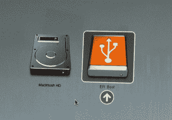
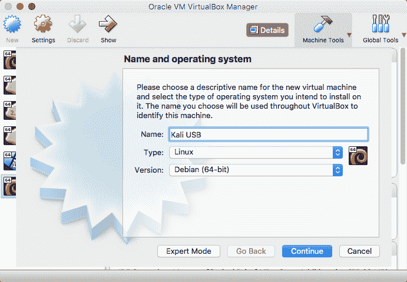
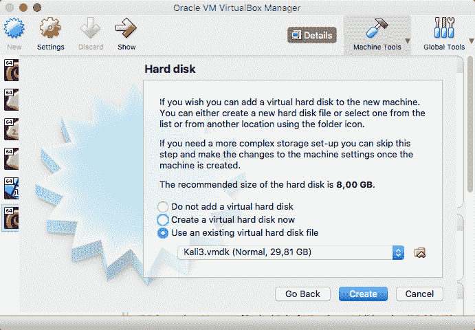
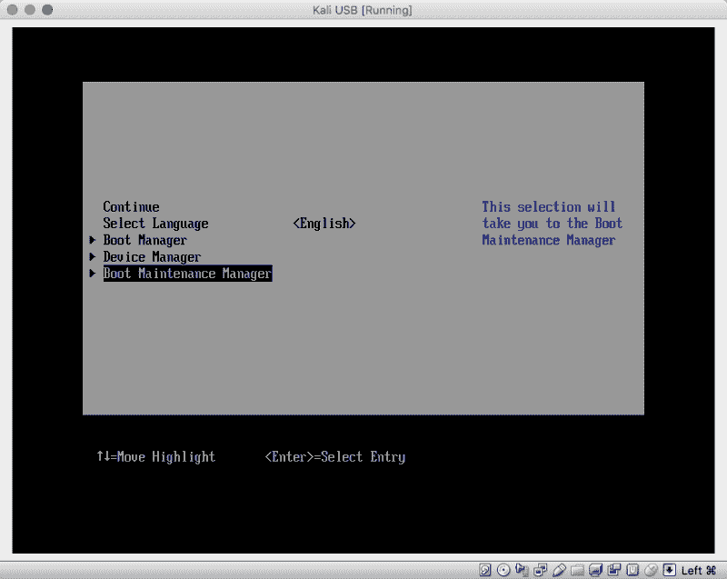
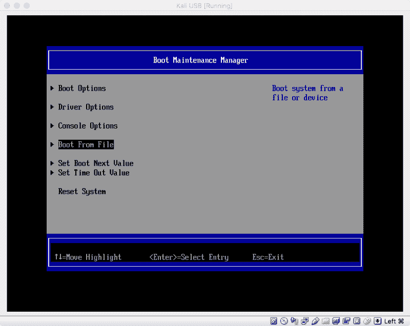
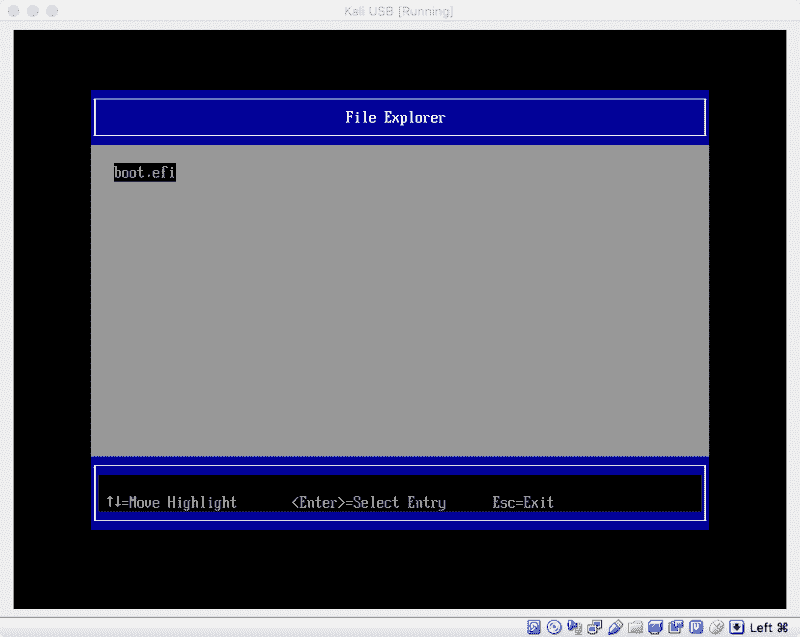
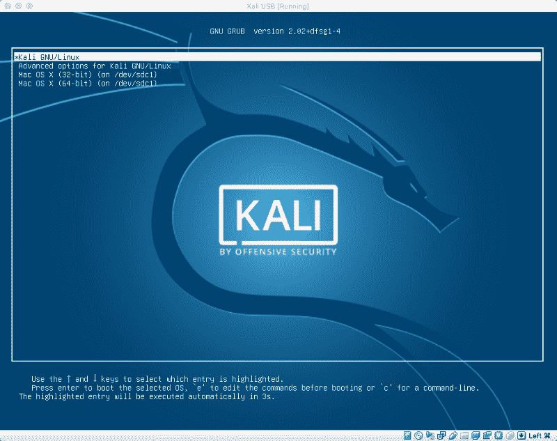

# 如何在 Mac 上用纯 EFI 引导在 u 盘上安装 Kali(让我们加入虚拟化…

> 原文：<https://www.freecodecamp.org/news/kali-installation-on-usb-stick-with-pure-efi-boot-on-a-mac-37585b7698e2/>

弗拉维奥·德·斯特凡诺

# 如何在 Mac 上用纯 EFI 引导在 u 盘上安装 Kali(让我们也在 Virtualbox 上通过 USB 进行虚拟化)


Photo by [Jessy Smith](https://unsplash.com/photos/zFOm6KzA-7g?utm_source=unsplash&utm_medium=referral&utm_content=creditCopyText) on [Unsplash](https://unsplash.com/search/photos/mac?utm_source=unsplash&utm_medium=referral&utm_content=creditCopyText)

本教程是为所有想要一个带**完整 Kali 安装**的 u 盘来和你的 Mac 一起使用的人准备的。这并不是为了执行具有持久性的实时 Kali 安装。

在 u 盘上执行 Kali 安装的问题是 Kali 使用 VFAT 文件系统对磁盘进行分区。Mac OS 只能识别 HFS+分区及其所需的一些文件。

所以，你需要:

*   你的男人
*   一个带有 Kali ISO 安装程序的 u 盘
*   目标 u 盘、SD 卡或 SSD 外置硬盘，您将在其中安装 Kali(建议 16GB 和 USB 3.0)

本教程深受本教程的启发，并对 Kali 进行了适当的修正。[https://medium . com/@ mm iglier/Ubuntu-installation-on-USB-stick-with-pure-EFI-boot-MAC-compatible-469 ad 33645 c 9](https://medium.com/@mmiglier/ubuntu-installation-on-usb-stick-with-pure-efi-boot-mac-compatible-469ad33645c9)

#### USB 实时安装

首先按照这个[教程](https://docs.kali.org/downloading/kali-linux-live-usb-install)在 u 盘上安装 Kali。我不会打扰您如何进行这一步，而是从这里开始:

```
$ sudo dd if={KALI_ISO.iso} of=/dev/{USB} bs=1m 
```

准备好之后，重新启动 Mac。插入两个 u 盘，然后按 ALT 并选择 **EFI boot** 来启动实时安装程序。



Kali 安装程序会问你关于时区和键盘布局的不同问题。

继续操作，直到它要求您对磁盘进行分区，这里选择:**手动。**然后选择你的 USB **目标**驱动器(你要安装 Kali 的地方)。你可以通过各种因素来识别，比如它的大小。点击**继续:**这将对你的硬盘进行分区。

现在，再次回到同一屏幕，选择 USB 目标驱动器下的**空闲空间**。点击**继续**，选择**自动划分空闲空间。**遵循推荐选项。然后点击**完成分区，并将更改写入磁盘**。

安装过程现在会将数据复制到磁盘。等待它完成(这大约需要 30 分钟)。

#### 从 GRUB Live 启动

一旦完成，你的 Mac 将重新启动，你必须再次按下 **ALT** 。再次选择**电喷启动**。

我们现在要做的是通过 **Live GRUB** 加载我们安装的 Kali 系统，因为我们安装的系统没有 MacOS 可识别的引导加载程序。

一旦 GRUB 被加载，按下 **c** 来获得 GRUB 命令行界面。

现在你要明白你的 Kali 安装在哪个 HD 中。为此，在加载 GRUB cli 时，键入**ls**；弹出你的 u 盘，再次输入 **ls** 。

```
grub> ls
(memdisk) (hd0) (hd1) (hd1,gpt3) (hd1, gpt2) (hd1,gpt1) ...
```

您会注意到一个 **hd{X}** 消失了:那是您的驱动器。现在你必须找到你的 **gpt。** *大概是 **gpt2*** **，**不过可以肯定的是，类型:

```
grub> ls (hdX,gpt2)/boot/grub
unicode.pf2 ...
```

*如果命令说`unicode..`这是正确的 gpt 否则尝试其他**GPT**。*现在找到分区的 UUID，并对其进行注释。

```
grub> ls -l (hdX},gpt{X})
        Partition hd2,gpt2: Filesystem type ext* 〈...snip...〉 UUID e86c20b9-83e1-447d-a3be-d1ddaad6c4c6 - Partition start at [...]
```

现在我们不能将参数设置为 GRUB 来引导(使用**选项卡**键来使用自动完成):

```
grub> set root=(hd{X},gpt{X})
grub> linux /boot/vmlinuz〈...tab here!...〉.efi.signed root=UUID=〈the UUID〉
grub> initrd /boot/initrd〈...tab here!...〉
grub> boot
```

这将使用 Live GRUB 引导您的**完整 Kali 安装**。您可以通过它在登录过程中识别的密码来区分真实环境。

#### 修复 EFI 分区

登录 Kali 安装后，打开终端并键入:

```
$ fdisk -l
```

找到你的司机。

现在，打开 **gdisk** (默认安装在 Kali 上)对驱动器进行分区(这里要非常小心):

```
$ gdisk /dev/sd{X}
GPT fdisk (gdisk) version 1.0.1

Partition table scan:
  MBR: hybrid
  BSD: not present
  APM: not present
  GPT: present

Found valid GPT with hybrid MBR; using GPT.

Command (? for help):
```

打印分区表，并确认第一个分区的类型为 EF00:

```
Command (? for help): p
Disk /dev/sdd: ...

[...]

Number  Start (sector)  End (sector)  Size     Code   Name
   1         2048         1050623  512.0 MiB   EF00   EFI System Partition

[...]
```

现在我们必须:

*   删除 EF00 分区
*   创建一个新的 HFS+

```
Command (? for help): d
Partition number (1-3): 1

Command (? for help): n
Partition number (1-128, default 1): 1

Just leave defaults values in the sector phase

Current type is 'Linux filesystem'
Hex code or GUID (L to show codes, Enter = 8300): AF00
Changed type of partition to 'Apple HFS/HFS+'

Command (? for help): w

Final checks complete. About to write GPT data. THIS WILL OVERWRITE EXISTING
PARTITIONS!!

Do you want to proceed? (Y/N): Y
OK; writing new GUID partition table (GPT) to /dev/sdd.
Warning: The kernel is still using the old partition table.
The new table will be used at the next reboot.
The operation has completed successfully.
```

现在我们有了一个未格式化的 HFS+分区。要格式化，我们需要一些工具；但是要获得这些工具，我们需要将 Debian 源代码列表添加到 **apt 中。**

```
$ echo "deb http://ftp.debian.org/debian unstable main contrib non-free" > /etc/apt/sources.list.d/debian.list
$ apt update
$ apt install hfsprogs
```

我们可以格式化分区:

```
$ mkfs.hfsplus /dev/sd{X}1 -v Kali
Initialized /dev/sd{X}1 as a 512 MB HFS Plus volume
```

现在我们必须编辑 **/etc/fstab** 文件:

```
$ gedit /etc/fstab
```

这将启动 Gedit。在该文件中，本地化这些行:

> **# /boot/efi 在安装期间在/dev/sd{X}1 上**
> **UUID = { XXXXXXX }/boot/EFI vfat defaults 0 1**

并删除它们。

现在，卸载引导分区，使用以下命令将其本地化:

```
$ mount | grep /boot/efi
/dev/sd{Y}1 on /boot/efi ...
$ umount /dev/sd{Y}1
```

然后运行以下命令，将必要的条目添加到 fstab 文件中:

```
$ echo "UUID=$(blkid -o value -s UUID /dev/sd{X}1) /boot/efi auto defaults 0 0" >> /etc/fstab
```

现在我们必须重新安装 GRUB，以便它可以使用新格式化的 HFS+分区来存储 EFI 数据:

```
$ mkdir -p /boot/efi/EFI/Kali

$ echo "This file is required for booting" > /boot/efi/EFI/Kali/mach_kernel
$ echo "This file is required for booting" > /boot/efi/mach_kernel

$ grub-install --target x86_64-efi --boot-directory=/boot --efi-directory=/boot/efi --bootloader-id=Kali
```

然后我们需要“祝福”引导程序代码，以便 Mac 引导程序能够引导它。为此，我们需要无法通过 apt 获得的 **hfsbless** 二进制文件。没问题，只需克隆存储库并构建:

```
$ cd /root
$ git clone https://github.com/detly/mactel-boot
$ cd mactel-boot
$ make
```

然后祝福:

```
./hfs-bless /boot/efi/EFI/Kali/System/Library/CoreServices/boot.efi
```

最后一步是创建 grub 配置:

```
$ sed -i 's/GRUB_HIDDEN/#GRUB_HIDDEN/g' /etc/default/grub
$ sed -i 's/GRUB_TIMEOUT=10/GRUB_TIMEOUT=0.1/' /etc/default/grub
$ grub-mkconfig -o /boot/grub/grub.cfg
```

完美无缺。现在重启，你应该可以通过按下 **ALT** 在 Mac 引导程序中看到你的 u 盘。

#### 通过 Virtualbox 虚拟化 USB

如果你需要通过 Virtualbox(在 Mac OSX 上)启动这个 u 盘，有一个简单的技巧。

首先，你必须创建一个指向 u 盘扇区的 VMDK 磁盘。那么，让我们来识别这个磁盘:

```
$ diskutil list
/dev/disk0 (internal):
   #:                       TYPE NAME                    SIZE       IDENTIFIER
   0:      GUID_partition_scheme                         500.3 GB   disk0
   1:                        EFI EFI                     314.6 MB   disk0s1
   2:                 Apple_APFS Container disk1         499.3 GB   disk0s2

/dev/disk1 (synthesized):
   #:                       TYPE NAME                    SIZE       IDENTIFIER
   0:      APFS Container Scheme -                      +499.3 GB   disk1
                                 Physical Store disk0s2
   1:                APFS Volume Macintosh HD            222.0 GB   disk1s1
   2:                APFS Volume Preboot                 22.4 MB    disk1s2
   3:                APFS Volume Recovery                519.9 MB   disk1s3
   4:                APFS Volume VM                      3.2 GB     disk1s4

/dev/disk3 (external, physical):
   #:                       TYPE NAME                    SIZE       IDENTIFIER
   0:      GUID_partition_scheme                        *32.0 GB    disk3
```

在我们的例子中，它是 **/dev/disk3。**我们先卸载，然后继续:

```
$ diskutil unmountDisk /dev/disk{X}
```

安装 VirtualBox 后，运行:

```
$ sudo VBoxManage internalcommands createrawvmdk -filename ~/Kali.vmdk -rawdisk /dev/disk{X}
$ chmod 777 ~/Kali.vmdk
$ chmod 777 /dev/disk{X}
```

太好了。现在，运行 Virtualbox UI 并使用以下设置创建一台新机器:



当 VirtualBox 向您索要磁盘时，让我们指向 VMDK 之前创建的磁盘:



在启动机器之前，让我们去设置和调整你的进程计数，视频和内存。

重要的是设置**启用**系统下的电喷**>母宝** rd。


这将允许您通过 EFI 启动。现在启动虚拟机并立即按下 **F12** 。

选择**开机维护管理器:**



选择**从文件引导:**



然后选择{**SATA _ DRIVE }>EFI>Kali>系统>库>CoreServ**ices>boot . EFI



瞧:



敬请期待:)