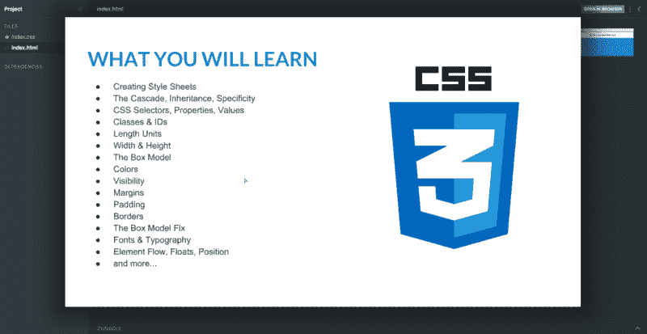
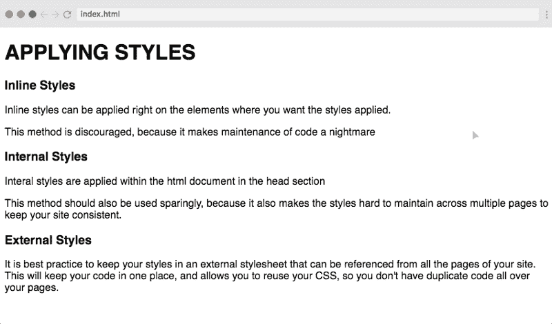
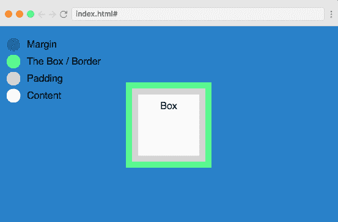
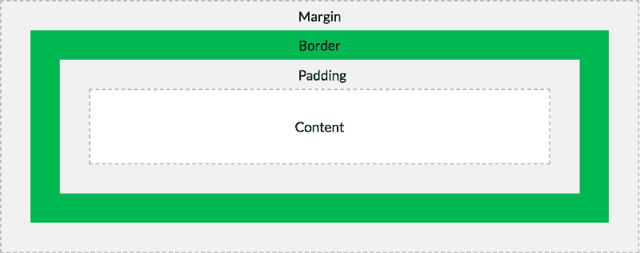
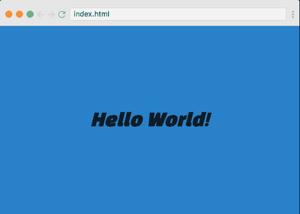
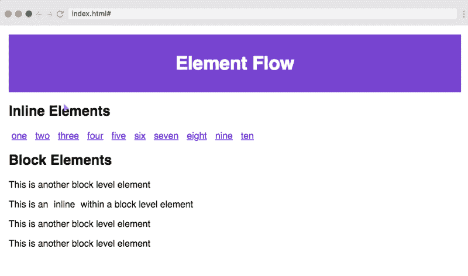
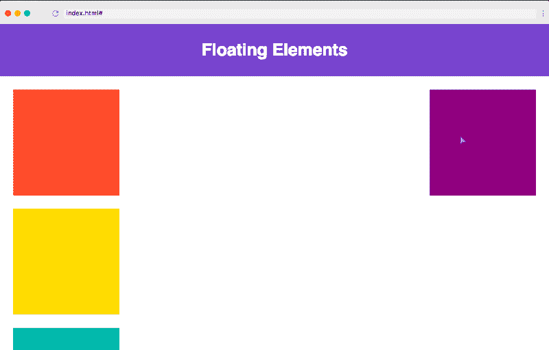
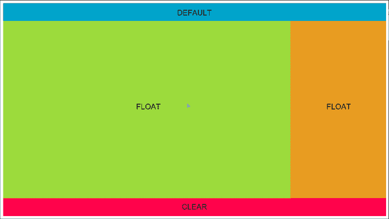
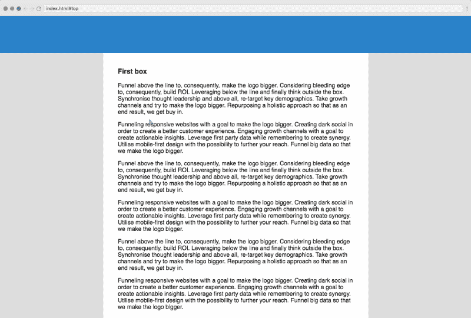
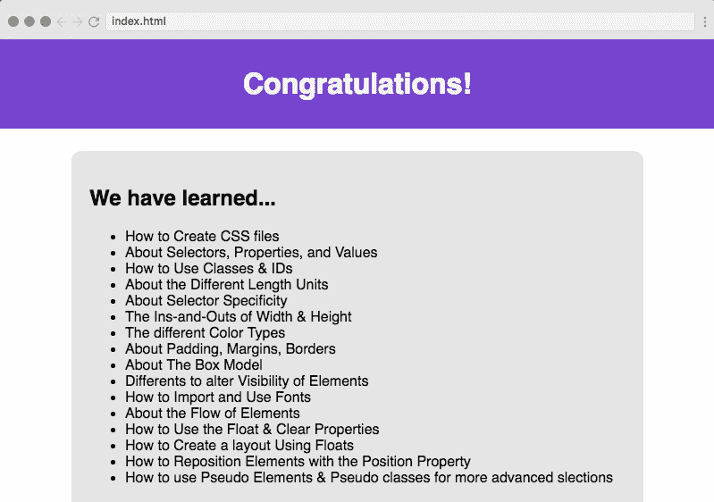

# 学习 CSS 在一个小时-免费和互动的 20 部分课程

> 原文：<https://www.freecodecamp.org/news/want-to-learn-css-heres-our-free-20-part-course-9fb3dcb0a971/>



[Click here to get to the course.](https://scrimba.com/g/gintrotocss?utm_source=freecodecamp.org&utm_medium=referral&utm_campaign=gintrotocss_1_hour_article)

CSS(层叠样式表)是 web 的三大基石之一，另外两个是 HTML 和 JavaScript。它通过颜色、样式、位置等等给网站带来了活力。因此，了解 CSS 在今天的劳动力市场上非常有价值！

所以我很高兴地宣布，我们刚刚在 Scrimba 上推出了一门免费的 CSS 课程。它是由我们杰出的导师[埃里克·提拉多](https://medium.com/u/3b3bb1053d15)创建的，他也上过我们广受欢迎的[HTML 入门课程。](https://scrimba.com/g/ghtml?utm_source=freecodecamp.org&utm_medium=referral&utm_campaign=gintrotocss_1_hour_article)

不到一个小时，Eric 就带你从零到精通 CSS！

我们来看看[球场](https://scrimba.com/g/gintrotocss?utm_source=freecodecamp.org&utm_medium=referral&utm_campaign=gintrotocss_1_hour_article)是怎么布局的。

### 第一部分:简介

在介绍视频中，Eric 将向您概述课程的内容、前提条件，以及他在整个课程中涉及的主题。他还向你简要介绍了他自己，以便你在开始之前熟悉他。

### 第 2 部分:CSS 文档和级联

然后我们直接进入课程的第一节正式课。在这一篇中，我们将探讨如何在 HTML 页面中包含 CSS，以及如何在元素中应用基本样式。



### 第 3 部分:CSS 选择器、属性和值

在第二课中，Eric 讲述了一些 CSS 词汇，这些词汇可以帮助你更好地理解他在后面的讲座中讲述的概念。您将了解什么是 HTML 元素，什么是 CSS 选择器，以及如何应用属性并给它们赋值。

# CSS 词汇

例如，这是一个`h1`元素。当您在浏览器中渲染它时，它会显示一些默认样式。如果我们想改变一些样式，我们可以使用 CSS:

```
h1 {  
   color: 'red';  
} 
```

我们的`h1`元素的选择器仅仅是元素本身的名称，然后我们用值 red 赋予它颜色属性。同样，我们也可以使用类和 id 来选择元素，这将在后面的视频中讨论。

### 第 4 部分:类和 id

这部分课程讨论了如何使用 CSS 中的类和 id 来选择 HTML 元素并对它们应用不同的样式。它还详细讨论了类和 ID 之间的区别，以及我们如何以及何时在 HTML 元素上分配它们

请看下面的代码示例:

```
<h1 class='heading'>This is the heading tag</h1>

<p class='paragraph'>This is a paragraph tag</p> 
```

上面的代码片段由一个`h1`(标题)和一个`p`(段落)标签组成。我们给了`h1`元素`heading`的类，给了`p`元素`paragraph.`的 ID

在我们的 CSS 文件中，我们选择 heading 类，并赋予它颜色属性。稍后我们选择段落 ID，并赋予它颜色和字体大小的属性:

```
.heading {  
   color: blue  
}

#paragraph {  
   color: green;  
   font-size: 14px;  
} 
```

### 第五部分:特异性

在本课程的第 5 部分，你将了解到特殊性，这意味着浏览器如何知道哪种样式和规则与要应用的元素最相关。

```
<h1 class='heading'>This is the heading tag</h1> 
```

例如，这里我们有一个应用了标题类别的`h1`标签。

```
h1 {  
   color: blue;  
}

.heading {  
   color: green;  
} 
```

使用 CSS，我们将蓝色分配给`h1`标签，这将改变每个`h1`的颜色。然后我们也将绿色分配给`heading`类，这样这个类中的每个元素的颜色都将被覆盖为绿色。所以我们上面定义的`h1`标签将显示为绿色。

### 第 6 部分:宽度和高度

在本课中，您将学习如何应用宽度和高度来控制页面的格式和流动。


上面是本课的一张幻灯片，它将告诉你如何使用宽度和高度来创建区域和方框，以使我们的网页看起来格式正确。

### 第 7 部分:长度单位

在 CSS 中，我们可以使用不同的单位来度量作为 HTML 元素属性传入的不同大小。本课详细讨论了这些不同的单位是什么，以及它们在用法上有何不同。

有两种长度单位:

1.  绝对单位
2.  相对单位。

绝对单位是固定长度单位，用其中任何一种单位表示的长度都将显示为该长度。例如，`cm`、`mm`、`in`、`'px`等都是绝对单位。

另一方面，相对长度单位指定相对于另一个长度属性的长度。例如，`em`、`ex`、`rem`等都是绝对单位。

### 第八部分:颜色

这一课详细讨论了我们如何使用和应用颜色到不同的 HTML 元素。它还讨论了在 CSS 属性中声明颜色名称的不同方法。

```
.heading1 {  
   color: orange;  
}

.heading2 {  
   color: #ff6347;  
}

.heading3 {  
   color: RGB(255, 99, 71);  
} 
```

上面的例子声明了三个类，并为它们分配了相同的颜色属性。但是需要注意的是我们是如何使用不同的方法来分配颜色值的。

类`heading1`使用颜色的名称(橙色)作为它的属性。`heading2`使用颜色的十六进制值。而`heading3`使用颜色的 RGB 值。

### 第 9 部分:填充

在 CSS 中，填充用于在任何已定义的边框内的元素内容周围创建空间。在 CSS 中，您可以控制将填充应用到元素的所有边或任意边。本课程的第 9 课讲述了填充，并教你如何以不同的方式应用它。

```
.container {  
   padding: 10px;  
   /* padding-left: 10px; */
   /*  padding-right: 10px; */ 
   /*  padding-top: 5px; */
   /*  padding-bottom: 5px; */ 
} 
```

就像上面的例子一样，我们可以只使用属性`padding`，它将把间距应用到所有的边，或者，你可以给单独的方向填充。

### 第 10 部分:边框

在本课中，您将学习如何在内容周围应用边框。您还将了解如何使用 CSS 中不同的样式和选项来改变边框。



以上图中的盒子为例，注意它周围不同颜色和宽度的边框。

### 第 11 部分:利润

CSS 中的边距类似于填充:它们在元素周围应用间距，但它们在任何已定义的边界之外应用间距。这一课讲述了在 CSS 中使用边距，以及如何在所有方向应用相同的边距或在不同方向应用不同的边距。

```
.container {  
   margin: 10px;  
   /* margin-left: 10px;  */
   /* margin-right: 10px;  */
   /* margin-top: 5px;  */
   /* margin-bottom: 5px;  */
} 
```

### 第 11 部分:盒子模型

CSS 中的盒子模型是我们描述设计和布局时使用的一个术语。我们可以把所有的 HTML 元素想象成盒子，每个盒子包含边距、填充、边框等属性。



上图解释了盒子的概念模型。在这一课中，Eric 将解释我们如何使用这一概念来更好地设计和排列我们的元素。

### 第 13 部分:可见性

我们还可以使用 CSS 更新 HTML 中任何元素的可见性。例如，我们可以使用`display`的属性隐藏或显示任何元素。这一课解释了三种不同的方法来处理元素的可见性。

```
.hidden {  
   display: none:  
} 
```

更新可见性的三种方法之一是使用`display`属性。在上面的例子中，我们已经将`display`属性设置为 none，这样任何具有`hidden`类的元素都不会出现在浏览器中。

### Part #14: Fonts

字体是 CSS 最重要和最有用的特性之一。我们可以使用不同种类的字体风格和字体系列来使我们的文本看起来更好。本课程的第 14 课是关于使用字体的！



上图中，文字 Hello World 有`Black Han Sans’, arial, sans-serif`的`font-family`和`30px`的`font-size`。同样，我们可以应用不同的属性来使我们的文本看起来更有吸引力和美观。

### 第 15 部分:元素流

在本节课程中，您将了解元素在浏览器中呈现的典型流程。HTML 元素有两种类型:内联元素和块元素

内联元素不能带有`width`和`height`属性。它们总是和它们的内容一样大。但是，在块元素上，您可以随意设置`width`和`height`



### 第 16 部分:漂浮和清除

在本课中，您将学习`float`和`clear`属性。如果我们想控制 HTML 元素的位置，使它们彼此浮动在左边或右边，这是非常有用的。



### 第 17 部分:浮动布局挑战

这门课的挑战来了。在其中，将鼓励您使用`float`属性创建以下布局。在稍后的截屏中，Eric 会教你如何做，以防你遇到任何困难。



### 第 18 部分:位置属性

在这一课中，我们将设计一个简单的文章页面，其中使用了可用的定位属性。我们将与 div，文本内容，跨度和页脚。

本课结束时，您将能够创建如下布局:



### 第 19 部分:伪类/元素

在最后一课中，我们将学习伪类和伪元素。我们使用伪类对 HTML 元素进行一些高级选择。当我们处理具有多个元素和条件样式的复杂网页时，这是一个非常有用的技术

```
/* unvisited link */  
a:link {  
    color: aqua;  
}

/* visited link */  
a:visited {  
    color: orange;  
} 
```

例如，在上面的代码片段中，我们使用锚标记是否被访问的状态，将不同的类应用于锚标记。使用伪类的用例有成千上万种，本课将帮助您理解使用它们的基本概念。

### 第 20 部分:下一步是什么？

在本课程的最后一个截屏中，Eric 总结了您在整个课程中学到的知识，并为您提供了继续学习的建议。

CSS 是一个庞大的主题，除了本课程所涵盖的内容之外，还有更多的功能需要学习！



如果你坚持到了最后，你可以给自己一个鼓励。你已经朝着学习如何建立和设计网站迈出了一大步，这是一项非常有价值的技能。

所以，今天就去[参加免费课程](https://scrimba.com/g/gintrotocss?utm_source=freecodecamp.org&utm_medium=referral&utm_campaign=gintrotocss_1_hour_article)吧！你未来的自己会为此感谢你的:)

* * *

感谢阅读！我的名字叫 Per Borgen，我是最简单的学习编码方法——Scrimba 的联合创始人。如果你想学习建立专业水平的现代网站，你应该看看我们的[响应式网页设计训练营](https://scrimba.com/g/gresponsive?utm_source=freecodecamp.org&utm_medium=referral&utm_campaign=gintrotocss_1_hour_article)。


[Click here to get to the advanced bootcamp.](https://scrimba.com/g/gresponsive?utm_source=freecodecamp.org&utm_medium=referral&utm_campaign=gintrotocss_1_hour_article)