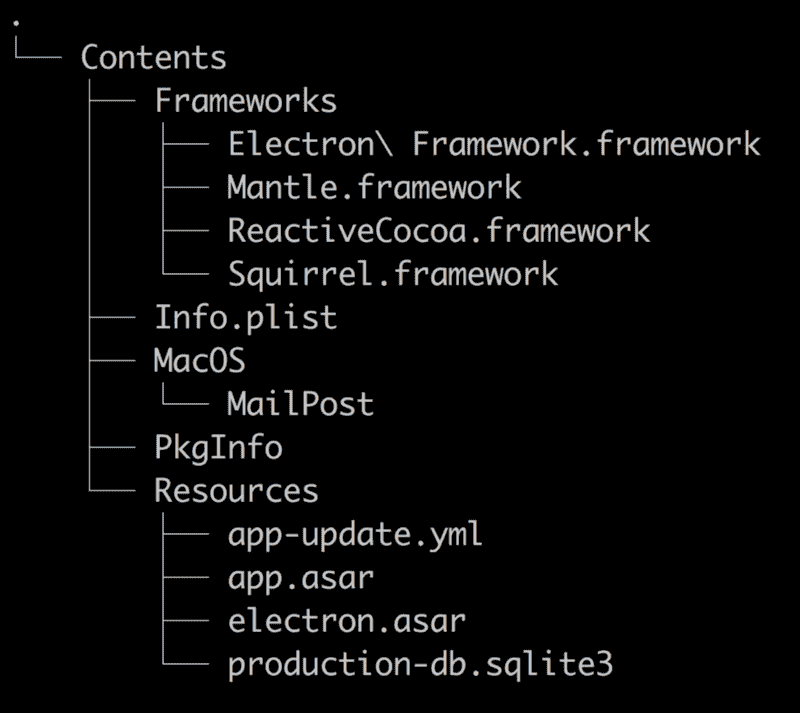

# 如何用 JavaScript 构建电子桌面应用程序:多线程、SQLite、本机模块和其他常见问题

> 原文：<https://www.freecodecamp.org/news/how-to-build-an-electron-desktop-app-in-javascript-multithreading-sqlite-native-modules-and-1679d5ec0ac/>

安德鲁·沃尔什

# 如何用 JavaScript 构建电子桌面应用程序:多线程、SQLite、本机模块和其他常见问题

作为开发桌面应用程序的框架，Electron 提供了很多功能。它授予对节点的 API 和 ecosphere 的完全访问权限。它部署在所有主要的操作系统上(只有一个代码库)。借助其基于 web 的架构，您可以使用 CSS 的最新功能来创建高级 ui。

有很多文章讨论如何使用 electronic，但是很少有人专门讨论如何使用 SQLite 或者如何使用多线程。我们将了解如何使用 Electron 构建处理大量数据或运行大量任务的应用程序。

特别是，我们将涵盖:

*   电子是如何工作的(简而言之)，以及它的结构如何影响我们能做什么
*   多线程操作
*   使用 SQLite 等本地数据库，或写入电子应用程序中的任何文件
*   本机模块
*   需要注意的几个问题
*   使用本机模块打包应用程序

### **电子如何工作——节选**

值得重复一下 Electron 架构背后的关键原则。一个电子应用至少包括两个过程。主线程是应用程序的入口，完成向用户显示渲染器进程所需的所有工作。主流程只能有一个实例。

渲染器进程使用 Chromium 来渲染你的应用程序。正如每个选项卡在自己的进程中运行一样，每个渲染器也是如此。它们是使用 [BrowserWindow](https://github.com/electron/electron/blob/master/docs/api/browser-window.md) 构造函数的 [loadURL](https://github.com/electron/electron/blob/master/docs/api/browser-window.md#winloadurlurl-options) 方法加载的，该方法需要指向本地或远程 HTML 文件。这意味着启动渲染器进程的唯一方法是使用 HTML 文件作为条目。

#### **电子架构的注意事项**

电子的简单性是它最大的优点之一。主进程进行必要的配置，然后将 HTML 文件或 URL 传递给呈现器进程。这个文件可以做常规 web 应用程序能做的任何事情——并且您可以从那里开始。

但是只能有一个主进程的事实使得如何实现多线程变得不清楚。Electron 的文档暗示渲染器进程是为渲染用户界面的任务而严格设计的(我们将看到，这不是真的)。

重要的是要知道[在主进程上做任何计算密集型的事情都会减慢](https://medium.com/actualbudget/the-horror-of-blocking-electrons-main-process-351bf11a763c)(或者冻结)你的渲染进程。将任何计算密集型工作从主线程上移走是至关重要的。最好让它单独完成启动渲染器进程所需的一切工作。由于我们不能在渲染应用程序前端的同一个渲染器进程上做密集的工作(因为这也会影响 UI)，我们需要另一种方法。

### **多线程**

在 electronic 中有三种通用的多线程处理方法:

*   使用网络工作者
*   派生新流程来运行任务
*   作为工作进程运行(隐藏)呈现器进程

#### **网络工作者**

因为 electronic 是建立在 Chromium 之上的，所以任何可以在浏览器上完成的事情都可以在 renderer 进程中完成。这意味着您可以使用 [web workers](https://developer.mozilla.org/en-US/docs/Web/API/Web_Workers_API/Using_web_workers) 在单独的线程中运行密集型任务。这种方法的优点是简单，并且保持了与 web 应用程序的同构。

然而，有一个非常大的警告—您不能使用本机模块。从技术上来说你可以，但是这样做会导致你的应用程序崩溃。这是一个严重的问题，因为任何需要多线程的应用程序可能也需要使用本机模块(如[节点-sqlite3](https://github.com/mapbox/node-sqlite3) )。

#### **派生新流程**

Electron 使用 Node 作为运行时，这意味着您可以完全访问像 [cluster](https://nodejs.org/api/cluster.html) 这样的内置模块。新的进程可以分叉来运行任务，使密集的工作远离主线程。

主要问题是，与渲染器进程不同，子进程不能使用电子库中的方法。这迫使您通过 IPC 维护与主进程的通信通道。渲染器进程可以使用[远程模块](https://github.com/electron/electron/blob/master/docs/api/remote.md)来告诉主进程执行仅主进程的任务，而不需要这个额外的步骤。

另一个问题是，如果你使用 ES 模块或者 JavaScript 的 TC39 特性，你需要确保你运行的是你的脚本的编译版本。您还需要将这些包含在您的打包应用程序中。这个问题会影响任何派生进程的节点应用程序，但是它确实会增加构建过程的复杂性。当平衡打包应用程序的需求和使用开发工具(利用实时重载等特性)时，这也变得很棘手。

#### **使用渲染器进程作为工作线程**

渲染器进程通常被视为用于渲染用户界面。然而，他们并不局限于这个唯一的任务。通过[配置传递给 BrowserWindow 的显示标志](https://github.com/electron/electron/blob/master/docs/api/browser-window.md#new-browserwindowoptions)，它们可以被隐藏并在后台运行。

这样做有很多好处。与 web workers 不同，您可以自由使用本机模块。与分叉进程不同，你仍然可以使用电子库来告诉主进程做一些事情，比如打开一个对话框或者创建操作系统通知。

使用电子时的一个挑战是 [IPC](https://github.com/electron/electron/blob/master/docs/api/ipc-main.md) 。虽然简单，但它需要大量的样板文件，并且增加了调试大量事件侦听器的难度。这也是你要进行单元测试的另一件事。通过使用渲染器进程作为工作线程，可以完全避免这种情况。就像使用服务器一样，您可以监听本地端口并接收请求，这使您能够使用诸如[graph QL](https://graphql.org/learn/)+[React Apollo](https://github.com/apollographql/react-apollo)之类的工具。您还可以使用 websockets 进行实时通信。另一个好处是，您不需要使用 ipcRenderer，并且可以保持您的电子和 web 应用程序同构(如果您希望对桌面和 web 应用程序使用共享代码库)。

对于高级用例，这种方法可以与集群相结合，以获得最佳效果。唯一的缺点是，您需要提供一个 HTML 文件作为 worker renderer 进程的入口(这确实有点像黑客)。

### **如何使用 SQLite(或任何你需要写的东西)**

有几种不需要本机模块的状态管理方法。例如，使用 Redux 在渲染器的上下文中处理所有状态。

然而，如果你需要处理大量的数据，这是不够的。特别是，我们将看看如何在电子应用程序中使用 SQLite。

要部署您的电子应用程序，您首先需要打包它。有很多工具可以做到这一点——最流行的是[电子生成器](https://github.com/electron-userland/electron-builder)。电子使用 ASAR 档案格式捆绑你的申请到一个单一的，未压缩的文件。ASAR 档案是只读的，这意味着您不能向其中写入任何数据。这意味着你不能将你的数据库和你的代码一起包含在你的 ASAR 档案中(在电子构建器中，这将在“[文件](https://www.electron.build/configuration/configuration)”下)。

相反，把你的数据库放在你的电子包的资源目录中。打包电子申请的文件结构以及数据库的存放位置如下所示:

名为 app.asar 的打包 ASAR 归档文件位于。/内容/资源。您可以将数据库或任何要写入但包含在打包应用程序中的文件放在同一个目录中。这可以通过使用“ [extraResources](https://www.electron.build/configuration/contents) ”配置的电子生成器来实现。

另一种方法是完全在另一个目录中创建数据库。但是如果用户决定卸载您的应用程序，您需要考虑在所有平台上删除这个文件。

### **用本机模块打包**

绝大多数节点模块都是用 JavaScript 编写的脚本。[本机模块](https://nodejs.org/api/addons.html#addons_c_addons)是用 C++编写的模块，具有与 Node 一起使用的绑定。它们充当用 C/C++编写的其他库的接口，通常配置为安装后编译。

作为低级模块，它们需要针对目标体系结构和操作系统进行编译。在 Windows 机器上编译的本机模块不能在 Linux 机器上运行——即使常规模块可以。这对 electronic 来说是个问题，因为我们最终需要将所有东西打包到一个. dmg (OSX)中。exe (Windows)或。deb (Linux)可执行文件。

使用本机模块的电子应用程序需要打包到它们的目标系统上。因为您希望在 CI/CD 管道中自动化这个过程，所以您需要在打包之前构建您的本机依赖项。为了完成这个任务，你可以使用一个由电子团队开发的叫做[电子重建](https://github.com/electron/electron-rebuild)的工具。

如果你正在开发一个非商业开源项目，你可以使用 [TravisCI](https://travis-ci.org/) (Linux，OSX)和 [Appveyor](https://www.appveyor.com/) (Windows)免费自动构建、测试和部署你的应用程序。

如果您有集成测试，这种设置可能会很棘手，因为您需要安装某些依赖项才能让无头测试工作。可以在[这里](https://github.com/AndrewGHC/mail-post/blob/master/.travis.yml)找到 OSX 和 Linux 的配置示例，在这里可以找到 Appveyor 的配置示例[(这些示例基于](https://github.com/AndrewGHC/mail-post/blob/master/appveyor.yml)[电子反应样板](https://github.com/chentsulin/electron-react-boilerplate)项目中的配置，增加了 OSX 和部署)。

### **抓到你了**

打包您的电子应用程序时，与路径相关的节点的一些内置属性可能不会像您预期的那样运行，也不会像您运行预构建的二进制文件来服务您的应用程序时那样运行。

像 __dirname、__filename 这样的变量和 process.cwd 这样的方法在打包的应用程序中不会像预期的那样运行(参见此处的[、此处](https://github.com/electron/electron/issues/3204)的[和此处](https://github.com/electron/electron/issues/8358)的[)。请改用](https://github.com/electron/electron/issues/2108) [app.getAppPath](https://github.com/electron/electron/blob/master/docs/api/app.md#appgetapppath) 。

### **关于包装的最后一点说明**

在开发一个电子应用程序时，您可能希望同时使用生产(使用预构建的二进制文件提供捆绑代码)和开发(使用 [webpack-dev-server](https://github.com/webpack/webpack-dev-server) 或 [webpack-serve](https://github.com/webpack-contrib/webpack-serve) 来查看您的文件)模式。

为了保持理智，从与源代码相同的目录中构建和提供您的包。这意味着当您选择这些文件进行打包时，所有文件路径假设在这些模式和您的包之间保持一致。

至少，你的主进程需要指向你的渲染器进程的 HTML 文件的文件路径。如果作为构建过程的一部分，您将这个文件移动到另一个目录中，您将被迫维护文件结构假设，这可能很快成为您需要维护的另一个复杂的负担。

在打包的应用程序中调试与不正确的文件路径相关的问题是一个反复试验的过程。

### **总结**

在 electronic 中有几种实现多线程的方法。Web workers 很方便，但是缺乏使用原生模块的能力。派生新的流程就像在 Node 中一样工作，但是缺乏使用电子库的能力迫使使用 IPC 来完成常见任务，并且会很快变得复杂。使用渲染进程作为工作进程将所有可用节点服务器工具的全部功能作为 IPC 通信的替代，同时保留对电子渲染器库中本机模块和方法的访问。

由于 Electron 将文件打包在只读的 ASAR 档案中，我们需要写入的任何文件(如 SQLite 数据库)都不能包含在内。相反，可以将它们放在 Resources 目录中，它们将保留在打包的应用程序中。

最后，要注意这样一个事实，即在打包的应用程序中，一些节点属性的行为并不像您预期的那样。为了清楚起见，请将打包应用程序的文件结构与源代码匹配。