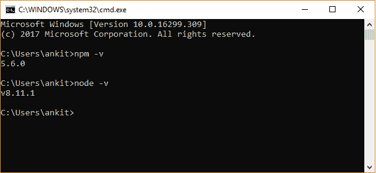
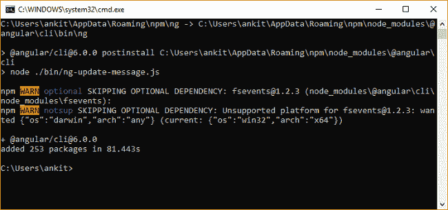
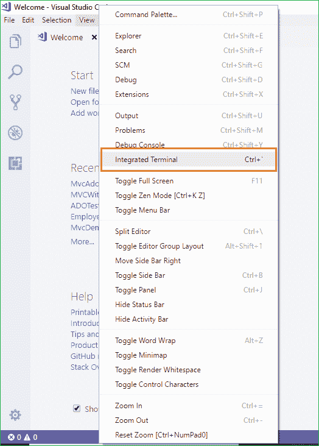
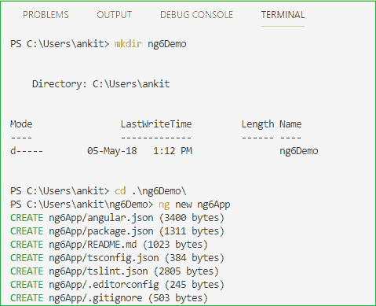
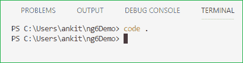
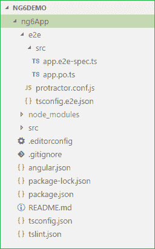
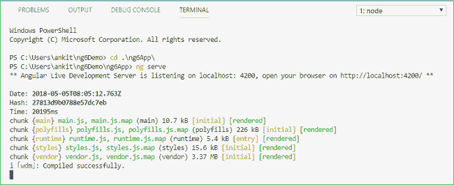
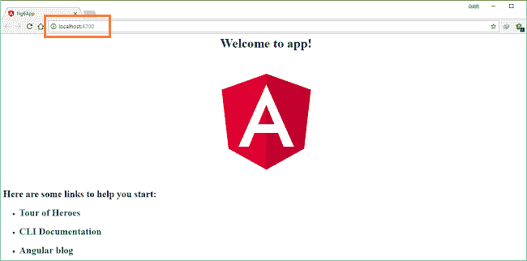
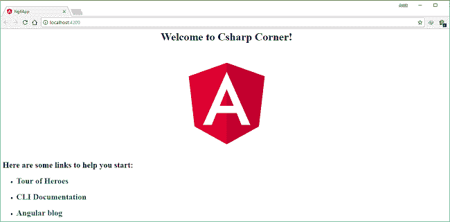

# 如何开始使用 Angular 6.0

> 原文：<https://www.freecodecamp.org/news/how-to-get-started-with-angular-6-0-a196cbfb9bbb/>

#### 了解新内容并构建应用程序

Angular 发布了最新版本 Angular 6.0。在本文中，我们将了解 Angular 6.0 的新特性，并借助 Angular CLI 6.0 和 Visual Studio 代码创建一个新项目。

### Angular 6.0 有什么新功能？

#### ng 更新

一个新的 CLI 命令，将您的项目依赖项更新到最新版本。

#### ng 添加

另一个新的 CLI 命令使向项目添加新功能变得更加容易。

#### 角度元素

这是一项新功能，允许我们将 Angular 组件编译成本地 web 组件，我们可以在 Angular 应用程序中使用这些组件。

#### <template></template>

您不能再在组件模板中使用<template></template>

#### 图书馆支持

Angular CLI 现在支持创建和构建库。要在 CLI 工作区中创建库项目，请运行以下命令:ng generate library <name>(例如:ng generate library my-demo-lib)</name>

#### 角形材料起动器部件

如果运行“ng add @angular/material”将材质添加到现有应用程序中，您还将能够生成 3 个新的起始组件:

*   **素材侧边导航**
    一个入门组件，包括一个带有应用程序名称和侧边导航的工具栏
*   **材质仪表板**
    一个包含动态网格列表卡片的起始仪表板组件
*   **物料数据表**
    一个初始数据表组件，预先配置了一个数据源，用于排序和分页

#### 工作空间支持

Angular CLI 现在支持包含多个项目的工作区，例如多个应用程序和/或库。

#### 的”。angular-cli.json "文件已被弃用

Angular 项目现在将使用“angular.json”而不是“.”。angular-cli.json”，用于构建和项目配置。

#### 使用 RxJS V6

Angular 6 还允许我们在应用程序中使用 RxJS V6。

#### 树可摇动提供程序

Angular 6.0 允许我们将服务捆绑到模块中的代码库中，在模块中注入服务。这将有助于我们使我们的应用程序更小。

例如:之前，我们习惯将我们的服务引用如下。

```
// In app.module.ts    @NgModule({    ...    providers: [MyService]  })  export class AppModule {}    // In myservice.ts     import { Injectable } from '@angular/core';    @Injectable()  export class MyService {    constructor() { }  }
```

这种方法仍然有效，但是 Angular 6.0 提供了一种新的更简单的替代方法。我们不再需要在 NgModule 中添加引用。我们可以将引用直接注入到服务中。因此，我们可以使用如下服务:

```
// In myservice.ts    import { Injectable } from '@angular/core';    @Injectable({    providedIn: 'root',  })  export class MyService {    constructor() { }  }
```

这些是 Angular 最新版本的新特性/改进。让我们继续使用 Angular 6.0 创建我们的第一个应用程序。

### 先决条件

*   从[这里](https://nodejs.org/en/download/)安装 Node.js 的最新版本
*   从[这里](https://code.visualstudio.com/)安装 Visual Studio 代码

安装 Node.js 也会在您的计算机上安装 npm。安装 Node.js 后，打开命令提示符并运行以下命令集来检查您的计算机上安装的 Node 和 npm 的版本。

参考下图:



现在我们已经安装了 Node 和 npm，下一步是安装 Angular CLI。在命令窗口中运行以下命令。这将在您的计算机上全局安装 Angular 6.0 CLI。



打开 VS 代码并导航至视图>>集成终端。



这将在 VS 代码中打开一个终端窗口。

在终端窗口中键入以下命令序列。这些命令将创建一个名为“ *ng6Demo* 的目录，然后在该目录中创建一个名为“ *ng6App* 的 Angular 应用程序。

*   mkdir ng6 演示版
*   CD ng6 演示
*   ng 新 ng6App



我们开始了——我们已经使用 VS 代码和 Angular CLI 创建了第一个 Angular 6 应用程序。现在运行以下命令打开项目。

请参考下图:



这将在一个新的 VS 代码窗口中打开我们应用程序的代码文件。您可以在解决方案资源管理器中看到以下文件结构。



请注意，文件夹结构与旧版本的 Angular 略有不同。我们有了一个新的“angular.json”文件，而不是旧的。angular-cli.json "文件。这个配置文件将仍然像以前一样提供相同的任务，但是模式发生了一些变化。

打开 package.json 文件，您可以看到我们的项目中安装了最新的 Angular 6.0.0 包。

```
{    "name": "ng6-app",    "version": "0.0.0",    "scripts": {      "ng": "ng",      "start": "ng serve",      "build": "ng build",      "test": "ng test",      "lint": "ng lint",      "e2e": "ng e2e"    },    "private": true,    "dependencies": {      "@angular/animations": "^6.0.0",      "@angular/common": "^6.0.0",      "@angular/compiler": "^6.0.0",      "@angular/core": "^6.0.0",      "@angular/forms": "^6.0.0",      "@angular/http": "^6.0.0",      "@angular/platform-browser": "^6.0.0",      "@angular/platform-browser-dynamic": "^6.0.0",      "@angular/router": "^6.0.0",      "core-js": "^2.5.4",      "rxjs": "^6.0.0",      "zone.js": "^0.8.26"    },    "devDependencies": {      "@angular/compiler-cli": "^6.0.0",      "@angular-devkit/build-angular": "~0.6.0",      "typescript": "~2.7.2",      "@angular/cli": "~6.0.0",      "@angular/language-service": "^6.0.0",      "@types/jasmine": "~2.8.6",      "@types/jasminewd2": "~2.0.3",      "@types/node": "~8.9.4",      "codelyzer": "~4.2.1",      "jasmine-core": "~2.99.1",      "jasmine-spec-reporter": "~4.2.1",      "karma": "~1.7.1",      "karma-chrome-launcher": "~2.2.0",      "karma-coverage-istanbul-reporter": "~1.4.2",      "karma-jasmine": "~1.1.1",      "karma-jasmine-html-reporter": "^0.2.2",      "protractor": "~5.3.0",      "ts-node": "~5.0.1",      "tslint": "~5.9.1"    }  }
```

我们的 Angular 应用程序的名称是 *ng6app* ，它位于 *ng6demo* 目录中。

因此，我们将首先使用下面的命令导航到我们的应用程序。

然后我们使用下面的命令来启动 web 服务器。



运行这个命令后，可以看到它正在要求在浏览器中打开[*http://localhost:4200*](http://localhost:4200)。所以，打开你机器上的任何一个浏览器，导航到这个 URL。现在，你可以看到下面的页面。



现在，我们将尝试更改屏幕上的欢迎文本。导航到*/src/app/app . component . ts*文件，并用以下代码替换该代码。

```
import { Component } from '@angular/core';    @Component({    selector: 'app-root',    templateUrl: './app.component.html',    styleUrls: ['./app.component.css']  })  export class AppComponent {    title = 'Csharp Corner';  }
```

现在打开浏览器，你可以看到网页已经更新为新的欢迎信息“欢迎来到 Csharp Corner！”



在本文中，我们了解了 Angular 6.0 的新特性。我们已经安装了 Angular 6.0 CLI，并借助 Visual Studio 代码创建了我们的第一个 Angular 6.0 应用程序。我们还定制了网页上的欢迎信息。

你也可以在 [C#角](https://www.c-sharpcorner.com/article/getting-started-with-angular-6/)找到这篇文章。

你可以在这里查看我关于 Angular [的其他文章](http://ankitsharmablogs.com/category/angular/)

最初发表于[https://ankitsharmablogs.com/](https://ankitsharmablogs.com/)