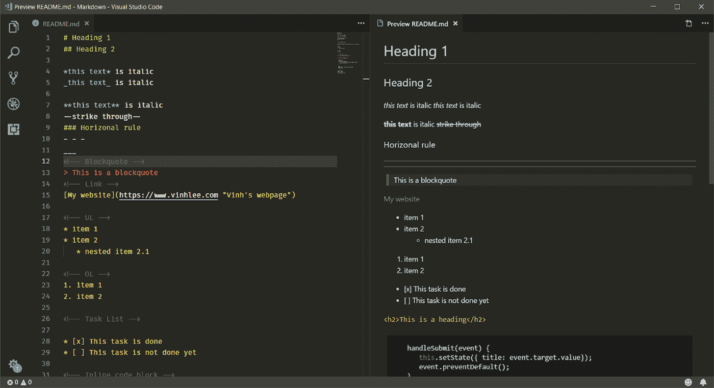
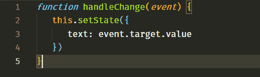
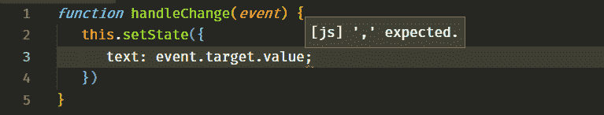
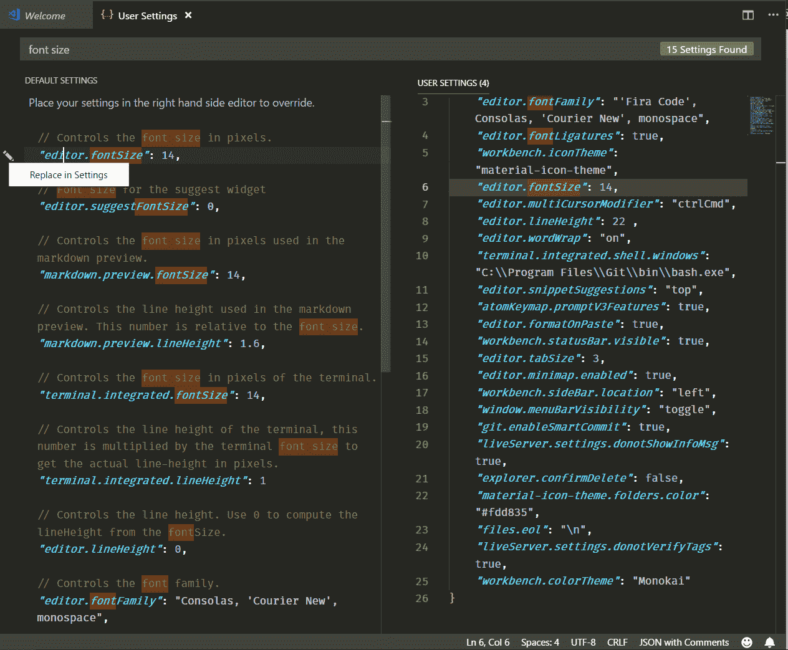
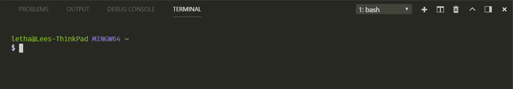
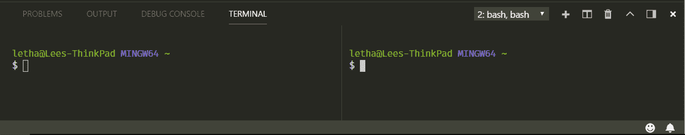
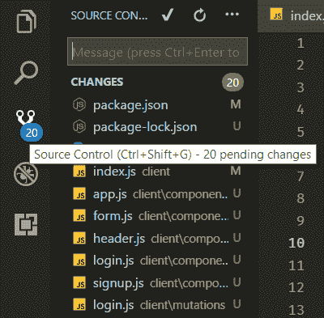
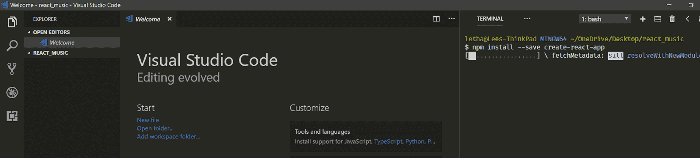
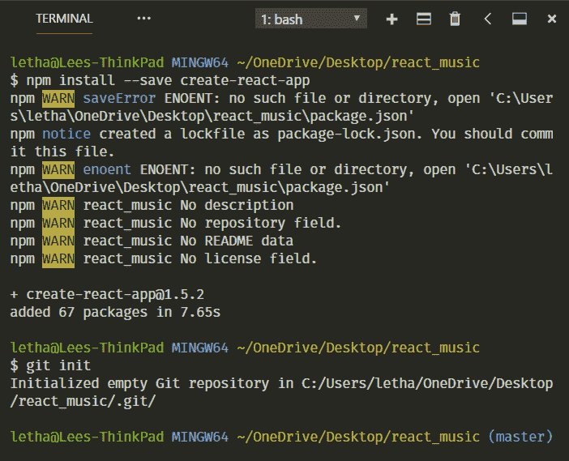
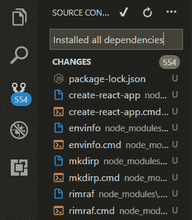

# 面向前端开发人员的 Visual Studio 代码概述

> 原文：<https://www.freecodecamp.org/news/an-overview-of-visual-studio-code-for-front-end-developers-49a4aa0771fb/>

作者 Vinh Le

无论你是代码新手还是经验丰富的开发人员，代码编辑器都是你工作中必不可少的一部分。问题是，尤其是如果你是一个初学者，ide 有太多的选择。其中许多都有相似的特性、功能，甚至用户界面。因此，选择正确的 IDE 可能会比您想象的花费更多的时间和精力。

如果你现在的问题是:“我应该从哪个代码编辑器开始？”然后我会回答:“这要看情况，我的朋友。”选择一个特定的 IDE 很大程度上取决于几个因素:您是什么类型的开发人员，您通常使用什么样的环境，或者您是否有完成工作绝对需要的独有的内置特性。

我会说，选择一个的方法是尝试和探索它们，然后选择最适合你的。

# 为您选择正确的代码编辑器

和大多数新手一样，我开始使用 Notepad++作为我的第一个代码编辑器。这可能是我尝试过的最简单的方法之一。后来，由于我的需求开始要求编辑器提供更高级的功能，我尝试了方括号、Atom，然后是 Visual Studio 代码。

经过大量的试验后，VSCode 成了我的最爱。它给我留下了深刻的印象，其现代化的用户界面，广泛的扩展可用性，以及内置 Git 和终端等伟大的功能。

这篇博客的主要目的不是比较不同的 ide，而是讨论我使用 VSCode 的经验。所以在这篇文章中，我将:

*   显示 VSCode 的简要介绍
*   介绍我安装的特定主题
*   讨论我使用的有用扩展
*   向您展示我如何利用 VSCode 的特性来增强我的工作流。

让我们开始吧！

# 但是首先，VSCode 到底是什么？

Visual Studio Code (VSCode)是微软开发的源代码编辑器，可以在 Windows、macOS、Linux 上运行。它是免费的、开源的，提供了对调试以及内置 Git 版本控制、语法亮点、代码片段等的支持。VSCode 的 UI 是高度可定制的，因为用户可以切换到不同的主题、键盘快捷键和首选项。

VSCode 最初于 2015 年作为一个开源项目在 GitHub 上发布，一年后发布到网络上。从那以后，微软的代码编辑器越来越受开发人员的欢迎。

在 [Stack Overflow 2018 开发者调查](https://insights.stackoverflow.com/survey/2018/)中，VSCode 被评为最受欢迎的开发环境，超过 100，000 名受访者中约有 35%的人表示他们使用它。更令人吃惊的是，在 web 开发领域，这个数字大约是 39%。

通过每月更新，用户可以期待享受更好的体验——错误修复、稳定性和性能提升频繁推出。

# 主题:颜色和字体

如果你像我一样，关心 IDE 的主题，找到合适的字体和主题颜色是非常重要的。我个人更喜欢深色主题，讨厌 Windows 上 VSCode 默认的 Consolas 字体。

所以 ****Monokai**** 颜色主题和 ****FiraCode**** 字体是我目前的选择。这种组合带来了强烈的对比，我觉得非常愉快的工作。

*   要安装主题，请单击设置图标= >颜色主题= >选择您喜欢的主题
*   点击查看 FiraCode [的安装指南。](https://github.com/tonsky/FiraCode)
*   你也可以去看看 ****OneDarkPro**** ，另一个很棒的黑暗主题:在扩展中(Windows 上 Ctrl + Shift + X)，搜索 OneDarkPro，点击安装，从颜色主题中选择。

# 有用的扩展(扩展= >搜索= >安装)

这些是我最喜欢的扩展:

*   [****美化****](https://marketplace.visualstudio.com/items?itemName=HookyQR.beautify) :就地美化代码，让你的代码更具可读性
*   ****括号对着色:**** 允许匹配的括号用颜色来标识

The colors of ( and { are separated right?

*   [****ESLint****](https://eslint.org/) :一般 React 或者 JavaScript 开发者必备的扩展。ESLint 用于查找代码中的问题和错别字，并允许您标记该错别字。它还提出了解决方案。

*   **:为 HTML 标记添加丰富的语言支持，如自动关闭标签。**
*   ******JavaScript (ES6)代码片段**** :不言自明**
*   ******实时服务器:**** 为你的 HTML 或 PHP 站点启动一个具有实时重载功能的本地服务器**
*   ******降价预览增强**** :为你的降价文件运行 live 服务器。**
*   ******材质图标主题:**** 提供基于谷歌材质设计的图标。要激活，单击 **设置= >文件图标主题= >选择素材图标主题****
*   ******更漂亮**** :漂亮地格式化你的 JavaScript/ TypeScript/ CSS 代码。**

# **自定义您的用户界面**

****

**您可以通过以下方式定制几乎所有内容，从代码的字体系列和字体大小到行高:**

*   **进入 ****用户设置(Ctrl +，)******
*   **搜索与您想要的定制相关的关键字**
*   **点按设置左侧的“编辑”按钮，然后选取“在设置中替换”**
*   **更改您刚才选择的设置值。**

**在我当前的设置中，根据我的个人喜好(以及良好的可读性)，我将 fontSize 设置为 14，lineHeight 设置为 22，tabSize 设置为 3。**

# **我希望从一开始就知道的事情**

**除了这些主题和扩展，我还想与您分享我如何使用 VSCode 的强大功能来提高工作效率。这些都是我作为初学者所不知道的，这对利用和促进我的工作流程会很有帮助。**

## **集成终端**

**你在软件开发上花的时间越多，终端就变得越重要，这是不可避免的。作为一名 JavaScript 开发人员，我使用终端来安装包、运行开发服务器，甚至将当前存储库中的更改推送到 GitHub。**

**一开始，我主要用 Windows 命令提示符或稍后的 Git Bash 来处理这些任务。如果你使用 Windows，那么你可能知道 CMD 是多么的愚蠢和烦人。Git Bash 是一个不错的工具，但是当你工作的时候在应用程序之间切换并不是一个愉快的经历。**

**VSCode 用它神奇的终端真正为我解决了这个问题。最酷的是，你可以很容易地设置它的工作方式与 Git Bash 相同，但是是在 VSCode 内部！这样你就有了一个很棒的组合。**

**要访问 VSCode 终端，使用****Ctrl+`(1 键左侧)**** 。然后终端会弹出来。**

****

**从这里，你可以做很多很酷的事情，比如创建一个新的终端或者取消现有的终端。您还可以拆分视图以及侧视图。**

**

It is cool to have multiple terminals built right in your code editor, isn’t it?** 

## **源代码管理(Git)**

****

**当您在一个存储库上工作并且经常需要进行更改时，您通常会找到终端来提交最近的更改，不是吗？嗯，VSCode 给了你一个很棒的内置工具来控制你的版本。**

**通过单击左侧面板中的 Git 图标或使用 Ctrl + Shift + G (Windows)，可以轻松访问源代码控制。在这里，你可以做任何事情。太方便了，不是吗？**

# **所有这些是如何增强我的工作流程的——它们又是如何让你的工作流程变得更好的？**

**在使用 VSCode 相当长的时间后，我坚信它的关键价值是基于它的一体化环境。作为一名前端开发人员，我的工作流程中的所有需求和任务都得到了完美的处理。**

**为了更清楚地说明这些优势，让我带您浏览一下我的正常工作流程。**

****

**比方说，我在 React 创建的一个新音乐应用程序上获得了一些想法。我通常通过创建一个空白文件夹来启动一个项目，所以我将创建一个名为 ****music_react**** 的新文件夹。之后，我可以通过选择一个右键选项立即在 VSCode 中打开项目。**

**一旦我在我的工作项目中，我可以在左侧面板中用快捷方式快速创建文件和文件夹。**

**在这个项目中，我想使用 ****create-react-app**** 初始化。因此，我可能需要安装那个包——没什么大不了的。我通过输入 Ctrl +`打开我的终端。令人惊讶的是，终端自动导航到我的确切目录。没有必要再改变目录了。**

**在命令行中输入安装 npm 包之后，我需要做的就是等待，直到所有的依赖项都安装完毕。**

********

**我还想在 GitHub 上发布我的项目，所以我应该先初始化一个 Git 存储库。安装完包之后，我也在终端中输入 Git 初始化命令。**

****

**一旦 Git 成功安装，我就可以在左侧面板的源代码控件中提交所有挂起的更改。**

**然后我可以像往常一样继续我的项目。此外，如果我愿意，我可以从我的终端将所有更改推送到 GitHub。**

# **包扎**

**这就是我在 VSCode 环境中的正常工作流程。我知道这取决于你是什么类型的开发者。与我相比，后端开发人员可能有完全不同的工作流程。**

**但是，如果您是一名刚刚开始了解 VSCode 的前端开发人员，并且希望在深入了解它之前先了解它，我希望这篇文章能让您有所了解，并有助于提高您的工作效率。毕竟，我写这个小指南的最大灵感是因为我真的找不到任何针对新人的 VSCode 的全面审查。因此，这个博客希望能给你带来一些价值。**

**最后，如果你的设置和我的不同，或者有你认为很好的扩展，不要犹豫，在评论中分享。我很高兴收到你的来信！**