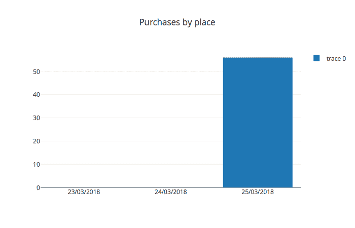
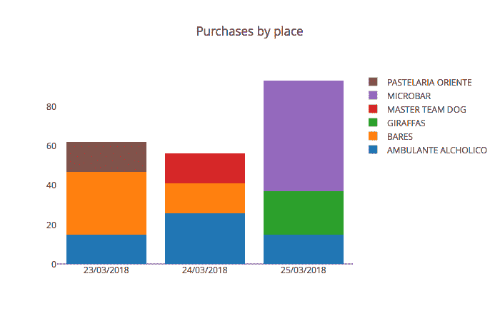
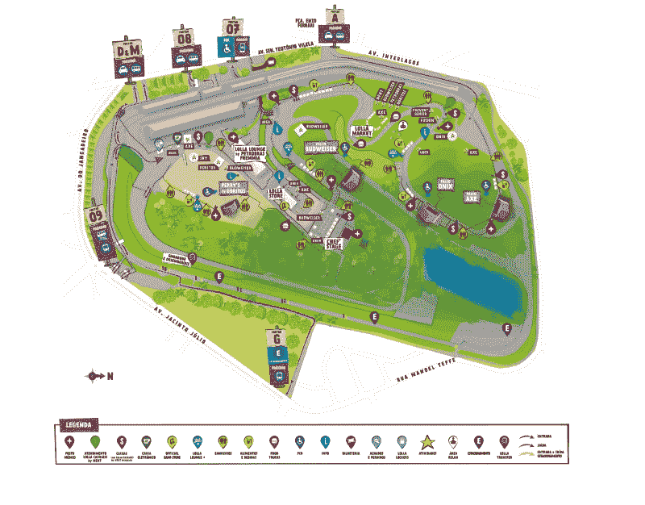
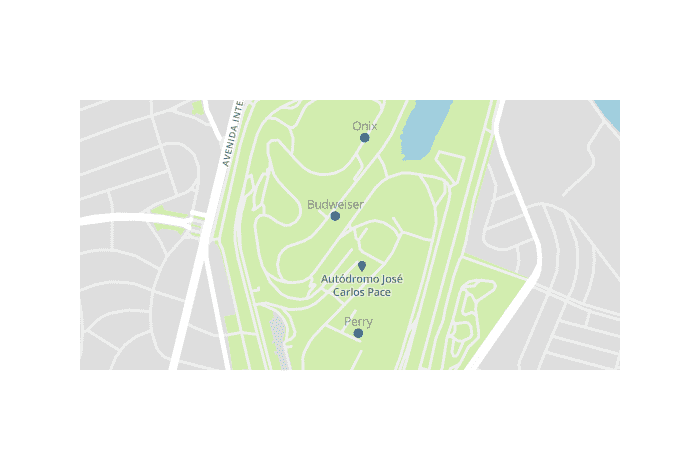
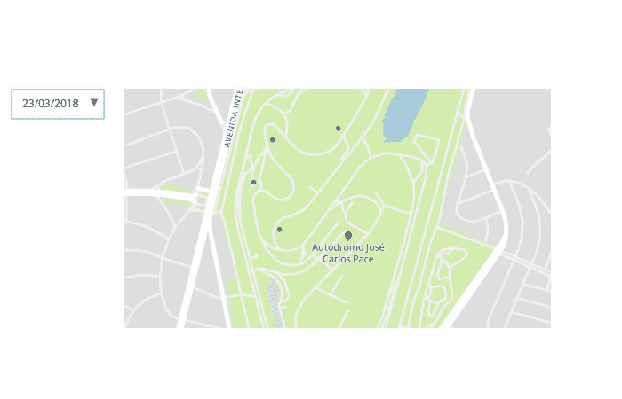
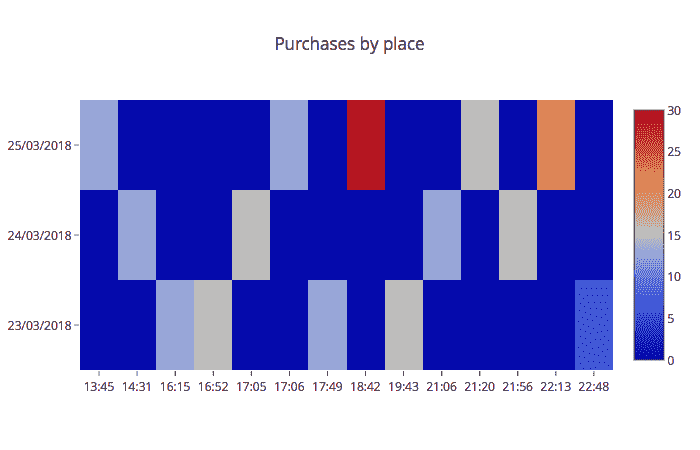
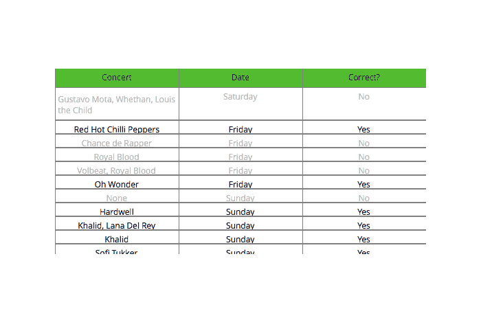
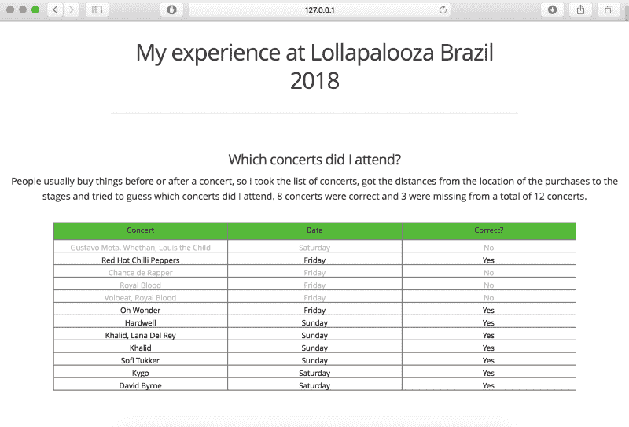

# 我如何以及为什么使用 Plotly(而不是 D3)来可视化我的 Lollapalooza 数据

> 原文：<https://www.freecodecamp.org/news/how-and-why-i-used-plotly-instead-of-d3-to-visualize-my-lollapalooza-data-d48345e2ca68/>

作者德博拉·梅斯基塔

# 我如何以及为什么使用 Plotly(而不是 D3)来可视化我的 Lollapalooza 数据


[Lollapalooza Brasil 2018 — Wesley Allen — IHateFlash](https://www.flickr.com/photos/t4fbr/39846814790/)

D3.js 是一个非常棒的 JavaScript 库，但是它有一个非常陡峭的学习曲线。这使得构建一个有价值的可视化的任务变得非常困难。如果你的目标是制作新的和创造性的数据可视化，这种额外的努力是可以的，但通常情况并非如此。

通常情况下，你的目标可能只是**用一些著名的图表**构建一个交互式可视化。如果你不是前端工程师，这可能会变得有点棘手。

作为数据科学家，我们的主要任务之一是数据操作。今天我使用的主要工具是 [Pandas](https://en.wikipedia.org/wiki/Pandas_(software)) (Python)。如果我告诉你**你** **可以从你的熊猫数据框**中为网络制作一些漂亮的互动图表，会怎么样？嗯，**可以！我们可以用[](https://en.wikipedia.org/wiki/Plotly)**来说明。****

**声明一下，也有用于 Matlab、R 和 JavaScript 的 Plotly API 库，但是我们在这里将坚持使用 Python 库。**

**平心而论，Plotly 是建立在 d3.js(和 stack.gl) 之上的[。D3 和 Plotly 的主要区别在于 Plotly 是一个特别的图表库**。**](https://plot.ly/python/user-guide/)**

****让我们建立一个条形图来了解 Plotly 是如何工作的。****

### ****用 plotly 构建条形图****

****在普罗特利的哲学中有 3 个主要概念:****

*   ****数据****
*   ****布局****
*   ****数字****

#### ****数据****

****数据对象定义了我们想要在图表中显示的内容(即数据)。我们定义了一组数据和规范，将它们显示为一个**轨迹**。一个数据对象可以有许多踪迹。想象一个折线图，有两条线代表两个不同的类别:每条线是一个轨迹。****

#### ****布局****

****布局对象定义与数据无关的功能(如标题、轴标题等)。我们还可以使用布局向图表添加注释和形状。****

#### ****数字****

****图形对象创建要打印的最终对象。它是一个包含数据和布局的对象。****

****Plotly 可视化是用 plotly.js 构建的。这意味着 Python API 只是与 plotly.js 库交互的**包。模块包含了为我们生成图形对象的函数。******

****好了，现在我们准备建立一个条形图:****

```
**`import plotly.graph_objs as goimport pandas as pdimport plotly.offline as offline`**
```

```
**`df = pd.read_csv("data.csv")`**
```

```
**`df_purchases_by_type = df.pivot_table(    index = "place",     columns = "date",     values = "price",     aggfunc = "sum"    ).fillna(0)`**
```

```
**`trace_microbar = go.Bar(    x = df_purchases_by_type.columns,     y = df_purchases_by_type.loc["MICROBAR"])`**
```

```
**`data = [trace_microbar]`**
```

```
**`layout = go.Layout(title = "Purchases by place", showlegend = True)`**
```

```
**`figure = go.Figure(data = data, layout = layout)`**
```

```
**`offline.plot(figure)`**
```

****注意:在这篇文章中，我们不会谈论我对数据帧做了什么。但是如果你想要一个关于这个的帖子，请在评论中告诉我。****

****好的，首先我们要显示一个类别的条形(一个叫做`"MICROBAR"`的地方)。因此，我们创建一个数据对象(一个列表)，用`go.Bar()`(一个轨迹)指定 x 和 y 轴的数据。Trace 是字典，data 是字典列表。这里是`trace_microbar`的内容(注意键入键):****

```
**`{'type': 'bar',  'x': Index(['23/03/2018', '24/03/2018', '25/03/2018'], dtype='object', name='date'),   'y': date  23/03/2018     0.0  24/03/2018     0.0  25/03/2018    56.0  Name: MICROBAR, dtype: float64}`**
```

****在 Layout 对象中，我们设置图表的标题和 showlegend 参数。然后，我们将数据和布局包装在一个图形中，并调用`plotly.offline.plot()`来显示图表。Plotly 有不同的选项来显示图表，但是让我们坚持使用离线选项。这将打开一个带有图表的浏览器窗口。****

****

The result**** 

****我想在堆叠条形图中显示所有内容，因此我们将创建一个数据列表，其中包含我们想要显示的所有轨迹(位置)，并将`barmode`参数设置为**堆栈**。****

```
**`import plotly.graph_objs as goimport pandas as pdimport plotly.offline as offline`**
```

```
**`df = pd.read_csv("data.csv")`**
```

```
**`df_purchases_by_place = df.pivot_table(index="place",columns="date",values="price",aggfunc="sum").fillna(0)`**
```

```
**`data = []`**
```

```
**`for index,place in df_purchases_by_place.iterrows():    trace = go.Bar(        x = df_purchases_by_place.columns,         y = place, name=index    )    data.append(trace)`**
```

```
**`layout = go.Layout(          title="Purchases by place",           showlegend=True,           barmode="stack"        )`**
```

```
**`figure = go.Figure(data=data, layout=layout)`**
```

```
**`offline.plot(figure)`**
```

****

Stacked bar chart**** 

****这是 Plotly 的基础。为了定制我们的图表，我们为轨迹和布局设置了不同的参数。现在让我们继续讨论 Lollapalooza 可视化。****

### ****我的 Lollapalooza 经历****

****对于 2018 年版的 Lollapalooza Brazil，所有购买都是通过支持 RFID 的腕带进行的。他们把数据发到你的邮箱，所以我决定看一下。通过分析我在节日期间购买的物品，我们可以了解我和我的经历的哪些方面？****

****数据看起来是这样的:****

*   ****购买日期****
*   ****购买时间****
*   ****产品****
*   ****量****
*   ****阶段****
*   ****我购物的地方****

****基于这个数据，我们来回答一些问题。****

#### ****节日期间我去了哪里？****

****数据只告诉我们我购买的地点的名称，节日在 Autódromo de Interlagos 举行。我从[到](https://www.lollapaloozabr.com/mapa-2018/)拿了一张地图，用 georeference.com[的地理参考工具得到了这些阶段的纬度和经度坐标。](https://www.georeferencer.com/maps/897503229699/view)****

****

Lollapalooza Brazil 2018 map**** 

****我们需要显示地图和每次购买的标记，所以我们将使用[地图框](https://www.mapbox.com/about/)和`scattermapbox`跟踪。首先，让我们只绘制阶段，看看这是如何工作的:****

```
**`import plotly.graph_objs as goimport plotly.offline as offlineimport pandas as pd`**
```

```
**`mapbox_token = "" #https://www.mapbox.com/help/define-access-token/`**
```

```
**`df = pd.read_csv("stages.csv")`**
```

```
**`trace = go.Scattermapbox(    lat = df["latitude"],     lon = df["longitude"],     text=df["stage"],     marker=go.Marker(size=10),     mode="markers+text",     textposition="top"  )`**
```

```
**`data = [trace]`**
```

```
**`layout = go.Layout(          mapbox=dict(            accesstoken=mapbox_token,             center=dict(              lat = -23.701057,              lon = -46.6970635             ),             zoom=14.5          )         )`**
```

```
**`figure = go.Figure(data = data, layout = layout)`**
```

```
**`offline.plot(figure)`**
```

****

Our first map**** 

****我们来学习一个新的布局参数:`updatemenus`。我们将使用它按日期显示标记。有四种可能的[更新方法](https://plot.ly/python/dropdowns/):****

*   ****`"restyle"`:修改数据或数据属性****
*   ****`"relayout"`:修改布局属性****
*   ****`"update"`:修改数据**和**布局属性****
*   ****`"animate"`:开始或暂停一个[动画](https://plot.ly/python/#animations)****

****要更新标记，我们只需要修改数据，所以我们将使用`"restyle"`方法。重新设置样式时，可以为每个轨迹或所有轨迹设置更改。这里，我们将每个跟踪设置为仅当用户更改下拉菜单选项时才可见:****

```
**`import plotly.graph_objs as goimport plotly.offline as offlineimport pandas as pdimport numpy as np`**
```

```
**`mapbox_token = ""`**
```

```
**`df = pd.read_csv("data.csv")`**
```

```
**`df_markers = df.groupby(["latitude","longitude","date"]).agg(dict(product = lambda x: "%s" % ", ".join(x), hour = lambda x: "%s" % ", ".join(x)))df_markers.reset_index(inplace=True)`**
```

```
**`data = []update_buttons = []`**
```

```
**`dates = np.unique(df_markers["date"])`**
```

```
**`for i,date in enumerate(dates):    df_markers_date = df_markers[df_markers["date"] == date]    trace = go.Scattermapbox(               lat = df_markers_date["latitude"],               lon = df_markers_date["longitude"],               name = date, text=df_markers_date["product"]+"<br>"+df_markers_date["hour"],               visible=False            )    data.append(trace)`** 
```

```
 **`visible_traces = np.full(len(dates), False)    visible_traces[i] = True`**
```

```
 **`button = dict(               label=date,                method="restyle",                args=[dict(visible = visible_traces)]             )    update_buttons.append(button)`**
```

```
**`updatemenus = [dict(active=-1, buttons = update_buttons)]`**
```

```
**`layout = go.Layout(            mapbox=dict(              accesstoken=mapbox_token,               center=dict(                  lat = -23.701057,                  lon = -46.6970635),                   zoom=14.5),               updatemenus=updatemenus           )`**
```

```
**`figure = go.Figure(data = data, layout = layout)`**
```

```
**`offline.plot(figure)`**
```

****

A map with a dropbox**** 

#### ****我的钱是怎么花的？****

****为了回答这个问题，我制作了一个条形图，显示我每天在食物和饮料上的花费，并制作了一个热图来显示我什么时候买了东西。我们已经了解了如何构建条形图，现在让我们构建一个热图:****

```
**`import plotly.graph_objs as goimport pandas as pdimport plotly.offline as offline`**
```

```
**`df = pd.read_csv("data.csv")`**
```

```
**`df_purchases_by_type = df.pivot_table(index="place",columns="date",values="price",aggfunc="sum").fillna(0)df["hour_int"] = pd.to_datetime(df["hour"], format="%H:%M", errors='coerce').apply(lambda x: int(x.hour))`**
```

```
**`df_heatmap = df.pivot_table(index="date",values="price",columns="hour", aggfunc="sum").fillna(0)`**
```

```
**`trace_heatmap = go.Heatmap(                 x = df_heatmap.columns,                  y = df_heatmap.index,                  z = [df_heatmap.iloc[0], df_heatmap.iloc[1], df_heatmap.iloc[2]]                )`**
```

```
**`data = [trace_heatmap]`**
```

```
**`layout = go.Layout(title="Purchases by place", showlegend=True)`**
```

```
**`figure = go.Figure(data=data, layout=layout)`**
```

```
**`offline.plot(figure)`**
```

****

When I spend my money (we'll need to change this color scale haha)**** 

#### ****我看了哪些演唱会？****

****现在让我们来看看最酷的部分:我能仅根据我的购买量来猜测我参加的音乐会吗？****

****理想情况下，当我们在看一场演出时，我们*是在*看演出(而不是买东西)，所以购买应该在每场演唱会的 之前的 ***或者*** 之后的 ***进行。然后，我根据购买的时间，列出了一小时前、一小时后的每场音乐会。*******

****为了找出我参加了这些展览中的哪一个，我计算了从购买地点到每个阶段的距离。我参加的演出应该是距离租界最近的。****

****因为我们想要显示每个数据点，所以可视化的最佳选择是表格。让我们建造一个:****

```
**`import plotly.graph_objs as goimport plotly.offline as offlineimport pandas as pd`**
```

```
**`df_table = pd.read_csv("concerts_I_attended.csv")`**
```

```
**`def colorFont(x):    if x == "Yes":       return "rgb(0,0,9)"    else:       return "rgb(178,178,178)"`**
```

```
**`df_table["color"] = df_table["correct"].apply(lambda x: colorFont(x))`**
```

```
**`trace_table = go.Table(      header=dict(          values=["Concert","Date","Correct?"],          fill=dict(            color=("rgb(82,187,47)"))          ),          cells=dict(          values= [df_table.concert,df_table.date,df_table.correct],          font=dict(color=([df_table.color])))      )`**
```

```
**`data = [trace_table]`**
```

```
**`figure = go.Figure(data = data)`**
```

```
**`offline.plot(figure)`**
```

****

How the table looks like**** 

****三场音乐会丢失，四场不正确，给我们 67%的准确率和 72%的召回率。****

### ****将所有这些放在一起:dash****

****我们有所有的图表，但我们的目标是把它们都放在一个页面上。为此，我们将使用[破折号](https://plot.ly/products/dash/)(通过 Plotly)。****

> ****“Dash 是一个用于构建分析性 web 应用程序的 Python 框架。不需要 JavaScript。Dash 非常适合用纯 Python 构建具有高度定制用户界面的数据可视化应用程序。它特别适合任何用 Python 处理数据的人。”— Plotly 的网站****

****Dash 是在 Flask、Plotly.js 和 React.js 之上编写的。它的工作方式与我们创建 Plotly 图表的方式非常相似:****

```
**`import dashimport dash_core_components as dccimport dash_html_components as htmlimport plotly.graph_objs as goimport pandas as pd app = dash.Dash()`**
```

```
**`df_table = pd.read_csv("concerts_I_attended.csv").dropna(subset=["concert"])def colorFont(x):    if x == "Yes":       return "rgb(0,0,9)"    else:       return "rgb(178,178,178)"`**
```

```
**`df_table["color"] = df_table["correct"].apply(lambda x: colorFont(x))`**
```

```
**`trace_table = go.Table(header=dict(values=["Concert","Date","Correct?"],fill=dict(color=("rgb(82,187,47)"))),cells=dict(values=[df_table.concert,df_table.date,df_table.correct],font=dict(color=([df_table.color]))))`**
```

```
**`data_table = [trace_table]`**
```

```
**`app.layout = html.Div(children=[    html.Div(        [            dcc.Markdown(                """                ## My experience at Lollapalooza Brazil 2018                ***                """.replace('  ', ''),                className='eight columns offset-by-two'            )        ],        className='row',        style=dict(textAlign="center",marginBottom="15px")    ),`**
```

```
**`html.Div([        html.Div([            html.H5('Which concerts did I attend?', style=dict(textAlign="center")),            html.Div('People usually buy things before or after a concert, so I took the list of concerts, got the distances from the location of the purchases to the stages and tried to guess which concerts did I attend. 8 concerts were correct and 3 were missing from a total of 12 concerts.', style=dict(textAlign="center")),            dcc.Graph(id='table', figure=go.Figure(data=data_table,layout=go.Layout(margin=dict(t=30)))),        ], className="twelve columns"),    ], className="row")])`**
```

```
**`app.css.append_css({    'external_url': 'https://codepen.io/chriddyp/pen/bWLwgP.css'})`**
```

```
**`if __name__ == '__main__':    app.run_server(debug=True)`**
```

****

Putting it all together with dash!**** 

****酷吧？****

****我在这里和[托管了最终的可视化](https://github.com/dmesquita/dash-lollapalooza-brasil-2018)[，所有的代码都在这里](https://dmesquita.pythonanywhere.com/)。****

****有一些替代托管可视化的方法:dash 有一个公共的 Dash 应用程序托管，Plotly 也提供一个网络服务来托管图形。****

****你觉得这篇文章有帮助吗？我尽力每个月写一篇深度文章，当我发表一篇新的文章时，你可以收到一封电子邮件。****

****我对 Plotly 有很好的体验，我肯定会在我的下一个项目中使用它。看完这篇概述后，你对它有什么想法？你还用其他什么工具来构建网络可视化？在评论中分享吧！感谢您的阅读！？****