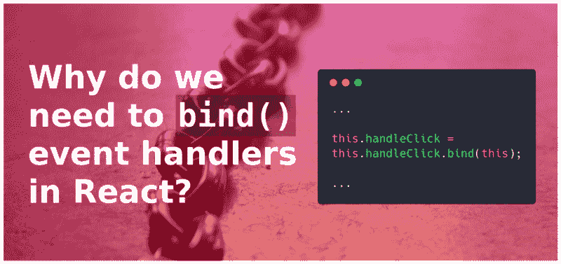

# 这就是为什么我们需要在 React 的类组件中绑定事件处理程序

> 原文：<https://www.freecodecamp.org/news/this-is-why-we-need-to-bind-event-handlers-in-class-components-in-react-f7ea1a6f93eb/>

作者:苏拉布·米斯拉

# 这就是为什么我们需要在 React 的类组件中绑定事件处理程序



Background photo by [Kaley Dykstra](https://unsplash.com/photos/gtVrejEGdmM?utm_source=unsplash&utm_medium=referral&utm_content=creditCopyText) on [Unsplash,](https://unsplash.com/search/photos/chain?utm_source=unsplash&utm_medium=referral&utm_content=creditCopyText) source code image generated at [carbon.now.sh](https://carbon.now.sh)

在 React 上工作时，您一定遇到过受控组件和事件处理程序。我们需要在自定义组件的构造函数中使用`.bind()`将这些方法绑定到组件实例。

```
class Foo extends React.Component{
  constructor( props ){
    super( props );
    this.handleClick = this.handleClick.bind(this);
  }

  handleClick(event){
    // your event handling logic
  }

  render(){
    return (
      <button type="button" 
      onClick={this.handleClick}>
      Click Me
      </button>
    );
  }
}

ReactDOM.render(
  <Foo />,
  document.getElementById("app")
);
```

在这篇文章中，我们将找出为什么我们需要这样做。

如果你还不知道`.bind()` [是做什么的，我推荐你在这里](https://developer.mozilla.org/en-US/docs/Web/JavaScript/Reference/Global_objects/Function/bind)阅读它。

### **怪 JavaScript，没反应过来**

嗯，指责听起来有点刺耳。这不是我们需要做的事情，因为 React 的工作方式或 JSX。这是因为 JavaScript 中的`this`绑定的工作方式。

让我们看看如果不将事件处理程序方法与其组件实例绑定会发生什么:

```
class Foo extends React.Component{
  constructor( props ){
    super( props );
  }

  handleClick(event){
    console.log(this); // 'this' is undefined
  }

  render(){
    return (
      <button type="button" onClick={this.handleClick}>
        Click Me
      </button>
    );
  }
}

ReactDOM.render(
  <Foo />,
  document.getElementById("app")
);
```

如果您运行此代码，请单击“单击我”按钮并检查您的控制台。您将看到`undefined`被打印到控制台，作为事件处理程序方法内部的`this`的值。`handleClick()`方法似乎让**失去了**它的上下文(组件实例)或`this`值。

### **JavaScript 中“this”绑定的工作原理**

正如我提到的，这是因为 JavaScript 中的`this`绑定方式。在这篇文章中我不会涉及太多细节，但是这里的是理解 JavaScript 中的`this`绑定是如何工作的一个很好的资源。

但是与我们这里的讨论相关的是，函数中`this`的值取决于该函数是如何被调用的。

#### **默认绑定**

```
function display(){
 console.log(this); // 'this' will point to the global object
}

display(); 
```

这是一个普通的函数调用。在这种情况下，`display()`方法中的`this`值是非严格模式下的窗口(或全局)对象。在严格模式下，`this`值为`undefined`。

#### **隐式绑定**

```
var obj = {
 name: 'Saurabh',
 display: function(){
   console.log(this.name); // 'this' points to obj
  }
};

obj.display(); // Saurabh 
```

当我们以这种方式调用一个函数时——前面有一个上下文对象——在`display()`中的`this`值被设置为`obj`。

但是当我们将这个函数引用赋给其他变量，并使用这个新的函数引用调用函数时，我们会在`display()`中得到一个不同的`this`值。

```
var name = "uh oh! global";
var outerDisplay = obj.display;
outerDisplay(); // uh oh! global
```

在上面的例子中，当我们调用`outerDisplay()`时，我们没有指定上下文对象。这是一个没有所有者对象的普通函数调用。这种情况下，`display()`内部的`this`的值回落到**默认绑定** *。*它指向全局对象，或者`undefined`如果被调用的函数使用严格模式。

这尤其适用于将函数作为回调传递给另一个定制函数、第三方库函数或像`setTimeout`这样的内置 JavaScript 函数。

考虑如下所示的`setTimeout`虚拟定义，然后调用它。

```
// A dummy implementation of setTimeout
function setTimeout(callback, delay){

   //wait for 'delay' milliseconds
   callback();

}

setTimeout( obj.display, 1000 );
```

我们可以算出，当我们调用`setTimeout`时，JavaScript 在内部将`obj.display`赋给它的参数`callback`。

```
callback = obj.display;
```

正如我们之前看到的，这种赋值操作会导致`display()`函数失去上下文。当这个回调最终在`setTimeout`内部被调用时，`display()`内部的`this`值回落到**默认绑定**。

```
var name = "uh oh! global";
setTimeout( obj.display, 1000 );

// uh oh! global
```

#### **显式硬绑定**

为了避免这种情况，我们可以通过使用`bind()`方法将`this`值**显式硬绑定**到一个函数。

```
var name = "uh oh! global";
obj.display = obj.display.bind(obj); 
var outerDisplay = obj.display;
outerDisplay();

// Saurabh
```

现在，当我们调用`outerDisplay()`时，`this`的值指向`display()`内的`obj`。

即使我们将`obj.display`作为回调传递，`display()`内部的`this`值也会正确指向`obj`。

### **仅使用 JavaScript 重新创建场景**

在本文的开头，我们在名为`Foo`的 React 组件中看到了这一点。如果我们没有将事件处理程序与`this`绑定，那么它在事件处理程序中的值被设置为`undefined`。

正如我提到和解释的那样，这是因为 JavaScript 中的`this`绑定的工作方式，与 React 的工作方式无关。因此，让我们删除特定于 React 的代码，并构建一个类似的纯 JavaScript 示例来模拟这种行为。

```
class Foo {
  constructor(name){
    this.name = name
  }

  display(){
    console.log(this.name);
  }
}

var foo = new Foo('Saurabh');
foo.display(); // Saurabh

// The assignment operation below simulates loss of context 
// similar to passing the handler as a callback in the actual 
// React Component
var display = foo.display; 
display(); // TypeError: this is undefined
```

我们不是在模拟实际的事件和处理程序，而是在使用同义代码。正如我们在 React 组件示例中观察到的，`this`值为`undefined`,因为在将处理程序作为回调传递后上下文丢失了——与赋值操作同义。这也是我们在这个非 React JavaScript 片段中观察到的。

“等一下！既然我们是根据默认绑定的规则在非严格模式下运行的，`this`值不应该指向全局对象吗？”你可能会问。

**号**这是为什么:

> *类声明*和*类表达式*的主体以[严格模式](https://developer.mozilla.org/en-US/docs/Web/JavaScript/Reference/Strict_mode)执行，即构造函数、静态和原型方法。Getter 和 setter 函数在严格模式下执行。

点击可以阅读全文[。](https://developer.mozilla.org/en-US/docs/Web/JavaScript/Reference/Classes)

因此，为了防止错误，我们需要像这样绑定`this`值:

```
class Foo {
  constructor(name){
    this.name = name
    this.display = this.display.bind(this);
  }

  display(){
    console.log(this.name);
  }
}

var foo = new Foo('Saurabh');
foo.display(); // Saurabh

var display = foo.display;
display(); // Saurabh
```

我们不需要在构造函数中这样做，我们也可以在其他地方这样做。考虑一下这个:

```
class Foo {
  constructor(name){
    this.name = name;
  }
  display(){
    console.log(this.name);
  }
}

var foo = new Foo('Saurabh');
foo.display = foo.display.bind(foo);
foo.display(); // Saurabh

var display = foo.display;
display(); // Saurabh
```

但是构造函数是编写事件处理程序绑定语句的最佳和最有效的地方，考虑到这是所有初始化发生的地方。

#### **为什么箭头函数不需要绑定'`this’`？**

我们还有两种方法可以在 React 组件中定义事件处理程序。

*   [**【公共类字段语法(实验)**](https://babeljs.io/docs/plugins/transform-class-properties/)

```
class Foo extends React.Component{
  handleClick = () => {
    console.log(this); 
  }

  render(){
    return (
      <button type="button" onClick={this.handleClick}>
        Click Me
      </button>
    );
  }
} 

ReactDOM.render(
  <Foo />,
  document.getElementById("app")
);
```

*   [**箭头功能中回调**](https://developer.mozilla.org/en/docs/Web/JavaScript/Reference/Functions/Arrow_functions)

```
class Foo extends React.Component{
 handleClick(event){
    console.log(this);
  }

  render(){
    return (
      <button type="button" onClick={(e) => this.handleClick(e)}>
        Click Me
      </button>
    );
  }
}

ReactDOM.render(
  <Foo />,
  document.getElementById("app")
);
```

这两者都使用 ES6 中引入的箭头函数。当使用这些替代方法时，我们的事件处理程序已经自动绑定到组件实例，我们不需要在构造函数中绑定它。

原因是在箭头函数的情况下，`this`在词汇上被绑定**。这意味着它使用封闭函数(或全局函数)的上下文作为它的`this`值。**

**在公共类字段语法示例中，箭头函数包含在`Foo`类中——或者构造函数中——所以上下文是组件实例，这就是我们想要的。**

**在 arrow 函数作为回调示例的情况下，arrow 函数包含在`render()`方法中，该方法由 React 在组件实例的上下文中调用。这就是为什么 arrow 函数也将捕获相同的上下文，并且其中的`this`值将正确地指向组件实例。**

**关于词法绑定的更多细节，请查看[这个优秀的资源](https://github.com/getify/You-Dont-Know-JS/blob/master/this%20%26%20object%20prototypes/ch2.md#lexical-this)。**

### ****长话短说****

**在 React 的类组件中，当我们像这样传递事件处理函数引用作为回调时**

```
`<button type="button" onClick={this.handleClick}>Click Me</button>`
```

**事件处理程序方法丢失了它的**隐式绑定的**上下文。当事件发生并调用处理程序时，`this`值回落到**默认绑定**并被设置为`undefined`，因为类声明和原型方法以严格模式运行。**

**当我们将事件处理程序的`this`绑定到构造函数中的组件实例时，我们可以将它作为回调来传递，而不用担心它会丢失上下文。**

**箭头函数不受这种行为的影响，因为它们使用了**词法** `this` **绑定**，自动将它们绑定到定义它们的作用域。**