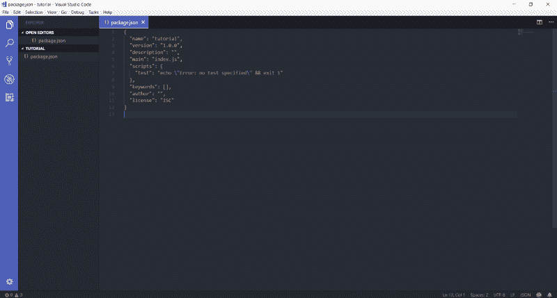
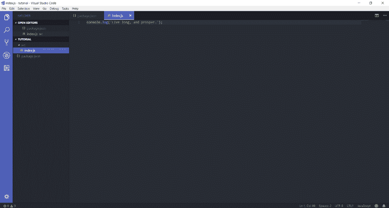
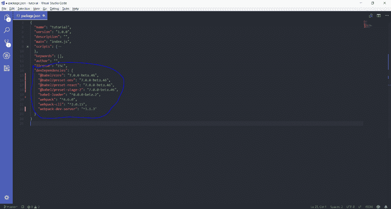
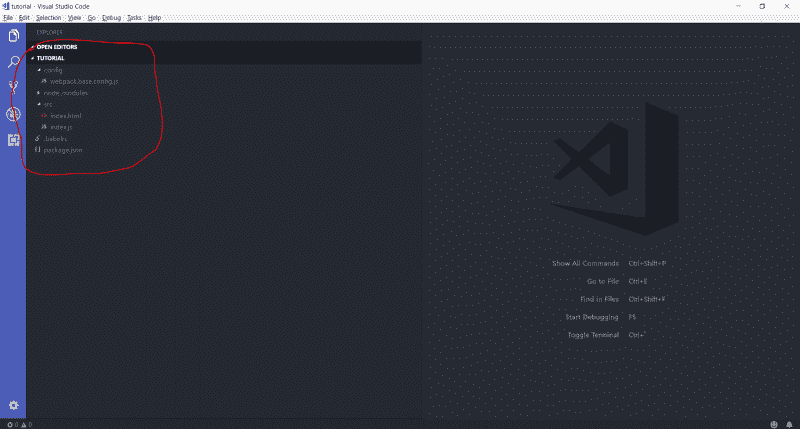
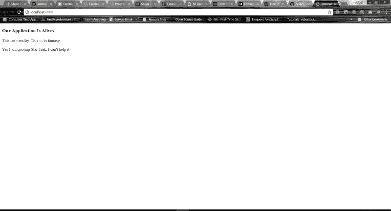
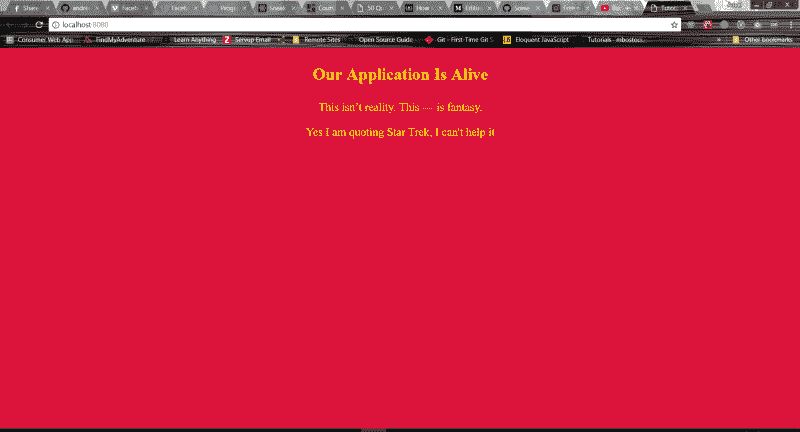

# 如何征服 Webpack 4 并构建一个甜美的 React 应用程序

> 原文：<https://www.freecodecamp.org/news/how-to-conquer-webpack-4-and-build-a-sweet-react-app-236d721e6745/>

> 这篇文章在 babel 的新版本中已经过时，请查看更新的文章“[如何结合 Webpack 4 和 Babel 7 创建一个奇妙的 React 应用程序](https://www.freecodecamp.org/news/how-to-combine-webpack-4-and-babel-7-to-create-a-fantastic-react-app-845797e036ff/)”，最后更新于 2018 年 10 月 13 日

在本文中，我将介绍如何使用 Webpack 4 设置 React 应用程序。本教程结束时，你将知道如何在你选择的编辑器中每次按下`**ctrl + s**` 时热重装你的应用程序。

我用的是 [Visual Studio 代码](https://code.visualstudio.com/) (VS 代码)，我很喜欢。它很轻，很灵活，最棒的是它是免费的。我喜欢免费的。如果你还没试过，那就试试吧。

### 我们的目标

本教程的目标是创建一个 [React](https://reactjs.org/) 应用，带有一些很酷的特性，比如 async/await。我不会在本教程中使用 [react-router 版本 4](https://reacttraining.com/react-router/web) ，因为我主要想关注如何使用 Webpack。

因此，到本文结束时，您将擅长:

*   设置开发环境，使用 [webpack-dev-server](https://github.com/webpack/webpack-dev-server) 进行热重装
*   使用 webpack 在代码中添加 SCSS 和 HTML 支持
*   增加对 try/catch、async/await 和 rest 操作符等特性的支持
*   创建生产版本—优化并准备好部署
*   在代码中设置不同的环境，如阶段、演示和生产

伙计们，我告诉你们，如果 Webpack 看起来有点难，在这之后就不再是这样了。

### 发展环境

#### 创建文件夹

在您的目录中创建一个名为`tutorial` 的文件夹。

#### 创建 package.json

打开你的终端，进入`tutorial`文件夹。

类型:

```
npm init -y
```

这将在您的`tutorial`文件夹中创建一个`**package.json**` 文件。

该文件将类似于以下内容:



This is what your package.json file will look like initially. I am using VS Code for the purpose of this tutorial

#### 创建 index.js 文件

我将在我的`**tutorial**` 文件夹中创建一个名为`**src**` 的文件夹。

在`**src**`文件夹中，我将创建一个名为`**index.js**`的文件。



and yeah, i’ll use star trek quotes a lot during this tutorial because IT’S AWESOME :D

#### 捆绑代码

我知道这不算什么，但是请原谅我。事情很快就会变得有趣起来。

现在，为了捆绑我们的代码，我们需要设置一些配置，以便 Webpack 可以知道从哪里捆绑代码。为此，我们需要安装一些依赖项。

所以让我们从输入开始:

```
npm i --save-dev webpack webpack-cli webpack-dev-server @babel/core @babel/preset-env @babel/preset-react @babel/preset-stage-2 babel-loader@^8.0.0-beta
```

哇！我知道有很多依赖。让我们回顾一下为什么我们首先需要这些。

webpack :我们需要 webpack 来捆绑我们的代码。

webpack-cli :我们将使用 webpack 的一些 cli 特性，让我们在编写脚本时更加轻松。

webpack-dev-server :我将使用 webpack-dev-server 包创建一个服务器。这只能在开发环境中使用，而不能用于生产。这意味着在开发和处理我的代码时，我不需要像 Node.js 这样的独立服务器。

[@babel/preset-env](https://github.com/babel/babel/tree/master/packages/babel-preset-env) :这个包的行为和@babel/preset-latest(或者@babel/preset-es2015，@babel/preset-es2016，和@babel/preset-es2017 一起)完全一样。酷吧？

[@ babel/preset-react](https://github.com/babel/babel/tree/master/packages/babel-preset-react):**这个包的名字听起来很清楚——这将在我们捆绑代码时增加对 react 的支持。**

**[@ babel/preset-stage-2](https://babeljs.io/docs/plugins/preset-stage-2/):**这将增加 [Ecma TC39](https://github.com/tc39) 提案的第二阶段特征。你可以在这里阅读更多相关信息[。](https://babeljs.io/docs/plugins/preset-stage-2/)****

****[@babel/loader](https://github.com/babel/babel-loader) :这是 Webpack 的一个依赖。它允许使用 Webpack 传输巴别塔。****

****[@babel/core](https://github.com/babel/babel/tree/master/packages/babel-core) **:** 这是对@babel/loader 本身的依赖。****

****现在，您对我们安装的内容和原因有了一点了解。****

****您的`package.json`文件应该是这样的:****

****

This is what your package.json file should be looking like right now.**** 

#### ****创建一个巴别塔文件****

****我们还需要添加一个名为`.babelrc` **、**的新文件，让我们也创建它。****

****在主文件夹目录中，创建一个文件`.babelrc`和下面的代码片段。这将有助于 Webpack 捆绑您的代码，并转换我们将编写的那些时髦的代码。****

#### ****设置 Webpack 4****

****好了，无聊的部分已经做完了。让我们进入本教程的主要部分:设置 Webpack 4。****

****引用《星际迷航》中的一句话:****

> ****他给我任务。他 [*任务*](http://www.youtube.com/watch?v=s0gk3AXEKUE) 我；我会得到他的。在我放弃他之前，我会追着他‘绕着尼比亚的卫星，绕着心大星的漩涡，绕着毁灭的*的火焰*。****

****因此，让我们创建一个名为`**config**`的新文件夹，并在该文件夹中创建一个名为`**webpack.base.config.js**`的文件。****

****我将这个文件命名为`.base`的原因是因为它包含了我们将在开发和不同的生产环境中使用的所有通用特性。这一个文件中的更改将反映在所有环境中。再说一次，如果现在这还没有意义，伙计们，再忍耐几分钟。它将开始变得有意义。****

****无需等待，在您的`config/webpack.base.config.js`文件中写下这几行代码:****

****`module.rules` 定义了 Webpack 将应用于某些文件扩展名的一组规则。****

****在我们的`rules`数组中，我们定义了一个`test` 来告诉 Webpack 使用什么扩展。这里我告诉 Webpack 只对基于`.js` 的文件应用特定的规则。****

****接下来是`exclude`。在捆绑时，我不希望 Webpack 传输所有内容。这将变得非常慢，尤其是当我还包含了我的 node_modules 文件夹的时候。****

****所以我将使用规则集中的`exclude` 属性将其排除。最后一个，也是最重要的一个，就是`use.loader` 属性。这里我给它的值是`babel-loader`。babel-loader 所做的是使用我们在`**.babelrc**` 文件中定义的预设来传输所有扩展名为`.js` 的文件。****

****到目前为止还不错，是吗？我们已经走了一半多了……****

****

Even Professor Snape Applauds You. Awesome work guys, we are almost there.**** 

****还有一点:Webpack 4 将`**src**` 文件夹设置为默认入口点，将`**dist**`文件夹设置为绑定结果的默认输出点。很酷，对吧？****

****进入您的`**tutorial**`文件夹并运行这个脚本。这将捆绑您的所有代码，并在浏览器中运行这些代码:****

```
**`Adeel@Frodo MINGW64 ~/Desktop/article/tutorial$ node_modules/.bin/webpack-dev-server --mode development --config config/webpack.base.config.js --open --hot --history-api-fallback`**
```

****这个脚本的基础是，它将组合我们在`**src**` 目录中的所有代码，并在浏览器的以下地址运行它:****

```
**`http://localhost:8080/`**
```

****

Hmm! That’s different. This gives an error: Cannot GET /**** 

#### ****超文本标记语言****

****所以当我们运行脚本时，它会编译并打开浏览器。现在它有了我们写在`**index.js**` 文件中的代码，但是它没有。可以在其中运行它的 html 文件。****

****我们需要在我们的`**webpack.base.config.js**`文件中添加一个 html-webpack-plugin，在我们的`**src**`目录中添加一个`**index.html**`文件。****

****首先安装使用 Webpack 传输 HTML 的依赖项:****

```
**`npm i --save-dev html-webpack-plugin`**
```

****您的`**package.json**`文件应该如下所示:****

****现在让我们在我们的`**src**`目录中添加一个 HTML 文件，并将其命名为`**index.html**`:****

****我们的项目目录现在应该是这样的:****

****

Our project directory, should look something like this**** 

****现在，让我们将那个`html-webpack-plugin` 添加到我们的`**webpack.base.config.js**`文件中。****

****所以我们在 webpack 配置文件中添加了一些新的东西——您注意到了吗？我只是在逗你。我知道你做了。****

****

Good job guys, we’re almost done.**** 

****现在这个插件做什么？嗯，很简单。简单地说，插件给你的网络包增加了功能。你可以在这里阅读更多关于他们的信息。****

****现在我已经添加了这个插件，名为 [html-webpack-plugin](https://webpack.js.org/plugins/html-webpack-plugin/) 。这个插件的目的很简单:它创建 HTML 文件来服务你的包文件。****

****好吧，让我们再运行一次脚本(交叉手指)。“我希望这次不要出错，”每个开发人员都说一次。****

```
**`Adeel@Frodo MINGW64 ~/Desktop/article/tutorial$ node_modules/.bin/webpack-dev-server --mode development --config config/webpack.base.config.js --open --hot --history-api-fallback`**
```

****这将编译并在可用的默认端口中打开您的浏览器。我的是:****

```
**`http://localhost:8080/`**
```

****

I simply clicked **ctrl + shift + i** this opened up the inspect element in my chrome browser**** 

****蓝色部分:蓝色部分只是我放入元标签和定义应用程序标题的地方。****

******黄色部分:**突出显示的黄色部分是我们写在`**index.html**`文件中的硬编码部分。这是我们未来的 React 应用程序将驻留的地方。****

******红色部分:**我用红色划线的部分是最有趣的部分。我们从来没有在 index.html 的档案里写过这个，那它是从哪里来的呢？****

****Webpack 非常智能。它将那个文件放在您的`**index.js**` 中，很好地打包，并整齐地添加到名为`**main.js**`的文件中。然后它把它注入到我们的`**index.html**`文件中。超级爽！****

#### ****添加反应****

****让我们加入 React，让派对开始吧。为此，我们需要安装一些依赖项。****

****我们先来看看:****

```
**`npm i react react-dom --save`**
```

****现在进入你的`**index.js**` 文件，写下:****

****让我们再次运行该脚本:****

```
**`Adeel@Frodo MINGW64 ~/Desktop/article/tutorial$ node_modules/.bin/webpack-dev-server --mode development --config config/webpack.base.config.js --open --hot --history-api-fallback`**
```

****这将编译并在默认端口打开您的浏览器。我的是:****

```
**`http://localhost:8080/`**
```

****哇，你看到你的浏览器打开了什么吗？是啊！你做到了。你的第一个 Webpack 配置的 React 应用。****

****现在还有很多事情要做。但是伙计哦伙计。干得好！****

****

This is our react app, running Yayyyy! :)**** 

****现在有趣的部分来了。进入你的`**index.js**`文件，把标题改成你选择的任何东西。点击`**ctrl + s**`并检查你的浏览器。它会自动更新您的内容。****

****很酷，对吧？****

#### ****让我们回顾一下****

****我们添加了一个开发环境。我们增加了热模块重装。我们增加了对**的支持。带有 React 代码的 js** 文件。在下一部分中，我们将在 Webpack 中添加 SCSS 支持。****

#### ****SCSS****

****对于 SCSS 支持，我们需要在我们的`**package.json file**.`中添加更多的依赖项****

****安装以下软件包:****

```
**`npm i --save-dev style-loader css-loader sass-loader node-sass extract-text-webpack-plugin@^4.0.0-beta.0`**
```

****这个插件将帮助我们把 SCSS 编译成 CSS。****

****[node-sass](https://github.com/sass/node-sass):**sass 加载程序需要 node-sass 作为对等依赖。******

****[CSS-loader](https://github.com/webpack-contrib/css-loader):CSS loader 像`import/require()`一样解释`@import`和`url()`，并将解析它们。****

****[style-loader](https://github.com/webpack-contrib/style-loader) :通过注入 style 标签将 CSS 添加到 DOM 中。****

****[extract-text-web pack-plugin](https://webpack.js.org/plugins/extract-text-webpack-plugin/):它将所有需要的`**.css**`模块移动到一个单独的 CSS 文件中。****

****因此，您的样式不再内联到 JavaScript 包中，而是在一个单独的 CSS 文件(`**styles.css**`)中。如果样式表的总容量很大，那么速度会更快，因为 CSS 包是与 JavaScript 包并行加载的。****

****现在我们的依赖项已经安装好了，让我们对 Webpack 配置文件做一些更改。****

****先了解一下我们在这里做了什么。在我们的`module.rules`中，我们添加了一条新规则。这条规则的作用是对所有的`**.scss**`文件进行捆绑。我希望这有意义。在我们的`use` **，**里面我们告诉它提取一些信息。****

****让我们更深入一点，我会尽量让它简单一些。****

```
**`{ fallback: "style-loader", use: "css-loader!sass-loader" }`**
```

****试着从下到上阅读这段代码。****

****获取所有 SASS 代码-。scss——使用`sass-loader` ,然后使用`css-loader.` 将其转换为 css 代码，然后通过`using style-`加载器将所有 CSS 代码注入到带有<样式>标签的 DOM 中。****

****现在这整个物体被包围着:****

```
**`use: ExtractTextPlugin.extract({ ... })`**
```

****这个`ExtractTextPlugin.extract({ })` 将获取所有应该注入到我们的 DOM 中的 CSS 代码，并将所有的 CSS 代码组合起来，打包到一个名为`**style.css**`的文件中。****

****这种方法的巨大好处是，如果从浏览器加载样式表时，总的样式表量很大，它将与 JavaScript 代码并行加载。这将使我们的网站下载速度更快。****

****在第二部分中，我们必须在我们的`plugins`数组中添加一个新条目，它是:****

```
**`new ExtractTextPlugin('style.css')`**
```

****这基本上是告诉插件将我们所有的 CSS 代码组合起来，放在一个名为`**style.css**`的文件中。****

****让我们在根文件夹中创建一个名为`**styles.scss**`的新文件，并进行一些样式设计。****

****现在在您的`**index.js**`文件中添加`**styles.scss**`。Webpack 允许你在 JavaScript 中导入 CSS。太棒了，我知道。****

****在您的代码中，只需添加这一行:****

```
**`import './styles.scss';`**
```

****现在再次运行这个脚本，并检查您的浏览器:****

```
**`Adeel@Frodo MINGW64 ~/Desktop/article/tutorial$ node_modules/.bin/webpack-dev-server --mode development --config config/webpack.base.config.js --open --hot --history-api-fallback`**
```

****这是我们最后一次手动编写。接下来我们将制作一个脚本。是的，我记得——我还没有解释这个脚本是做什么的。我会的。我保证。****

****无论如何，检查你的浏览器…好酷。****

****

Our React app with some .scss code. We are rocking it guys,**** 

#### ****制作剧本****

****让我们写一些脚本，让我们的生活轻松一点。我之所以一遍又一遍地要求你写那个剧本，是为了让你能真正记住它，而不仅仅是从网上复制粘贴。****

****让我们进入我们的`**package.json**`文件。****

****在您的`scripts` 部分，添加以下代码:****

****现在，在您的终端中，键入:****

```
**`Adeel@Frodo MINGW64 ~/Desktop/article/tutorial$ npm run start:dev`**
```

******注意**:在脚本中，我们不再需要这样写:****

```
**`node_modules/.bin/webpack`**
```

****更多详情请见 webpack-dev-server 使用文档 [**此处**](https://github.com/webpack/webpack-dev-server#usage) **。******

****`start:dev` 的剧本现在看起来是这样的:****

```
**`webpack-dev-server --mode development --config config/webpack.base.config.js --open --hot --history-api-fallback`**
```

****让我们来分析一下这个脚本的作用:****

****`webpack-dev-server --mode development`****

****标志`--mode development`设置了为开发目的而优化的构建。它为开发周期提供了快速的增量编译，并在运行时提供了有用的错误消息。****

****你可以在这篇惊人的文章中阅读更多关于模式的内容: [Webpack 4:模式和优化](https://medium.com/webpack/webpack-4-mode-and-optimization-5423a6bc597a)。****

****标志`--config config/webpack.base.config.js`告诉 Webpack 我们所有的配置放在 Webpack 绑定的什么地方。****

****标志`--open`告诉`webpack-dev-server`打开浏览器。****

****标志`--hot`告诉`webpack-dev-server`启用 Webpack 的热模块更换功能。每当你点击`**ctrl + s**`时，浏览器就会更新****

****标志`— -history-api-fallback`告诉`webpack-dev-server`在无法找到请求的资源的情况下退回到`**index.html**`。你可以在这里阅读更多关于[历史-api-fallback](https://github.com/webpack/webpack-dev-server/tree/master/examples/cli/history-api-fallback) 的内容。****

### ****生产环境****

****既然我们已经完成了我们的开发环境，让我们动手做点事情，让我们的代码为生产做好准备。****

****让我们创建一个新文件`**webpack.opt.config.js**`。这个文件将包含我们需要的所有生产优化。****

****我们的计划是将我们的`**webpack.base.config.js**`文件与`**webpack.opt.config.js**`文件合并，为我们的单页面应用程序创建一个产品配置。****

****让我们开始吧。在您的`**config**`目录中创建一个名为`**webpack.opt.config.js**`的新文件。`opt`是优化的简称。如果有人能想出一个更酷的名字，请告诉我。****

****我们需要安装一些依赖项来帮助我们进行优化:****

```
**`$ npm i --save-dev optimize-css-assets-webpack-plugin uglifyjs-webpack-plugin`**
```

****尽管`--mode production`本身有一些很酷的优化。你可以在这里了解更多信息。但我还是想再补充几个。****

****代码如下:****

****让我们回顾一下我们在这里做了什么。我在 dev-dependency 中添加了新模块。****

****[uglifyjs-webpack-plugin](https://github.com/webpack-contrib/uglifyjs-webpack-plugin) :顾名思义，这将丑化和最小化我们所有的代码，以减小包的大小。****

****[optimize-css-assets-web pack-plugin](https://github.com/NMFR/optimize-css-assets-webpack-plugin):这个插件将最小化并优化你的 CSS 代码。****

****到目前为止，大家都很好——我们快完成了。****

****

Just a little bit more, and you have reached the finish line.**** 

****还记得我说过一种方法，在这种方法中，我们不必一次又一次地重复我们的代码吗？一个用于开发，另一个用于生产…甚至不要让我开始管理这些环境阶段，演示和现场！今天就结束了。不再有代码重复。****

****我向你们介绍我们的救世主，白衣骑士。这个插件很神奇，顾名思义。****

****这将会以一种智能的方式组合我们对`**.base**`和`**.opt**`文件的配置。它提供了一个`merge`函数，该函数连接数组并合并对象以创建一个新对象。****

****所以事不宜迟，让我们也安装这个神奇的插件:****

```
**`$ npm i --save-dev webpack-merge`**
```

****让我们创建最后的`**webpack.prod.config.js**`文件:****

****我们向名为`productionConfiguration`的函数传递一个参数，并使用了`env`。这就是我们通过 CLI 在 Webpack 中传递信息的方式(我一会儿会解释我们是如何做的)。****

****我正在传递一个叫做`NODE_ENV`的东西。它是我将告诉我的 webpack 我将运行什么环境的值——比如演示、测试、实况或其他。****

****接下来，无论我在`env.NODE_ENV`中得到什么，我都会使用名为`DefinePlugin`的 Webpack 内置插件在`process.env.NODE_ENV`中设置。我们只需要确保我们传递的任何值总是字符串化的。****

****然后，在最后一行，我们这样做:****

```
**`module.exports = merge.smart(baseConfig, optimizationConfig, productionConfiguration);`**
```

****这里发生的是，我们使用名为`smart`的`webpack-merge's`方法来智能地合并我们的所有三个配置。这样我们就不会到处重复相同的代码。这是最酷的功能。****

****我记得在我发现这个插件之前的一段时间。在我所有的 Webpack 配置文件中做同样的事情真是一团糟。现在只是小菜一碟。****

****不管怎样，向前看，现在我们的 Webpack 配置终于完成了。让我们在`**package.json**`文件中创建生产就绪的构建脚本。****

****在您的脚本部分，添加以下行:****

****我将从`prestart:prod`命令开始:****

```
**`"prestart:prod": "webpack --mode production --config config/webpack.prod.config.js --env.NODE_ENV=production --progress",`**
```

****我们将分解这个命令。****

****`webpack --mode production`。正如我们之前讨论的，当讨论`development mode`时，生产模式将在我们的捆绑文件上运行一些非常酷的优化过程，以使文件变得更小。****

****下一个标志是`--config config/webpack.prod.config.js`。这告诉 Webpack 我们的生产配置在目录中的位置。****

****`env`标志指定了我们通过`**webpack-cli**`传递的环境变量。事情是这样的:`--env.NOVE_ENV=production`用键`NODE_ENV`在我们的`**webpack.prod.config.js**` 中传递一个对象，这个键的值叫做`production`。****

****可以传递任意多的环境变量，比如`--env.X=foo --env.Y=bar`。然后，在您的配置中，您会以访问`NODE_ENV`值的相同方式获得这些值。****

****最后一个标志是`--progess`。它只是告诉你这个包的进度/状态，比如在你的`**dist**` 文件夹中制作这个包的时候，这个包已经完成了多少百分比。****

#### ****快速提醒****

****Webpack 4 默认将`**src**` 文件夹设置为默认入口点，将`**dist**`文件夹设置为绑定结果的默认输出点。很酷，对吧？我知道我在重复这一点——我早些时候告诉过你——但这就是为什么我说提醒。****

#### ****回到我们的教程****

****我们讨论了`prestart:prod`脚本，现在我们将讨论名为`start:prod`的最终脚本。****

****有了 npm，任何时候你想一个接一个地运行脚本，你可以用`preCOMMAND` `COMMAND` `postCOMMAND.`对它们进行排序****

****就像我们在这里做的:****

```
**`$ prestart:prod`**
```

```
**`$ start:prod`**
```

****所以我们总是在执行名为`npm run prestart:prod.`的脚本之前运行脚本`npm run start:prod`****

****我们来讨论一下`start:prod.`****

```
**`$ node server => {This is equivalent to} =&gt; $ node server/index.js`**
```

****让我们创建一个名为`**server**`的文件夹。在该文件夹中，创建一个名为`**index.js**`的文件。但在此之前，我们需要添加最后一个依赖项。****

****这将是 Express，我们的后端 Node.js 框架:****

```
**`npm i --save express`**
```

****在我们继续之前，让我们讨论一下这个代码。****

****我们用`express()`实例化我们的应用程序，然后建立一个名为`**dist**` **的静态公共文件夹。**这与我们运行生产命令时由 Webpack 创建的文件夹相同。****

****我们包含了我们的`**routes**`文件——我们将很快创建它——并将`**routes**`文件设置为`/`目录。****

****接下来，我们设置一个端口。如果没有通过节点 CLI 设置，我们使用端口`3000`。之后，我们创建一个 HTTP 服务器，并通过端口监听该服务器。最后，我们安慰我们的终端，我们正在某个端口上运行服务器。****

****让我们创建最后一个文件`**routes/index.js**:`****

****在这里，我们检查无论用户访问什么，路径都会将用户重定向到 React 应用程序所在的`**dist/index.html**`。****

****仅此而已。我们完了。****

****现在进入您的终端并键入:****

```
**`npm run start:prod`**
```

****这需要一点时间。它会在传输过程中显示进度。之后，它会显示一条消息，如果没有提供，则为`listening to port 3000`。****

****现在转到你的浏览器`http:localhost:3000/`，你的应用程序就启动了。****

****

Congrats!**** 

****参见 [GitHub](https://github.com/adeelibr/react-starter) 上的代码。****

****感谢我的好朋友 Ahmed Abbasi 帮助我校对了这篇文章。****

****你可以在 [Twitter](http://twitter.com/adeelibr) 上关注我，我很乐意和你们谈谈，听听你们的意见。****