# 如何使用 JavaScript 从头开始构建一个 HTML 计算器应用程序

> 原文：<https://www.freecodecamp.org/news/how-to-build-an-html-calculator-app-from-scratch-using-javascript-4454b8714b98/>

这是一篇史诗般的文章，你可以从中学习如何从头开始构建一个计算器。我们将关注您需要编写的 JavaScript 如何考虑构建计算器，如何编写代码，以及最终如何清理您的代码。

到本文结束时，您应该会得到一个功能与 iPhone 计算器完全一样的计算器(没有`+/-`和百分比功能)。

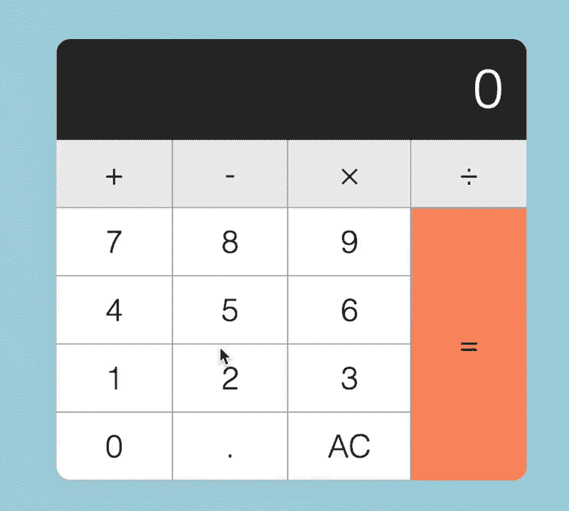

### 先决条件

在您尝试完成本课程之前，请确保您对 JavaScript 有足够的掌握。至少，你需要知道这些事情:

1.  [If/else 语句](https://zellwk.com/blog/js-if-else)
2.  [用于循环](https://zellwk.com/blog/js-for-loops)
3.  [JavaScript 函数](https://zellwk.com/blog/js-functions)
4.  [箭头功能](https://zellwk.com/blog/es6/#arrow-functions)
5.  `&&`和`||`运算符
6.  如何用`textContent`属性改变文本
7.  如何使用事件委托模式添加事件侦听器

### 开始之前

我建议你在学习本课之前，先试着自己制作一个计算器。这是一个很好的练习，因为你将训练自己像一个开发者一样思考。

一旦你尝试了一个小时，再回到这一课(不管你是成功还是失败。当你尝试的时候，你会思考，这将有助于你更快地吸取教训。

至此，让我们先来了解一下计算器是如何工作的。

### 构建计算器

首先，我们想制造计算器。

计算器由两部分组成:显示器和按键。

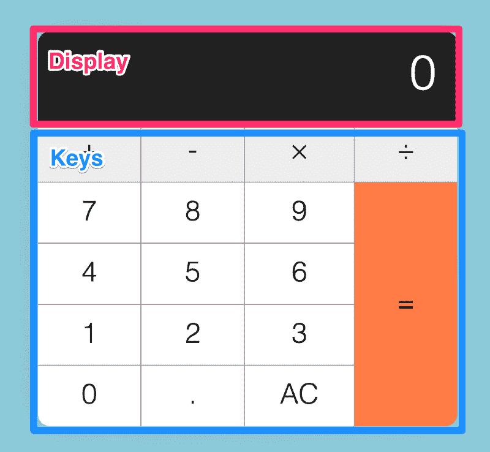

```
<div class=”calculator”>
  <div class=”calculator__display”>0</div>
  <div class=”calculator__keys”> … </div>
</div>
```

我们可以使用 CSS Grid 来制作键，因为它们是以类似网格的格式排列的。这已经在 starter 文件中为您完成了。你可以在这支笔的[处找到启动文件。](https://codepen.io/zellwk/pen/pLgmGL)

```
.calculator__keys { 
  display: grid; 
  /* other necessary CSS */ 
}
```

为了帮助我们识别操作符、十进制、清除和等号键，我们将提供一个数据操作属性来描述它们的作用。

```
<div class="calculator__keys">
  <button class="key--operator" data-action="add">+</button>
  <button class="key--operator" data-action="subtract">-</button
  <button class="key--operator" data-action="multiply">&times;</button>
  <button class="key--operator" data-action="divide">÷</button
  <button>7</button>
  <button>8</button>
  <button>9</button>
  <button>4</button>
  <button>5</button>
  <button>6</button>
  <button>1</button>
  <button>2</button>
  <button>3</button>
  <button>0</button>
  <button data-action="decimal">.</button>
  <button data-action="clear">AC</button>
  <button class="key--equal" data-action="calculate">=</button>
</div>
```

### 听按键声

当一个人拿到计算器时，可能会发生五种情况。他们可以击中:

1.  数字键(0–9)
2.  一种操作键(+、-、×、)
3.  十进制键
4.  等号键
5.  透明钥匙

构建这个计算器的第一步是能够(1)监听所有按键，以及(2)确定被按下的键的类型。在这种情况下，我们可以使用事件委托模式来监听，因为键都是`.calculator__keys`的子元素。

```
const calculator = document.querySelector(‘.calculator’)
const keys = calculator.querySelector(‘.calculator__keys’)

keys.addEventListener(‘click’, e => {
 if (e.target.matches(‘button’)) {
   // Do something
 }
})
```

接下来，我们可以使用`data-action`属性来确定被点击的键的类型。

```
const key = e.target
const action = key.dataset.action
```

如果该键没有`data-action`属性，则它必须是数字键。

```
if (!action) {
  console.log('number key!')
}
```

如果这个键有一个`data-action`，或者是`add`、`subtract`、`multiply`或者是`divide`，我们就知道这个键是一个操作符。

```
if (
  action === 'add' ||
  action === 'subtract' ||
  action === 'multiply' ||
  action === 'divide'
) {
  console.log('operator key!')
}
```

如果键的`data-action`是`decimal`，我们知道用户点击了十进制键。

按照同样的思路，如果键的`data-action`是`clear`，我们知道用户点击了 clear(显示 AC 的那个)键。如果键的`data-action`是`calculate`，我们知道用户点击了等号键。

```
if (action === 'decimal') {
  console.log('decimal key!')
}

if (action === 'clear') {
  console.log('clear key!')
}

if (action === 'calculate') {
  console.log('equal key!')
}
```

此时，您应该从每个计算器键得到一个`console.log`响应。

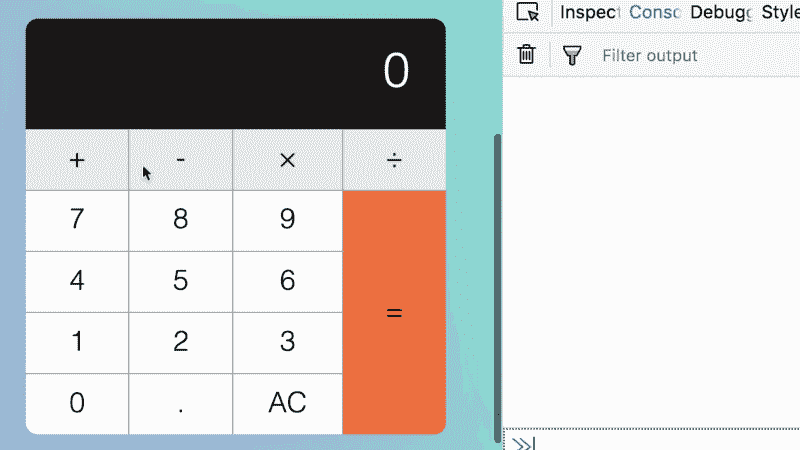

### 建设幸福之路

让我们考虑一下普通人拿起计算器时会做什么。这条“普通人会做的事”被称为幸福之路。

让我们称我们的普通人为玛丽。

当玛丽拿起计算器时，她可以按下这些键中的任何一个:

1.  数字键(0–9)
2.  一种操作键(+、-、×、)
3.  十进制键
4.  等号键
5.  透明钥匙

一次考虑五种类型的键可能会让人不知所措，所以让我们一步一步来。

### 当用户点击数字键时

此时，如果计算器显示 0(默认数字)，目标数字应代替零。


如果计算器显示一个非零数字，目标数字应附加到显示的数字上。

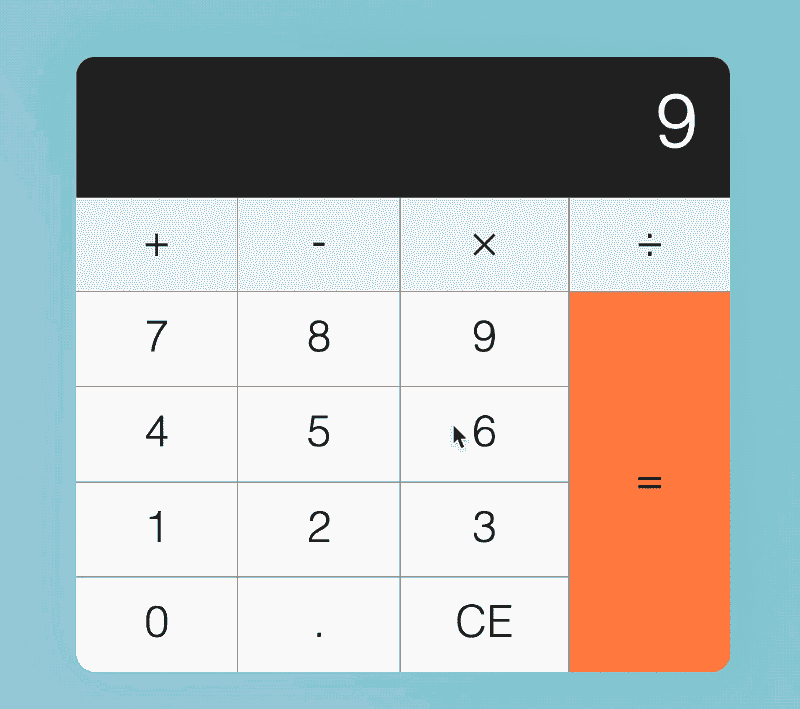

在这里，我们需要知道两件事:

1.  被单击的键的编号
2.  当前显示的数字

我们可以分别通过被点击键和`.calculator__display`的`textContent`属性得到这两个值。

```
const display = document.querySelector('.calculator__display')

keys.addEventListener('click', e => {
  if (e.target.matches('button')) {
    const key = e.target
    const action = key.dataset.action
    const keyContent = key.textContent
    const displayedNum = display.textContent
    // ...
  }
})
```

**如果计算器显示 0，我们想用点击的键替换计算器的显示。**我们可以通过替换显示的 textContent 属性来实现。

```
if (!action) {
  if (displayedNum === '0') {
    display.textContent = keyContent
  }
}
```

**如果计算器显示一个非零数字，我们希望将点击的键附加到显示的数字上。为了追加一个数字，我们连接了一个字符串。**

```
if (!action) {
  if (displayedNum === '0') {
    display.textContent = keyContent
  } else {
    display.textContent = displayedNum + keyContent
  }
}
```

此时，Mary 可以单击这些键中的任意一个:

1.  十进制键
2.  操作员键

假设玛丽按了十进制键。

### 当用户点击十进制键时

当玛丽按下十进制键时，显示屏上会出现一个十进制数。如果 Mary 在敲击十进制键后敲击任何数字，该数字也应该附加在显示器上。


为了创造这种效果，我们可以将`.`连接到显示的数字上。

```
if (action === 'decimal') {
  display.textContent = displayedNum + '.'
}
```

接下来，让我们假设 Mary 通过按操作键继续她的计算。

### 当用户点击操作键时

如果 Mary 点击了一个操作键，则该操作键应该被突出显示，这样 Mary 就知道该操作键处于活动状态。

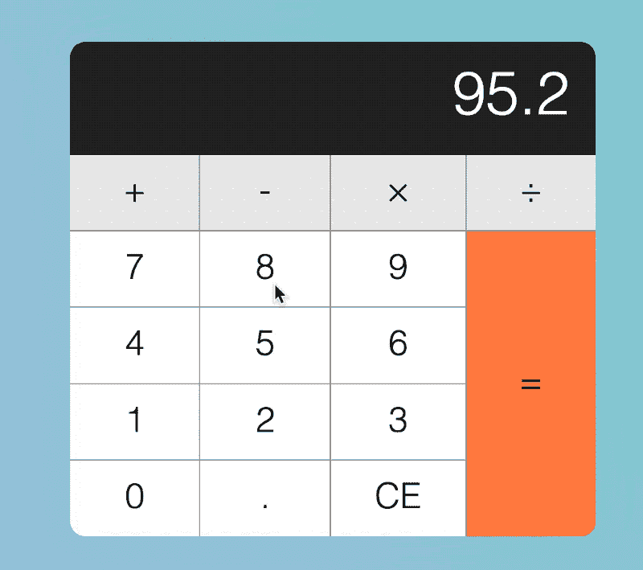

为此，我们可以将`is-depressed`类添加到操作键中。

```
if (
  action === 'add' ||
  action === 'subtract' ||
  action === 'multiply' ||
  action === 'divide'
) {
  key.classList.add('is-depressed')
}
```

一旦玛丽按下一个操作键，她就会按下另一个数字键。

### 当用户在操作键之后点击数字键时

当 Mary 再次点击数字键时，先前的显示将被新的数字所取代。操作员键也应释放其按下状态。

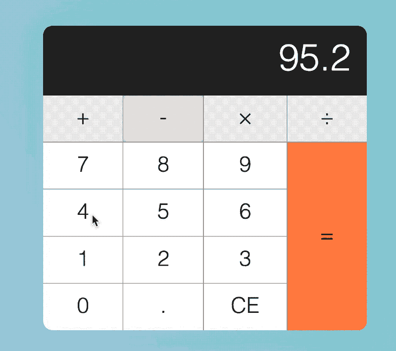

为了释放按下的状态，我们通过一个`forEach`循环从所有键中移除`is-depressed`类:

```
keys.addEventListener('click', e => {
  if (e.target.matches('button')) {
    const key = e.target
    // ...

    // Remove .is-depressed class from all keys
    Array.from(key.parentNode.children)
      .forEach(k => k.classList.remove('is-depressed'))
  }
})
```

接下来，我们希望将显示更新为单击的键。在我们这样做之前，我们需要一种方法来判断前一个键是否是操作键。

一种方法是通过自定义属性。我们把这个自定义属性叫做`data-previous-key-type`。

```
const calculator = document.querySelector('.calculator')
// ...

keys.addEventListener('click', e => {
  if (e.target.matches('button')) {
    // ...

    if (
      action === 'add' ||
      action === 'subtract' ||
      action === 'multiply' ||
      action === 'divide'
    ) {
      key.classList.add('is-depressed')
      // Add custom attribute
      calculator.dataset.previousKeyType = 'operator'
    }
  }
})
```

如果`previousKeyType`是一个操作符，我们想用点击的数字替换显示的数字。

```
const previousKeyType = calculator.dataset.previousKeyType

if (!action) {
  if (displayedNum === '0' || previousKeyType === 'operator') {
    display.textContent = keyContent
  } else {
    display.textContent = displayedNum + keyContent
  }
}
```

接下来，假设 Mary 决定通过点击等号键来完成她的计算。

### 当用户点击等号键时

当 Mary 按下等号键时，计算器应该会计算出一个取决于三个值的结果:

1.  输入计算器的第一个数字
2.  **操作员**
3.  输入计算器的第二个数字

计算后，结果应取代显示的值。


至此，我们只知道了**秒的数字**——也就是当前显示的数字。

```
if (action === 'calculate') {
  const secondValue = displayedNum
  // ...
}
```

为了得到第一个数字，我们需要在清除之前存储计算器的显示值。保存第一个数字的一种方法是在单击 operator 按钮时将它添加到一个自定义属性中。

为了得到**操作符**，我们也可以使用相同的技术。

```
if (
  action === 'add' ||
  action === 'subtract' ||
  action === 'multiply' ||
  action === 'divide'
) {
  // ...
  calculator.dataset.firstValue = displayedNum
  calculator.dataset.operator = action
}
```

一旦我们有了需要的三个值，我们就可以进行计算了。最终，我们希望代码看起来像这样:

```
if (action === 'calculate') {
  const firstValue = calculator.dataset.firstValue
  const operator = calculator.dataset.operator
  const secondValue = displayedNum

  display.textContent = calculate(firstValue, operator, secondValue)
}
```

这意味着我们需要创建一个`calculate`函数。它应该接受三个参数:第一个数字、操作符和第二个数字。

```
const calculate = (n1, operator, n2) => {
  // Perform calculation and return calculated value
}
```

如果运算符是`add`，我们要把值加在一起。如果运算符是`subtract`，我们要减去这些值，以此类推。

```
const calculate = (n1, operator, n2) => {
  let result = ''

  if (operator === 'add') {
    result = n1 + n2
  } else if (operator === 'subtract') {
    result = n1 - n2
  } else if (operator === 'multiply') {
    result = n1 * n2
  } else if (operator === 'divide') {
    result = n1 / n2
  }

  return result
}
```

记住`firstValue`和`secondValue`在这一点上是字符串。如果你把字符串加在一起，你会把它们连接起来(`1 + 1 = 11`)。

所以，在计算结果之前，我们想把字符串转换成数字。我们可以通过两个函数`parseInt`和`parseFloat`来实现。

*   `parseInt`将一个字符串转换成一个**整数**。
*   `parseFloat`将一个字符串转换成一个**浮点**(这意味着一个带小数位的数字)。

对于计算器，我们需要一个浮点数。

```
const calculate = (n1, operator, n2) => {
  let result = ''

  if (operator === 'add') {
    result = parseFloat(n1) + parseFloat(n2)
  } else if (operator === 'subtract') {
    result = parseFloat(n1) - parseFloat(n2)
  } else if (operator === 'multiply') {
    result = parseFloat(n1) * parseFloat(n2)
  } else if (operator === 'divide') {
    result = parseFloat(n1) / parseFloat(n2)
  }

  return result
}
```

快乐之路到此为止！

你可以通过[这个链接](http://zellwk.com/blog/calculator-part-1)获得快乐之路的源代码(向下滚动并在框中输入你的电子邮件地址，我会将源代码直接发送到你的邮箱)。

### 边缘案例

幸福的道路是不够的。要构建一个健壮的计算器，你需要让你的计算器能够适应奇怪的输入模式。要做到这一点，你必须想象一个捣乱者试图通过按错键来破坏你的计算器。我们把这个捣蛋鬼叫做蒂姆吧。

蒂姆可以按任意顺序敲击这些按键:

1.  数字键(0–9)
2.  一种操作键(+、-、×、)
3.  十进制键
4.  等号键
5.  透明钥匙

### 如果蒂姆按了十进制键会发生什么

如果 Tim 在显示器已经显示小数点的时候按了一个十进制键，那么什么都不会发生。

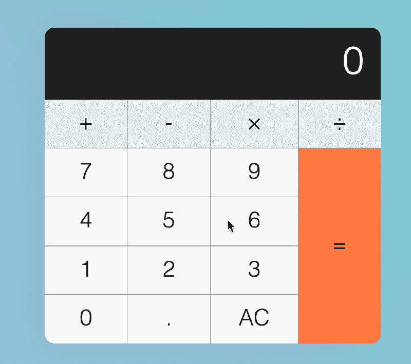

这里，我们可以用`includes`方法检查显示的数字是否包含一个`.`。

`includes`检查给定匹配的字符串。如果找到一个字符串，则返回`true`；如果不是，它返回`false`。

**注意** : `includes`区分大小写。

```
// Example of how includes work.
const string = 'The hamburgers taste pretty good!'
const hasExclaimation = string.includes('!')
console.log(hasExclaimation) // true
```

要检查字符串是否已经有一个点，我们这样做:

```
// Do nothing if string has a dot
if (!displayedNum.includes('.')) {
  display.textContent = displayedNum + '.'
}
```

接下来，如果 Tim 在按下操作键后按下十进制键，显示屏将显示`0.`。


这里我们需要知道前一个键是否是运算符。我们可以通过检查在上一课中设置的自定义属性`data-previous-key-type`来判断。

`data-previous-key-type`还没有完成。为了正确识别`previousKeyType`是否是一个操作符，我们需要为每个被点击的键更新`previousKeyType`。

```
if (!action) {
  // ...
  calculator.dataset.previousKey = 'number'
}

if (action === 'decimal') {
  // ...
  calculator.dataset.previousKey = 'decimal'
}

if (action === 'clear') {
  // ...
  calculator.dataset.previousKeyType = 'clear'
}

if (action === 'calculate') {
 // ...
  calculator.dataset.previousKeyType = 'calculate'
}
```

一旦我们有了正确的`previousKeyType`，我们就可以用它来检查前一个键是否是一个操作符。

```
if (action === 'decimal') {
  if (!displayedNum.includes('.')) {
    display.textContent = displayedNum + '.'
  } else if (previousKeyType === 'operator') {
    display.textContent = '0.'
  }

calculator.dataset.previousKeyType = 'decimal'
}
```

### 如果蒂姆按了操作键会发生什么

如果 Tim 先按下操作键，操作键应该会亮起。(我们已经讨论了这种边缘情况，但是如何讨论呢？看看你能不能认出我们做了什么)。

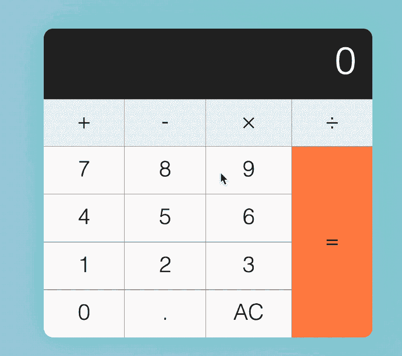

第二，如果 Tim 多次按下同一个操作键，应该不会发生任何事情。(我们已经讨论过这种边缘情况)。

**注意:**如果你想提供更好的 UX，你可以通过一些 CSS 改变来显示操作符被反复点击。我们在这里没有这样做，但是看看你是否可以自己编程，作为一个额外的编码挑战。

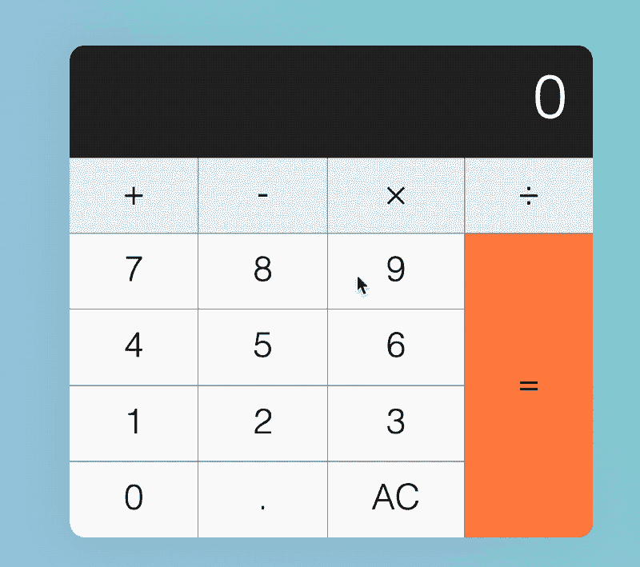

第三，如果 Tim 在敲击第一个操作键之后敲击另一个操作键，则第一个操作键应该被释放。然后，应按下第二个操作键。(我们也涵盖了这种边缘情况——但是怎么做呢？).

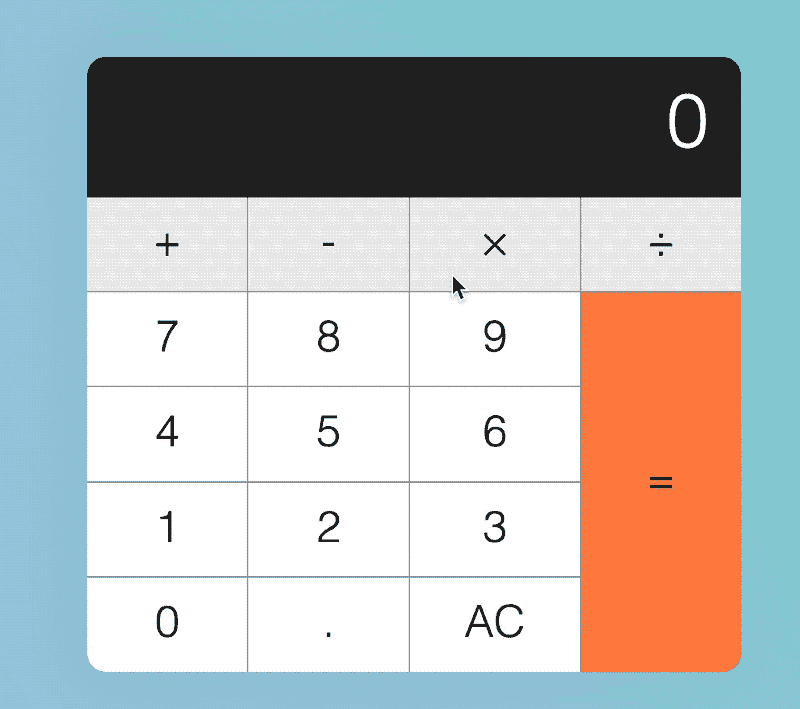

第四，如果 Tim 按顺序点击一个数字、一个操作符、一个数字和另一个操作符，则显示应该更新为计算值。


这意味着当`firstValue`、`operator`和`secondValue`存在时，我们需要使用`calculate`函数。

```
if (
  action === 'add' ||
  action === 'subtract' ||
  action === 'multiply' ||
  action === 'divide'
) {
  const firstValue = calculator.dataset.firstValue
  const operator = calculator.dataset.operator
  const secondValue = displayedNum

// Note: It's sufficient to check for firstValue and operator because secondValue always exists
  if (firstValue && operator) {
    display.textContent = calculate(firstValue, operator, secondValue)
  }

key.classList.add('is-depressed')
  calculator.dataset.previousKeyType = 'operator'
  calculator.dataset.firstValue = displayedNum
  calculator.dataset.operator = action
}
```

虽然我们可以在第二次单击操作键时计算一个值，但我们也在这一点上引入了一个错误——在操作键上的额外单击会在不应该的时候计算一个值。


为了防止计算器在后续点击操作键时执行计算，我们需要检查`previousKeyType`是否是一个操作符。如果是，我们不进行计算。

```
if (
  firstValue &&
  operator &&
  previousKeyType !== 'operator'
) {
  display.textContent = calculate(firstValue, operator, secondValue)
}
```

第五，在操作员键计算一个数字后，如果蒂姆命中一个数字，接着是另一个操作员，操作员应该继续计算，就像这样:`8 - 1 = 7`、`7 - 2 = 5`、`5 - 3 = 2`。

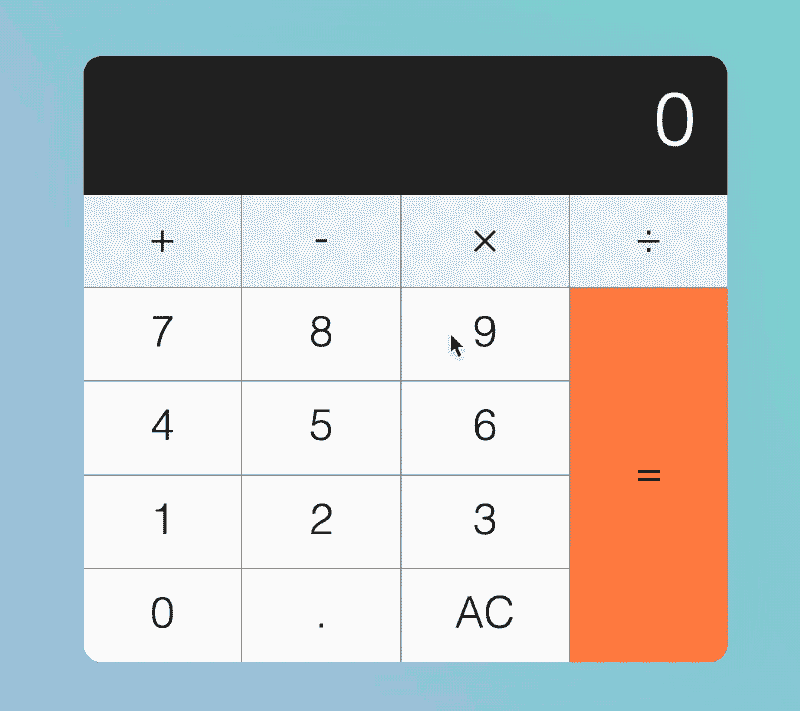

现在，我们的计算器不能进行连续计算。第二个计算值是错误的。这里是我们有的:`99 - 1 = 98`，`98 - 1 = 0`。

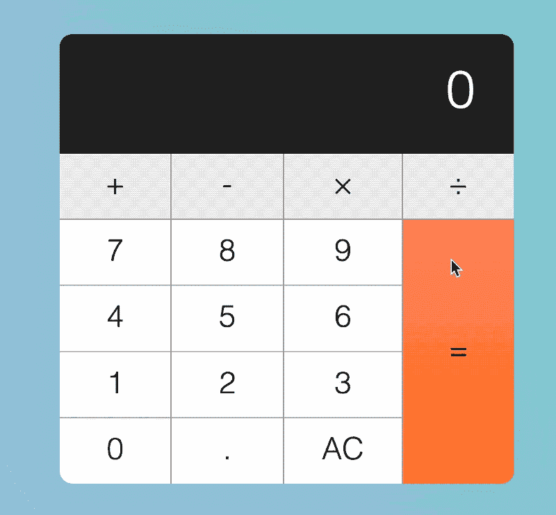

第二个值计算错误，因为我们将错误的值输入到`calculate`函数中。让我们通过几张图片来理解我们的代码做了什么。

### 了解我们的计算功能

首先，假设用户点击了一个数字，99。此时，计算器中尚未注册任何内容。

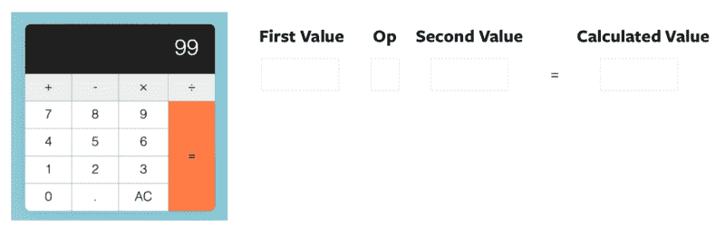

第二，假设用户点击了减法运算符。在他们点击减法运算符后，我们将`firstValue`设置为 99。我们还设置了`operator`来减去。

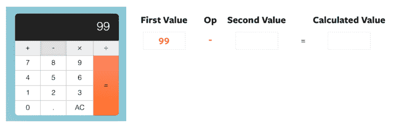

第三，假设用户点击了第二个值，这次是 1。此时，显示的数字更新为 1，但我们的`firstValue`、`operator`和`secondValue`保持不变。

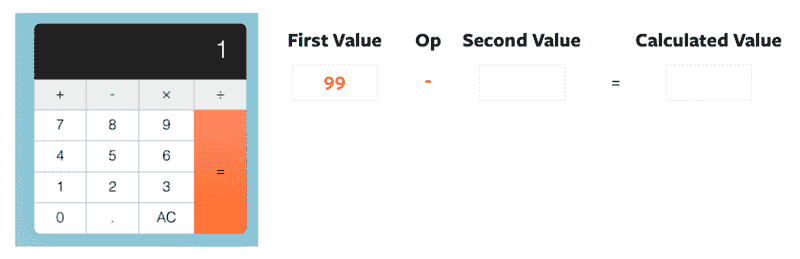

第四，用户再次点击减法。就在他们点击减法之后，在我们计算结果之前，我们将`secondValue`设置为显示的数字。

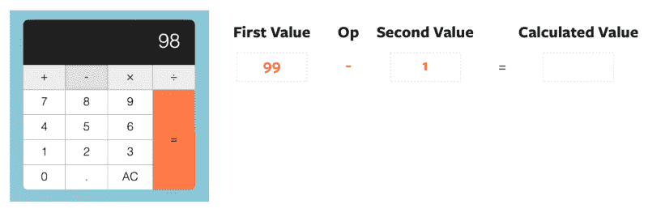

第五，我们用`firstValue` 99、`operator`减法和`secondValue` 1 来执行计算。结果是 98。

计算出结果后，我们将显示结果。然后，我们将`operator`设置为减法，将`firstValue`设置为之前显示的数字。

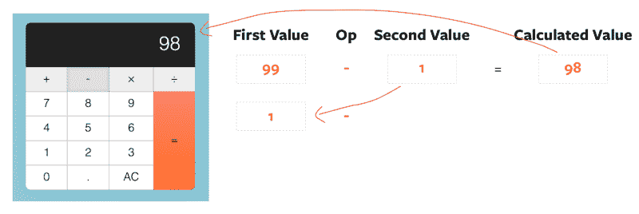

嗯，这是非常错误的！如果我们想继续计算，我们需要用计算出的值更新`firstValue`。


```
const firstValue = calculator.dataset.firstValue
const operator = calculator.dataset.operator
const secondValue = displayedNum

if (
  firstValue &&
  operator &&
  previousKeyType !== 'operator'
) {
  const calcValue = calculate(firstValue, operator, secondValue)
  display.textContent = calcValue

// Update calculated value as firstValue
  calculator.dataset.firstValue = calcValue
} else {
  // If there are no calculations, set displayedNum as the firstValue
  calculator.dataset.firstValue = displayedNum
}

key.classList.add('is-depressed')
calculator.dataset.previousKeyType = 'operator'
calculator.dataset.operator = action
```

通过此修复，由操作键完成的连续计算现在应该是正确的。

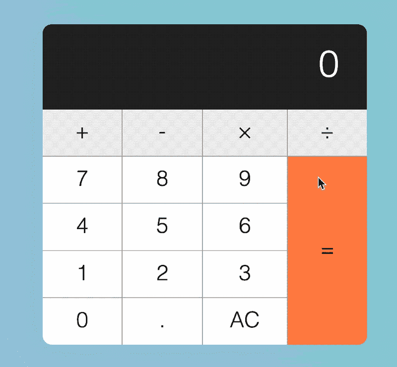

### 如果蒂姆按了等号键会发生什么？

首先，如果 Tim 在按任何操作键之前先按等号键，应该不会发生任何事情。

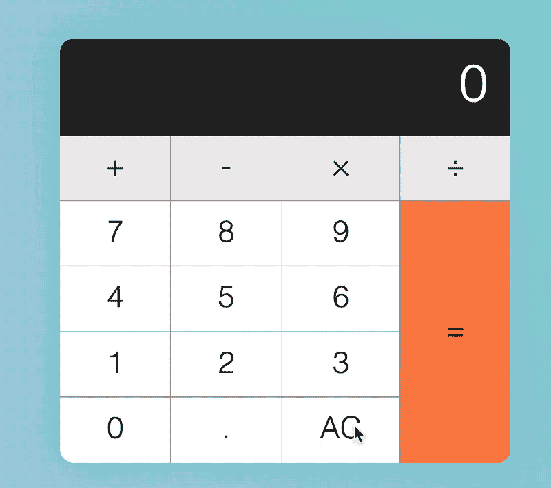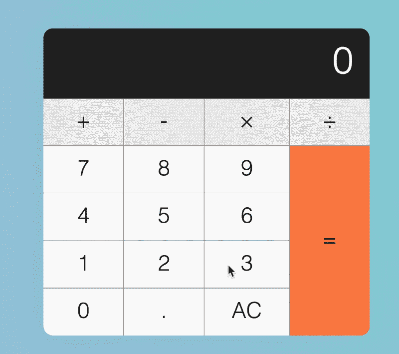

我们知道，如果`firstValue`没有设置为数字，操作键还没有被点击。我们可以利用这一知识来防止平等计算。

```
if (action === 'calculate') {
  const firstValue = calculator.dataset.firstValue
  const operator = calculator.dataset.operator
  const secondValue = displayedNum

if (firstValue) {
    display.textContent = calculate(firstValue, operator, secondValue)
  }

calculator.dataset.previousKeyType = 'calculate'
}
```

第二，如果 Tim 输入一个数字，后面是一个运算符，再后面是一个等号，那么计算器应该这样计算结果:

1.  `2 + =` — > `2 + 2 = 4`
2.  `2 - =` — > `2 - 2 = 0`
3.  `2 × =` — > `2 × 2 = 4`
4.  `2 ÷ =` — > `2 ÷ 2 = 1`

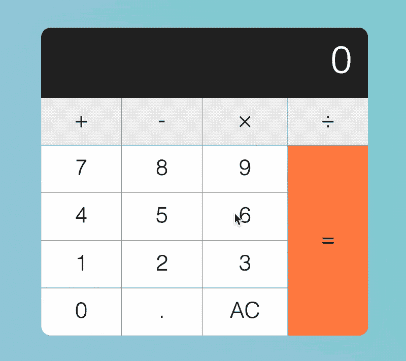

我们已经考虑到了这个奇怪的输入。你能理解为什么吗？:)

第三，如果 Tim 在一次计算完成后按下等号键，则应该再次执行另一次计算。计算应该是这样的:

1.  蒂姆按下 5-1 键
2.  蒂姆打了个平手。计算值为`5 - 1 = 4`
3.  蒂姆打了个平手。计算值为`4 - 1 = 3`
4.  蒂姆打了个平手。计算值为`3 - 1 = 2`
5.  蒂姆打了个平手。计算值为`2 - 1 = 1`
6.  蒂姆打了个平手。计算值为`1 - 1 = 0`


不幸的是，我们的计算器把计算搞乱了。下面是我们的计算器显示的内容:

1.  蒂姆按下 5-1 键
2.  蒂姆打了个平手。计算值为`4`
3.  蒂姆打了个平手。计算值为`1`


### 修正计算

首先，假设我们的用户点击了 5 次。此时，计算器中尚未注册任何内容。

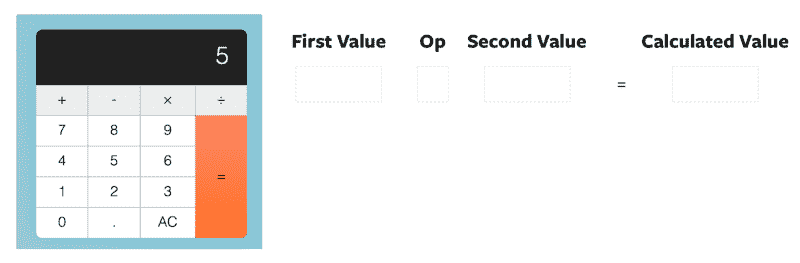

第二，假设用户点击了减法运算符。在他们点击减法运算符后，我们将`firstValue`设置为 5。我们还设置了`operator`来减去。

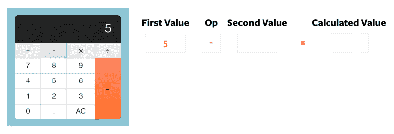

第三，用户点击第二个值。假设是 1。此时，显示的数字更新为 1，但我们的`firstValue`、`operator`和`secondValue`保持不变。

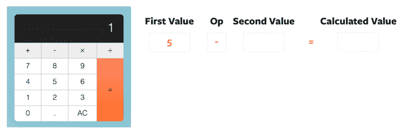

第四，用户单击等号键。就在他们点击等于之后，但是在计算之前，我们将`secondValue`设置为`displayedNum`


第五，计算器计算出`5 - 1`的结果，给出`4`。结果会更新到显示屏上。`firstValue`和`operator`会被结转到下一次计算，因为我们没有更新它们。


第六，当用户再次点击 equals 时，我们在计算前将`secondValue`设置为`displayedNum`。


你可以看出这里出了什么问题。

代替`secondValue`，我们希望将`firstValue`设置为显示的数字。

```
if (action === 'calculate') {
  let firstValue = calculator.dataset.firstValue
  const operator = calculator.dataset.operator
  const secondValue = displayedNum

if (firstValue) {
    if (previousKeyType === 'calculate') {
      firstValue = displayedNum
    }

display.textContent = calculate(firstValue, operator, secondValue)
  }

calculator.dataset.previousKeyType = 'calculate'
}
```

我们还想将之前的`secondValue`带入新的计算中。为了让`secondValue`持续到下一次计算，我们需要将它存储在另一个定制属性中。让我们称这个自定义属性为`modValue`(代表修改值)。

```
if (action === 'calculate') {
  let firstValue = calculator.dataset.firstValue
  const operator = calculator.dataset.operator
  const secondValue = displayedNum

if (firstValue) {
    if (previousKeyType === 'calculate') {
      firstValue = displayedNum
    }

display.textContent = calculate(firstValue, operator, secondValue)
  }

// Set modValue attribute
  calculator.dataset.modValue = secondValue
  calculator.dataset.previousKeyType = 'calculate'
}
```

如果`previousKeyType`是`calculate`，我们知道我们可以用`calculator.dataset.modValue`作为`secondValue`。一旦我们知道了这一点，我们就可以进行计算。

```
if (firstValue) {
  if (previousKeyType === 'calculate') {
    firstValue = displayedNum
    secondValue = calculator.dataset.modValue
  }

display.textContent = calculate(firstValue, operator, secondValue)
}
```

这样，当连续点击等号键时，我们就有了正确的计算结果。

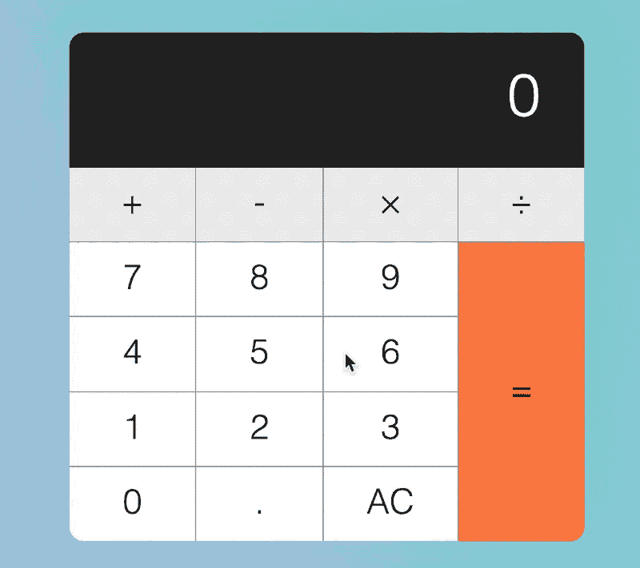

### 回到等号键

第四，如果 Tim 在 calculator 键后打了一个十进制键或数字键，则显示器应分别替换为`0.`或新的数字。

在这里，我们不仅要检查`previousKeyType`是否是`operator`，还要检查它是否是`calculate`。

```
if (!action) {
  if (
    displayedNum === '0' ||
    previousKeyType === 'operator' ||
    previousKeyType === 'calculate'
  ) {
    display.textContent = keyContent
  } else {
    display.textContent = displayedNum + keyContent
  }
  calculator.dataset.previousKeyType = 'number'
}

if (action === 'decimal') {
  if (!displayedNum.includes('.')) {
    display.textContent = displayedNum + '.'
  } else if (
    previousKeyType === 'operator' ||
    previousKeyType === 'calculate'
  ) {
    display.textContent = '0.'
  }

calculator.dataset.previousKeyType = 'decimal'
}
```

第五，如果 Tim 在等号键之后按了一个操作键，计算器应该**而不是**进行计算。


为此，我们在使用操作键执行计算之前检查`previousKeyType`是否为`calculate`。

```
if (
  action === 'add' ||
  action === 'subtract' ||
  action === 'multiply' ||
  action === 'divide'
) {
  // ...

if (
    firstValue &&
    operator &&
    previousKeyType !== 'operator' &&
    previousKeyType !== 'calculate'
  ) {
    const calcValue = calculate(firstValue, operator, secondValue)
    display.textContent = calcValue
    calculator.dataset.firstValue = calcValue
  } else {
    calculator.dataset.firstValue = displayedNum
  }

// ...
}
```

清除键有两种用途:

1.  全部清除(用`AC`表示)清除所有内容，并将计算器重置为初始状态。
2.  清除条目(用`CE`表示)清除当前条目。它将以前的数字保存在内存中。

当计算器处于默认状态时，应显示`AC`。

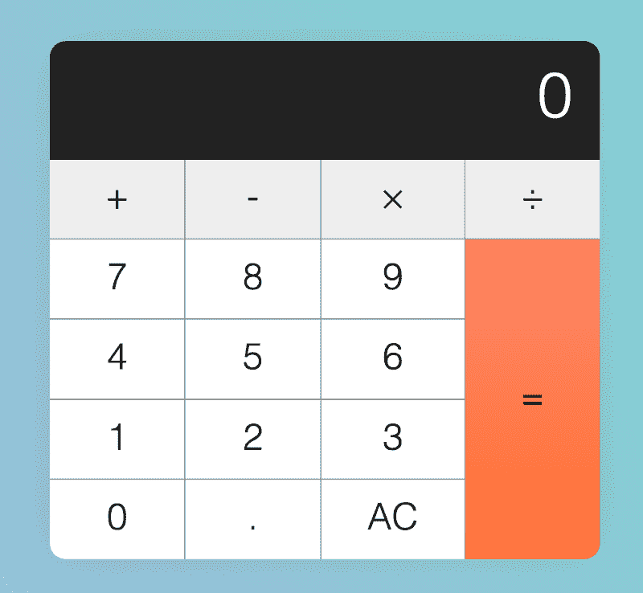

第一，如果 Tim 打了一个键(除了 clear 以外的任何键)，`AC`要改成`CE`。

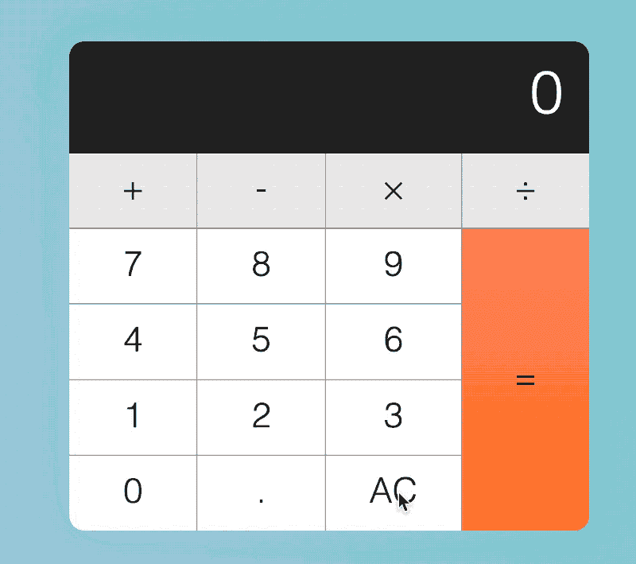

我们通过检查`data-action`是否为`clear`来实现这一点。如果它不是`clear`，我们寻找清除按钮并改变它的`textContent`。

```
if (action !== 'clear') {
  const clearButton = calculator.querySelector('[data-action=clear]')
  clearButton.textContent = 'CE'
}
```

第二，如果 Tim 点击`CE`，显示屏应该显示 0。同时，`CE`应该恢复到`AC`，这样蒂姆就可以将计算器复位到初始状态。**


```
if (action === 'clear') {
  display.textContent = 0
  key.textContent = 'AC'
  calculator.dataset.previousKeyType = 'clear'
}
```

第三，如果 Tim 点击`AC`，将计算器重置为初始状态。

要将计算器重置为初始状态，我们需要清除我们设置的所有自定义属性。

```
if (action === 'clear') {
  if (key.textContent === 'AC') {
    calculator.dataset.firstValue = ''
    calculator.dataset.modValue = ''
    calculator.dataset.operator = ''
    calculator.dataset.previousKeyType = ''
  } else {
    key.textContent = 'AC'
  }

display.textContent = 0
  calculator.dataset.previousKeyType = 'clear'
}
```

就这样——无论如何，对于边缘案例部分！

您可以通过[这个链接](http://zellwk.com/blog/calculator-part-2)获取 edge cases 部分的源代码(向下滚动并在框中输入您的电子邮件地址，我会将源代码直接发送到您的邮箱)。

在这一点上，我们一起创建的代码相当混乱。如果你试图自己阅读代码，你可能会迷路。让我们重构它，使它更干净。

### 重构代码

当你重构时，你通常会从最明显的改进开始。既然这样，那就从`calculate`说起吧。

在继续之前，请确保您了解这些 JavaScript 实践/特性。我们将在重构中使用它们。

1.  [提前回报](http://blog.timoxley.com/post/47041269194/avoid-else-return-early)
2.  [三元运算符](https://developer.mozilla.org/en-US/docs/Web/JavaScript/Reference/Operators/Conditional_Operator)
3.  [纯函数](https://medium.com/@jamesjefferyuk/javascript-what-are-pure-functions-4d4d5392d49c)
4.  [ES6 破坏](https://zellwk.com/blog/es6#destructuring)

就这样，我们开始吧！

### 重构计算函数

这是我们目前掌握的情况。

```
const calculate = (n1, operator, n2) => {
  let result = ''
  if (operator === 'add') {
    result = parseFloat(n1) + parseFloat(n2)
  } else if (operator === 'subtract') {
    result = parseFloat(n1) - parseFloat(n2)
  } else if (operator === 'multiply') {
    result = parseFloat(n1) * parseFloat(n2)
  } else if (operator === 'divide') {
    result = parseFloat(n1) / parseFloat(n2)
  }

  return result
}
```

你知道我们应该尽可能减少重新分配。这里，如果我们在`if`和`else if`语句中返回计算结果，我们可以删除赋值:

```
const calculate = (n1, operator, n2) => {
  if (operator === 'add') {
    return firstNum + parseFloat(n2)
  } else if (operator === 'subtract') {
    return parseFloat(n1) - parseFloat(n2)
  } else if (operator === 'multiply') {
    return parseFloat(n1) * parseFloat(n2)
  } else if (operator === 'divide') {
    return parseFloat(n1) / parseFloat(n2)
  }
}
```

因为我们返回所有的值，所以我们可以使用**早期返回**。如果我们这样做，就不需要任何条件。

```
const calculate = (n1, operator, n2) => {
  if (operator === 'add') {
    return firstNum + parseFloat(n2)
  }

  if (operator === 'subtract') {
    return parseFloat(n1) - parseFloat(n2)
  }

  if (operator === 'multiply') {
    return parseFloat(n1) * parseFloat(n2)
  }

  if (operator === 'divide') {
    return parseFloat(n1) / parseFloat(n2)
  }
}
```

由于每个`if`条件有一个语句，我们可以去掉括号。(注意:一些开发人员用大括号发誓)。下面是代码的样子:

```
const calculate = (n1, operator, n2) => {
  if (operator === 'add') return parseFloat(n1) + parseFloat(n2)
  if (operator === 'subtract') return parseFloat(n1) - parseFloat(n2)
  if (operator === 'multiply') return parseFloat(n1) * parseFloat(n2)
  if (operator === 'divide') return parseFloat(n1) / parseFloat(n2)
}
```

最后，我们在函数中调用了`parseFloat`八次。我们可以通过创建两个包含浮点值的变量来简化它:

```
const calculate = (n1, operator, n2) => {
  const firstNum = parseFloat(n1)
  const secondNum = parseFloat(n2)
  if (operator === 'add') return firstNum + secondNum
  if (operator === 'subtract') return firstNum - secondNum
  if (operator === 'multiply') return firstNum * secondNum
  if (operator === 'divide') return firstNum / secondNum
}
```

我们现在完成了`calculate`。你不觉得比以前更好读了吗？

### 重构事件侦听器

我们为事件监听器创建的代码非常庞大。这是我们目前掌握的情况:

```
keys.addEventListener('click', e => {
  if (e.target.matches('button')) {

    if (!action) { /* ... */ }

    if (action === 'add' ||
      action === 'subtract' ||
      action === 'multiply' ||
      action === 'divide') {
      /* ... */
    }

    if (action === 'clear') { /* ... */ }
    if (action !== 'clear') { /* ... */ }
    if (action === 'calculate') { /* ... */ }
  }
})
```

你如何开始重构这段代码？如果您不知道任何编程最佳实践，您可能会尝试通过将每种操作分解成一个更小的函数来进行重构:

```
// Don't do this!
const handleNumberKeys = (/* ... */) => {/* ... */}
const handleOperatorKeys = (/* ... */) => {/* ... */}
const handleDecimalKey = (/* ... */) => {/* ... */}
const handleClearKey = (/* ... */) => {/* ... */}
const handleCalculateKey = (/* ... */) => {/* ... */}
```

不要这样。这没有帮助，因为你仅仅是分割代码块。当你这样做的时候，函数变得难以理解。

更好的方法是将代码分成纯函数和不纯函数。如果您这样做，您将得到如下所示的代码:

```
keys.addEventListener('click', e => {
  // Pure function
  const resultString = createResultString(/* ... */)

  // Impure stuff
  display.textContent = resultString
  updateCalculatorState(/* ... */)
})
```

这里，`createResultString`是一个纯函数，返回需要在计算器上显示的内容。`updateCalculatorState`是一个不纯的函数，改变了计算器的视觉外观和自定义属性。

### 制作 createResultString

如前所述，`createResultString`应该返回需要在计算器上显示的值。
你可以通过代码中写着`display.textContent = 'some value`的部分得到这些值。

```
display.textContent = 'some value'
```

我们希望返回每个值，而不是`display.textContent = 'some value'`，以便以后使用。

```
// replace the above with this
return 'some value'
```

让我们一起从数字键开始，一步一步来。

### 制作数字键的结果字符串

这是我们的数字键代码:

```
if (!action) {
  if (
    displayedNum === '0' ||
    previousKeyType === 'operator' ||
    previousKeyType === 'calculate'
  ) {
    display.textContent = keyContent
  } else {
    display.textContent = displayedNum + keyContent
  }
  calculator.dataset.previousKeyType = 'number'
}
```

第一步是将写着`display.textContent = 'some value'`的部分复制到`createResultString`中。当你这样做的时候，确保你把`display.textContent =`变成了`return`。

```
const createResultString = () => {
  if (!action) {
    if (
      displayedNum === '0' ||
      previousKeyType === 'operator' ||
      previousKeyType === 'calculate'
    ) {
      return keyContent
    } else {
      return displayedNum + keyContent
    }
  }
}
```

接下来，我们可以将`if/else`语句转换成三元运算符:

```
const createResultString = () => {
  if (action!) {
    return displayedNum === '0' ||
      previousKeyType === 'operator' ||
      previousKeyType === 'calculate'
      ? keyContent
      : displayedNum + keyContent
  }
}
```

当你重构时，记得记下你需要的变量列表。我们稍后将回到这个列表。

```
const createResultString = () => {
  // Variables required are:
  // 1\. keyContent
  // 2\. displayedNum
  // 3\. previousKeyType
  // 4\. action

  if (action!) {
    return displayedNum === '0' ||
      previousKeyType === 'operator' ||
      previousKeyType === 'calculate'
      ? keyContent
      : displayedNum + keyContent
  }
}
```

### 生成十进制键的结果字符串

这是十进制键的代码:

```
if (action === 'decimal') {
  if (!displayedNum.includes('.')) {
    display.textContent = displayedNum + '.'
  } else if (
    previousKeyType === 'operator' ||
    previousKeyType === 'calculate'
  ) {
    display.textContent = '0.'
  }

  calculator.dataset.previousKeyType = 'decimal'
}
```

和以前一样，我们想把任何改变`display.textContent`的东西移到`createResultString`中。

```
const createResultString = () => {
  // ...

  if (action === 'decimal') {
    if (!displayedNum.includes('.')) {
      return = displayedNum + '.'
    } else if (previousKeyType === 'operator' || previousKeyType === 'calculate') {
      return = '0.'
    }
  }
}
```

由于我们想要返回所有的值，我们可以将`else if`语句转换成早期返回。

```
const createResultString = () => {
  // ...

  if (action === 'decimal') {
    if (!displayedNum.includes('.')) return displayedNum + '.'
    if (previousKeyType === 'operator' || previousKeyType === 'calculate') return '0.'
  }
}
```

这里一个常见的错误是当两个条件都不匹配时，忘记返回当前显示的数字。我们需要这样做，因为我们将用从`createResultString`返回的值替换`display.textContent`。如果我们错过了，`createResultString`将返回`undefined`，这不是我们所希望的。

```
const createResultString = () => {
  // ...

  if (action === 'decimal') {
    if (!displayedNum.includes('.')) return displayedNum + '.'
    if (previousKeyType === 'operator' || previousKeyType === 'calculate') return '0.'
    return displayedNum
  }
}
```

像往常一样，记下需要的变量。此时，所需的变量与之前相同:

```
const createResultString = () => {
  // Variables required are:
  // 1\. keyContent
  // 2\. displayedNum
  // 3\. previousKeyType
  // 4\. action
}
```

### 为操作键生成结果字符串

这是我们为操作键编写的代码。

```
if (
  action === 'add' ||
  action === 'subtract' ||
  action === 'multiply' ||
  action === 'divide'
) {
  const firstValue = calculator.dataset.firstValue
  const operator = calculator.dataset.operator
  const secondValue = displayedNum

  if (
    firstValue &&
    operator &&
    previousKeyType !== 'operator' &&
    previousKeyType !== 'calculate'
  ) {
    const calcValue = calculate(firstValue, operator, secondValue)
    display.textContent = calcValue
    calculator.dataset.firstValue = calcValue
  } else {
    calculator.dataset.firstValue = displayedNum
  }

  key.classList.add('is-depressed')
  calculator.dataset.previousKeyType = 'operator'
  calculator.dataset.operator = action
}
```

现在你知道该怎么做了:我们想把所有改变`display.textContent`的东西都移到`createResultString`中。以下是需要移动的内容:

```
const createResultString = () => {
  // ...
  if (
    action === 'add' ||
    action === 'subtract' ||
    action === 'multiply' ||
    action === 'divide'
  ) {
    const firstValue = calculator.dataset.firstValue
    const operator = calculator.dataset.operator
    const secondValue = displayedNum

    if (
      firstValue &&
      operator &&
      previousKeyType !== 'operator' &&
      previousKeyType !== 'calculate'
    ) {
      return calculate(firstValue, operator, secondValue)
    }
  }
}
```

记住，`createResultString`需要返回要在计算器上显示的值。如果`if`条件不匹配，我们仍然希望返回显示的数字。

```
const createResultString = () => {
  // ...
  if (
    action === 'add' ||
    action === 'subtract' ||
    action === 'multiply' ||
    action === 'divide'
  ) {
    const firstValue = calculator.dataset.firstValue
    const operator = calculator.dataset.operator
    const secondValue = displayedNum

    if (
      firstValue &&
      operator &&
      previousKeyType !== 'operator' &&
      previousKeyType !== 'calculate'
    ) {
      return calculate(firstValue, operator, secondValue)
    } else {
      return displayedNum
    }
  }
}
```

然后，我们可以将`if/else`语句重构为一个三元运算符:

```
const createResultString = () => {
  // ...
  if (
    action === 'add' ||
    action === 'subtract' ||
    action === 'multiply' ||
    action === 'divide'
  ) {
    const firstValue = calculator.dataset.firstValue
    const operator = calculator.dataset.operator
    const secondValue = displayedNum

    return firstValue &&
      operator &&
      previousKeyType !== 'operator' &&
      previousKeyType !== 'calculate'
      ? calculate(firstValue, operator, secondValue)
      : displayedNum
  }
}
```

如果你仔细观察，你会发现没有必要存储一个`secondValue`变量。我们可以在`calculate`函数中直接使用`displayedNum`。

```
const createResultString = () => {
  // ...
  if (
    action === 'add' ||
    action === 'subtract' ||
    action === 'multiply' ||
    action === 'divide'
  ) {
    const firstValue = calculator.dataset.firstValue
    const operator = calculator.dataset.operator

    return firstValue &&
      operator &&
      previousKeyType !== 'operator' &&
      previousKeyType !== 'calculate'
      ? calculate(firstValue, operator, displayedNum)
      : displayedNum
  }
}
```

最后，记下所需的变量和属性。这一次我们需要`calculator.dataset.firstValue`和`calculator.dataset.operator`。

```
const createResultString = () => {
  // Variables & properties required are:
  // 1\. keyContent
  // 2\. displayedNum
  // 3\. previousKeyType
  // 4\. action
  // 5\. calculator.dataset.firstValue
  // 6\. calculator.dataset.operator
}
```

### 生成清除键的结果字符串

我们编写了以下代码来处理`clear`键。

```
if (action === 'clear') {
  if (key.textContent === 'AC') {
    calculator.dataset.firstValue = ''
    calculator.dataset.modValue = ''
    calculator.dataset.operator = ''
    calculator.dataset.previousKeyType = ''
  } else {
    key.textContent = 'AC'
  }

  display.textContent = 0
  calculator.dataset.previousKeyType = 'clear'
}
```

如上，想把所有改变`display.textContent`的东西都移到`createResultString`里。

```
const createResultString = () => {
  // ...
  if (action === 'clear') return 0
}
```

### 为等于键生成结果字符串

以下是我们为等号键编写的代码:

```
if (action === 'calculate') {
  let firstValue = calculator.dataset.firstValue
  const operator = calculator.dataset.operator
  let secondValue = displayedNum

  if (firstValue) {
    if (previousKeyType === 'calculate') {
      firstValue = displayedNum
      secondValue = calculator.dataset.modValue
    }

    display.textContent = calculate(firstValue, operator, secondValue)
  }

  calculator.dataset.modValue = secondValue
  calculator.dataset.previousKeyType = 'calculate'
}
```

如上所述，我们希望将所有将`display.textContent`更改为`createResultString`的内容复制过来。以下是需要复制的内容:

```
if (action === 'calculate') {
  let firstValue = calculator.dataset.firstValue
  const operator = calculator.dataset.operator
  let secondValue = displayedNum

  if (firstValue) {
    if (previousKeyType === 'calculate') {
      firstValue = displayedNum
      secondValue = calculator.dataset.modValue
    }
    display.textContent = calculate(firstValue, operator, secondValue)
  }
}
```

当将代码复制到`createResultString`中时，确保为每一个可能的场景返回值:

```
const createResultString = () => {
  // ...

  if (action === 'calculate') {
    let firstValue = calculator.dataset.firstValue
    const operator = calculator.dataset.operator
    let secondValue = displayedNum

    if (firstValue) {
      if (previousKeyType === 'calculate') {
        firstValue = displayedNum
        secondValue = calculator.dataset.modValue
      }
      return calculate(firstValue, operator, secondValue)
    } else {
      return displayedNum
    }
  }
}
```

接下来，我们希望减少重新分配。我们可以通过三元运算符将正确的值传递给`calculate`来实现。

```
const createResultString = () => {
  // ...

  if (action === 'calculate') {
    const firstValue = calculator.dataset.firstValue
    const operator = calculator.dataset.operator
    const modValue = calculator.dataset.modValue

    if (firstValue) {
      return previousKeyType === 'calculate'
        ? calculate(displayedNum, operator, modValue)
        : calculate(firstValue, operator, displayedNum)
    } else {
      return displayedNum
    }
  }
}
```

如果您觉得合适，可以用另一个三元运算符进一步简化上面的代码:

```
const createResultString = () => {
  // ...

  if (action === 'calculate') {
    const firstValue = calculator.dataset.firstValue
    const operator = calculator.dataset.operator
    const modValue = calculator.dataset.modValue

    return firstValue
      ? previousKeyType === 'calculate'
        ? calculate(displayedNum, operator, modValue)
        : calculate(firstValue, operator, displayedNum)
      : displayedNum
  }
}
```

此时，我们要再次注意所需的属性和变量:

```
const createResultString = () => {
  // Variables & properties required are:
  // 1\. keyContent
  // 2\. displayedNum
  // 3\. previousKeyType
  // 4\. action
  // 5\. calculator.dataset.firstValue
  // 6\. calculator.dataset.operator
  // 7\. calculator.dataset.modValue
}
```

### 传入必要的变量

我们在`createResultString`中需要七个属性/变量:

1.  `keyContent`
2.  `displayedNum`
3.  `previousKeyType`
4.  `action`
5.  `firstValue`
6.  `modValue`
7.  `operator`

我们可以从`key`那里得到`keyContent`和`action`。我们还可以从`calculator.dataset`中得到`firstValue`、`modValue`、`operator`和`previousKeyType`。

这意味着`createResultString`函数需要三个变量——`key`、`displayedNum`和`calculator.dataset`。因为`calculator.dataset`代表计算器的状态，所以让我们用一个叫做`state`的变量来代替。

```
const createResultString = (key, displayedNum, state) => {
  const keyContent = key.textContent
  const action = key.dataset.action
  const firstValue = state.firstValue
  const modValue = state.modValue
  const operator = state.operator
  const previousKeyType = state.previousKeyType
  // ... Refactor as necessary
}

// Using createResultString
keys.addEventListener('click', e => {
  if (e.target.matches('button')) return
  const displayedNum = display.textContent
  const resultString = createResultString(e.target, displayedNum, calculator.dataset)

  // ...
})
```

如果您愿意，可以随意析构变量:

```
const createResultString = (key, displayedNum, state) => {
  const keyContent = key.textContent
  const { action } = key.dataset
  const {
    firstValue,
    modValue,
    operator,
    previousKeyType
  } = state

  // ...
}
```

### if 语句内的一致性

在`createResultString`中，我们使用以下条件来测试被点击的按键类型:

```
// If key is number
if (!action) { /* ... */ }

// If key is decimal
if (action === 'decimal') { /* ... */ }

// If key is operator
if (
  action === 'add' ||
  action === 'subtract' ||
  action === 'multiply' ||
  action === 'divide'
) { /* ... */}

// If key is clear
if (action === 'clear') { /* ... */ }

// If key is calculate
if (action === 'calculate') { /* ... */ }
```

它们不一致，所以很难读懂。如果可能的话，我们希望使它们保持一致，这样我们就可以这样写:

```
if (keyType === 'number') { /* ... */ }
if (keyType === 'decimal') { /* ... */ }
if (keyType === 'operator') { /* ... */}
if (keyType === 'clear') { /* ... */ }
if (keyType === 'calculate') { /* ... */ }
```

为此，我们可以创建一个名为`getKeyType`的函数。这个函数应该返回被点击的键的类型。

```
const getKeyType = (key) => {
  const { action } = key.dataset
  if (!action) return 'number'
  if (
    action === 'add' ||
    action === 'subtract' ||
    action === 'multiply' ||
    action === 'divide'
  ) return 'operator'
  // For everything else, return the action
  return action
}
```

下面是该函数的使用方法:

```
const createResultString = (key, displayedNum, state) => {
  const keyType = getKeyType(key)

  if (keyType === 'number') { /* ... */ }
  if (keyType === 'decimal') { /* ... */ }
  if (keyType === 'operator') { /* ... */}
  if (keyType === 'clear') { /* ... */ }
  if (keyType === 'calculate') { /* ... */ }
}
```

我们完成了`createResultString`。接下来说`updateCalculatorState`。

### 制作 updateCalculatorState

`updateCalculatorState`是一个改变计算器视觉外观和自定义属性的功能。

和`createResultString`一样，我们需要检查被点击的键的类型。在这里，我们可以重用`getKeyType`。

```
const updateCalculatorState = (key) => {
  const keyType = getKeyType(key)

  if (keyType === 'number') { /* ... */ }
  if (keyType === 'decimal') { /* ... */ }
  if (keyType === 'operator') { /* ... */}
  if (keyType === 'clear') { /* ... */ }
  if (keyType === 'calculate') { /* ... */ }
}
```

如果你看看剩下的代码，你可能会注意到我们为每种类型的键改变了`data-previous-key-type`。代码如下所示:

```
const updateCalculatorState = (key, calculator) => {
  const keyType = getKeyType(key)

  if (!action) {
    // ...
    calculator.dataset.previousKeyType = 'number'
  }

  if (action === 'decimal') {
    // ...
    calculator.dataset.previousKeyType = 'decimal'
  }

  if (
    action === 'add' ||
    action === 'subtract' ||
    action === 'multiply' ||
    action === 'divide'
  ) {
    // ...
    calculator.dataset.previousKeyType = 'operator'
  }

  if (action === 'clear') {
    // ...
    calculator.dataset.previousKeyType = 'clear'
  }

  if (action === 'calculate') {
    calculator.dataset.previousKeyType = 'calculate'
  }
}
```

这是多余的，因为我们已经知道了带有`getKeyType`的键类型。我们可以将上述内容重构为:

```
const updateCalculatorState = (key, calculator) => {
  const keyType = getKeyType(key)
  calculator.dataset.previousKeyType = keyType

  if (keyType === 'number') { /* ... */ }
  if (keyType === 'decimal') { /* ... */ }
  if (keyType === 'operator') { /* ... */}
  if (keyType === 'clear') { /* ... */ }
  if (keyType === 'calculate') { /* ... */ }
}
```

### 为操作键制作`updateCalculatorState`

视觉上，我们需要确保所有的键都释放它们的按下状态。在这里，我们可以复制并粘贴之前的代码:

```
const updateCalculatorState = (key, calculator) => {
  const keyType = getKeyType(key)
  calculator.dataset.previousKeyType = keyType

  Array.from(key.parentNode.children).forEach(k => k.classList.remove('is-depressed'))
}
```

在将与`display.textContent`相关的部分移到`createResultString`之后，下面是我们为操作键编写的内容。

```
if (keyType === 'operator') {
  if (firstValue &&
      operator &&
      previousKeyType !== 'operator' &&
      previousKeyType !== 'calculate'
  ) {
    calculator.dataset.firstValue = calculatedValue
  } else {
    calculator.dataset.firstValue = displayedNum
  }

  key.classList.add('is-depressed')
  calculator.dataset.operator = key.dataset.action
}
```

您可能会注意到，我们可以用三元运算符来缩短代码:

```
if (keyType === 'operator') {
  key.classList.add('is-depressed')
  calculator.dataset.operator = key.dataset.action
  calculator.dataset.firstValue = firstValue &&
    operator &&
    previousKeyType !== 'operator' &&
    previousKeyType !== 'calculate'
    ? calculatedValue
    : displayedNum
}
```

像以前一样，记下您需要的变量和属性。这里，我们需要`calculatedValue`和`displayedNum`。

```
const updateCalculatorState = (key, calculator) => {
  // Variables and properties needed
  // 1\. key
  // 2\. calculator
  // 3\. calculatedValue
  // 4\. displayedNum
}
```

### 使`updateCalculatorState`为清除键

下面是清除键的剩余代码:

```
if (action === 'clear') {
  if (key.textContent === 'AC') {
    calculator.dataset.firstValue = ''
    calculator.dataset.modValue = ''
    calculator.dataset.operator = ''
    calculator.dataset.previousKeyType = ''
  } else {
    key.textContent = 'AC'
  }
}

if (action !== 'clear') {
  const clearButton = calculator.querySelector('[data-action=clear]')
  clearButton.textContent = 'CE'
}
```

这里我们没有什么可以重构的。请随意将所有内容复制/粘贴到`updateCalculatorState`中。

### 为等号键制作`updateCalculatorState`

以下是我们为等号键编写的代码:

```
if (action === 'calculate') {
  let firstValue = calculator.dataset.firstValue
  const operator = calculator.dataset.operator
  let secondValue = displayedNum

  if (firstValue) {
    if (previousKeyType === 'calculate') {
      firstValue = displayedNum
      secondValue = calculator.dataset.modValue
    }

    display.textContent = calculate(firstValue, operator, secondValue)
  }

  calculator.dataset.modValue = secondValue
  calculator.dataset.previousKeyType = 'calculate'
}
```

如果我们去掉所有与`display.textContent`有关的东西，这就是我们剩下的东西。

```
if (action === 'calculate') {
  let secondValue = displayedNum

  if (firstValue) {
    if (previousKeyType === 'calculate') {
      secondValue = calculator.dataset.modValue
    }
  }

  calculator.dataset.modValue = secondValue
}
```

我们可以将其重构为:

```
if (keyType === 'calculate') {
  calculator.dataset.modValue = firstValue && previousKeyType === 'calculate'
    ? modValue
    : displayedNum
}
```

像往常一样，记下所使用的属性和变量:

```
const updateCalculatorState = (key, calculator) => {
  // Variables and properties needed
  // 1\. key
  // 2\. calculator
  // 3\. calculatedValue
  // 4\. displayedNum
  // 5\. modValue
}
```

### 传入必要的变量

我们知道`updateCalculatorState`需要五个变量/属性:

1.  `key`
2.  `calculator`
3.  `calculatedValue`
4.  `displayedNum`
5.  `modValue`

因为可以从`calculator.dataset`中检索到`modValue`，所以我们只需要传入四个值:

```
const updateCalculatorState = (key, calculator, calculatedValue, displayedNum) => {
  // ...
}

keys.addEventListener('click', e => {
  if (e.target.matches('button')) return

  const key = e.target
  const displayedNum = display.textContent
  const resultString = createResultString(key, displayedNum, calculator.dataset)

  display.textContent = resultString

  // Pass in necessary values
  updateCalculatorState(key, calculator, resultString, displayedNum)
})
```

### 再次重构 updateCalculatorState

我们在`updateCalculatorState`中改变了三种值:

1.  `calculator.dataset`
2.  按下/压下操作符的类别
3.  `AC` vs `CE`文本

如果你想让它更简洁，你可以把(2)和(3)拆分成另一个函数——`updateVisualState`。下面是`updateVisualState`可能的样子:

```
const updateVisualState = (key, calculator) => {
  const keyType = getKeyType(key)
  Array.from(key.parentNode.children).forEach(k => k.classList.remove('is-depressed'))

  if (keyType === 'operator') key.classList.add('is-depressed')

  if (keyType === 'clear' && key.textContent !== 'AC') {
    key.textContent = 'AC'
  }

  if (keyType !== 'clear') {
    const clearButton = calculator.querySelector('[data-action=clear]')
    clearButton.textContent = 'CE'
  }
}
```

### 包扎

重构后，代码变得更加清晰。如果您研究一下事件监听器，您就会知道每个函数是做什么的。下面是事件监听器最后的样子:

```
keys.addEventListener('click', e => {
  if (e.target.matches('button')) return
  const key = e.target
  const displayedNum = display.textContent

  // Pure functions
  const resultString = createResultString(key, displayedNum, calculator.dataset)

  // Update states
  display.textContent = resultString
  updateCalculatorState(key, calculator, resultString, displayedNum)
  updateVisualState(key, calculator)
})
```

您可以通过[这个链接](https://zellwk.com/blog/calculator-part-3)获取重构部分的源代码(向下滚动并在框中输入您的电子邮件地址，我会将源代码直接发送到您的邮箱)。

我希望你喜欢这篇文章。如果你这样做了，你可能会喜欢[学习 JavaScript](https://learnjavascript.today/)——在这个课程中，我会一步一步地向你展示如何构建 20 个组件，就像我们今天如何构建这个计算器一样。

注意:我们可以通过添加键盘支持和辅助功能(如实时区域)来进一步改进计算器。想知道怎么回事吗？去看看学习 JavaScript:)