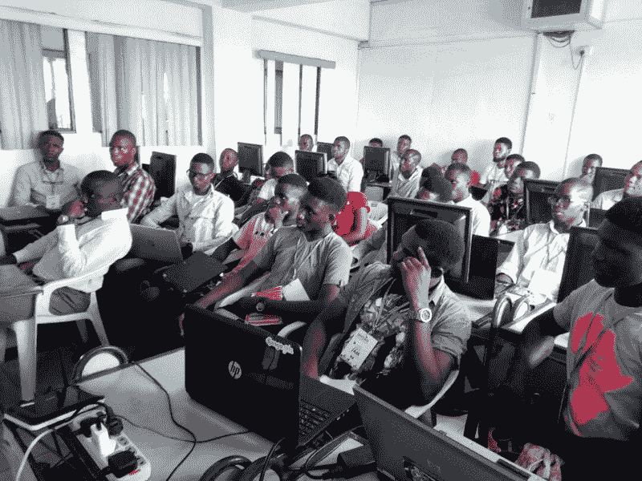
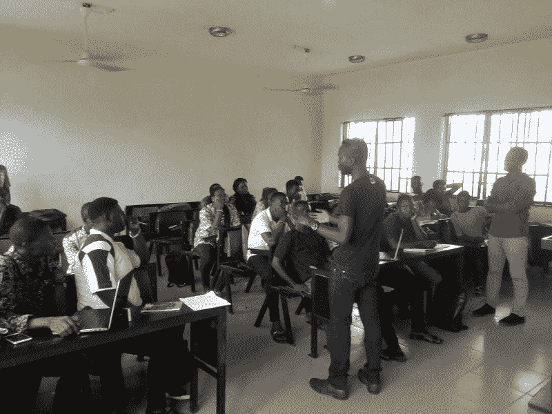
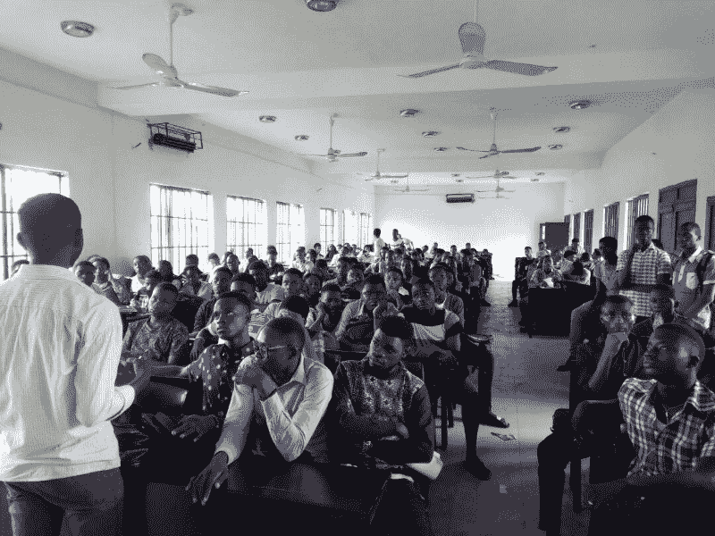
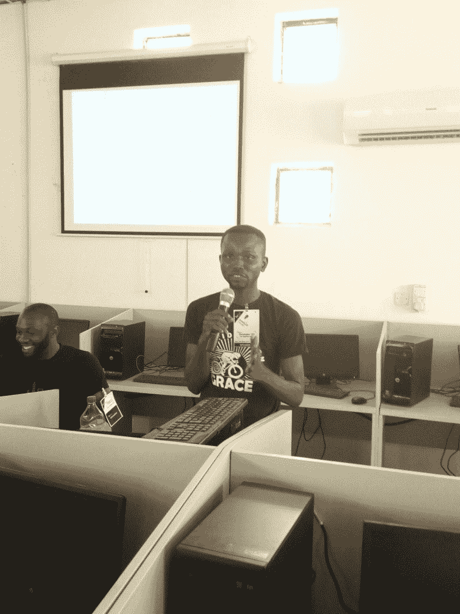
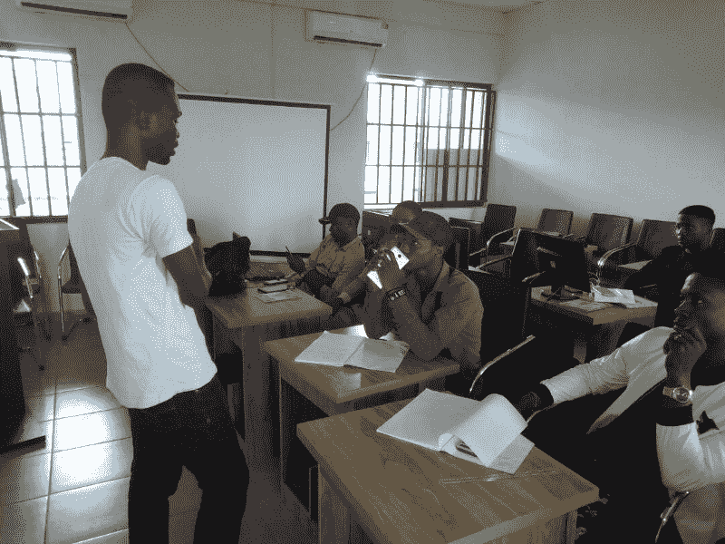
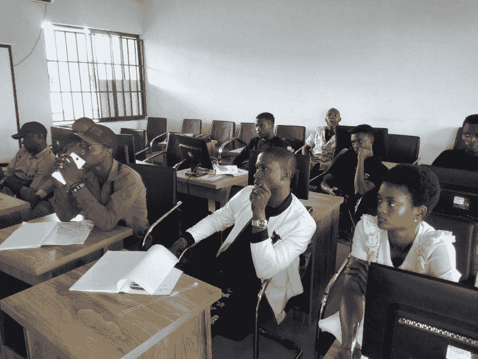
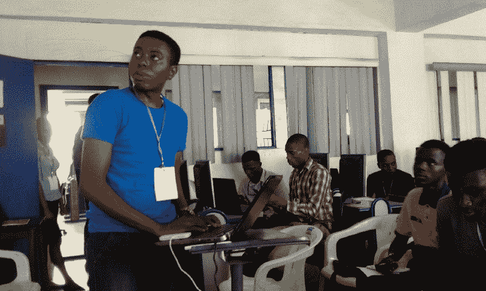
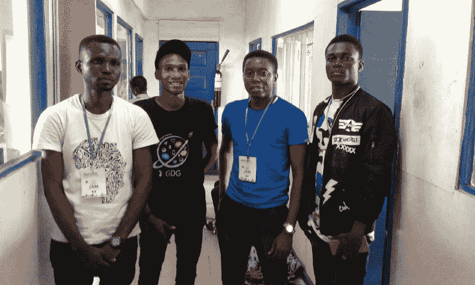
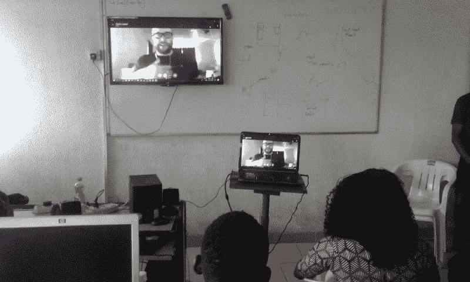

# 我如何在尼日利亚的瓦里建立了一个谷歌开发团队，GDG 分部，并拥有 100 名成员

> 原文：<https://www.freecodecamp.org/news/how-i-started-a-google-developers-group-gdg-chapter-in-warri-nigeria-and-reached-100-members-22cbd622d070/>

> 只要一点火星就能让火燃烧起来，很快周围的人就能在它的光芒中暖和起来。库尔特·凯泽，传下去

我确信，毫无疑问，技术将在改变整个非洲大陆的叙事中发挥(并且已经在发挥)至关重要的作用。

你不用找很远就能分享我的信念。看看[安德拉的](https://andela.com/)使命[培养下一代科技领袖](https://andela.com/about-us/)和【Udacity 的【谷歌非洲奖学金项目。他们旨在寻找尼日利亚和整个非洲最有才华的软件开发人员。

谷歌的开发者们通过社区建设在撒哈拉以南非洲和全世界所做的工作给了我很大的启发。因此，今年早些时候，我利用[谷歌开发团队](https://developers.google.com/programs/community/gdg/) (GDG)，申请在尼日利亚瓦里成立一个 GDG 分会。

由于我不住在拉各斯(席卷非洲大陆的科技革命的中心)——我住在尼日利亚南部三角洲州的城市瓦里——这意味着我只能远程参加聚会和科技活动(具体来说是通过 Twitter)。如果你像我一样是一个远程工作者，这不是建立网络的最佳方式！

我需要感受、接触和会见我所在领域的业内人士，我想帮助激励那些有抱负和意愿拥抱技术并成为开发人员的人。

#### 我是谁？

我是一名前端开发人员、技术写作人员、 [freeCodeCamp 媒体出版物](https://medium.freecodecamp.org/)的[志愿编辑](https://medium.freecodecamp.org/abbey-is-joining-the-freecodecamp-team-as-an-editor-4b2600167f8)，以及 [Google 开发者小组、GDG、尼日利亚瓦里](https://www.meetup.com/GDG-Warri)的主要组织者。

我的软件开发之旅始于十几岁。2003 年，我接触了 QBASIC，这是编程入门课程的语言，是我获得数据处理文凭证书的一部分要求。这是通过尼日利亚贝宁大学计算机科学系教授的。

CS 系讲师 Frank 大叔与 Roland Ukor 带领的一些学生合作创办了一个软件俱乐部。我们被教了 Visual Basic 6.0，Cold Fusion，classic ASP，然后是. NET(那是微软刚刚发布的)。

回想起来，那是我最早接触小组学习和技术社区文化的时候。

#### 为什么是 GDG 和我对 GDG·瓦里的看法？

> 如果说我比别人看得更远，那是因为我站在巨人的肩膀上。—艾萨克·牛顿

Google 开发团队是一个对 Google 技术和 API 感兴趣的本地开发团队(和有抱负的开发人员)。GDG 当地的分会可以举办适合他们社区的聚会，比如帮助人们学习如何编码和成为开发者，举办黑客马拉松，以及运行 codelabs。

GDGs 一直站在撒哈拉以南非洲建设科技社区的最前沿。GDGs 是非洲最大的开发者社区(见[目录](https://developers.google.com/programs/community/gdg/directory/))。由于我热衷于在瓦里从头开始建立一个开发人员社区，并希望带来技术带来的同样的兴奋和授权，所以成立 GDG 分会自然很合适。我相信这个社区可以站在 GDG 其他分会和[谷歌开发者专家](https://developers.google.com/experts/about)的肩膀上看得更远。

Charles Freeborn introducing GDG Warri to the final year students of the Department of Computer Science, Federal University of Petroleum Resources, Effurun, Nigeria

我专注于激光，我在瓦里创办 GDG 分会的愿景概括如下:

*   通过激励尽可能多的年轻人成为软件开发人员来建立一个软件开发人员社区
*   从长远来看，这个开发人员社区将获得有价值的技能，使他们能够被雇佣。它还将为社会创造创新的解决方案，并帮助建立初创企业。
*   该组织将通过技术帮助改变尼日利亚尼日尔三角洲地区的叙事。

#### 在[GDG·瓦里 meetup 页面](https://www.meetup.com/GDG-Warri)上运行前 100 个成员

人们需要被触摸，被看见，被感觉，被听见。

Charles Freeborn introducing GDG Warri to 150 plus students of the Department of Computer Science, Federal University of Petroleum Resources, Effurun, Nigeria

我明白社交媒体在帮助我们让会员访问我们的 [meetup](https://www.meetup.com/GDG-Warri/) 页面方面的作用，但我也意识到我必须做一些现场活动。所以我从瓦里和三角洲州的大学校园开始(针对计算机科学本科生)。

但是进入大学传播瓦里新 GDG 分部的消息需要一些战略规划。我需要一些现场工作人员和志愿者，而当时我没有。我不得不单枪匹马把消息传出去。

#### 我是怎么做到的？

2018 年 3 月 16 日，我被安排在三角洲州首府阿萨巴的 forLoop meetup 上发表演讲，距离瓦里有三个小时的车程。由于这是我第一次做技术演讲，我在脸书的一个群组上发了一个帖子，邀请人们参加这个聚会。一位先生对未来发表了评论。我回答说，我会穿上一件印有“骑在恩典上”的衬衫，如果他参加，他应该向我问好。

Charles Freeborn speaking at forLoop Asaba, March 16, 2018, wearing “Riding On Grace”

你可以想象当聚会结束后，一位绅士走向我并介绍自己是伊勒库拉·伊多乌时，我是多么的惊讶和高兴。他微笑着对我说:“你真的穿上了骑在优雅的衬衫。”我立刻想起了脸书的对话，并为能遇见这位先生而兴奋不已。

Idowu 是尼日利亚 Effurun-Warri 联邦石油资源大学的学生。他作为 GDG·瓦里的先锋志愿者继续发挥着重要作用，并安排了我的第一次约会，把 GDG·瓦里介绍给大学最后一年的数学系学生。

Charles Freeborn’s first time addressing the final Mathematics students of the Federal University of Petroleum Resources, Effurun-Warri, Nigeria

我不会冒险把学生们引向 meetup 的网址。我想让那些感兴趣的人当场报名。拿着我的 MIFI，我打开了互联网，带着学生们注册了 meetup，并在 Meetup 页面上成为了 T2 GDG 瓦里的会员。

这次访问导致了我们的第一批 GDG 社区成员的注册，并为我会见大学计算机科学系的系主任奠定了基础。在第一次演讲之后，我做了更多的演讲。我们正在接近 page 瓦里聚会页面的 100 名成员。

#### 举办第一次 meetup——移动网站认证学习会

社区建设不是也永远不会是独角戏。我需要找到对构建软件开发人员社区充满热情的合作组织者和志愿者。

Benjamin facilitating Module 2 of the mobile site certification study jam

出于对女性参与科技的热情，我联系了#100DaysOfCode 社区的领跑者 Judith Njoku，让她成为我的合作组织者。她会在我们即将到来的聚会上分享她的技术故事。

对于我们的第一次聚会，我们在 2018 年 4 月 14 日举办了谷歌移动网站认证研究 jam。移动站点学习 jams 是由同伴引导的、基于辅导员的学习会议。参与者将学习构建移动网站的基础和高级知识，并在通过测试后获得证书。

#### 为学习聚会找辅导员

Me, and some of the facilitators (L-R [Charles Freeborn Eteure](https://www.freecodecamp.org/news/how-i-started-a-google-developers-group-gdg-chapter-in-warri-nigeria-and-reached-100-members-22cbd622d070/undefined), Sam, Co-Organizer, GDG, Benin, Benjamin Ojorma, web developer and [Kelvin Omereshone](https://www.freecodecamp.org/news/how-i-started-a-google-developers-group-gdg-chapter-in-warri-nigeria-and-reached-100-members-22cbd622d070/undefined), front-end developer, MyPadi.ng)

我们的学习计划将持续三个小时，涵盖四个模块。我们意识到，一个人长时间忙于学习会很紧张。所以我们决定找三个主持人，每个人负责一个模块，这样我们就可以在会议间隙休息一下，给与会者带来最大的影响。

*   模块 1: [移动网站及其重要性](https://support.google.com/partners/answer/7336519?hl=en-GB&ref_topic=7327827)——由[王子达林顿·埃克米尼](https://www.freecodecamp.org/news/how-i-started-a-google-developers-group-gdg-chapter-in-warri-nigeria-and-reached-100-members-22cbd622d070/undefined)主持，他是 [Codefii 框架](http://www.codefii.com/)(一个 PHP 框架)的 web 开发人员和创建者
*   模块 2: [提高移动网站速度](https://support.google.com/partners/answer/7336686?hl=en-GB&ref_topic=7327827) —由来自尼日利亚瓦里 [Elucomputing](http://www.elucomputing.com) 的 Web 开发人员兼首席执行官 Benjamin Ojorma Odumah 主持
*   模块 3: [创建高效的移动 UX](https://support.google.com/partners/answer/7336694?hl=en-GB&ref_topic=7327827) —由[开尔文·奥默雷松](https://www.freecodecamp.org/news/how-i-started-a-google-developers-group-gdg-chapter-in-warri-nigeria-and-reached-100-members-22cbd622d070/undefined)、前端开发人员、 [MyPadi.ng](https://mypadi.ng/) 主持
*   模块 4: [高级 web 技术](https://support.google.com/partners/answer/7336292?hl=en-GB&ref_topic=7327827) —由前端开发人员[凯尔文·奥默雷松](https://www.freecodecamp.org/news/how-i-started-a-google-developers-group-gdg-chapter-in-warri-nigeria-and-reached-100-members-22cbd622d070/undefined)、 [MyPadi.ng](https://mypadi.ng/) 主持

#### 让与会者在会议上学习编码

由于我们是一个不断发展的社区，我不得不找一个人来激励与会者进入编码领域。聚会结束后，火势不得不蔓延！我还想为他们提供一个平台，让他们可以开始自己的开发生涯。

除了数百万人学习编码的牧羊人、[昆西·拉森](https://www.freecodecamp.org/news/how-i-started-a-google-developers-group-gdg-chapter-in-warri-nigeria-and-reached-100-members-22cbd622d070/undefined)，还有谁更有资格谈论学习编码呢？他是[自由代码营](https://www.freecodecamp.org)的创始人，在过去的一年里，我有机会和他一起工作——所以这似乎是一个容易的选择。

Quincy 远程加入了我们，来做一个关于为什么你应该成为一名开发者的演讲。他列出了他在这篇文章中写的一些观点，[请一定要学会编码](https://medium.freecodecamp.org/please-do-learn-to-code-233597dd141c)。他以“问我任何问题(AMA)”环节结束了演讲。

Quincy Larson’s talk

#### 关键要点和未来发展

> 一根蜡烛不会因为点燃另一根蜡烛而失去光亮——詹姆斯·凯勒

4 月 13 日晚上，聚会的前一天，我对到会的人数持怀疑态度——毕竟，我以前从未主持过聚会！我们的 meetup 活动页面设置为 40 人。我们已经预定了位置，但是我担心人们会出现。

那天晚上，我跪下祈祷。

这些担心是不必要的，因为我们有 41 人出席。我真的被我推特上看到的投票结果震惊了。

社区是由热衷于让他人变得更好的人建立的。我们的社区还没有大量的开发人员，但是我们将激励尽可能多的人接受编码作为新的素养。它是丰富开发人员生活的工具，也是通过创新解决方案让世界变得更美好的工具。

为了大获全胜，我们让人们在 [freeCodeCamp](https://www.freecodecamp.org) 上注册学习编码。所以他们开始了和我们一起成为开发者的旅程。

我要特别感谢[非洲的谷歌](https://twitter.com/googleafrica)、[谷歌开发者](https://www.freecodecamp.org/news/how-i-started-a-google-developers-group-gdg-chapter-in-warri-nigeria-and-reached-100-members-22cbd622d070/undefined)、[阿尼迪·乌多-奥邦](https://www.freecodecamp.org/news/how-i-started-a-google-developers-group-gdg-chapter-in-warri-nigeria-and-reached-100-members-22cbd622d070/undefined)和[奥莱沃拉·博拉吉](https://twitter.com/Olaiw0la)给了我在瓦里创建开发者社区的巨大机会。

对于瓦里市和三角洲州来说，这是激动人心的时刻，我想邀请你加入我们的 [meetup 页面](https://meetup.com/GDG-Warri)上的谷歌开发者小组 page 瓦里。

这是 meetup 上的[张照片](https://photos.google.com/share/AF1QipOOU_Ghkrssb2nOAWYmpTea0o3MqSN_97VFp5xX7TQRYGzyMhY1Yb2LOvrMGpxawQ?key=QmFoWXdfMlo3MGZVcEdaX05QdjlJMHE3WVdEa0JB)。

请通过 gmail[dot]com 联系我

我们还将于 2018 年 6 月 2 日在尼日利亚 Effurun-Warri 的 PTI 会议中心举办 [Google I/O Extended 2018 Warri，](https://www.meetup.com/GDG-Warri/events/250145818/)。看看这个。

如果你觉得这篇文章有趣，你可以帮我鼓掌，让其他人也看到它？或者分享它。我也上了 T [维特](https://twitter.com/charliecodes)