# 我是如何通过尝试、错误和一些外部帮助来解决和调试我的 Webpack 问题的。

> 原文：<https://www.freecodecamp.org/news/how-to-solve-webpack-problems-the-practical-case-79fb676417f4/>

玛格丽塔·奥布拉兹索娃

# 我是如何通过尝试、错误和一些外部帮助来解决和调试我的 Webpack 问题的。


See the original at: [https://www.instagram.com/p/BdCxrMcn-k5/?taken-by=riittagirl](https://www.instagram.com/p/BdCxrMcn-k5/?taken-by=riittagirl)

我想说这是一次不寻常的旅行。我知道 Webpack 不容易配置:有许多部件和许多选项，有 npm 地狱，并且它们随着新版本而改变。难怪当事情不像你预期的那样进行时(也就是说，不像文档中的那样)，调试起来会很麻烦。

### 尝试调试

我的调试之旅从以下设置开始:

*网页包. config.js*

```
// webpack v4.6.0
```

```
const path = require('path');const HtmlWebpackPlugin = require('html-webpack-plugin');const WebpackMd5Hash = require('webpack-md5-hash');const CleanWebpackPlugin = require('clean-webpack-plugin');const webpack = require('webpack');
```

```
module.exports = {  entry: { main: './src/index.js' },  output: {    path: path.resolve(__dirname, 'dist'),    filename: '[name].[chunkhash].js'  },  devServer: {    contentBase: './dist',    hot: true,    open: true  },  module: {    rules: [      {         test: /\.js$/,        exclude: /node_modules/,        use: [          { loader: 'babel-loader' },          {            loader: 'eslint-loader',            options: {               formatter: require('eslint/lib/formatters/stylish')             }           }         ]       }     ]  },  plugins: [    new CleanWebpackPlugin('dist', {}),    new HtmlWebpackPlugin({      inject: false,      hash: true,      template: './src/index.html',      filename: 'index.html'    }),    new WebpackMd5Hash()  ]
```

```
};
```

*package.json*

```
{  "name": "post",  "version": "1.0.0",  "description": "",  "main": "index.js",  "scripts": {    "build": "webpack --mode production",    "dev": "webpack-dev-server"   },  "author": "",  "license": "ISC",  "devDependencies": {    "babel-cli": "^6.26.0",    "babel-core": "^6.26.0",    "babel-loader": "^7.1.4",    "babel-preset-env": "^1.6.1",    "babel-preset-react": "^6.24.1",    "babel-runtime": "^6.26.0",    "clean-webpack-plugin": "^0.1.19",    "eslint": "^4.19.1",    "eslint-config-prettier": "^2.9.0",    "eslint-loader": "^2.0.0",    "eslint-plugin-prettier": "^2.6.0",    "eslint-plugin-react": "^7.7.0",    "html-webpack-plugin": "^3.2.0",    "prettier": "^1.12.1",    "react": "^16.3.2",    "react-dom": "^16.3.2",    "webpack": "^4.6.0",    "webpack-cli": "^2.0.13",    "webpack-dev-server": "^3.1.3",    "webpack-md5-hash": "0.0.6"  }}
```

*.babelrc*

```
{  "presets": ["env", "react"]}
```

*.eslintrc.js*

```
module.exports = {  env: {    browser: true,    commonjs: true,    es6: true  },  extends: [    'eslint:recommended',    'plugin:react/recommended',    'prettier',    'plugin:prettier/recommended'  ],  parserOptions: {    ecmaFeatures: {      experimentalObjectRestSpread: true,      jsx: true    },    sourceType: 'module'  },  plugins: ['react', 'prettier'],  rules: {    indent: ['error', 2],    'linebreak-style': ['error', 'unix'],    quotes: ['warn', 'single'],    semi: ['error', 'always'],    'no-unused-vars': [      'warn',      { vars: 'all', args: 'none', ignoreRestSiblings: false }    ],    'prettier/prettier': 'error'   }};
```

*prettle . config . js*

```
// .prettierrc.js
```

```
module.exports = {  printWidth: 80,  tabWidth: 2,  semi: true,  singleQuote: true,  bracketSpacing: true};
```

在 *src/* 文件夹中:

*index.html*

```
<html> <head></head> <body>    <div id="app"></div>    <script src="<%= htmlWebpackPlugin.files.chunks.main.entry %>"></script> </body></html>
```

*index.js*

```
import React from 'react';import { render } from 'react-dom';import Hello from './Hello';
```

```
class App extends React.Component {  render() {    return (      <div>        <Hello hello={'Hello, world! And the people of the world!'} />     </div>    );  }}render(<App />, document.getElementById('app'));
```

*Hello.js*

```
import React from 'react';import PropTypes from 'prop-types';
```

```
class Hello extends React.Component {  render() {    return <div>{this.props.hello}</div>;  }}
```

```
Hello.propTypes = {  hello: PropTypes.string};
```

```
export default Hello;
```

这是整个项目的结构:

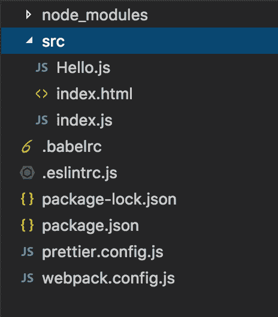

### 那么，是什么问题呢？

如你所见，我设置了环境、电子打印等等。我创造了一切，以便我可以开始编码，并把我的新组件添加到我闪亮的新组件库中。

但是如果我出错了呢？我们去搞砸些事情吧。

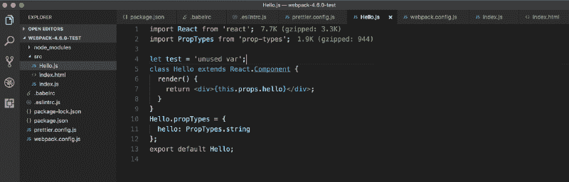

如果我们试图从我们的谷歌 Chrome 浏览器控制台回溯错误的来源，这对我们来说会非常困难。我们会偶然发现这样的事情:

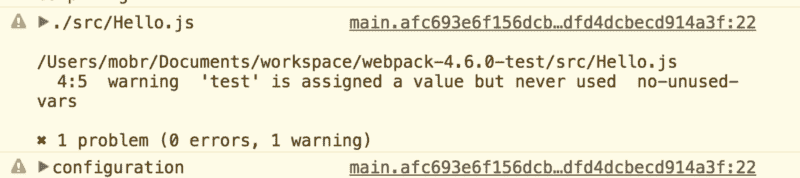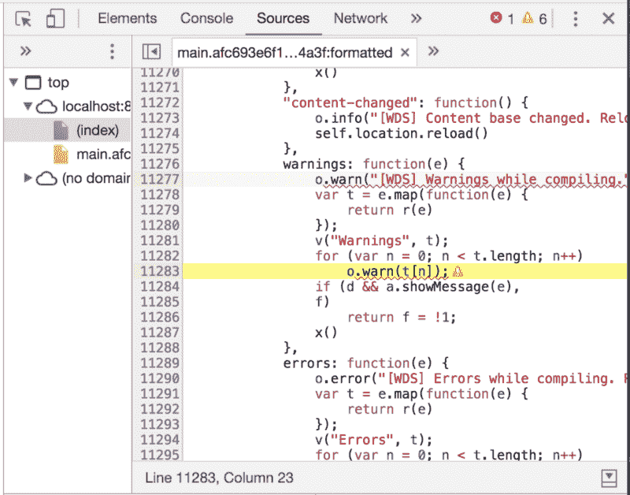

未配置源映射！

我希望它指向一个文件 **Hello.js** 而不是一个捆绑文件，有点像这个家伙在这里做的。

### 这可能是一个很小的东西

至少我是这么认为的。所以我试着通过添加 [**devtool**](https://webpack.js.org/configuration/devtool/) 来设置文档中描述的[源地图。](https://webpack.js.org/guides/development/#using-webpack-dev-server)

> 当 webpack 捆绑您的源代码时，跟踪错误和警告到它们的原始位置会变得很困难。例如，如果您将三个源文件(`a.js`、`b.js`和`c.js`)捆绑成一个包(`bundle.js`，并且其中一个源文件包含错误，那么堆栈跟踪将简单地指向`bundle.js`。这并不总是有用的，因为您可能想知道错误来自哪个源文件。

> 为了更容易地跟踪错误和警告，JavaScript 提供了[源映射](http://blog.teamtreehouse.com/introduction-source-maps)，它将编译后的代码映射回原始源代码。如果错误源于`b.js`，源地图会准确地告诉你。([来源](https://webpack.js.org/guides/development/))

所以我天真地认为这可以在我的 *webpack.config.js* 中工作:

```
...
```

```
module.exports = {  entry: { main: './src/index.js' },  output: {    path: path.resolve(__dirname, 'dist'),    filename: '[name].[chunkhash].js'  },  devtool: 'inline-source-map',  devServer: {    contentBase: './dist',    hot: true,    open: true  },  ...
```

以及 *package.json*

```
..."scripts": {  "build": "webpack --mode production",  "dev": "webpack-dev-server --mode development"}...
```

做的时候要加一个开发标志，不然就不会像医生说的那样起作用。然而，即使有了建议的值，源地图也没有像我希望的那样运行。

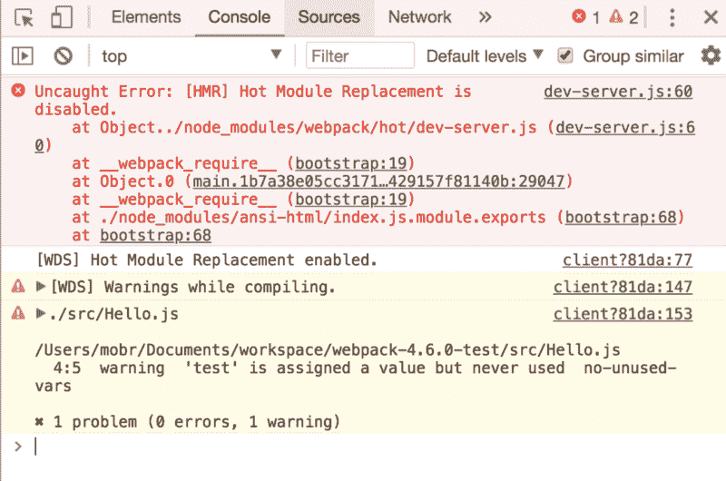

如果你读了 SurviveJS 的这个指南，你会看到。

在我尝试了它的每一个选项后，我求助于 GitHub 问题搜索。

### GitHub 问题追踪

尝试 GitHub 问题中的所有建议对我没有帮助。

在某种程度上，我认为 webpack-dev-server 有问题。原来 webpack-dev-server 已经处于维护模式几个月了。

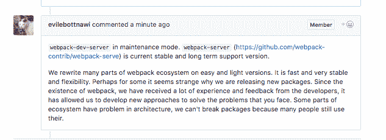

在我偶然发现[这个问题](https://github.com/webpack/webpack-dev-server/issues/1161)之后，我发现**推荐使用 webpack-serve 而不是 webpack-dev-server。**

老实说，那是我第一次听说一种叫做 **webpack-serve** 的替代品。医生看起来也不乐观。但我还是决定试一试。

```
npm install webpack-serve --save-dev
```

我创建了 *serve.config.js*

```
const serve = require('webpack-serve');
```

```
const config = require('./webpack.config.js');
```

```
serve({ config });
```

我在我的 package.json 中用 webpack serve 替换了 **webpack-dev-server。**

但是尝试 webpack-serve 也没有解决。

所以在这一点上，我觉得我已经使用了在 GitHub 上能找到的所有建议:

*   [Webpack 4 — Sourcemaps](https://stackoverflow.com/questions/48986641/webpack-4-sourcemaps) :这个问题表明`devtool: 'source-map'`应该开箱即用，但对我来说不是这样
*   [如何使 webpack sourcemap 到原始文件](https://stackoverflow.com/questions/34185748/how-to-make-webpack-sourcemap-to-original-files):在我的输出配置中添加`devtoolModuleFilenameTemplate: info =>'file://' + path.resolve(info.absoluteResourcePath).replace(/\\/g, '`/’)并没有多大帮助。但它显示给我的不是 client.js，而是 index.js。
*   https://github.com/webpack/webpack/issues/6400:这不是对我问题的准确描述，所以尝试这里的方法似乎对我没有帮助
*   我试着使用`webpack.SourceMapDevToolPlugin`,但是它在我的设置中不起作用，即使我删除了 devtools 或者将它们设置为 false
*   我在这里没有使用 UglifyJS 插件，所以为它设置选项不是一个解决方案
*   我知道 webpack-dev-server 现在正在维护中，所以我尝试了 webpack-serve，但是看起来源代码地图也不能使用它
*   我也尝试了源地图支持包，但是没有成功。我也有类似的情况，见[这里](https://github.com/webpack/webpack/issues/3165)。

### 神圣的 StackOverflow

我花了很长时间来配置源地图，所以我在 StackOverflow 上创建了一个[问题](https://stackoverflow.com/questions/50105741/webpack-4-devtool-option-does-not-work-with-webpack-dev-server)。

调试 webpack 配置通常是一项麻烦的任务:最好的方法是从头开始创建一个配置。如果文档中的某些内容没有按预期工作，那么尝试在分支上找到类似的问题，或者创建您自己的问题可能是个好主意。反正我是这么想的。

第一个回答我问题的人真的很想帮忙。他分享了自己的工作配置。甚至通过创建[一个拉取请求](https://github.com/marharyta/webpack-fast-development/pull/1/files)来帮助我。

这里唯一的问题是:**为什么他的设置会起作用**？我的意思是，这可能不是魔术，而且有一些模块不兼容。遗憾的是，我不明白为什么我的设置不起作用:

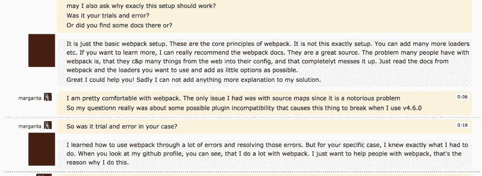

问题是，他以自己的方式重组项目，用心良苦。

这意味着我将在项目中有更多的设置，并且将不得不改变相当多的东西。如果我在做测试设置，这可能还可以，但是我决定对文件做逐渐的改变，看看哪里出了问题。

#### 剖析问题

所以我们来看看他的 Webpack 和 *package.json* 和我的有什么区别。只是为了记录，我在问题中使用了不同的回购，所以这里是我的[到回购](https://github.com/marharyta/webpack-fast-development)的链接和我的设置。

```
// webpack v4.6.0
```

```
const path = require('path');const HtmlWebpackPlugin = require('html-webpack-plugin');const WebpackMd5Hash = require('webpack-md5-hash');const CleanWebpackPlugin = require('clean-webpack-plugin');const stylish = require('eslint/lib/formatters/stylish');const webpack = require('webpack');
```

```
module.exports = {  entry: { main: './src/index.js' },  output: {   devtoolModuleFilenameTemplate: info => 'file://' + path.resolve(info.absoluteResourcePath).replace(/\\/g, '/'),
```

```
 path: path.resolve(__dirname, 'dist'),   filename: '[name].[hash].js'  },  mode: 'development',  devtool: 'eval-cheap-module-source-map',  devServer: {    contentBase: './dist',    hot: true  },  module: {    rules: [      {        test: /\.js$/,        exclude: /node_modules/,        loader: 'babel-loader'      },      {        test: /\.js$/,        exclude: /node_modules/,        loader: 'eslint-loader',        options: {          formatter: stylish         }       }     ]   },   plugins: [    // new webpack.SourceMapDevToolPlugin({    //   filename: '[file].map',    //   moduleFilenameTemplate: undefined,    //   fallbackModuleFilenameTemplate: undefined,    //   append: null,    //   module: true,    //   columns: true,    //   lineToLine: false,    //   noSources: false,    //   namespace: ''    // }),    new CleanWebpackPlugin('dist', {}),    new HtmlWebpackPlugin({      inject: false,      hash: true,      template: './src/index.html',      filename: 'index.html'    }),    new WebpackMd5Hash(),    // new webpack.NamedModulesPlugin(),    new webpack.HotModuleReplacementPlugin()  ]
```

```
};
```

*package.json*

```
{
```

```
"name": "post","version": "1.0.0","description": "","main": "index.js","scripts": {  "storybook": "start-storybook -p 9001 -c .storybook",  "dev": "webpack-dev-server --mode development --open",  "build": "webpack --mode production"},"author": "","license": "ISC","devDependencies": {  "@storybook/addon-actions": "^3.4.3",  "@storybook/react": "v4.0.0-alpha.4",  "babel-cli": "^6.26.0",  "babel-core": "^6.26.0",  "babel-loader": "^7.1.4",  "babel-preset-env": "^1.6.1",  "babel-preset-react": "^6.24.1",  "babel-runtime": "^6.26.0",  "clean-webpack-plugin": "^0.1.19",  "eslint": "^4.19.1",  "eslint-config-prettier": "^2.9.0",  "eslint-loader": "^2.0.0",  "eslint-plugin-prettier": "^2.6.0",  "eslint-plugin-react": "^7.7.0",  "html-webpack-plugin": "^3.2.0",  "prettier": "^1.12.1",  "react": "^16.3.2",  "react-dom": "^16.3.2",  "webpack": "v4.6.0",  "webpack-cli": "^2.0.13",  "webpack-dev-server": "v3.1.3",  "webpack-md5-hash": "0.0.6",  "webpack-serve": "^0.3.1"},"dependencies": {  "source-map-support": "^0.5.5"}
```

```
}
```

我故意让它们保持原样，以便您可以看到我的调试尝试。**一切正常，除了源图**。下面，我将分享他在我的配置中所做的更改——但是当然最好在这里查看完整的拉取请求。

```
 // webpack v4.6.0 const path = require('path'); const HtmlWebpackPlugin = require('html-webpack-plugin'); // deleting this module from the config-const WebpackMd5Hash = require('webpack-md5-hash'); const CleanWebpackPlugin = require('clean-webpack-plugin'); const stylish = require('eslint/lib/formatters/stylish'); const webpack = require('webpack');  module.exports = {  // adding the mode setting here instead of a flag+  mode: 'development',   entry: { main: './src/index.js' },   output: {  // deleting the path and the template from the output-    devtoolModuleFilenameTemplate: info =>-      'file://' + path.resolve(info.absoluteResourcePath).replace(/\\/g, '/'),-    path: path.resolve(__dirname, 'dist'),     filename: '[name].[hash].js'   },  // adding resolve option here+  resolve: {+    extensions: ['.js', '.jsx']+  },   //changing the devtool option   devtool: 'eval-cheap-module-source-map',  // changing the devServer settings   devServer: {-    contentBase: './dist',-    hot: true+    hot: true,+    open: true   },   module: {     rules: [    // putting my two checks into one (later he asked me in the chat to delete eslint option completely)       {-        test: /\.js$/,-        exclude: /node_modules/,-        loader: 'babel-loader'-      },-      {-        test: /\.js$/,+        test: /\.jsx?$/,         exclude: /node_modules/,-        loader: 'eslint-loader',-        options: {-          formatter: stylish-        }+        use: [+          { loader: 'babel-loader' },+          { loader: 'eslint-loader', options: { formatter: stylish } }+        ]       }     ]   },   plugins: [    //cleaned some options-    new CleanWebpackPlugin('dist', {}),+    new CleanWebpackPlugin('dist'),    //deleted some settings from the HTMLWebpackPlugin     new HtmlWebpackPlugin({-      inject: false,-      hash: true,-      template: './src/index.html',-      filename: 'index.html'+      template: './src/index.html'     }),  //completely removed the hashing plugin and added a hot module replacement one
```

```
-    new WebpackMd5Hash(),-    new webpack.NamedModulesPlugin(),+    new webpack.HotModuleReplacementPlugin()   ] };
```

*package.json*

```
"main": "index.js",   "scripts": {     "storybook": "start-storybook -p 9001 -c .storybook",  //added different flags for webpack-dev-server-    "dev": "webpack-dev-server --mode development --open",+    "dev": "webpack-dev-server --config ./webpack.config.js",     "build": "webpack --mode production"   },   "author": "",@@ -31,11 +31,6 @@     "react-dom": "^16.3.2",     "webpack": "v4.6.0",     "webpack-cli": "^2.0.13",-    "webpack-dev-server": "v3.1.3",-    "webpack-md5-hash": "0.0.6",-    "webpack-serve": "^0.3.1"-  },-  "dependencies": {//moved dev server to dependencies
```

```
-    "source-map-support": "^0.5.5"+    "webpack-dev-server": "v3.1.3"   } }
```

如你所见，他删除了一堆模块，并在配置中添加了 mode。看一看拉请求，您可以看到他还添加了一些特定的面向反应的 HMR。

这通过牺牲大量插件来帮助源地图工作，但没有具体解释他为什么这样做。作为一个阅读文档的人，这让我不太满意。

后来，我使用了我最初的 webpack.connfig.js，并开始一步一步地添加更改，看看源地图何时最终开始工作。

**变化 1:**

```
-    new CleanWebpackPlugin('dist', {}),+    new CleanWebpackPlugin('dist'),
```

**变化 2:**

我将 webpack-dev-server 添加到依赖项，而不是 devDependencies:

```
...
```

```
},
```

```
"dependencies": {
```

```
 "webpack-dev-server": "^3.1.3"
```

```
}
```

```
}
```

```
...
```

**变化 3:**

接下来，我删除了一些 devServer 设置:

```
devServer: {-    contentBase: './dist',+    hot: true,+    open: true   },
```

**变化 4:**

让我们去掉时髦:

```
...
```

```
},
```

```
devtool: 'inline-source-map',  devServer: {    hot: true,    open: true  },
```

```
...
```

```
use: [  { loader: 'babel-loader' },  {    loader: 'eslint-loader'  }
```

```
]
```

```
....
```

**变化 5:**

现在让我们尝试删除 WebpackMd5Hash 哈希插件:

```
...
```

```
module.exports = {mode: 'development',entry: { main: './src/index.js' },output: {  path: path.resolve(__dirname, 'dist'),  filename: '[name].js'  },devtool: 'inline-source-map',...
```

```
plugins: [  new CleanWebpackPlugin('dist'),  new HtmlWebpackPlugin({    inject: false,    hash: true,    template: './src/index.html',    filename: 'index.html'  })-    new WebpackMd5Hash(), ]
```

```
};
```

**变化 6:**

现在让我们尝试从 HtmlWebpackPlugin 中删除一些设置:

```
...
```

```
plugins: [  new CleanWebpackPlugin('dist'),  new HtmlWebpackPlugin({    template: './src/index.html'  })]};
```

```
...
```

**变化 7:**

正如我们在他的代码中看到的，他在这里添加了一些解决选项。我个人不明白为什么我们需要他们在这里。我在文件里也找不到信息。

```
...
```

```
resolve: {  extensions: ['.js', '.jsx']},module: {
```

```
...
```

**变化 8:**

删除输出路径:

```
...
```

```
entry: { main: './src/index.js' },output: {  filename: '[name].js'},devtool: 'inline-source-map',
```

```
...
```

**变化 9:**

添加热模块替换插件:

```
...
```

```
const HtmlWebpackPlugin = require('html-webpack-plugin');const CleanWebpackPlugin = require('clean-webpack-plugin');const webpack = require('webpack');
```

```
...
```

```
plugins: [  new CleanWebpackPlugin('dist'),  new HtmlWebpackPlugin({    template: './src/index.html'  }),  new webpack.HotModuleReplacementPlugin()]};
```

```
...
```

**改变 10:**

将— config 添加到 package.json:

```
-    "dev": "webpack-dev-server --mode development --open",+    "dev": "webpack-dev-server --config ./webpack.config.js",
```

让我们弄清楚一些事情:在这一点上，我几乎重写了配置。

这是一个大问题，因为我们不能每次都重写它！

### 了解 webpack 的最佳资源

最后，我去检查 create-react-app 是如何实现源映射的。那毕竟是个正确的决定。这是 [webpack 开发版本](https://github.com/facebook/create-react-app/blob/next/packages/react-scripts/config/webpack.config.dev.js)的配置。

如果我们检查一下 **devtool** 是如何在那里实现的，我们会看到:

> //如果您希望在 DevTools 中看到编译后的输出，您可能需要“eval”。

> //参见[https://github.com/facebook/create-react-app/issues/343.](https://github.com/facebook/create-react-app/issues/343.)中的讨论

> devtool:“廉价模块源地图”

所以这个问题把我指向了另一个问题，在这里找到了。

```
// webpack v4
```

```
const path = require('path');const HtmlWebpackPlugin = require('html-webpack-plugin');const WebpackMd5Hash = require('webpack-md5-hash');const CleanWebpackPlugin = require('clean-webpack-plugin');
```

```
module.exports = {
```

```
mode: "development",entry: { main: './src/index.js' },output: {  path: path.resolve(__dirname, 'dist'),  filename: '[name].[hash].js'},devtool: 'cheap-module-source-map',devServer: {  contentBase: './dist',  hot: true,  open: true},module: {
```

改变线路仍然不起作用——到目前为止！我了解到源地图是一个长期悬而未决的问题。

### **向合适的人询问**

每个开源项目都有维护者。所以，在这种情况下，马上问这些人绝对是正确的举动。

尽管 Daniel 的试错法对我来说并不奏效，但我对维护团队的移动性感到惊喜。

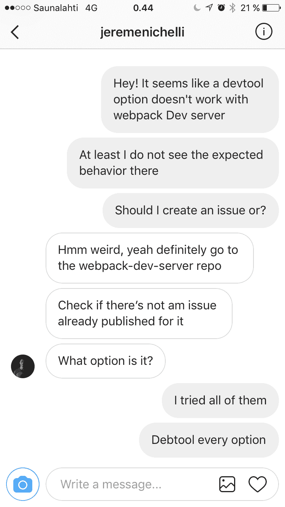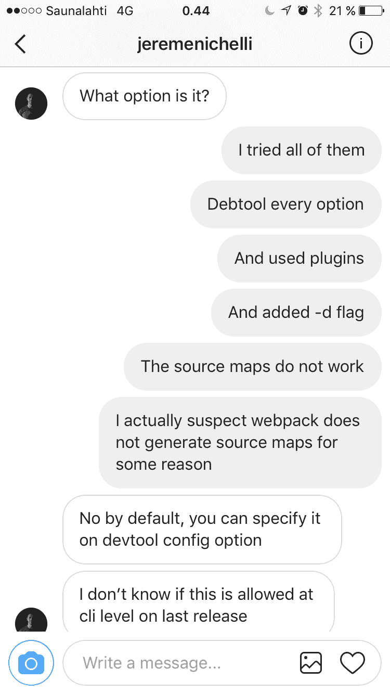

所以我创建了一个回购协议，你可以在这里看到[和](https://github.com/marharyta/webpack-4.6.0-test)。检查那里的第二个提交。

为了让你更容易理解，这里是我的项目 webpack.js，在这里我回滚到我的初始、更干净的设置:

```
// webpack v4
```

```
const path = require('path');const HtmlWebpackPlugin = require('html-webpack-plugin');const WebpackMd5Hash = require('webpack-md5-hash');const CleanWebpackPlugin = require('clean-webpack-plugin');
```

```
module.exports = {  mode: 'development',  entry: { main: './src/index.js' },  output: {    path: path.resolve(__dirname, 'dist'),    filename: '[name].[hash].js'  },  devtool: 'inline-source-map',  devServer: {    contentBase: './dist',    hot: true,    open: true  },  module: {    rules: [      {        test: /\.js$/,        exclude: /node_modules/,        use: [          { loader: 'babel-loader' },          {            loader: 'eslint-loader',            options: {               formatter: require('eslint/lib/formatters/stylish')             }          }         ]        }      ]  },  plugins: [    new CleanWebpackPlugin('dist'),    new HtmlWebpackPlugin({      inject: false,      hash: true,      template: './src/index.html',      filename: 'index.html'    }),    new WebpackMd5Hash()  ]};
```

在检查了我的代码后，维护人员创建了一个[问题](https://github.com/marharyta/webpack-4.6.0-test/issues/1)。

让我们回顾一下他在那里包括了什么:

> 设置`mode`选项

> 我发现的第一个问题是如何设置`mode`选项。在 npm 脚本中，模式设置为:

> **网页包模式制作**

> 正确的做法应该是:

> **网页包模式=生产**

> 在我看来，npm 脚本的最终状态如下:

> **【脚本】:{**
> **【构建】:“webpack - mode=production”，**
> **“start”:“web pack-dev-server-mode = development-hot”**
> **}**

> 我还把`dev`改成了`start`,因为它更标准，也是其他开发者期望的命令。你实际上可以做`npm start`，而不用`run`命令？

```
...
```

```
"scripts": {  "build": "webpack --mode production",  "dev": "webpack-dev-server --mode=development --hot"},
```

```
...
```

接下来，他提出了以下建议:

> 用于源地图的开发工具

> 我总是推荐`inline-source-map`选项，这是最直接的，它作为一个注释包含在包的末尾。

> **module . exports = {**
> **+dev tool:' inline-source-map '，**
> **//其余配置**
> **}**

> 我还建议创建一个单独的对象，并仅在开发时填充它:

> 命令

> **web pack-dev-server-mode =开发节点 _ 环境=开发**

> webpack.config.js

> **const webpackConfig = {}**

> **if(process . ENV . node _ ENV = = = ' development '){**
> **web pack config . dev tool = ' inline-source-map '**
> **}**

> 通过这种方式，您可以确保生产上的捆绑包不会受此影响。

然后，他建议从装载机上移除 ESLint:

> 林挺和开发者体验

> **老实说，作为一个加载程序，我会删除`eslint`,它非常垃圾，扰乱了开发流程。我更喜欢添加一个预提交 githook 来检查这一点。**

> 通过添加如下脚本，这非常简单:

> **"脚本":{**
> **+ "lint": "eslint。/src/**/*。js"**
> **【构建】:" webpack - mode=production "，**
> **【start】:" web pack-dev-server-mode = development-hot "**
> **}**

> 然后和哈士奇结合。

并将其添加到脚本中:

```
...
```

```
"scripts": {
```

```
"lint": "eslint ./src/**/*.js",
```

```
"build": "webpack --mode production",
```

```
"dev": "webpack-dev-server --mode=development --hot"
```

```
},
```

```
...
```

我故意在 src/ *Hello.js* **里弄错了** 看看这次源图是怎么工作的。

```
import React from 'react';import PropTypes from 'prop-types';
```

```
class Hello extends React.Component {  console.log(hello.world);  render() {    return <div>{this.props.hello}</div>;  }}Hello.propTypes = {  hello: PropTypes.string};export default Hello;
```

### 我如何解决问题

问题是埃斯林。但是在正确指定模式并删除 eslint-loader 之后，source maps 工作正常！

按照维护者给我的例子，我将我的 Webpack 更新为:

```
// webpack v4
```

```
const path = require('path');const HtmlWebpackPlugin = require('html-webpack-plugin');const WebpackMd5Hash = require('webpack-md5-hash');const CleanWebpackPlugin = require('clean-webpack-plugin');module.exports = {  entry: { main: './src/index.js' },  output: {    path: path.resolve(__dirname, 'dist'),    filename: '[name].[hash].js'  },  devtool: 'inline-source-map',  devServer: {    contentBase: './dist',    hot: true,    open: true  },  module: {    rules: [     {      test: /\.js$/,      exclude: /node_modules/,      use: [{ loader: 'babel-loader' }]     }    ]  },  plugins: [    new CleanWebpackPlugin('dist'),    new HtmlWebpackPlugin({      inject: false,      hash: true,      template: './src/index.html',      filename: 'index.html'    }),    new WebpackMd5Hash()  ]};
```

和我的包 JSON 到:

```
{
```

```
"name": "post","version": "1.0.0","description": "","main": "index.js","scripts": {  "build": "webpack --mode=production",  "start": "NODE_ENV=development webpack-dev-server --mode=development --hot"},"author": "","license": "ISC","devDependencies": {  "babel-cli": "^6.26.0",  "babel-core": "^6.26.0",  "babel-loader": "^7.1.4",  "babel-preset-env": "^1.6.1",  "babel-preset-react": "^6.24.1",  "babel-runtime": "^6.26.0",  "clean-webpack-plugin": "^0.1.19",  "eslint": "^4.19.1",  "eslint-config-prettier": "^2.9.0",  "eslint-loader": "^2.0.0",  "eslint-plugin-prettier": "^2.6.0",  "eslint-plugin-react": "^7.7.0",  "html-webpack-plugin": "^3.2.0",  "prettier": "^1.12.1",  "react": "^16.3.2",  "react-dom": "^16.3.2",  "webpack": "^4.6.0",  "webpack-cli": "^2.0.13",  "webpack-md5-hash": "0.0.6"},"dependencies": {  "webpack-dev-server": "^3.1.3"}
```

```
}
```

**源地图终于起作用了！**

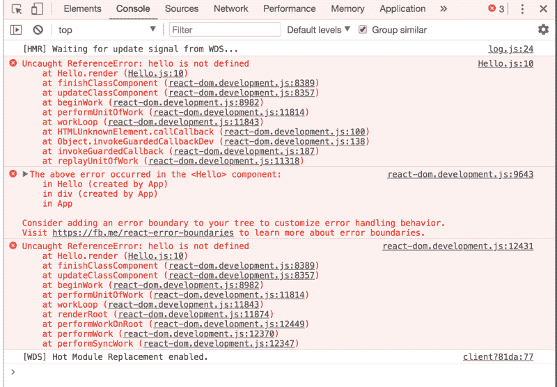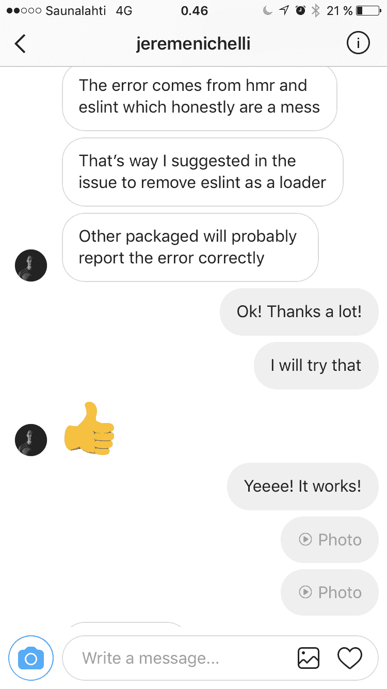

### **结论:**

自 2016 年以来，源地图一直是多个讨论和 bug 的主题，你可以在这里看到。

Webapack 需要审计方面的帮助！

发现这个 bug 后，我向 ESLint loader 包提交了一个[问题](https://github.com/webpack-contrib/eslint-loader/issues/227)。

当谈到检查源地图的质量时，我们可以使用[这个工具](http://sokra.github.io/source-map-visualization/)。

### 如果您遇到 webpack 问题，您可以做什么？

如果您遇到 Webpack 的问题，请不要惊慌！请遵循以下步骤:

*   在 GitHub 中搜索与你类似的问题。
*   试着检查样板文件，看看这个特性是如何实现的，比如 create-react-app。
*   在 StackOverflow 上提问—不要害怕！不过，要确保你已经用尽了自己解决问题的方法。
*   不要犹豫，发微博直接问维护人员。
*   一旦发现问题，就制造问题。这对贡献者有很大帮助！

在本文中，我已经为您提供了我的配置文件以及我用来逐步配置它的过程。

注意:由于在您阅读本文时，许多 npm 依赖项可能会发生变化，因此相同的配置可能不适合您！我恳请您在下面的评论中留下您的错误，以便我稍后可以编辑它。

**请为这篇文章订阅并鼓掌！谢谢！**