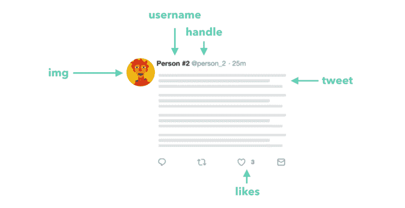
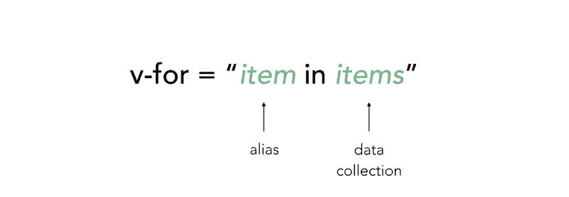
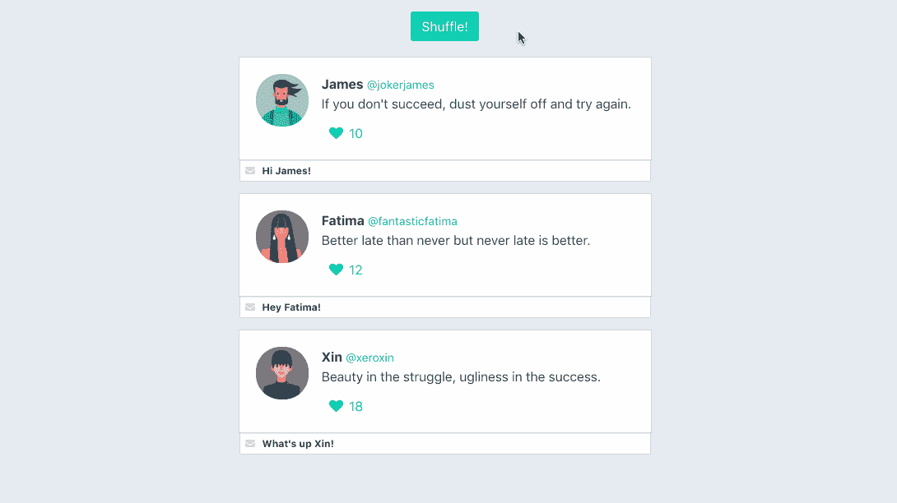
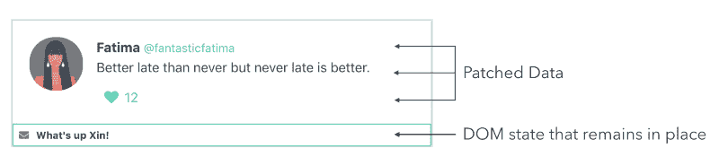
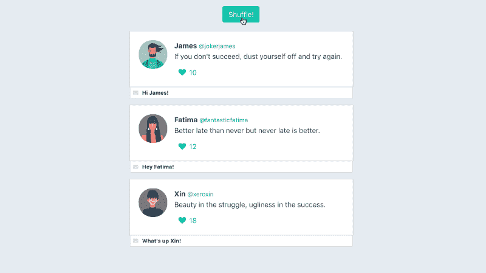

# Vue.js 中的动态列表呈现介绍

> 原文：<https://www.freecodecamp.org/news/an-introduction-to-dynamic-list-rendering-in-vue-js-a70eea3e321/>

作者:哈桑·吉尔德

# Vue.js 中的动态列表呈现介绍


列表呈现是前端 web 开发中最常用的实践之一。动态列表呈现通常用于以简洁友好的格式向用户呈现一系列类似分组的信息。在我们使用的几乎每一个网络应用程序中，我们都可以看到**列表**在应用程序的众多区域中的内容。

在本文中，我们将收集对 Vue 在生成动态列表中的`v-for`指令的理解。我们还将通过一些例子来解释为什么在这样做的时候应该使用`key`属性。

由于我们将在开始编写代码时对事情进行全面的解释，所以本文假设您对 Vue(和/或其他 JavaScript 框架)一无所知或知之甚少。

### 案例研究:Twitter

我们将使用 Twitter 作为本文的案例研究。

当登录到 Twitter 的主索引路径时，我们会看到一个类似这样的视图:


在主页上，我们已经习惯于看到趋势列表、推文列表、潜在关注者列表等等。这些列表中显示的内容取决于多种因素——我们的 Twitter 历史、我们关注的人、我们的喜好等等。因此，我们可以说所有这些数据都是动态的。

尽管该数据是动态获得的，但显示该数据的**方式**保持不变。这部分是由于使用了**可重用 web 组件**。

例如，我们可以将 tweets 列表视为单个`tweet-component`条目的列表。我们可以把`tweet-component`看作一个外壳，它接受各种数据，比如用户名、句柄、tweet 和头像等，并简单地以一致的标记显示这些数据。



假设我们想要基于从服务器获得的大型数据源呈现一个组件列表(比如一个`tweet-component`条目列表)。在 Vue 中，首先应该想到的是`**v-for**`指令。

### v-for 指令

`v-for`指令用于呈现基于数据源的项目列表。该指令可在模板元素上使用，并且需要特定的语法，如下所示:



让我们看一个实践中的例子。首先，我们假设我们已经获得了一组 tweet 数据:

```
const tweets = [
  {
    id: 1,
    name: 'James',
    handle: '@jokerjames',
    img: 'https://semantic-ui.com/images/avatar2/large/matthew.png',
    tweet: "If you don't succeed, dust yourself off and try again.",
    likes: 10,
  },
  { 
    id: 2,
    name: 'Fatima',
    handle: '@fantasticfatima',
    img: 'https://semantic-ui.com/images/avatar2/large/molly.png',
    tweet: 'Better late than never but never late is better.',
    likes: 12,
  },
  {
    id: 3,
    name: 'Xin',
    handle: '@xeroxin',
    img: 'https://semantic-ui.com/images/avatar2/large/elyse.png',
    tweet: 'Beauty in the struggle, ugliness in the success.',
    likes: 18,
  }
]
```

`tweets`是一个由`tweet`对象组成的集合，每个`tweet`都包含特定 tweet 的细节——一个惟一的标识符、账户的名称/句柄、tweet 消息等等。现在让我们尝试使用`v-for`指令来呈现基于这些数据的 tweet 组件列表。

首先，我们将创建 Vue 实例——Vue 应用程序的核心。我们将实例挂载/附加到 id 为`app`的 DOM 元素，并将`tweets`集合指定为实例数据对象的一部分。

```
new Vue({
  el: '#app',
  data: {
    tweets
  }
});
```

我们现在将继续创建一个`tweet-component`，我们的`v-for`指令将使用它来呈现一个列表。我们将使用全局`Vue.component`构造函数来创建一个名为`tweet-component`的组件:

```
Vue.component('tweet-component', {
  template: `  
    <div class="tweet">
      <div class="box">
        <article class="media">
          <div class="media-left">
            <figure class="image is-64x64">
              
            </figure>
          </div>
          <div class="media-content">
            <div class="content">
              <p>
                <strong>{{tweet.name}}</strong> <small>{{tweet.handle}}</small>
                <br>
                {{tweet.tweet}}
              </p>
            </div>
              <div class="level-left">
                <a class="level-item">
                  <span class="icon is-small"><i class="fas fa-heart"></i></span>
                  <span class="likes">{{tweet.likes}}</span>
                </a>
              </div>
          </div>
        </article>
      </div>
    </div>  
  `,
  props: {
    tweet: Object
  }
});
```

这里需要注意一些有趣的事情:

1.  `tweet-component`期望一个`tweet`对象道具，如道具验证需求(`props: {tweet: Object}`)中所示。如果组件是用一个`tweet`道具渲染的，这个道具是**而不是一个对象**，Vue 会发出警告。
2.  借助于 Mustache 语法:`{{ }}`，我们将 tweet 对象 prop 的属性绑定到组件模板上。
3.  组件标记采用了[布尔玛的盒子元素](https://bulma.io/documentation/elements/box/),因为它与 tweet 非常相似。

在 HTML 模板中，我们需要在安装 Vue 应用的地方创建标记(即 id 为`app`的元素)。在这个标记中，我们将使用`v-for`指令来呈现 tweets 列表。

由于`tweets`是我们将要迭代的数据集合，`tweet`将是在指令中使用的合适别名。在每个渲染的`tweet-component`中，我们将**也将** 传入迭代的`tweet`对象，作为在组件中访问它的道具。

```
<div id="app" class="columns">
  <div class="column">
    <tweet-component v-for="tweet in tweets" :tweet="tweet"/>
  </div>
</div>
```

不管更多的 tweet 对象将如何被引入集合，或者它们将如何随时间变化，我们的设置将总是以我们期望的相同标记呈现集合中的所有 tweet。

在一些自定义 CSS 的帮助下，我们的应用程序看起来会像这样:

[//codepen.io/itslit/embed/xWjZKy/?height=265&theme-id=0&default-tab=js,result](//codepen.io/itslit/embed/xWjZKy/?height=265&theme-id=0&default-tab=js,result)

See the Pen [Simple Twitter Feed #1](https://codepen.io/itslit/pen/xWjZKy/) by Hassan Dj ([@itslit](https://codepen.io/itslit)) on [CodePen](https://codepen.io).

尽管一切都按预期运行，但我们的浏览器控制台可能会提示我们一个 Vue 提示:

```
[Vue tip]: <tweet-component v-for="tweet in tweets">: component lists rendered with v-for should have explicit keys...
```

**注意:**通过 CodePen 运行代码时，您可能看不到浏览器控制台中的警告。

为什么 Vue 告诉我们在我们的列表中指定显式键，而一切都按预期工作？

### 关键属性

通常的做法是为呈现的`v-for`列表中的每个迭代元素指定一个 key 属性。这是因为 Vue 使用`key`属性为每个节点的身份创建**唯一绑定。**

让我们解释一下——如果我们的列表有任何动态 UI 变化(例如，列表项的顺序被打乱)，Vue 将选择改变每个元素**中的数据，而不是相应地移动 DOM 元素的**。在大多数情况下，这不是问题。然而，在某些情况下，我们的`v-for`列表依赖于 DOM 状态和/或子组件状态，这可能会导致一些意想不到的行为。

让我们来看一个例子。如果我们的简单 tweet 组件现在包含一个允许用户直接回复 tweet 消息的输入字段会怎么样？我们将忽略如何提交该响应，而只处理新的输入字段本身:


我们将把这个新的输入字段添加到`tweet-component`的模板中:

```
Vue.component('tweet-component', {
  template: `
    <div class="tweet">
      <div class="box">
        // ...
      </div>
      <div class="control has-icons-left has-icons-right">
        <input class="input is-small" placeholder="Tweet your reply..." />
        <span class="icon is-small is-left">
          <i class="fas fa-envelope"></i>
        </span>
      </div>
    </div>
  `,
  props: {
    tweet: Object
  }
});
```

假设我们想在我们的应用程序中引入另一个新特性。这项功能将允许用户随机洗牌的推文列表。

为此，我们可以首先包含一个“Shuffle！”HTML 模板中的按钮:

```
<div id="app" class="columns">
  <div class="column">
    <button class="is-primary button" @click="shuffle">
      Shuffle!
    </button>
    <tweet-component v-for="tweet in tweets" :tweet="tweet"/>
  </div>
</div>
```

我们在 button 元素上附加了一个 click 事件监听器，以便在被触发时调用一个`shuffle`方法。在我们的 Vue 实例中，我们将创建负责随机移动实例中的`tweets`集合的`shuffle`方法。我们将使用洛达什的 [_shuffle](https://lodash.com/docs/4.17.5#shuffle) 方法来实现这一点:

```
new Vue({
  el: '#app',
  data: {
    tweets
  },
  methods: {
    shuffle() {
      this.tweets = _.shuffle(this.tweets)
    }
  }
});
```

我们来试试吧！如果我们点击几次随机播放，我们会注意到我们的 tweet 元素会随着每次点击而随机分类。

[//codepen.io/itslit/embed/LdmGmP/?height=265&theme-id=0&default-tab=js,result](//codepen.io/itslit/embed/LdmGmP/?height=265&theme-id=0&default-tab=js,result)

See the Pen [Simple Twitter Feed #2](https://codepen.io/itslit/pen/LdmGmP/) by Hassan Dj ([@itslit](https://codepen.io/itslit)) on [CodePen](https://codepen.io).

然而，如果我们在每个组件的输入中键入一些信息，然后**再**单击 shuffle，我们会注意到一些奇怪的事情发生了:



由于我们没有选择使用`**key**`属性，Vue 没有为每个 tweet 节点创建唯一的绑定。因此，当我们打算对推文重新排序时，Vue 采取了更高效的保存方法，只需**更改每个元素中的** **(或补丁)**数据。因为临时 DOM 状态(即输入的文本)仍然存在，所以我们会遇到这种意外的不匹配。

下面的图表向我们展示了修补到每个元素上的数据以及保留在原位的 DOM 状态:



为了避免这一点；我们必须给列表中呈现的每个`tweet-component`分配一个唯一的**键**。

我们将使用`tweet`的`id`作为唯一标识符，因为我们应该有把握地说一条推文的`id`不应该等于另一条推文的。因为我们使用动态值，所以我们将使用`v-bind`指令将我们的键绑定到`tweet.id`:

```
<div id="app" class="columns">
  <div class="column">
    <button class="is-primary button" @click="shuffle">
      Shuffle!
    </button>
    <tweet-component
      v-for="tweet in tweets"
      :tweet="tweet"
      :key="tweet.id"
    />
  </div>
</div>
```

现在，Vue 可以识别每条推文的节点身份，所以当我们打算调整列表时，它会**重新排序** 组件。



### 过渡

由于每个 tweet 组件现在都在相应地移动，我们可以更进一步，使用 Vue 的`transition-group`到**显示**元素是如何重新排序的。

为此，我们将添加`[transition-group](https://vuejs.org/v2/guide/transitions.html#List-Transitions)`元素作为`v-for`列表的包装器。我们将指定一个`tweets`的转换名称，并声明转换组应该作为一个`div`元素呈现。

```
<div id="app" class="columns">
  <div class="column">
    <button class="is-primary button" @click="shuffle">
      Shuffle!
    </button>
    <transition-group name="tweets" tag="div">
      <tweet-component
         v-for="tweet in tweets"
         :tweet="tweet"
         :key="tweet.id"
      />
    </transition-group>
  </div>
</div>
```

根据过渡的名称，Vue 将自动识别是否指定了任何 CSS 过渡/动画。因为我们的目标是为列表中项目的**移动**调用一个转换，Vue 将沿着`tweets-move`(其中`tweets`是我们转换组的名称)的路线寻找一个指定的 CSS 转换。

因此，我们将手动引入一个具有指定类型和转换时间的`.tweets-move`类:

```
#app .tweets-move {
  transition: transform 1s;
}
```

**注意:**这是对应用列表转换的一个非常简短的介绍。请务必查看 [Vue 文档](https://vuejs.org/v2/guide/transitions.html)，了解可应用的所有不同类型过渡的详细信息！

当随机播放被调用时，我们的`tweet-component`元素现在会在位置之间适当地**转换**。试试看！在输入栏中键入一些信息，然后单击“随机播放！”有几次。

很酷，对吧？如果没有`key`属性，**transition-group 元素就不能用来创建列表转换**，因为这些元素是在中被**修补的，而不是被重新排序的。**

是否应该一直使用`key`属性？**推荐**。 [Vue 文档](https://vuejs.org/v2/guide/list.html#key)规定只有在以下情况下才应省略 key 属性:

*   出于性能方面的原因，我们有意采用默认的方式来修补元素。
*   DOM 内容足够简单。

### 结论

我们做到了！希望这篇短文描述了`v-for`指令是多么有用，并且为为什么经常使用`key`属性提供了更多的上下文。如果你有任何问题/想法，请告诉我！

如果你喜欢我的写作风格，并且可能对学习如何用 Vue 构建真实世界的应用感兴趣，你可能会喜欢我帮助出版的书**full stack Vue:Vue . js 完全指南**！这本书涵盖了 Vue 的许多方面，包括路由、简单状态管理、表单处理、Vuex、服务器持久性和测试等主题。如果你有兴趣和/或想尝试一个样本章节，你可以从我们的网站【https://fullstack.io/vue】[](https://www.fullstack.io/vue/)****获得更多信息！****

**如果您有任何问题/想法/意见，欢迎随时联系我 [@djirdehh](https://twitter.com/djirdehh) ！**